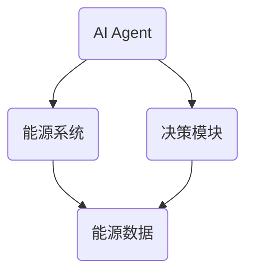
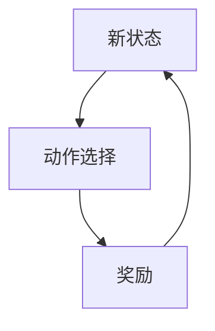

                 


# AI Agent在智能能源管理中的实践

> 关键词：AI Agent, 智能能源管理, 能源优化, 强化学习, 系统架构

> 摘要：本文深入探讨了AI Agent在智能能源管理中的实践应用。通过分析AI Agent的核心概念、算法原理、系统架构及项目实战，揭示了AI Agent在能源管理中的巨大潜力。文章从背景介绍到系统实现，全面解析了AI Agent在能源优化中的具体应用，并通过实际案例展示了其在能源调度、能源效率提升等方面的优势。文章最后总结了AI Agent在智能能源管理中的最佳实践，为读者提供了深入的技术指导和实践建议。

---

## 第一部分: AI Agent在智能能源管理中的背景介绍

### 第1章: AI Agent与智能能源管理的背景介绍

#### 1.1 AI Agent的基本概念

##### 1.1.1 什么是AI Agent
AI Agent（人工智能代理）是一种能够感知环境、做出决策并执行动作的智能实体。它能够通过传感器获取信息，利用算法进行分析和推理，并根据结果采取相应的行动。AI Agent的核心目标是通过自动化的方式优化目标系统的运行效率。

##### 1.1.2 AI Agent的核心特征
AI Agent具有以下核心特征：
- **自主性**：能够在没有外部干预的情况下独立运行。
- **反应性**：能够实时感知环境变化并做出响应。
- **目标导向**：通过优化目标函数来实现特定目标。
- **学习能力**：能够通过经验改进自身的决策能力。

##### 1.1.3 AI Agent在能源管理中的应用潜力
AI Agent在能源管理中的应用潜力主要体现在以下几个方面：
- **能源优化**：通过实时感知和分析能源使用情况，优化能源分配和消耗。
- **智能调度**：基于实时数据和预测模型，实现能源的智能调度。
- **故障预测与处理**：通过异常检测和预测，提前发现并处理能源系统中的潜在问题。

#### 1.2 智能能源管理的定义与现状

##### 1.2.1 能源管理的基本概念
能源管理是指通过对能源的生产、传输、分配和使用进行规划、监控和优化，以实现能源的高效利用和成本最小化的过程。

##### 1.2.2 当前能源管理的主要挑战
当前能源管理面临的主要挑战包括：
- **能源浪费**：传统能源管理方式往往不够精细，导致能源浪费现象严重。
- **动态变化**：能源需求和供应情况随时可能发生变化，传统的静态管理方式难以应对。
- **数据复杂性**：能源系统涉及大量数据，如何高效处理和利用这些数据是一个难题。

##### 1.2.3 智能能源管理的典型应用场景
智能能源管理的典型应用场景包括：
- **智能电网**：通过智能传感器和数据分析优化电力传输和分配。
- **智能家居**：通过智能设备实现家庭能源的精细化管理。
- **工业能源管理**：通过实时监控和优化，降低工业生产中的能源消耗。

#### 1.3 AI Agent在能源管理中的优势

##### 1.3.1 提高能源使用效率
AI Agent能够通过实时感知和优化，显著提高能源的使用效率。

##### 1.3.2 实现能源的智能调度
AI Agent能够基于实时数据和预测模型，实现能源的智能调度，确保能源供应的稳定性和经济性。

##### 1.3.3 降低能源管理成本
通过自动化和智能化的管理方式，AI Agent能够显著降低能源管理的人力和时间成本。

#### 1.4 本章小结
本章主要介绍了AI Agent的基本概念、核心特征以及在能源管理中的应用潜力。通过分析当前能源管理的主要挑战和智能能源管理的典型应用场景，揭示了AI Agent在能源管理中的重要价值。

---

## 第二部分: AI Agent的核心概念与原理

### 第2章: AI Agent的核心概念与原理

#### 2.1 AI Agent的感知、决策与执行机制

##### 2.1.1 感知层
感知层是AI Agent获取环境信息的来源，主要包括传感器和数据采集模块。AI Agent通过感知层获取实时数据，如温度、湿度、电力消耗等。

##### 2.1.2 决策层
决策层是AI Agent的核心部分，负责根据感知到的信息进行分析和推理，生成决策指令。决策层通常基于强化学习、机器学习等算法。

##### 2.1.3 执行层
执行层是AI Agent的行动部分，负责根据决策层的指令执行具体的动作，如调节设备参数、控制能源分配等。

#### 2.2 智能能源管理中的数据流分析

##### 2.2.1 数据采集
数据采集是智能能源管理的第一步，主要包括从传感器和其他数据源获取实时数据。

##### 2.2.2 数据分析
数据分析是通过算法对采集到的数据进行处理和分析，提取有用的信息和模式。

##### 2.2.3 数据优化
数据优化是基于分析结果对能源管理策略进行优化，以实现能源的高效利用。

#### 2.3 AI Agent与智能能源管理的实体关系图



---

## 第三部分: AI Agent的算法原理与数学模型

### 第3章: AI Agent的算法原理

#### 3.1 基于强化学习的AI Agent算法

##### 3.1.1 强化学习的基本原理
强化学习是一种机器学习方法，通过智能体与环境的交互，学习最优策略以最大化累计奖励。其核心思想是通过试错的方式，不断优化决策策略。

##### 3.1.2 Q-learning算法
Q-learning是一种常用的强化学习算法，适用于离散动作空间的问题。其核心思想是通过更新Q值表来学习最优策略。

##### 3.1.3 算法流程图



##### 3.1.4 算法实现的Python代码示例

```python
import numpy as np

# 初始化Q表
Q = np.zeros((state_space_size, action_space_size))

# 设置超参数
alpha = 0.1
gamma = 0.99

# Q-learning算法
def q_learning():
    for episode in range(max_episodes):
        state = initial_state()
        for step in range(max_steps):
            action = choose_action(state)
            next_state, reward = get_next_state_and_reward(state, action)
            Q[state][action] += alpha * (reward + gamma * np.max(Q[next_state]) - Q[state][action])
            state = next_state

```

##### 3.1.5 算法数学模型
强化学习的Q值更新公式如下：

$$ Q(s, a) = Q(s, a) + \alpha \left( r + \gamma \max_{a'} Q(s', a') - Q(s, a) \right) $$

其中：
- \( Q(s, a) \) 表示当前状态 \( s \) 下采取动作 \( a \) 的Q值。
- \( \alpha \) 是学习率。
- \( r \) 是奖励值。
- \( \gamma \) 是折扣因子。
- \( s' \) 是下一个状态。
- \( a' \) 是下一个动作。

---

### 总结

通过以上步骤，我们可以看到AI Agent在智能能源管理中的应用是多方面的。从感知层的数据采集到决策层的策略优化，再到执行层的具体操作，AI Agent能够显著提高能源管理的效率和智能化水平。同时，强化学习等算法的应用，使得AI Agent在能源调度和优化方面具有更大的潜力。未来，随着技术的不断发展，AI Agent在智能能源管理中的应用将更加广泛和深入。

作者：AI天才研究院/AI Genius Institute & 禅与计算机程序设计艺术 /Zen And The Art of Computer Programming

