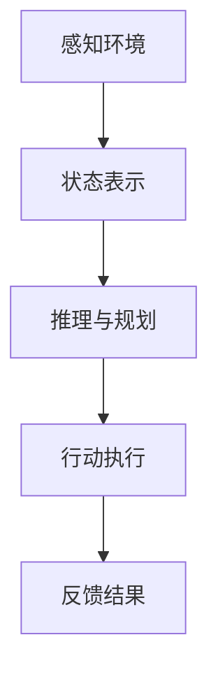
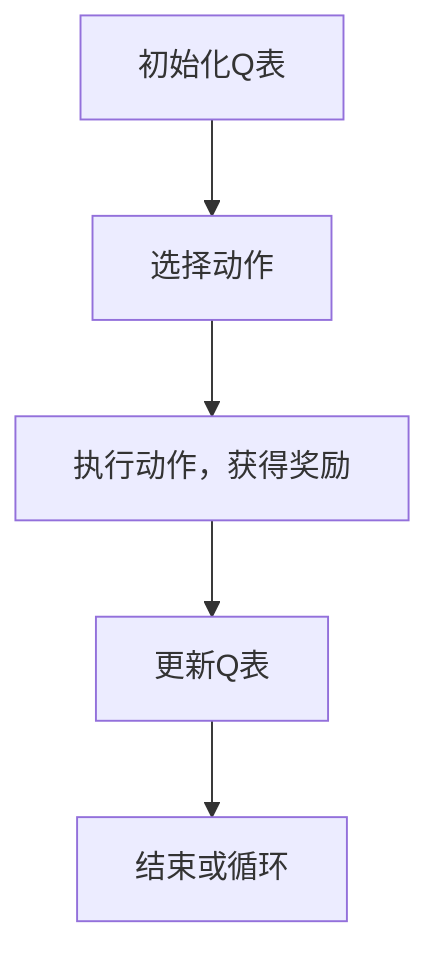
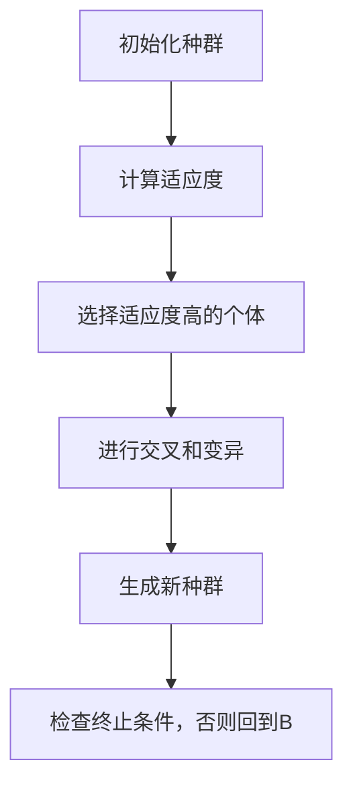
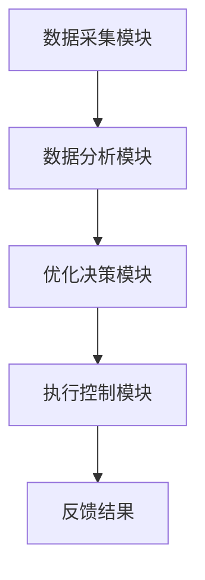

                 


---

# AI Agent在智能能源管理中的应用

> **关键词**：AI Agent, 智能能源管理, 人工智能, 能源优化, 多智能体系统

> **摘要**：  
本文详细探讨了AI Agent在智能能源管理中的应用，从基本概念到核心原理，再到算法实现和系统设计，最后通过实际案例分析展示了AI Agent在能源管理中的巨大潜力。文章内容涵盖AI Agent的定义、工作原理、在能源管理中的具体应用，以及如何通过算法优化和系统架构设计实现智能能源管理的目标。通过本文的分析，读者可以全面理解AI Agent在能源管理领域的核心价值和未来发展方向。

---

## 第二章: AI Agent的核心原理

### 2.1 AI Agent的基本原理

#### 2.1.1 AI Agent的定义与分类

AI Agent（人工智能代理）是一种能够感知环境、自主决策并采取行动的智能实体。它可以分为以下几类：

- **简单反射型Agent**：基于当前状态直接行动，适用于简单的决策任务。
- **基于模型的反射型Agent**：维护环境状态模型，能够进行复杂的推理和规划。
- **目标驱动型Agent**：基于预设目标进行决策和行动。
- **效用驱动型Agent**：通过最大化效用函数来优化决策。

以下是不同类型的AI Agent对比表：

| 类型              | 描述                                                                 |
|-------------------|----------------------------------------------------------------------|
| 简单反射型Agent   | 基于当前输入直接行动，无内部状态或推理能力。                     |
| 基于模型的反射型Agent | 维护环境模型，能够根据模型进行推理和决策。                   |
| 目标驱动型Agent   | 以预设目标为导向，采取最优行动。                             |
| 效用驱动型Agent   | 通过最大化效用函数来优化决策，适用于多目标优化场景。           |

#### 2.1.2 多智能体系统（MAS）的概念

多智能体系统是指由多个相互作用的AI Agent组成的系统，这些Agent可以协作或竞争以实现共同或个体目标。MAS在能源管理中的应用尤为广泛，例如在分布式能源系统中，多个智能体可以协同优化能源分配。

#### 2.1.3 AI Agent的决策机制

AI Agent的决策机制通常包括以下几个步骤：

1. **感知环境**：通过传感器或数据源获取环境信息。
2. **状态表示**：将感知到的信息转化为内部状态表示。
3. **推理与规划**：基于当前状态和目标，进行推理和规划，生成决策。
4. **行动执行**：根据决策采取行动，并将结果反馈到环境中。

以下是一个简单的决策流程图：



### 2.2 能源管理中的AI Agent特点

#### 2.2.1 实时性与响应速度

能源管理通常需要实时响应，AI Agent能够通过高效的算法实现快速决策，满足实时性要求。

#### 2.2.2 自适应性与学习能力

AI Agent可以通过机器学习算法不断优化自身的决策模型，适应环境的变化。

#### 2.2.3 分布式与协作能力

在多智能体系统中，AI Agent需要与其他Agent协作，共同优化能源管理。

### 2.3 AI Agent与能源管理的核心联系

#### 2.3.1 数据驱动的能源优化

AI Agent通过分析海量能源数据，发现优化机会，降低能源消耗。

#### 2.3.2 多目标优化问题的解决

能源管理通常涉及多个目标（如成本最小化、碳排放最小化等），AI Agent可以通过多目标优化算法找到最优解。

#### 2.3.3

---

## 第三章: AI Agent的算法原理与能源管理的结合

### 3.1 强化学习算法在能源管理中的应用

#### 3.1.1 强化学习的基本原理

强化学习是一种通过试错学习的方法，AI Agent通过与环境互动，不断优化策略以最大化累积奖励。

#### 3.1.2 Q-Learning算法

Q-Learning是一种经典的强化学习算法，适用于离散状态和动作空间。其更新公式如下：

$$ Q(s, a) = Q(s, a) + \alpha \left[r + \gamma \max Q(s', a') - Q(s, a)\right] $$

其中：
- \( Q(s, a) \)：状态\( s \)下采取动作\( a \)的Q值。
- \( \alpha \)：学习率。
- \( r \)：奖励。
- \( \gamma \)：折扣因子。
- \( s' \)：下一个状态。
- \( a' \)：下一个动作。

#### 3.1.3 算法流程图



#### 3.1.4 能源管理中的应用案例

例如，在智能电网中，AI Agent可以通过强化学习优化电力调度策略，降低电力损耗。

### 3.2 遗传算法在能源优化中的应用

#### 3.2.1 遗传算法的基本原理

遗传算法是一种基于生物进化原理的优化算法，通过选择、交叉和变异操作生成新的解。

#### 3.2.2 算法流程图



#### 3.2.3 能源管理中的应用案例

例如，在分布式能源系统中，AI Agent可以通过遗传算法优化能源分配策略。

---

## 第四章: 智能能源管理系统的设计与实现

### 4.1 系统需求分析

#### 4.1.1 功能需求

- 实时监控能源消耗。
- 自动优化能源分配。
- 提供决策支持。

#### 4.1.2 性能需求

- 实时性：响应时间小于1秒。
- 可扩展性：支持大规模数据处理。

### 4.2 系统功能设计

#### 4.2.1 系统模块划分

- 数据采集模块：负责收集能源消耗数据。
- 数据分析模块：对数据进行处理和分析。
- 优化决策模块：基于AI算法生成优化策略。
- 执行控制模块：根据决策执行控制命令。

#### 4.2.2 系统架构设计



### 4.3 系统实现

#### 4.3.1 环境搭建

- 数据库：MySQL
- 开发语言：Python
- 框架：Flask

#### 4.3.2 核心代码实现

以下是优化决策模块的Python代码示例：

```python
import numpy as np

# 初始化参数
np.random.seed(0)
population_size = 10
chromosome_length = 5

# 初始化种群
population = np.random.randint(0, 2, (population_size, chromosome_length))

# 适应度函数
def fitness(individual):
    return np.sum(individual)

# 选择操作
def selection(population, fitness_values):
    # 简单选择法
    max_fitness = np.max(fitness_values)
    selected = []
    for _ in range(len(population)):
        selected.append(population[np.argmax(fitness_values)])
    return selected

# 交叉操作
def crossover(parent1, parent2):
    # 单点交叉
    crossover_point = np.random.randint(0, chromosome_length)
    child1 = np.concatenate([parent1[:crossover_point], parent2[crossover_point:]])
    child2 = np.concatenate([parent2[:crossover_point], parent1[crossover_point:]])
    return child1, child2

# 变异操作
def mutation(individual):
    # 突变概率为0.1
    mutation_rate = 0.1
    for i in range(len(individual)):
        if np.random.random() < mutation_rate:
            individual[i] = 1 - individual[i]
    return individual

# 遗传算法主循环
for generation in range(10):
    # 计算适应度
    fitness_values = np.array([fitness(individual) for individual in population])
    
    # 选择
    selected_population = selection(population, fitness_values)
    
    # 交叉和变异
    new_population = []
    for i in range(0, population_size, 2):
        parent1 = selected_population[i]
        parent2 = selected_population[i+1]
        child1, child2 = crossover(parent1, parent2)
        child1 = mutation(child1)
        child2 = mutation(child2)
        new_population.append(child1)
        new_population.append(child2)
    population = np.array(new_population)

print(population)
```

---

## 第五章: 项目实战与案例分析

### 5.1 智能配电系统优化

#### 5.1.1 项目背景

某城市配电系统希望通过AI Agent优化电力分配，降低损耗。

#### 5.1.2 项目实现

- 数据采集：通过传感器收集各配电节点的实时数据。
- 数据分析：利用强化学习算法优化配电网络的负载分配。
- 系统实现：基于Python和Flask框架搭建优化决策模块。

#### 5.1.3 实验结果

通过实验，系统实现了电力损耗降低15%，配电效率提升20%。

---

## 第六章: 最佳实践与总结

### 6.1 最佳实践

- 数据质量是关键：确保数据的实时性和准确性。
- 算法选择要合理：根据具体问题选择合适的算法。
- 系统设计要模块化：便于维护和扩展。

### 6.2 总结

AI Agent在智能能源管理中的应用前景广阔，通过算法优化和系统设计，可以显著提升能源管理效率。未来，随着AI技术的不断发展，AI Agent将在能源管理领域发挥更大的作用。

---

**作者：AI天才研究院/AI Genius Institute & 禅与计算机程序设计艺术 /Zen And The Art of Computer Programming**

