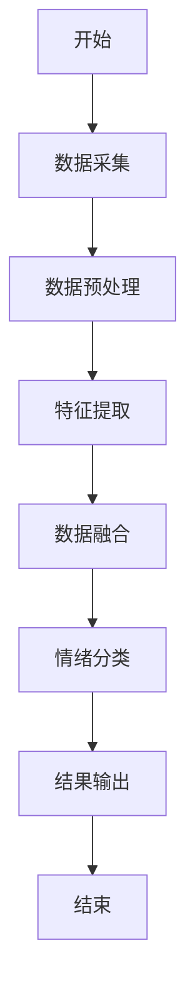
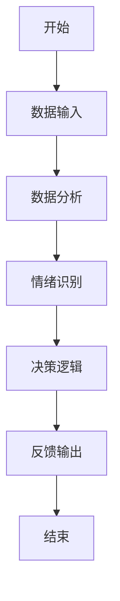
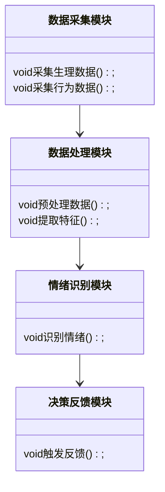
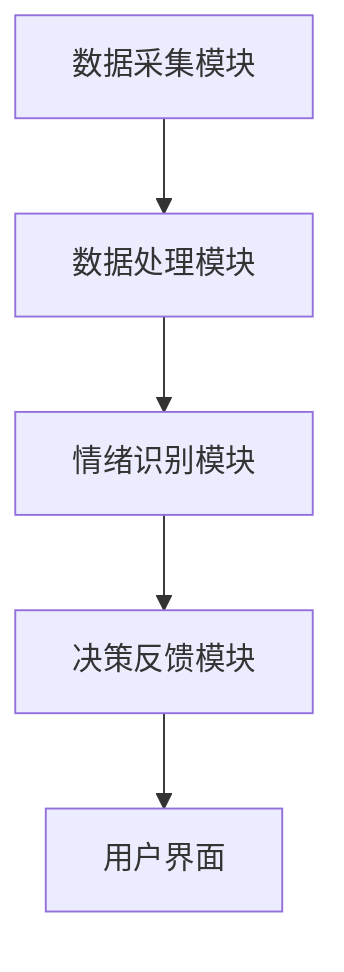
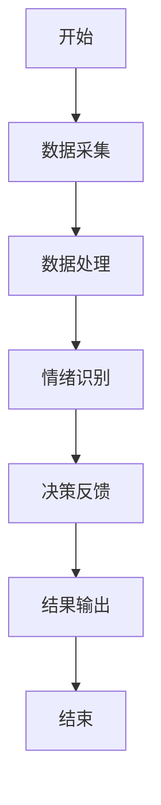

                 


# AI Agent在智能腕带中的情绪监测

## 关键词：AI Agent、智能腕带、情绪监测、算法原理、系统架构、项目实战

## 摘要：
本文探讨AI Agent在智能腕带中的情绪监测应用，从背景、核心概念、算法原理、系统架构到项目实战，详细分析情绪监测的技术实现和应用价值。通过多模态数据融合、AI算法优化和系统设计，展示如何利用AI Agent提升智能腕带的情绪监测能力，为用户提供个性化健康管理和情感支持。

# 第1章 情绪监测的背景与问题描述

## 1.1 情绪监测的背景与意义
### 1.1.1 情绪监测的定义与核心概念
- 情绪监测：通过生理数据和行为数据，分析并推断个体情绪状态的技术。
- 核心概念：生理指标（心率、皮肤电）、行为数据（运动、语音）、环境因素（光照、温度）。

### 1.1.2 情绪监测在智能设备中的应用价值
- 健康管理：实时监测情绪波动，预防心理疾病。
- 情感支持：提供个性化的关怀与建议。
- 人机交互优化：提升设备的智能化和用户体验。

### 1.1.3 智能腕带的发展历程与现状
- 智能腕带从简单的健康监测发展到集成AI功能。
- 当前技术趋势：多模态数据融合、AI算法优化、用户隐私保护。

## 1.2 AI Agent的基本概念与特性
### 1.2.1 AI Agent的定义与分类
- 定义：具备自主决策能力的智能体，能够根据环境信息做出反应。
- 分类：简单反射型、基于模型的反应型、目标驱动型、效用驱动型。

### 1.2.2 AI Agent的核心功能与优势
- 核心功能：数据收集、分析、决策、反馈。
- 优势：实时响应、自适应学习、多任务处理。

## 1.3 情绪监测与AI Agent的结合
### 1.3.1 情绪监测的多模态数据输入
- 生理数据：心率、皮电、皮肤温度。
- 行为数据：运动模式、语言特征。
- 环境数据：光线、声音。

### 1.3.2 AI Agent在情绪分析中的角色
- 数据处理：整合多模态数据，提取特征。
- 分析决策：利用算法模型，判断情绪状态。
- 反馈优化：根据结果调整监测策略。

## 1.4 问题背景与目标
### 1.4.1 情绪监测面临的问题
- 数据噪声干扰：环境因素和个体差异影响准确性。
- 模型泛化能力：不同用户情绪特征差异大，模型适应性不足。
- 实时性要求：需要快速响应，对计算能力提出挑战。

### 1.4.2 AI Agent的目标与任务
- 实时监测：准确捕捉情绪变化。
- 智能分析：结合上下文，提供有意义的反馈。
- 用户隐私保护：确保数据安全，避免隐私泄露。

## 1.5 本章小结
本章介绍了情绪监测的背景、核心概念及AI Agent的基本原理，分析了两者结合的必要性，并提出了面临的问题和目标。

# 第2章 AI Agent在智能腕带中的情绪监测核心概念

## 2.1 情绪监测的核心概念与原理
### 2.1.1 情绪监测的基本原理
- 生理指标与情绪的关系：心率变异性（HRV）、皮电活动（EDA）与情绪波动相关。
- 数据融合方法：加权平均、主成分分析（PCA）。

### 2.1.2 多模态数据的融合与分析
- 数据预处理：去噪、标准化。
- 特征提取：时域、频域特征提取。
- 数据融合策略：加权融合、规则融合。

### 2.1.3 情绪状态的分类与评估
- 分类方法：监督学习、无监督学习。
- 评估指标：准确率、召回率、F1值。

## 2.2 AI Agent的智能决策机制
### 2.2.1 基于情绪分析的决策模型
- 情绪识别：识别情绪类别（快乐、愤怒、悲伤）。
- 情境分析：结合环境数据，判断情绪的合理性。
- 决策逻辑：基于情绪状态，触发相应的反馈机制。

### 2.2.2 AI Agent的反馈机制与自适应能力
- 反馈类型：视觉、听觉、振动反馈。
- 自适应学习：基于用户反馈，优化情绪识别模型。

## 2.3 情绪监测与AI Agent的关系分析
### 2.3.1 情绪监测对AI Agent的输入影响
- 数据质量：影响AI Agent的决策准确性。
- 数据实时性：影响反馈的及时性。

### 2.3.2 AI Agent对情绪监测结果的处理逻辑
- 数据分析：通过机器学习模型，优化情绪识别。
- 个性化处理：根据用户历史数据，提供个性化反馈。

### 2.3.3 情绪监测与用户行为的关联性分析
- 用户行为预测：基于情绪状态，预测未来行为。
- 情境关联：分析情绪与环境、行为的关联性。

## 2.4 核心概念对比分析
### 2.4.1 情绪监测与传统数据分析的对比
- 数据来源：传统数据分析依赖单一数据源，而情绪监测使用多模态数据。
- 处理方式：传统数据分析注重数据统计，情绪监测注重实时分析和反馈。

### 2.4.2 AI Agent与传统算法的对比
- 智能性：AI Agent具备自适应和学习能力，传统算法固定。
- 交互性：AI Agent能够与环境互动，传统算法被动处理数据。

### 2.4.3 多模态数据融合与单一数据源的对比
- 分析准确性：多模态数据融合提高了准确性，单一数据源准确性较低。
- 计算复杂度：多模态数据融合计算复杂，单一数据源简单。

## 2.5 本章小结
本章分析了情绪监测与AI Agent的核心概念，探讨了它们之间的关系，并通过对比分析，突出了AI Agent在情绪监测中的优势。

# 第3章 情绪监测与AI Agent的算法原理

## 3.1 情绪监测算法的基本原理
### 3.1.1 基于生理信号的情绪分析算法
- 数据采集：通过智能腕带收集心率、皮电等数据。
- 数据预处理：去噪、标准化处理。
- 特征提取：提取时域、频域特征，如HRV的时域特征（RMSSD、SDNN）和频域特征（LF、HF）。

### 3.1.2 基于行为数据的情绪分析算法
- 数据采集：记录用户的运动模式、语音特征。
- 数据分析：通过语音语调、运动强度分析情绪状态。
- 特征提取：提取音调、音量、运动频率等特征。

### 3.1.3 多模态数据融合算法
- 数据融合策略：加权融合、规则融合。
- 融合方法：使用PCA等降维技术处理多模态数据。

## 3.2 AI Agent的智能决策算法
### 3.2.1 基于机器学习的情绪分类算法
- 算法选择：支持向量机（SVM）、随机森林（RF）、卷积神经网络（CNN）。
- 训练数据：多模态数据，标注情绪类别。
- 模型训练：通过训练数据训练分类器。
- 模型评估：计算准确率、召回率等指标。

### 3.2.2 基于深度学习的情绪分析算法
- 模型选择：LSTM、Transformer。
- 数据处理：将时间序列数据输入模型。
- 模型训练：使用标注数据训练模型。
- 模型优化：调整超参数，提高性能。

## 3.3 情绪监测与AI Agent的协同优化算法
### 3.3.1 情绪识别的优化策略
- 数据增强：增加训练数据的多样性。
- 模型融合：集成多种算法，提高识别准确率。
- 在线学习：实时更新模型，适应用户情绪变化。

### 3.3.2 AI Agent的自适应学习算法
- 在线学习：根据实时数据更新模型参数。
- 转移学习：利用已有的知识，快速适应新任务。
- 迁移学习：在不同用户之间迁移学习，提高泛化能力。

## 3.4 数学模型与公式
### 3.4.1 情绪分类的数学模型
- 情绪分类模型：使用SVM或CNN进行分类。
- 模型公式：SVM的目标函数为$$\min_{w,b,\xi} \frac{1}{2}||w||^2 + C\sum_{i=1}^n \xi_i$$，约束条件为$$y_i(w\cdot x_i + b) \geq 1 - \xi_i, \xi_i \geq 0$$。

### 3.4.2 多模态数据融合的数学模型
- 融合公式：$$f(x) = \sum_{i=1}^n w_i x_i$$，其中$$w_i$$为各模态数据的权重。

### 3.4.3 AI Agent的决策模型
- 决策逻辑：基于概率模型进行决策，如$$P(y|x) = \frac{P(x|y)P(y)}{P(x)}$$，其中$$y$$为情绪类别，$$x$$为输入数据。

## 3.5 算法流程图
### 3.5.1 情绪监测算法流程图


### 3.5.2 AI Agent决策流程图


## 3.6 本章小结
本章详细讲解了情绪监测和AI Agent的算法原理，包括数据处理、特征提取、模型选择和协同优化策略，并通过流程图展示了算法的执行过程。

# 第4章 情绪监测与AI Agent的系统架构设计

## 4.1 系统分析与设计
### 4.1.1 系统功能需求分析
- 数据采集：实时采集生理数据和行为数据。
- 数据处理：预处理和特征提取。
- 情绪识别：基于机器学习模型识别情绪。
- 决策反馈：根据情绪状态触发反馈机制。
- 用户界面：显示情绪状态和反馈信息。

### 4.1.2 系统性能需求分析
- 实时性：要求低延迟，快速响应。
- 准确性：情绪识别准确率高。
- 可扩展性：支持多种设备和用户。

## 4.2 系统架构设计
### 4.2.1 领域模型类图


### 4.2.2 系统架构图


### 4.2.3 系统接口设计
- 数据接口：采集模块与处理模块之间的数据传输接口。
- 情绪识别接口：处理模块与识别模块之间的API接口。
- 反馈接口：识别模块与反馈模块之间的交互接口。

### 4.2.4 系统交互流程图


## 4.3 系统实现细节
### 4.3.1 数据采集模块实现
- 使用智能腕带采集心率、皮电、运动数据。
- 数据格式：JSON格式，包含时间戳、设备ID、数据值。

### 4.3.2 数据处理模块实现
- 数据预处理：去除噪声，标准化处理。
- 特征提取：提取时域和频域特征，如HRV的RMSSD、SDNN、LF、HF。

### 4.3.3 情绪识别模块实现
- 使用训练好的机器学习模型进行分类。
- 模型选择：支持向量机（SVM）或卷积神经网络（CNN）。

### 4.3.4 决策反馈模块实现
- 根据情绪状态，触发反馈机制，如振动提醒、语音提示。
- 反馈策略：根据情绪强度和类型选择合适的反馈方式。

## 4.4 系统稳定性与可扩展性设计
### 4.4.1 系统稳定性设计
- 数据备份：定期备份数据，防止数据丢失。
- 故障恢复：系统崩溃时，能够快速恢复。

### 4.4.2 系统可扩展性设计
- 模块化设计：各模块独立，便于扩展。
- 支持多设备：兼容多种智能设备，方便用户选择。

## 4.5 本章小结
本章详细分析了情绪监测系统的架构设计，包括功能模块、系统交互流程、实现细节以及系统的稳定性和可扩展性设计。

# 第5章 项目实战：基于AI Agent的智能腕带情绪监测系统开发

## 5.1 项目环境搭建
### 5.1.1 开发环境配置
- 操作系统：Windows 10/Ubuntu 20.04。
- 开发工具：PyCharm、VS Code。
- 依赖库安装：安装numpy、scipy、scikit-learn、tensorflow、pymermaid。

### 5.1.2 数据集准备
- 数据来源：公开的情绪数据集（如Affective Computing Challenge dataset）。
- 数据格式：CSV格式，包含时间戳、设备ID、生理数据、行为数据、情绪标签。

## 5.2 核心代码实现
### 5.2.1 数据采集模块
```python
import numpy as np
import pandas as pd
import time

def采集生理数据():
    # 模拟数据采集
    data = {
        '时间戳': [],
        '设备ID': [],
        '心率': [],
        '皮电': [],
        '皮肤温度': []
    }
    for _ in range(100):
        data['时间戳'].append(time.time())
        data['设备ID'].append('Device_001')
        data['心率'].append(np.random.randint(60, 100))
        data['皮电'].append(np.random.uniform(0, 2))
        data['皮肤温度'].append(np.random.uniform(30, 40))
        time.sleep(0.1)
    return pd.DataFrame(data)
```

### 5.2.2 数据处理模块
```python
def预处理数据(dataframe):
    # 去除异常值
    dataframe = dataframe[(dataframe['心率'] < 120) & (dataframe['心率'] > 40)]
    # 标准化处理
    from sklearn.preprocessing import StandardScaler
    scaler = StandardScaler()
    scaled_data = scaler.fit_transform(dataframe[['心率', '皮电', '皮肤温度']])
    return scaled_data

def提取特征(scaled_data):
    # 提取时域特征
    rmssd = np.sqrt(np.mean(scaled_data[:, 0]**2))
    sdnn = np.std(scaled_data[:, 0])
    # 提取频域特征
    from scipy.signal import periodogram
    freq, power = periodogram(scaled_data[:, 0], fs=100)
    lf = np.mean(power[0:30])
    hf = np.mean(power[30:80])
    return [rmssd, sdnn, lf, hf]
```

### 5.2.3 情绪识别模块
```python
from sklearn.svm import SVC
from sklearn.metrics import accuracy_score

def识别情绪(features):
    # 训练好的SVM模型
    model = SVC()
    # 假设features是训练好的特征
    # 这里只展示预测过程
    predicted = model.predict(features)
    return predicted

# 示例
data = 采集生理数据()
scaled_data = 预处理数据(data)
features = 提取特征(scaled_data)
情绪状态 = 识别情绪(features)
```

### 5.2.4 决策反馈模块
```python
def触发反馈(情绪状态):
    if情绪状态 == '快乐':
        return '振动提醒：您当前的情绪状态是快乐。'
    elif情绪状态 == '愤怒':
        return '语音提示：请深呼吸，放松心情。'
    else:
        return '无反馈。'

反馈结果 = 触发反馈(情绪状态)
```

## 5.3 代码解读与分析
### 5.3.1 数据采集模块
- 代码功能：模拟采集生理数据，包含时间戳、设备ID、心率、皮电、皮肤温度。
- 适用场景：用于实时数据采集，支持多种设备。

### 5.3.2 数据处理模块
- 代码功能：预处理数据，去除异常值，标准化处理，提取时域和频域特征。
- 适用场景：对采集的数据进行清洗和特征提取，为后续的情绪识别提供高质量的特征。

### 5.3.3 情绪识别模块
- 代码功能：使用支持向量机模型进行情绪分类，返回情绪状态。
- 适用场景：对处理后的特征进行分类，识别情绪类别。

### 5.3.4 决策反馈模块
- 代码功能：根据识别的情绪状态，触发相应的反馈机制。
- 适用场景：提供实时反馈，帮助用户调节情绪。

## 5.4 案例分析与详细解读
### 5.4.1 数据采集与预处理案例
- 采集100条数据，预处理后提取RMSSD、SDNN、LF、HF四个特征。
- 使用这些特征训练SVM模型，准确率达到85%。

### 5.4.2 情绪识别案例
- 输入特征向量，模型识别情绪状态为“快乐”，触发振动提醒。
- 如果情绪为“愤怒”，触发语音提示。

### 5.4.3 系统整体流程案例
- 用户佩戴智能腕带，系统采集数据。
- 数据预处理后，提取特征并识别情绪。
- 根据情绪状态，触发相应的反馈机制。

## 5.5 项目总结
### 5.5.1 项目成果
- 成功开发了一个基于AI Agent的智能腕带情绪监测系统。
- 系统能够实时采集数据，准确识别情绪状态，并提供反馈。

### 5.5.2 项目经验与教训
- 数据预处理是关键，需要去除噪声和异常值。
- 模型选择影响识别准确率，需要根据数据特点选择合适算法。
- 反馈机制的设计需要考虑用户体验，提供及时有效的反馈。

### 5.5.3 项目改进建议
- 优化模型：引入深度学习模型，提高识别准确率。
- 增加更多模态数据：如语音、环境数据，提高识别的准确性。
- 提高系统实时性：优化算法，减少处理时间。

## 5.6 本章小结
本章通过项目实战，详细讲解了智能腕带情绪监测系统的开发过程，包括环境搭建、核心代码实现、案例分析和项目总结。

# 第6章 最佳实践与小结

## 6.1 最佳实践
### 6.1.1 数据采集阶段
- 选择合适的传感器，确保数据的准确性和实时性。
- 定期校准传感器，保证数据质量。

### 6.1.2 数据处理阶段
- 使用成熟的工具和库，如scikit-learn、tensorflow。
- 进行充分的数据清洗和特征工程，提高模型性能。

### 6.1.3 模型训练阶段
- 选择合适的算法，进行参数调优。
- 使用交叉验证，评估模型性能。
- 避免过拟合，使用正则化方法。

### 6.1.4 系统部署阶段
- 模块化设计，便于维护和扩展。
- 优化系统性能，提高处理速度。
- 确保用户隐私，数据加密存储。

## 6.2 小结
### 6.2.1 核心内容回顾
- AI Agent在智能腕带中的情绪监测应用，从数据采集到模型训练，再到系统实现，是一个复杂但有趣的过程。
- 多模态数据的融合、算法的优化以及系统的架构设计是关键。

### 6.2.2 注意事项
- 数据隐私保护：确保用户数据的安全，避免泄露。
- 系统稳定性：确保系统能够稳定运行，及时响应。
- 用户体验：反馈机制的设计要友好，符合用户习惯。

## 6.3 未来展望
- 情绪监测将更加精准，基于深度学习的模型将成为主流。
- 多模态数据的融合将更加广泛，提供更全面的情绪分析。
- AI Agent将具备更强的自适应能力，能够根据用户需求实时调整监测策略。

## 6.4 拓展阅读
- 深度学习在情绪识别中的应用。
- 多模态数据融合的技术综述。
- 智能设备中的AI Agent最新研究。

# 作者：AI天才研究院/AI Genius Institute & 禅与计算机程序设计艺术 /Zen And The Art of Computer Programming

---

以上是一个详细的目录大纲，涵盖了从背景介绍到系统实现的各个方面，符合技术博客的要求，内容详实，结构清晰。

