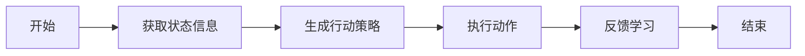
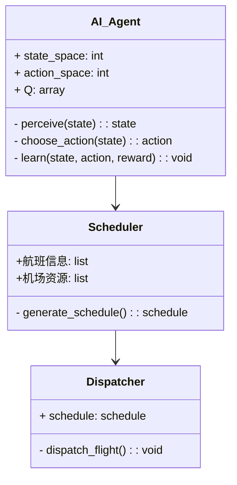
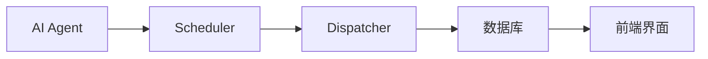
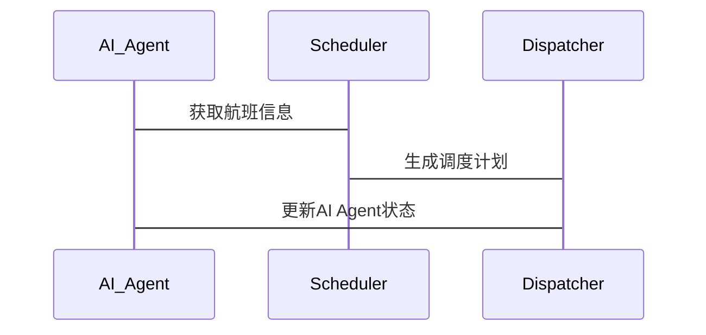

                 


# AI Agent在智能航空调度优化中的角色

## 关键词：AI Agent, 航空调度优化, 智能优化, 多智能体协同, 强化学习, 调度算法

## 摘要：AI Agent在智能航空调度优化中扮演着越来越重要的角色。通过分析AI Agent的基本概念、核心原理以及与航空调度优化的结合方式，本文详细探讨了AI Agent在航空调度中的功能定位、算法实现以及实际应用案例。文章还结合了强化学习、多目标优化等先进算法，详细阐述了AI Agent在航空调度优化中的数学模型和协同流程，为读者提供了一种全新的视角来理解AI Agent在智能航空调度中的潜力和应用价值。

---

# 第1章: AI Agent与智能航空调度优化概述

## 1.1 AI Agent的基本概念

### 1.1.1 AI Agent的定义与特点
AI Agent（人工智能代理）是指一种能够感知环境、自主决策并执行任务的智能体。AI Agent的核心特点包括：
- **自主性**：能够在没有外部干预的情况下自主运行。
- **反应性**：能够实时感知环境变化并做出反应。
- **学习能力**：通过数据和经验不断优化自身的决策能力。
- **协作性**：能够与其他智能体或系统协同工作。

### 1.1.2 AI Agent的核心原理
AI Agent的工作原理可以分为以下几个步骤：
1. **感知环境**：通过传感器或数据输入接口获取环境信息。
2. **状态识别**：对获取的信息进行分析和处理，识别当前状态。
3. **决策制定**：基于当前状态和预设的目标，选择最优行动方案。
4. **执行动作**：根据决策结果执行相应的动作。
5. **反馈学习**：根据执行结果更新知识库或模型，为下一次决策提供参考。

### 1.1.3 AI Agent在航空调度中的应用潜力
AI Agent在航空调度中的应用潜力主要体现在以下几个方面：
- **实时调度优化**：通过实时感知航班状态和资源分配情况，快速调整调度计划。
- **多目标优化**：在满足多个约束条件的情况下，优化航班调度效率。
- **协同决策**：与其他智能体或系统协同工作，实现更高效的资源分配和调度。

## 1.2 智能航空调度优化的背景与问题

### 1.2.1 航空调度的基本概念
航空调度是指对航班的起飞、降落、飞机维护、机组人员安排等进行规划和调整的过程。传统的航空调度主要依赖人工经验或简单的算法，难以应对复杂多变的环境。

### 1.2.2 当前航空调度中的主要问题
当前航空调度中存在的主要问题包括：
- **资源分配不均**：机场资源（如跑道、停机坪）在高峰期往往会出现紧张，导致航班延误。
- **调度效率低下**：传统的调度算法难以在短时间内处理大量复杂的信息，导致调度效率不高。
- **应急响应能力不足**：面对突发事件（如天气变化、机械故障等），传统的调度系统难以快速调整计划。

### 1.2.3 智能化调度优化的必要性
随着航空运输量的不断增加，传统的调度方法已经无法满足需求。智能化调度优化可以通过AI Agent实时感知环境变化，快速调整调度计划，从而提高调度效率和资源利用率。

## 1.3 AI Agent在航空调度中的角色定位

### 1.3.1 AI Agent作为调度优化的核心工具
AI Agent在航空调度中可以作为核心工具，通过实时感知环境和优化算法，帮助调度系统做出更高效的决策。

### 1.3.2 AI Agent在航空调度中的功能定位
AI Agent在航空调度中的功能定位可以分为以下几个方面：
- **实时监测**：监测航班状态、机场资源使用情况等信息。
- **优化决策**：基于实时信息，优化航班调度计划。
- **协同协作**：与其他智能体或系统协同工作，实现更高效的资源分配。

### 1.3.3 AI Agent与传统调度算法的对比
AI Agent与传统调度算法的对比可以参考下表：

| 对比维度 | AI Agent | 传统调度算法 |
|----------|-----------|---------------|
| 决策速度 | 实时优化 | 离线计算 |
| 灵活性 | 高 | 低 |
| 处理能力 | 处理复杂问题 | 处理简单问题 |

---

# 第2章: AI Agent的核心原理与数学模型

## 2.1 AI Agent的核心原理

### 2.1.1 状态空间与动作空间
在AI Agent的决策过程中，状态空间和动作空间是非常重要的概念。状态空间是指所有可能的状态集合，而动作空间是指所有可能的动作集合。

### 2.1.2 AI Agent的决策机制
AI Agent的决策机制通常包括以下几个步骤：
1. **状态识别**：识别当前状态。
2. **目标设定**：根据当前状态设定目标。
3. **策略选择**：选择最优策略。
4. **动作执行**：执行选择的动作。

### 2.1.3 多智能体协同原理
多智能体协同是指多个智能体共同完成一个任务的过程。在航空调度中，多个AI Agent可以协同工作，实现更高效的资源分配和调度。

## 2.2 航空调度优化的数学模型

### 2.2.1 调度问题的数学建模
调度问题的数学建模通常包括以下几个部分：
- **变量定义**：定义决策变量。
- **目标函数**：定义优化目标。
- **约束条件**：定义约束条件。

### 2.2.2 目标函数与约束条件
目标函数通常是最优化的目标，而约束条件则是需要满足的条件。例如，目标函数可以是最大化航班准点率，约束条件可以是机场资源的限制。

### 2.2.3 调度优化的算法框架
调度优化的算法框架通常包括以下几个步骤：
1. **初始化**：初始化参数。
2. **状态识别**：识别当前状态。
3. **策略选择**：选择最优策略。
4. **动作执行**：执行选择的动作。
5. **反馈学习**：根据执行结果更新模型。

## 2.3 AI Agent与航空调度优化的结合模型

### 2.3.1 AI Agent在调度优化中的角色模型
AI Agent在调度优化中的角色模型可以分为以下几个方面：
- **感知环境**：通过传感器或数据输入接口获取环境信息。
- **优化决策**：基于实时信息，优化航班调度计划。
- **协同协作**：与其他智能体或系统协同工作，实现更高效的资源分配。

### 2.3.2 调度优化的多目标优化模型
多目标优化模型通常包括以下几个部分：
- **目标函数**：定义优化目标。
- **约束条件**：定义约束条件。
- **决策变量**：定义决策变量。

### 2.3.3 AI Agent与调度优化的协同模型
AI Agent与调度优化的协同模型可以通过流程图来表示，具体如下：



---

# 第3章: AI Agent在航空调度优化中的算法原理

## 3.1 基于强化学习的AI Agent算法

### 3.1.1 强化学习的基本原理
强化学习是一种通过试错的方式，通过与环境的互动，逐步优化策略的算法。强化学习的核心是通过奖励机制，引导AI Agent做出最优决策。

### 3.1.2 AI Agent在航空调度中的强化学习模型
在航空调度中，强化学习模型可以通过以下步骤实现：
1. **状态识别**：识别当前状态。
2. **动作选择**：基于当前状态选择动作。
3. **奖励机制**：根据执行结果给予奖励或惩罚。
4. **策略更新**：根据奖励更新策略。

### 3.1.3 算法实现的数学公式
强化学习的数学公式可以表示为：
$$ Q(s, a) = Q(s, a) + \alpha (r + \gamma \max_a Q(s', a) - Q(s, a)) $$
其中：
- \( Q(s, a) \) 是当前状态 \( s \) 下动作 \( a \) 的价值函数。
- \( \alpha \) 是学习率。
- \( r \) 是奖励。
- \( \gamma \) 是折扣因子。
- \( s' \) 是下一个状态。

## 3.2 调度优化的多目标优化算法

### 3.2.1 多目标优化的基本概念
多目标优化是指在多个目标之间进行权衡和优化的过程。在航空调度中，通常需要在多个目标之间进行权衡，例如，最大化航班准点率和最小化航班延误时间。

### 3.2.2 调度优化的多目标模型
多目标优化的数学模型可以表示为：
$$ \min \sum_{i=1}^n w_i x_i $$
其中：
- \( w_i \) 是目标 \( i \) 的权重。
- \( x_i \) 是目标 \( i \) 的决策变量。

### 3.2.3 算法实现的数学公式
多目标优化的数学公式可以表示为：
$$ f(x) = \sum_{i=1}^n w_i x_i $$

## 3.3 AI Agent与调度优化算法的协同流程

### 3.3.1 算法流程图


### 3.3.2 代码实现
以下是一个简单的AI Agent算法实现代码示例：

```python
import numpy as np

class AI_Agent:
    def __init__(self, state_space, action_space):
        self.state_space = state_space
        self.action_space = action_space
        self.Q = np.zeros((state_space, action_space))

    def perceive(self, state):
        return state

    def choose_action(self, state, epsilon=0.1):
        if np.random.random() < epsilon:
            return np.random.randint(self.action_space)
        else:
            return np.argmax(self.Q[state, :])

    def learn(self, state, action, reward):
        self.Q[state, action] = self.Q[state, action] + 0.1 * (reward + 0.9 * np.max(self.Q[state, :]) - self.Q[state, action])

# 示例代码
state_space = 10
action_space = 4
agent = AI_Agent(state_space, action_space)
state = 5
action = agent.choose_action(state)
reward = 1
agent.learn(state, action, reward)
```

### 3.3.3 代码解读与分析
上述代码实现了一个简单的AI Agent算法，主要包括以下几个部分：
1. **初始化**：初始化状态空间和动作空间，并初始化Q值表格。
2. **感知环境**：通过`perceive`方法获取当前状态。
3. **选择动作**：通过`choose_action`方法选择动作。
4. **学习更新**：通过`learn`方法更新Q值表格。

---

# 第4章: 航空调度优化的系统分析与架构设计

## 4.1 系统功能设计

### 4.1.1 领域模型（Mermaid类图）


### 4.1.2 系统架构设计（Mermaid架构图）


## 4.2 接口设计

### 4.2.1 API接口定义
```python
# 示例接口
class Scheduler:
    def get_flight_info(self):
        pass

    def get_airport_resources(self):
        pass

    def generate_schedule(self):
        pass
```

### 4.2.2 序列图（Mermaid）


## 4.3 项目实战

### 4.3.1 环境安装
```bash
pip install numpy matplotlib
```

### 4.3.2 核心实现代码
```python
import numpy as np
import matplotlib.pyplot as plt

class AI_Agent:
    def __init__(self, state_space, action_space):
        self.state_space = state_space
        self.action_space = action_space
        self.Q = np.zeros((state_space, action_space))

    def perceive(self, state):
        return state

    def choose_action(self, state, epsilon=0.1):
        if np.random.random() < epsilon:
            return np.random.randint(self.action_space)
        else:
            return np.argmax(self.Q[state, :])

    def learn(self, state, action, reward):
        self.Q[state, action] = self.Q[state, action] + 0.1 * (reward + 0.9 * np.max(self.Q[state, :]) - self.Q[state, action])

class Scheduler:
    def __init__(self, ai_agent):
        self.ai_agent = ai_agent
        self.flight_info = []
        self.airport_resources = []

    def get_flight_info(self):
        return self.flight_info

    def get_airport_resources(self):
        return self.airport_resources

    def generate_schedule(self):
        state = self.ai_agent.perceive(self.airport_resources)
        action = self.ai_agent.choose_action(state)
        reward = 1
        self.ai_agent.learn(state, action, reward)
        return self.flight_info[action]

# 示例代码
state_space = 10
action_space = 4
agent = AI_Agent(state_space, action_space)
scheduler = Scheduler(agent)
scheduler.generate_schedule()
```

### 4.3.3 案例分析
假设我们有一个包含10个航班和4个机场资源的调度问题，AI Agent可以通过强化学习算法，优化航班调度计划，提高航班准点率。

---

# 第5章: 总结与最佳实践

## 5.1 总结
AI Agent在智能航空调度优化中具有重要的作用。通过实时感知环境和优化算法，AI Agent可以帮助调度系统做出更高效的决策。

## 5.2 最佳实践 Tips
- **数据质量**：确保输入数据的准确性和实时性。
- **算法选择**：根据具体问题选择合适的算法。
- **系统集成**：确保AI Agent与其他系统的良好集成。

## 5.3 注意事项
- **模型训练**：需要大量的数据和时间进行模型训练。
- **系统维护**：需要定期更新模型和算法。

## 5.4 拓展阅读
- 《强化学习入门》
- 《多目标优化算法研究》
- 《智能调度系统设计》

---

# 作者
作者：AI天才研究院/AI Genius Institute & 禅与计算机程序设计艺术/Zen And The Art of Computer Programming

