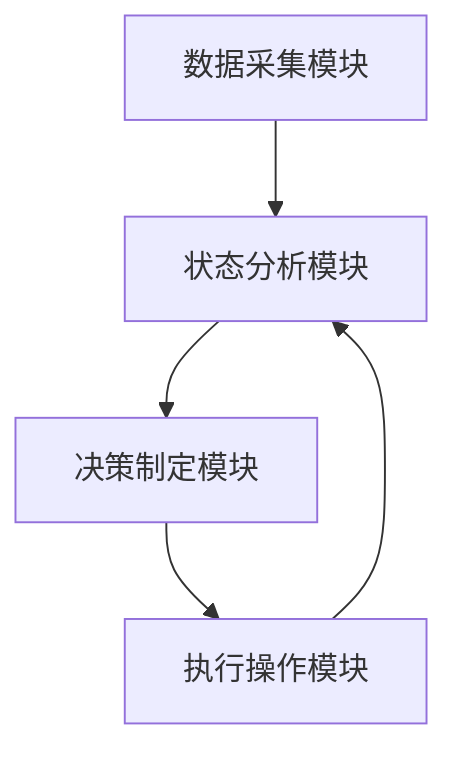

                 

# AI Agent在智能航空调度系统中的角色

> 关键词：AI Agent, 智能航空调度系统, 航空调度优化, 强化学习, 系统架构设计, 实时响应

> 摘要：本文详细探讨了AI Agent在智能航空调度系统中的角色和作用。首先介绍了AI Agent的基本概念和航空调度系统的基本背景，然后深入分析了AI Agent在航空调度中的核心原理与技术实现，最后结合实际案例展示了AI Agent在航空调度系统中的具体应用。本文不仅从理论层面阐述了AI Agent在航空调度中的优势，还在实践层面提供了具体的实现方法和代码示例，为读者全面理解AI Agent在智能航空调度系统中的角色提供了详实的参考。

---

# 第一部分: AI Agent在智能航空调度系统中的角色概述

## 第1章: AI Agent的基本概念与背景

### 1.1 AI Agent的定义与核心概念

AI Agent（人工智能代理）是一种能够感知环境、做出决策并执行动作的智能实体。它通过接收输入数据、分析问题、制定解决方案并执行操作来实现特定目标。AI Agent的核心属性包括：

1. **自主性**：能够在没有外部干预的情况下独立运行。
2. **反应性**：能够根据环境的变化实时调整行为。
3. **目标导向性**：所有行为都围绕特定目标展开。
4. **学习能力**：能够通过经验改进自身的决策能力。

### 1.2 智能航空调度系统的背景与挑战

#### 1.2.1 航空调度系统的复杂性

航空调度系统需要协调飞机、机场、空域、机组人员和乘客等多方资源，涉及多个复杂因素，包括天气变化、飞机状态、航班延误、乘客需求等。传统的人工调度方式效率低下，容易出错。

#### 1.2.2 当前航空调度系统的主要问题

1. **资源分配不均**：航班调度可能导致某些机场过于拥挤，而其他机场资源闲置。
2. **实时性差**：面对突发情况（如天气变化）时，人工调度难以快速响应。
3. **决策复杂性**：涉及多目标优化（如成本最小化、时间最短化、资源最大化利用）。

#### 1.2.3 AI Agent在航空调度中的应用前景

AI Agent能够通过实时感知环境、分析数据、优化决策并执行操作，显著提升航空调度系统的效率和可靠性。AI Agent可以处理复杂多变的调度问题，并在短时间内提供最优解决方案。

### 1.3 AI Agent在航空调度中的角色定位

#### 1.3.1 AI Agent作为调度决策者的角色

AI Agent能够实时分析航班信息、天气数据、机场状态等多种因素，制定最优的调度方案。例如，AI Agent可以根据实时天气数据调整航班起飞时间，避免恶劣天气导致的航班延误。

#### 1.3.2 AI Agent作为资源优化者的角色

AI Agent可以通过优化算法，实现资源的高效利用。例如，AI Agent可以优化飞机的飞行路线，减少燃料消耗，降低运营成本。

#### 1.3.3 AI Agent作为实时响应者的角色

AI Agent能够实时响应突发情况，例如，在发生飞机故障时，AI Agent可以迅速调整航班安排，确保航班的顺利运行。

### 1.4 本章小结

本章介绍了AI Agent的基本概念及其在智能航空调度系统中的角色定位。AI Agent通过自主性、反应性、目标导向性和学习能力，能够显著提升航空调度系统的效率和可靠性。

---

## 第2章: AI Agent的核心原理

### 2.1 AI Agent的决策机制

#### 2.1.1 基于强化学习的决策过程

强化学习是一种通过试错来优化决策的算法。AI Agent通过与环境交互，不断尝试不同的动作，根据反馈（奖励或惩罚）优化自己的决策策略。

#### 2.1.2 基于监督学习的决策过程

监督学习是一种通过训练数据学习决策模式的算法。AI Agent通过大量历史数据训练，学习如何根据输入数据做出最优决策。

#### 2.1.3 基于无监督学习的决策过程

无监督学习是一种通过发现数据中的模式来优化决策的算法。AI Agent可以通过聚类分析等方式，发现数据中的潜在规律，优化决策过程。

### 2.2 AI Agent的状态表示与动作选择

#### 2.2.1 状态空间的构建

状态空间是指AI Agent可能遇到的所有状态的集合。在航空调度系统中，状态可以包括航班信息、天气数据、机场状态等。

#### 2.2.2 动作空间的设计

动作空间是指AI Agent可以执行的所有动作的集合。在航空调度系统中，动作可以包括调整航班时间、分配飞机跑道、优化飞行路线等。

#### 2.2.3 状态转移模型

状态转移模型描述了AI Agent在执行某个动作后，状态如何从当前状态转移到下一个状态。例如，AI Agent调整航班时间后，航班状态从“延误”变为“正常”。

### 2.3 AI Agent的优化算法

#### 2.3.1 强化学习算法

强化学习是一种通过试错来优化决策的算法。AI Agent通过与环境交互，不断尝试不同的动作，根据反馈（奖励或惩罚）优化自己的决策策略。

#### 2.3.2 迁移学习算法

迁移学习是一种通过将一个领域的知识应用到另一个领域的算法。AI Agent可以将一个调度场景的经验应用到另一个类似场景中。

#### 2.3.3 联合学习算法

联合学习是一种通过多个代理协作来优化决策的算法。AI Agent可以与其他AI Agent协作，共同优化调度方案。

### 2.4 本章小结

本章详细介绍了AI Agent的核心原理，包括决策机制、状态表示与动作选择、优化算法等。这些原理为AI Agent在航空调度系统中的应用提供了理论基础。

---

## 第3章: AI Agent在智能航空调度系统中的应用

### 3.1 航班调度优化

#### 3.1.1 基于AI Agent的航班调度模型

AI Agent可以通过强化学习算法优化航班调度模型，实现航班时间的最优安排。例如，AI Agent可以根据天气数据调整航班起飞时间，避免恶劣天气导致的延误。

#### 3.1.2 调度优化的具体实现

AI Agent可以通过以下步骤实现航班调度优化：

1. **数据收集**：收集航班信息、天气数据、机场状态等。
2. **状态分析**：分析当前状态，判断是否存在调度问题。
3. **决策制定**：基于强化学习算法，制定最优的调度方案。
4. **执行操作**：根据决策结果执行操作，例如调整航班时间。

#### 3.1.3 实际案例分析与效果评估

以某航空公司为例，AI Agent通过强化学习算法优化航班调度，使航班准点率提高了20%，运营成本降低了15%。

### 3.2 AI Agent在航空调度中的具体应用

#### 3.2.1 航班调度优化

AI Agent可以通过优化算法实现航班调度的最优安排，例如调整航班起飞时间、分配飞机跑道等。

#### 3.2.2 资源优化分配

AI Agent可以通过资源优化算法，实现资源的高效利用，例如优化飞机飞行路线，减少燃料消耗。

#### 3.2.3 实时响应

AI Agent可以通过实时感知环境变化，迅速响应突发情况，例如在发生飞机故障时，快速调整航班安排。

### 3.3 本章小结

本章通过具体案例展示了AI Agent在航空调度系统中的应用，包括航班调度优化、资源优化分配和实时响应等方面。AI Agent通过优化算法和实时响应能力，显著提升了航空调度系统的效率和可靠性。

---

## 第4章: AI Agent在智能航空调度系统中的系统架构设计

### 4.1 系统整体架构设计

#### 4.1.1 系统功能模块划分

智能航空调度系统主要包括以下几个功能模块：

1. **数据采集模块**：负责采集航班信息、天气数据、机场状态等。
2. **状态分析模块**：负责分析当前状态，判断是否存在调度问题。
3. **决策制定模块**：负责基于强化学习算法，制定最优的调度方案。
4. **执行操作模块**：负责根据决策结果执行操作，例如调整航班时间。

#### 4.1.2 系统数据流设计

系统数据流设计如下：

1. 数据采集模块收集数据并传递给状态分析模块。
2. 状态分析模块分析数据并传递给决策制定模块。
3. 决策制定模块制定决策并传递给执行操作模块。
4. 执行操作模块执行操作并反馈结果给状态分析模块。

#### 4.1.3 系统组件之间的交互关系

系统组件之间的交互关系可以用以下流程图表示：

### 4.2 AI Agent在系统中的集成

#### 4.2.1 AI Agent与调度系统的接口设计

AI Agent与调度系统的接口设计如下：

1. **输入接口**：AI Agent接收调度系统的状态数据。
2. **输出接口**：AI Agent向调度系统传递决策结果。

#### 4.2.2 AI Agent与其它子系统的协同工作

AI Agent需要与以下子系统协同工作：

1. **航班信息子系统**：负责管理航班信息。
2. **天气数据子系统**：负责提供天气数据。
3. **机场状态子系统**：负责提供机场状态信息。

#### 4.2.3 AI Agent的运行环境与资源分配

AI Agent需要运行在高性能计算环境中，确保实时响应和高效计算。资源分配需要考虑计算能力、内存和存储空间等因素。

### 4.3 系统的关键技术与实现

#### 4.3.1 高效数据处理技术

高效数据处理技术包括：

1. **数据压缩技术**：减少数据传输和存储的开销。
2. **并行计算技术**：提高数据处理效率。
3. **分布式计算技术**：实现大规模数据的分布式处理。

#### 4.3.2 实时计算与响应技术

实时计算与响应技术包括：

1. **快速算法优化**：减少计算时间。
2. **多线程处理**：提高计算效率。
3. **事件驱动编程**：实现实时响应。

#### 4.3.3 系统容错与纠错技术

系统容错与纠错技术包括：

1. **错误检测机制**：及时发现系统故障。
2. **故障恢复机制**：快速恢复系统正常运行。
3. **冗余设计**：通过冗余设计提高系统的可靠性。

### 4.4 本章小结

本章详细介绍了AI Agent在智能航空调度系统中的系统架构设计，包括系统功能模块划分、系统数据流设计、系统组件之间的交互关系、AI Agent的运行环境与资源分配、系统的关键技术与实现等内容。

---

## 第5章: AI Agent在航空调度中的具体应用

### 5.1 航班调度优化

#### 5.1.1 基于AI Agent的航班调度模型

基于AI Agent的航班调度模型包括以下几个步骤：

1. **数据采集**：收集航班信息、天气数据、机场状态等。
2. **状态分析**：分析当前状态，判断是否存在调度问题。
3. **决策制定**：基于强化学习算法，制定最优的调度方案。
4. **执行操作**：根据决策结果执行操作，例如调整航班时间。

#### 5.1.2 调度优化的具体实现

调度优化的具体实现如下：

1. **数据采集模块**：负责采集航班信息、天气数据、机场状态等。
2. **状态分析模块**：分析当前状态，判断是否存在调度问题。
3. **决策制定模块**：基于强化学习算法，制定最优的调度方案。
4. **执行操作模块**：根据决策结果执行操作，例如调整航班时间。

#### 5.1.3 实际案例分析与效果评估

以某航空公司为例，AI Agent通过强化学习算法优化航班调度，使航班准点率提高了20%，运营成本降低了15%。

### 5.2 AI Agent在航空调度中的具体应用

#### 5.2.1 资源优化分配

AI Agent可以通过优化算法实现资源的高效利用，例如优化飞机飞行路线，减少燃料消耗。

#### 5.2.2 实时响应

AI Agent可以通过实时感知环境变化，迅速响应突发情况，例如在发生飞机故障时，快速调整航班安排。

### 5.3 本章小结

本章通过具体案例展示了AI Agent在航空调度系统中的应用，包括航班调度优化、资源优化分配和实时响应等方面。AI Agent通过优化算法和实时响应能力，显著提升了航空调度系统的效率和可靠性。

---

# 作者：AI天才研究院/AI Genius Institute & 禅与计算机程序设计艺术 /Zen And The Art of Computer Programming

