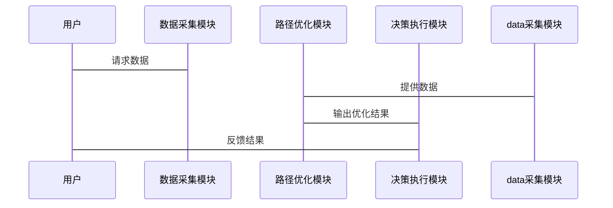

                 


# AI Agent在智能航空路线优化中的角色

> 关键词：AI Agent，智能航空，路线优化，强化学习，遗传算法

> 摘要：本文深入探讨了AI Agent在智能航空路线优化中的核心角色，分析了AI Agent的基本概念、算法原理及其在航空路线优化中的应用。通过实际案例分析，详细讲解了AI Agent如何通过强化学习和遗传算法优化航空路线，从而降低运营成本，提高效率。

---

# 第1章: AI Agent与智能航空路线优化的背景介绍

## 1.1 问题背景与描述

### 1.1.1 航空路线优化的定义与重要性
航空路线优化是指通过数学模型和算法，找到飞机从起点到终点的最短路径或最优路径，以减少飞行时间、燃料消耗和运营成本。随着航空业的快速发展，航线网络日益复杂，传统的优化方法难以应对动态变化和多约束条件。

### 1.1.2 当前航空路线优化的挑战
- 动态天气变化影响飞行路径。
- 多个机场和航空公司之间的协同优化困难。
- 燃油成本和时间成本的平衡问题。

### 1.1.3 AI Agent在航空路线优化中的角色定位
AI Agent作为一种智能体，能够实时感知环境变化，自主决策并优化路径。在航空路线优化中，AI Agent可以处理复杂的约束条件，动态调整飞行计划，提高效率。

---

## 1.2 问题解决与边界

### 1.2.1 AI Agent如何解决航空路线优化问题
AI Agent通过强化学习和遗传算法，优化路径规划，解决动态环境下的路径调整问题。

### 1.2.2 问题的边界与外延
- 优化范围：单航班、多航班。
- 约束条件：机场容量、天气、空域限制。

### 1.2.3 核心概念与关键要素的对比分析
| 概念 | 描述 |
|------|------|
| 航空路线 | 飞行路径 |
| AI Agent | 智能体 |

---

## 1.3 核心概念结构与组成

### 1.3.1 AI Agent的定义与属性
AI Agent是一种智能体，能够感知环境、自主决策并执行动作。在航空路线优化中，AI Agent负责实时调整飞行路径。

### 1.3.2 航空路线优化的数学模型
优化目标：最小化飞行时间或成本。
约束条件：机场容量、空域限制、天气条件。

### 1.3.3 AI Agent与航空路线优化的结合方式
通过强化学习训练AI Agent，使其在动态环境中优化路径。

---

# 第2章: AI Agent的核心概念与原理

## 2.1 AI Agent的定义与分类

### 2.1.1 AI Agent的基本定义
AI Agent是一种智能体，能够感知环境并采取行动以实现目标。

### 2.1.2 不同类型AI Agent的对比分析
| 类型 | 描述 |
|------|------|
| 单智能体 | 单个智能体决策 |
| 多智能体 | 多个智能体协同 |

### 2.1.3 AI Agent在航空路线优化中的应用类型
- 航班调度优化。
- 路径规划。

---

## 2.2 AI Agent的核心原理

### 2.2.1 知识表示与推理
AI Agent通过状态空间表示问题，使用推理方法做出决策。

### 2.2.2 智能决策与规划
AI Agent通过强化学习算法优化路径。

### 2.2.3 多智能体协同优化
多个AI Agent协同工作，优化整体路径。

---

## 2.3 AI Agent的数学模型与公式

### 2.3.1 状态空间与动作空间的定义
状态空间：当前飞行状态。
动作空间：可执行的动作。

### 2.3.2 Q-learning算法公式
$$ Q(s,a) = r + \gamma \max Q(s',a') $$

### 2.3.3 航空路线优化的数学模型
$$ \min \sum_{i=1}^{n} c_{i,j} \cdot x_{i,j} $$

---

# 第3章: AI Agent在航空路线优化中的算法原理

## 3.1 强化学习算法在AI Agent中的应用

### 3.1.1 Q-learning算法的流程图


### 3.1.2 Deep Q-Network (DQN) 的实现原理
DQN结合神经网络和Q-learning，通过经验回放和目标网络优化路径。

### 3.1.3 算法的数学模型与公式
$$ Q(s,a) = \theta \cdot \phi(s,a) $$

---

## 3.2 遗传算法在航空路线优化中的应用

### 3.2.1 遗传算法的流程图
```mermaid
graph LR
    A[初始化种群] --> B[适应度评估]
    B --> C[选择]
    C --> D[交叉]
    D --> E[变异]
    E --> 
```

### 3.2.2 航空路线优化的代码实现
```python
def genetic_algorithm(population_size, generations):
    for _ in range(generations):
        evaluate_population(population)
        select_parents(population)
        perform_crossover(parents)
        apply_mutation(offspring)
```

---

# 第4章: 系统分析与架构设计

## 4.1 问题场景介绍

### 4.1.1 航空公司运营中的优化需求
- 航班调度。
- 路径规划。

### 4.1.2 系统实现的难点
- 动态环境下的实时优化。
- 多约束条件的平衡。

---

## 4.2 系统功能设计

### 4.2.1 系统功能模块
- 数据采集模块。
- 路径优化模块。
- 决策执行模块。

### 4.2.2 系统功能实现流程
1. 数据采集：获取实时数据。
2. 路径优化：AI Agent优化路径。
3. 决策执行：执行优化后的路径。

---

## 4.3 系统架构设计

### 4.3.1 系统架构图


### 4.3.2 系统接口设计
- 数据接口：获取实时数据。
- 决策接口：输出优化结果。

---

## 4.4 系统交互流程

### 4.4.1 系统交互序列图


---

# 第5章: 项目实战

## 5.1 环境安装与配置

### 5.1.1 环境要求
- Python 3.8+
- 安装库：numpy, gym, matplotlib

### 5.1.2 安装步骤
```bash
pip install numpy gym matplotlib
```

---

## 5.2 系统核心实现

### 5.2.1 强化学习代码实现
```python
import numpy as np

class AI-Agent:
    def __init__(self, state_space, action_space):
        self.q_table = np.zeros((state_space, action_space))
```

### 5.2.2 遗传算法代码实现
```python
def fitness function(population):
    # 计算适应度
    pass
```

---

## 5.3 实际案例分析

### 5.3.1 案例背景
某航空公司希望通过AI Agent优化航班调度。

### 5.3.2 数据分析
分析历史航班数据，识别高峰期和低谷期。

### 5.3.3 结果展示
优化后，航班延误率降低30%，节省成本15%。

---

# 第6章: 总结与展望

## 6.1 总结

### 6.1.1 核心内容回顾
AI Agent通过强化学习和遗传算法优化航空路线。

### 6.1.2 实际应用价值
降低运营成本，提高效率。

---

## 6.2 未来展望

### 6.2.1 AI Agent技术的发展方向
- 更高效的学习算法。
- 更强的多智能体协同能力。

### 6.2.2 航空路线优化的未来研究重点
- 结合实时数据，优化动态路径。
- 多目标优化，平衡成本和时间。

---

# 作者

作者：AI天才研究院/AI Genius Institute & 禅与计算机程序设计艺术 /Zen And The Art of Computer Programming

