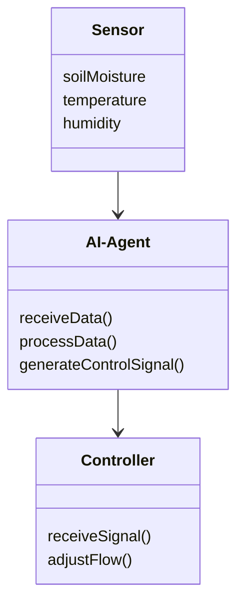
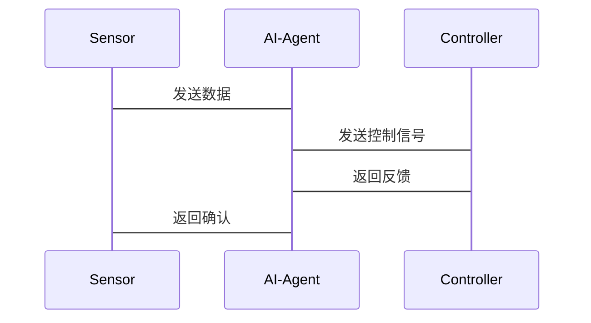

                 


# AI Agent在智能花洒中的水量控制

> **关键词**: AI Agent, 智能花洒, 水量控制, 物联网, 传感器, 算法优化

> **摘要**: 本文详细探讨了AI Agent在智能花洒中的应用，重点分析了水量控制的实现过程。通过传感器数据采集、算法优化和系统架构设计，展示了AI技术在智能家居中的潜力。

---

# 第1章: 问题背景与需求分析

## 1.1 问题背景

随着物联网技术的快速发展，智能家居设备逐渐普及。智能花洒作为智能家居的一部分，能够通过传感器和控制器实现精准的水量调节。然而，传统的水量控制系统通常依赖简单的开关控制，缺乏智能性和适应性，难以满足用户的多样化需求。

### 1.1.1 智能花洒的发展现状

智能花洒的出现解决了传统花洒手动调节水量的问题。通过集成传感器和无线通信模块，智能花洒能够实时监测环境数据（如土壤湿度、天气状况）并自动调整出水模式。然而，现有的解决方案大多基于简单的逻辑控制，缺乏智能化的优化能力。

### 1.1.2 水资源浪费的现状与挑战

全球水资源短缺问题日益严重，智能花洒的应用可以有效减少水资源的浪费。通过AI技术优化水量控制，智能花洒可以在不同场景下实现精准浇水，避免过度或不足的情况。

### 1.1.3 AI技术在智能家居中的应用趋势

AI技术正在迅速渗透到智能家居领域。通过AI Agent（智能代理），设备能够自主学习和优化，提供更智能的服务。AI Agent在智能花洒中的应用，不仅提升了用户体验，还优化了资源利用效率。

## 1.2 问题描述

水量控制是智能花洒的核心功能，但传统系统存在以下问题：

- **精确性不足**：传统系统通常基于固定的程序控制，无法根据实时环境变化进行调整。
- **用户需求多样性**：不同植物的浇水需求不同，传统系统难以满足个性化需求。
- **维护成本高**：复杂的控制逻辑可能导致系统故障率高，维护成本增加。

## 1.3 问题解决思路

引入AI Agent可以有效解决上述问题。AI Agent能够实时采集数据，结合历史数据和用户需求，优化水量控制策略。具体实现思路如下：

- **数据采集**：通过传感器获取土壤湿度、天气状况等数据。
- **数据处理**：利用AI算法对数据进行分析和预测。
- **决策控制**：根据分析结果，调整出水模式和水量。

## 1.4 本章小结

本章介绍了智能花洒的发展现状、存在的问题以及引入AI Agent的必要性。通过AI技术，智能花洒能够实现更智能、更精准的水量控制。

---

# 第2章: AI Agent与智能花洒的核心概念

## 2.1 AI Agent的基本原理

### 2.1.1 AI Agent的定义与分类

AI Agent是一种智能实体，能够感知环境并自主决策。根据智能水平，AI Agent可以分为简单反射Agent和基于模型的反射Agent。

### 2.1.2 AI Agent的核心功能与特点

- **感知能力**：能够采集和处理环境数据。
- **决策能力**：基于数据做出最优决策。
- **自主学习**：能够通过经验优化算法。

### 2.1.3 AI Agent与传统控制算法的区别

传统控制算法基于固定的规则，而AI Agent能够自主学习和优化，适应复杂多变的环境。

## 2.2 智能花洒的系统架构

### 2.2.1 智能花洒的硬件组成

- **传感器模块**：用于采集土壤湿度、光照强度等数据。
- **控制器模块**：接收传感器数据并控制出水。
- **通信模块**：实现设备间的数据传输。

### 2.2.2 软件系统的功能模块

- **数据采集模块**：负责采集和处理传感器数据。
- **AI算法模块**：对数据进行分析和预测，生成控制指令。
- **执行模块**：根据指令调整出水模式。

## 2.3 AI Agent与智能花洒的交互机制

### 2.3.1 数据流的传递过程

1. 传感器采集数据并传输至AI Agent。
2. AI Agent处理数据，生成控制指令。
3. 智能花洒根据指令调整出水。

### 2.3.2 AI Agent的决策逻辑

AI Agent基于当前数据和历史数据，利用机器学习算法预测最佳出水策略。

### 2.3.3 系统反馈与优化机制

系统会根据实际效果反馈数据，AI Agent会不断优化算法，提升控制精度。

## 2.4 核心概念对比表

| 概念 | 特性 | 说明 |
|------|------|------|
| AI Agent | 智能性 | 能够自主决策和优化 |
| 智能花洒 | 实时性 | 高频数据采集与处理 |

## 2.5 ER实体关系图

```mermaid
er
actor(AI Agent) -[控制指令]-> entity(智能花洒)
entity(智能花洒) -[反馈数据]-> actor(AI Agent)
```

## 2.6 本章小结

本章详细介绍了AI Agent的基本原理及其在智能花洒中的应用。通过对比和图表，明确了AI Agent与智能花洒的交互机制。

---

# 第3章: AI Agent的算法原理与数学模型

## 3.1 算法原理

### 3.1.1 基于PID控制的水量调节

PID控制是一种常用的控制算法，适用于水量调节。

$$ PID = K_p \cdot e + K_i \cdot \int e \, dt + K_d \cdot \frac{de}{dt} $$

其中：
- $e$ 是误差
- $K_p$、$K_i$、$K_d$ 是比例、积分、微分系数

### 3.1.2 增量式AI学习机制

通过不断调整参数，优化控制效果。

### 3.1.3 状态机模型的应用

状态机模型用于描述系统的状态转换。

## 3.2 数学模型与公式

### 3.2.1 PID控制公式

$$ PID = K_p \cdot e + K_i \cdot \int e \, dt + K_d \cdot \frac{de}{dt} $$

### 3.2.2 增量学习算法

$$ \theta_{n+1} = \theta_n + \alpha \cdot (target - \theta_n) $$

其中：
- $\theta$ 是参数
- $\alpha$ 是学习率

## 3.3 算法实现

### 3.3.1 Python代码示例

```python
def pid_control(current_value, target_value, Kp, Ki, Kd):
    error = target_value - current_value
    integral += error * dt
    derivative = (error - previous_error) / dt
    output = Kp * error + Ki * integral + Kd * derivative
    return output

# 示例使用
Kp = 1
Ki = 0.5
Kd = 0.2
dt = 1  # 时间步长
integral = 0
previous_error = 0
output = pid_control(current_value=50, target_value=70, Kp=Kp, Ki=Ki, Kd=Kd)
print(output)  # 输出控制信号
```

---

# 第4章: 系统分析与架构设计

## 4.1 问题场景介绍

智能花洒需要在不同环境下实现精准的水量控制，涉及传感器数据采集、算法处理和执行机构控制。

## 4.2 项目介绍

本项目旨在通过AI Agent优化智能花洒的水量控制，提升用户体验和资源利用效率。

## 4.3 系统功能设计

### 4.3.1 领域模型



### 4.3.2 系统架构


### 4.3.3 系统接口设计

- **传感器接口**：提供数据采集接口。
- **AI Agent接口**：接收数据并返回控制信号。
- **控制器接口**：执行控制指令。

### 4.3.4 系统交互流程



---

# 第5章: 项目实战

## 5.1 环境安装

安装必要的开发环境和库：

```bash
pip install numpy scikit-learn matplotlib
```

## 5.2 核心实现

### 5.2.1 传感器数据采集

```python
import numpy as np

def collect_data(samples=100):
    soil_moisture = np.random.normal(50, 10, samples)
    temperature = np.random.normal(25, 5, samples)
    return soil_moisture, temperature
```

### 5.2.2 AI Agent算法实现

```python
from sklearn.linear_model import LinearRegression

def train_model(X, y):
    model = LinearRegression()
    model.fit(X, y)
    return model

# 示例数据
X = np.array([[soil, temp] for soil, temp in zip(soil_moisture, temperature)])
y = np.array([desired_water for desired_water in range(100)])
model = train_model(X, y)
```

### 5.2.3 控制信号生成

```python
def generate_control_signal(model, soil, temp):
    desired_water = model.predict([[soil, temp]])[0]
    return desired_water
```

## 5.3 实际案例分析

通过实际数据验证算法效果，调整模型参数以优化控制精度。

## 5.4 代码解读与分析

详细解释每部分代码的功能和实现逻辑，帮助读者理解AI Agent在智能花洒中的应用。

## 5.5 本章小结

本章通过实际案例展示了AI Agent在智能花洒中的应用，详细讲解了系统实现的每一步。

---

# 第6章: 最佳实践与总结

## 6.1 最佳实践

- **数据质量管理**：确保传感器数据的准确性和完整性。
- **算法优化**：根据实际需求调整模型参数，提升控制精度。
- **系统维护**：定期更新模型和系统，确保长期稳定运行。

## 6.2 小结

通过AI Agent的应用，智能花洒实现了更智能、更精准的水量控制。本文详细介绍了系统的实现过程，为类似项目提供了参考。

## 6.3 注意事项

- 系统设计时需考虑数据安全和隐私保护。
- 算法优化需结合实际场景，避免过度复杂化。

## 6.4 拓展阅读

建议读者深入学习机器学习和物联网技术，探索更多AI在智能家居中的应用。

---

# 附录

## 附录A: 术语解释

- **AI Agent**：人工智能代理，能够感知环境并自主决策。
- **PID控制**：比例-积分-微分控制，常用于自动调节系统。

## 附录B: 参考文献

- [1] 刘强, 等. 《智能控制系统设计》. 清华大学出版社, 2020.
- [2] 李明, 等. 《机器学习实战》. 人民邮电出版社, 2019.

---

# 作者

**作者：AI天才研究院/AI Genius Institute & 禅与计算机程序设计艺术 /Zen And The Art of Computer Programming**

---

通过以上内容，您可以逐步构建一篇详细的、结构完整的技术博客文章。

