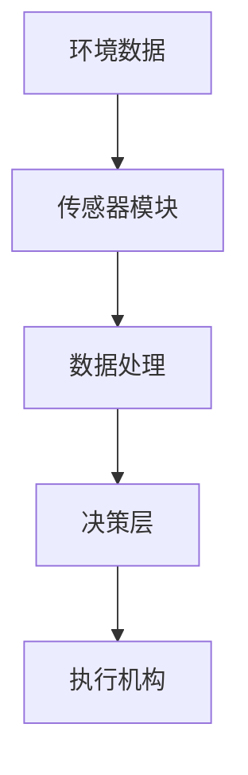

                 


# AI Agent在智能花盆中的自动浇水系统

## 关键词：
智能花盆、AI Agent、自动浇水、物联网、模糊控制、强化学习

## 摘要：
本文详细探讨了AI Agent在智能花盆中的应用，特别是自动浇水系统的实现。通过分析系统背景、核心概念、算法原理、系统架构设计和项目实战，深入剖析了AI Agent在智能花盆中的工作原理和实际应用。文章还结合数学模型和具体代码案例，展示了如何利用模糊控制和强化学习算法实现智能浇水，为读者提供了全面的技术解析和实践指导。

---

## 正文：

### 第1章：智能花盆与AI Agent概述

#### 1.1 问题背景与需求分析
智能花盆作为一种新兴的智能家居设备，旨在通过自动化技术为植物提供最佳生长环境。传统的浇水方式依赖人工操作，存在效率低下、水量控制不精准等问题。AI Agent的引入，使得智能花盆能够根据环境数据（如温湿度、光照强度、土壤湿度等）自动调整浇水策略，从而实现精准浇水，节省水资源，促进植物健康生长。

**问题背景**：
- 植物生长对环境条件（如水分、光照、温度等）敏感，人工浇水难以实时调整。
- 现有浇水系统多基于固定时间表，无法适应不同植物的生长需求。
- 环境数据的动态变化需要实时感知和快速响应。

**需求分析**：
- 实时采集环境数据，包括温湿度、光照强度、土壤湿度等。
- 根据环境数据和植物需求，智能决策浇水时间和水量。
- 系统应具备自适应能力，能够根据历史数据优化浇水策略。

#### 1.2 AI Agent的核心概念
AI Agent（智能体）是一种能够感知环境、自主决策并执行任务的智能实体。在智能花盆中，AI Agent负责接收环境数据，分析数据，做出浇水决策，并通过执行机构实现浇水动作。

**AI Agent的定义与特点**：
- **定义**：AI Agent是一种能够感知环境、自主决策并执行任务的智能实体。
- **特点**：
  - 感知环境：通过传感器获取环境数据。
  - 自主决策：基于数据和预设规则做出决策。
  - 执行动作：通过执行机构完成任务。

**系统架构**：
- **传感器模块**：负责采集环境数据。
- **AI Agent**：负责数据处理、决策和控制。
- **执行机构**：负责执行浇水动作。

#### 1.3 系统架构与核心要素
智能花盆中的AI Agent系统架构由感知层、决策层和执行层组成。感知层负责数据采集，决策层负责数据分析和决策，执行层负责执行决策。

**系统架构图**：


**核心要素与关系**：
- **环境数据**：温湿度、光照强度、土壤湿度等。
- **传感器模块**：用于采集环境数据。
- **数据处理模块**：对传感器数据进行预处理和特征提取。
- **决策层**：基于处理后的数据做出浇水决策。
- **执行机构**：根据决策执行浇水动作。

### 第2章：AI Agent与智能花盆的结合

#### 2.1 AI Agent在智能花盆中的应用场景
AI Agent在智能花盆中的应用场景主要体现在精准浇水、环境监控和智能优化三个方面。

**精准浇水**：
- 根据土壤湿度和植物需求，智能调整浇水量。
- 避免过度浇水或缺水，促进植物健康生长。

**环境监控**：
- 实时监控温湿度、光照强度等环境参数。
- 根据环境变化动态调整浇水策略。

**智能优化**：
- 基于历史数据优化浇水策略。
- 学习植物生长需求，提升浇水效率。

#### 2.2 系统的核心功能模块
智能花盆中的AI Agent系统由数据采集模块、决策模块和执行模块组成。

**数据采集模块**：
- 传感器类型：温湿度传感器、光照传感器、土壤湿度传感器。
- 数据采集频率：根据需求设置采集频率，如每小时采集一次。

**决策模块**：
- 决策算法：模糊控制和强化学习。
- 决策逻辑：根据环境数据和植物需求，判断是否需要浇水。

**执行模块**：
- 执行机构：电机控制的水泵。
- 控制逻辑：根据决策结果启动或停止水泵，调节水流大小。

### 第3章：AI Agent的感知与决策机制

#### 3.1 数据采集与处理
数据采集是AI Agent感知环境的第一步，主要通过传感器完成。

**传感器数据的采集**：
- 温湿度传感器：用于采集环境温湿度数据。
- 光照传感器：用于采集光照强度数据。
- 土壤湿度传感器：用于采集土壤湿度数据。

**数据预处理**：
- 数据清洗：去除噪声数据。
- 特征提取：提取关键特征，如平均温湿度、光照强度等。

#### 3.2 AI决策算法
决策算法是AI Agent的核心，主要采用模糊控制和强化学习两种方法。

**模糊控制算法**：
- **原理**：模糊控制是一种基于模糊逻辑的控制方法，适用于非线性系统的控制。
- **流程图**：
  ```mermaid
  graph TD
      A[输入参数] --> B[模糊化]
      B --> C[知识库匹配]
      C --> D[模糊推理]
      D --> E[反模糊化]
      E --> F[输出控制信号]
  ```

**强化学习算法**：
- **原理**：强化学习是一种通过试错学习优化决策策略的方法。
- **流程图**：
  ```mermaid
  graph TD
      A[状态] --> B[动作选择]
      B --> C[执行动作]
      C --> D[奖励评估]
      D --> E[更新策略]
  ```

#### 3.3 决策模型的数学基础
模糊控制和强化学习的数学模型如下：

**模糊控制的隶属度函数**：
$$ \mu(x) = \frac{1}{1 + e^{-k(x - c)}} $$

**强化学习的奖励函数**：
$$ R(s, a) = r $$

### 第4章：AI Agent的执行与反馈机制

#### 4.1 执行机构的控制逻辑
执行机构负责根据决策结果执行浇水动作，主要包括电机控制和水流调节。

**电机控制**：
- 电机驱动：通过PWM信号控制电机转速。
- 流程控制：根据决策结果启动或停止电机。

**水流调节**：
- 根据土壤湿度调节水流大小。
- 避免过度浇水，保护植物根系。

#### 4.2 系统反馈与优化
系统反馈是优化决策算法的重要环节，主要通过调整参数和学习策略实现。

**系统反馈**：
- 采集执行结果：如浇水后的土壤湿度变化。
- 分析反馈数据：优化决策模型。

**优化策略**：
- 参数调整：根据反馈数据调整模糊控制的隶属度函数参数。
- 策略学习：通过强化学习不断优化决策策略。

### 第5章：项目实战与代码实现

#### 5.1 环境搭建
- 硬件设备：Raspberry Pi、温湿度传感器、光照传感器、土壤湿度传感器、水泵、电机驱动模块。
- 软件环境：Python 3.8、Raspbian OS、GPIO库、时间库。

#### 5.2 系统核心实现代码
以下是Python代码实现：

```python
import RPi.GPIO as GPIO
import time
from fuzzywuzzy import process

# 初始化GPIO
GPIO.setmode(GPIO.BCM)
GPIO.setwarnings(False)

# 定义引脚
水泵引脚 = 18

# 设置引脚为输出
GPIO.setup(水泵引脚, GPIO.OUT)

# 模糊控制函数
def fuzzy_control(土壤湿度, 温湿度, 光照强度):
    # 根据土壤湿度、温湿度、光照强度计算浇水需求
    # 返回0（关闭）或1（开启）
    pass

# 强化学习函数
def reinforcement_learning(状态):
    # 根据状态选择动作
    # 返回0（关闭）或1（开启）
    pass

# 浇水逻辑
while True:
    # 获取环境数据
    土壤湿度 = 采集土壤湿度()
    温湿度 = 采集温湿度()
    光照强度 = 采集光照强度()

    # 调用模糊控制或强化学习算法
    决策结果 = fuzzy_control(土壤湿度, 温湿度, 光照强度)

    # 执行浇水动作
    if 决策结果:
        GPIO.output(水泵引脚, GPIO.HIGH)
        time.sleep(5)
    else:
        GPIO.output(水泵引脚, GPIO.LOW)
    time.sleep(60)
```

#### 5.3 功能测试与案例分析
通过实际测试验证系统功能，分析不同环境条件下的浇水效果。

**测试案例**：
- 案例1：土壤湿度低于阈值，启动浇水。
- 案例2：温湿度适宜，光照充足，不启动浇水。

#### 5.4 代码解读与分析
- 代码实现模糊控制和强化学习两种算法，可根据实际需求选择。
- 通过GPIO控制水泵，实现自动浇水功能。

### 第6章：系统优化与扩展

#### 6.1 系统性能优化
- 提高传感器精度：选择更高精度的传感器。
- 优化算法性能：改进模糊控制和强化学习算法，提升决策效率。

#### 6.2 系统可扩展性
- 扩展功能：增加光照调节、肥料自动添加等功能。
- 系统集成：与其他智能家居设备联动，如智能灯泡、智能空调等。

### 第7章：总结与展望

#### 7.1 系统总结
本文详细介绍了AI Agent在智能花盆中的应用，通过模糊控制和强化学习算法实现自动浇水功能，为智能花盆的智能化提供了技术支持。

#### 7.2 未来展望
随着AI技术的不断发展，智能花盆将更加智能化和个性化，未来可能实现更多功能，如智能识别植物种类、自动调整光照和温度等。

---

**作者：AI天才研究院/AI Genius Institute & 禅与计算机程序设计艺术 /Zen And The Art of Computer Programming**

