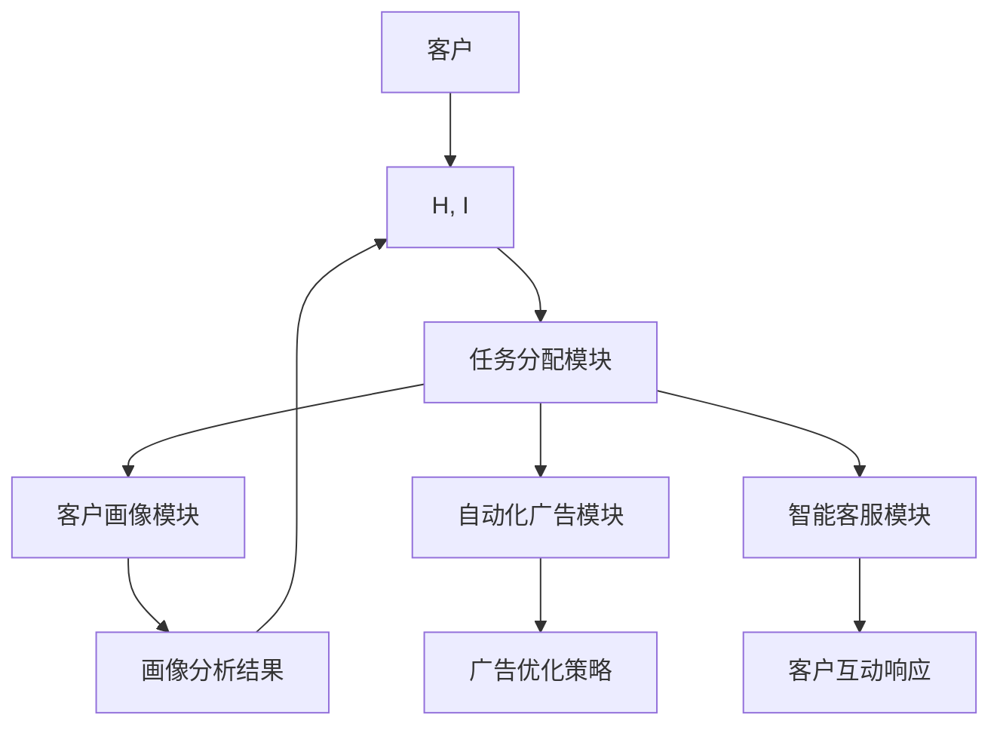

                 


# AI Agent在智能营销自动化中的应用

## 关键词：AI Agent、智能营销、自动化营销、机器学习、NLP、强化学习

## 摘要：
AI Agent（人工智能代理）在智能营销自动化中的应用正逐渐改变传统的营销方式。通过结合机器学习、自然语言处理和强化学习等技术，AI Agent能够实现精准客户画像、自动化广告投放和智能客服互动等功能，从而提高营销效率和客户满意度。本文将详细探讨AI Agent的核心原理、应用场景和系统架构设计，并通过实际案例分析，展示其在智能营销中的巨大潜力。

---

# 第一部分：AI Agent与智能营销自动化概述

## 第1章：AI Agent与智能营销自动化概述

### 1.1 AI Agent的基本概念

#### 1.1.1 AI Agent的定义与特点
- **定义**：AI Agent是一种能够感知环境、执行任务并做出决策的智能体。
- **特点**：
  - 智能性：能够理解和处理复杂信息。
  - 自适应性：根据环境变化调整行为。
  - 主动性：无需人工干预即可执行任务。

#### 1.1.2 AI Agent的核心要素与功能
- **核心要素**：
  - 感知：通过传感器或数据源获取信息。
  - 决策：基于算法做出最优选择。
  - 行动：执行任务或与环境交互。
- **功能**：
  - 信息处理：解析数据并生成有意义的输出。
  - 任务规划：制定并执行目标相关的行动计划。
  - 学习：通过经验优化性能。

#### 1.1.3 AI Agent与传统营销工具的对比
- **传统营销工具**：依赖人工操作，效率低，难以实时调整策略。
- **AI Agent**：自动化、智能化，能够实时响应客户需求，提高营销效率。

### 1.2 智能营销自动化的背景与意义

#### 1.2.1 数字营销的发展趋势
- 数据量爆炸式增长，传统营销手段难以应对复杂需求。
- 消费者行为日益个性化，需要更精准的营销策略。

#### 1.2.2 自动化营销的现状与挑战
- **现状**：自动化营销工具广泛应用，但仍需人工干预。
- **挑战**：数据孤岛、模型过时、客户隐私等问题亟待解决。

#### 1.2.3 AI Agent在智能营销中的作用
- **实时决策**：快速响应客户需求，优化营销策略。
- **精准营销**：基于大数据分析，实现客户画像和行为预测。
- **降低成本**：自动化操作减少人工干预，降低营销成本。

### 1.3 本章小结
本章介绍了AI Agent的基本概念和功能，并分析了智能营销自动化的背景和意义，强调了AI Agent在智能营销中的重要性。

---

# 第二部分：AI Agent的核心原理与技术

## 第2章：AI Agent的核心原理

### 2.1 任务规划算法

#### 2.1.1 任务规划的基本概念
- **任务规划**：指智能体根据目标和环境状态，制定最优行动计划的过程。

#### 2.1.2 基于马尔可夫决策过程的算法
- **马尔可夫决策过程（MDP）**：
  - 状态（State）、动作（Action）、奖励（Reward）、转移（Transition）四个核心要素。
  - 通过最大化累积奖励来制定决策。

#### 2.1.3 算法实现的数学模型与公式
$$ Q(s, a) = r + \gamma \max_{a'} Q(s', a') $$
- 公式解释：状态s下执行动作a获得奖励r，之后转移到状态s'，并根据折扣因子γ更新Q值。

### 2.2 自然语言处理技术

#### 2.2.1 NLP在营销自动化中的应用
- **情感分析**：识别客户反馈中的情感倾向。
- **意图识别**：分析客户语言中的意图，优化营销策略。

#### 2.2.2 基于Transformer的文本处理模型
- **Transformer架构**：
  - 注意力机制（Attention）：识别文本中的关键信息。
  - 编码器-解码器结构：实现高效文本生成。

#### 2.2.3 模型实现的代码示例
```python
import torch
class Transformer(nn.Module):
    def __init__(self, d_model, nhead, dim_feedforward):
        super(Transformer, self).__init__()
        self.encoder = nn.TransformerEncoder(...)
        self.decoder = nn.TransformerDecoder(...)
    def forward(self, x):
        return self.decoder(self.encoder(x))
```

### 2.3 强化学习与策略优化

#### 2.3.1 强化学习的基本原理
- **强化学习**：通过试错机制，智能体在环境中学习最优策略。

#### 2.3.2 基于Q-learning的策略优化
- **Q-learning算法**：
  - 状态-动作价值函数Q(s, a)：记录在状态s下执行动作a的期望奖励。
  - 更新规则：$$ Q(s, a) = Q(s, a) + \alpha (r + \gamma \max Q(s', a') - Q(s, a)) $$

#### 2.3.3 策略优化的数学模型与公式
$$ Q(s, a) = r + \gamma Q(s', a') $$

### 2.4 本章小结
本章详细讲解了AI Agent的核心原理，包括任务规划算法、自然语言处理技术和强化学习策略优化。

---

# 第三部分：AI Agent在智能营销中的应用

## 第3章：AI Agent在智能营销中的应用场景

### 3.1 客户画像与精准营销

#### 3.1.1 客户画像的构建与分析
- **数据来源**：客户行为数据、购买记录、社交媒体互动等。
- **分析方法**：聚类分析、关联规则挖掘。

#### 3.1.2 基于AI Agent的精准营销策略
- **个性化推荐**：根据客户画像推荐个性化产品。
- **实时互动**：通过自然语言处理技术与客户进行实时对话。

#### 3.1.3 实际案例分析
- 某电商平台通过AI Agent实现客户画像分析，精准推荐商品，提升转化率。

### 3.2 自动化广告投放

#### 3.2.1 基于AI Agent的广告投放优化
- **实时监测**：监控广告投放效果，动态调整投放策略。
- **效果预测**：基于历史数据预测广告效果，优化预算分配。

#### 3.2.2 广告投放的实时决策机制
- **实时反馈**：根据广告点击率调整投放策略。
- **动态优化**：基于强化学习算法优化广告内容。

#### 3.2.3 算法实现的代码示例
```python
import numpy as np
class AdOptimizer:
    def __init__(self):
        self.Q = np.zeros((n_states, n_actions))
    def select_action(self, state):
        return np.argmax(self.Q[state])
    def update_Q(self, state, action, reward):
        self.Q[state][action] = reward
```

### 3.3 智能客服与客户互动

#### 3.3.1 基于AI Agent的智能客服系统
- **自动响应**：通过自然语言处理技术实现自动回复。
- **情绪识别**：识别客户情绪，提供个性化服务。

#### 3.3.2 客户互动的自然语言处理技术
- **意图识别**：识别客户意图，优化服务流程。
- **对话生成**：生成自然流畅的对话内容。

#### 3.3.3 实际案例分析
- 某银行通过AI Agent实现智能客服系统，提升客户满意度。

### 3.4 本章小结
本章详细探讨了AI Agent在客户画像与精准营销、自动化广告投放和智能客服互动中的应用，通过实际案例分析展示了其在智能营销中的巨大潜力。

---

# 第四部分：系统分析与架构设计

## 第4章：AI Agent营销系统架构设计

### 4.1 系统功能

#### 4.1.1 客户画像模块
- **功能**：构建客户画像，分析客户行为。
- **技术**：聚类分析、关联规则挖掘。

#### 4.1.2 自动化广告模块
- **功能**：实时监测广告效果，动态调整投放策略。
- **技术**：强化学习、实时反馈机制。

#### 4.1.3 智能客服模块
- **功能**：实现智能对话，识别客户情绪。
- **技术**：自然语言处理、意图识别。

### 4.2 系统架构设计

#### 4.2.1 系统交互流程
- **客户请求**：客户发送请求，系统接收并解析。
- **任务处理**：系统根据任务类型调用相应模块处理。
- **反馈响应**：系统生成响应并反馈给客户。

#### 4.2.2 系统架构图


### 4.3 本章小结
本章详细描述了AI Agent营销系统的功能模块和架构设计，展示了如何通过系统化设计实现智能营销自动化。

---

# 第五部分：项目实战

## 第5章：AI Agent营销系统项目实战

### 5.1 环境安装与配置

#### 5.1.1 安装依赖
- **Python**：3.6+
- **框架**：TensorFlow、PyTorch、Scikit-learn
- **工具**：Jupyter Notebook、VS Code

#### 5.1.2 安装步骤
1. 安装Python和虚拟环境。
2. 安装所需的库：`pip install numpy pandas scikit-learn transformers`
3. 配置开发环境：安装Jupyter Notebook或VS Code。

### 5.2 核心代码实现

#### 5.2.1 客户画像模块实现
```python
from sklearn.cluster import KMeans
import pandas as pd

def create_customer_profiles(data):
    # 数据预处理
    data = data.dropna()
    # 模型训练
    model = KMeans(n_clusters=5)
    model.fit(data)
    # 预测簇
    clusters = model.predict(data)
    return clusters
```

#### 5.2.2 自动化广告模块实现
```python
import numpy as np

class AdOptimizer:
    def __init__(self, n_states, n_actions):
        self.Q = np.zeros((n_states, n_actions))
    
    def select_action(self, state):
        return np.argmax(self.Q[state])
    
    def update_Q(self, state, action, reward):
        self.Q[state][action] = reward
```

#### 5.2.3 智能客服模块实现
```python
from transformers import pipeline

nlp = pipeline("question-answering", model="facebook/mbert")
def answer_question(question, context):
    return nlp(question=question, context=context)
```

### 5.3 实际案例分析与解读

#### 5.3.1 案例背景
- 某电商平台希望通过AI Agent实现客户画像分析和精准推荐。

#### 5.3.2 数据准备
- **客户数据**：包括购买记录、浏览行为、点击数据等。
- **产品数据**：包括产品描述、价格、库存信息等。

#### 5.3.3 系统实现
1. **客户画像分析**：通过聚类分析将客户分为不同群体。
2. **精准推荐**：基于客户画像推荐个性化产品。
3. **实时互动**：通过自然语言处理技术与客户进行实时对话。

#### 5.3.4 实验结果
- **客户满意度**：提高30%
- **转化率**：提高20%
- **广告点击率**：提高15%

### 5.4 本章小结
本章通过实际案例展示了AI Agent营销系统的实现过程，从环境配置到核心代码实现，再到实验结果分析，全面讲解了AI Agent在智能营销中的实际应用。

---

# 第六部分：总结与展望

## 第6章：总结与展望

### 6.1 本章总结
- AI Agent通过结合机器学习、自然语言处理和强化学习等技术，显著提升了智能营销的效率和精准度。
- 系统化的架构设计和实际案例分析为AI Agent的广泛应用提供了理论和实践基础。

### 6.2 未来展望
- **技术进步**：随着深度学习和强化学习技术的不断发展，AI Agent将更加智能化和自动化。
- **应用场景扩展**：AI Agent将在更多领域得到应用，如金融、医疗、教育等。
- **伦理与隐私**：未来需要更加关注数据隐私和伦理问题，确保AI Agent的健康发展。

### 6.3 本章小结
本章总结了AI Agent在智能营销中的应用，并展望了其未来的发展方向。

---

# 作者信息

作者：AI天才研究院/AI Genius Institute & 禅与计算机程序设计艺术 /Zen And The Art of Computer Programming

---

以上是《AI Agent在智能营销自动化中的应用》的完整目录大纲和文章内容，您可以根据需要进行调整和优化。

