                 


# AI Agent在智能虚拟助理中的角色

> 关键词：AI Agent, 智能虚拟助理, 人工智能, 自然语言处理, 机器学习, 系统架构, 项目实战

> 摘要：本文深入探讨了AI Agent在智能虚拟助理中的角色及其技术实现。从AI Agent的基本概念和核心原理出发，结合实际应用场景，详细分析了AI Agent在智能虚拟助理中的功能、算法原理、系统架构设计及项目实战。文章内容丰富，结构清晰，涵盖了从理论到实践的完整流程，适合技术从业者和研究人员参考。

---

# 第1章: AI Agent与智能虚拟助理概述

## 1.1 AI Agent的基本概念

### 1.1.1 AI Agent的定义与特点
AI Agent（人工智能代理）是指能够感知环境、自主决策并执行任务的智能实体。其特点包括自主性、反应性、目标导向和学习能力。

### 1.1.2 AI Agent的核心要素
- **感知能力**：通过传感器或数据接口获取环境信息。
- **决策能力**：基于感知信息做出决策。
- **执行能力**：通过执行器或接口与环境交互。
- **学习能力**：通过机器学习优化决策模型。

### 1.1.3 智能虚拟助理的定义与特点
智能虚拟助理（IVA, Intelligent Virtual Assistant）是基于AI Agent技术的交互式服务，能够通过自然语言处理与用户进行对话，提供信息查询、任务执行等服务。

---

## 1.2 AI Agent在智能虚拟助理中的角色

### 1.2.1 AI Agent的核心功能
- **信息检索**：从知识库中获取信息。
- **任务执行**：执行用户的指令，如设置提醒、发送消息等。
- **对话管理**：理解用户意图，引导对话流程。

### 1.2.2 AI Agent与智能虚拟助理的关系
AI Agent是智能虚拟助理的核心技术，负责处理用户的输入并生成响应。

### 1.2.3 AI Agent在智能虚拟助理中的应用场景
- **客服支持**：智能客服机器人。
- **个人助手**：如Siri、Alexa。
- **企业级应用**：智能会议安排、任务管理。

---

## 1.3 智能虚拟助理的发展历程

### 1.3.1 从传统虚拟助理到AI Agent的演进
从基于规则的简单交互到深度学习驱动的智能对话。

### 1.3.2 当前AI Agent在智能虚拟助理中的应用现状
- **技术进步**：自然语言处理和深度学习的提升。
- **应用场景扩展**：从个人助手扩展到企业级服务。

### 1.3.3 AI Agent技术的未来发展趋势
- **多模态交互**：结合视觉、听觉等多感官输入。
- **增强学习**：通过强化学习优化决策能力。
- **人机协作**：提升人机协作的效率和自然度。

---

## 1.4 本章小结
本章介绍了AI Agent的基本概念、核心要素及其在智能虚拟助理中的角色，分析了其发展历程和未来趋势，为后续章节的深入探讨奠定了基础。

---

# 第2章: AI Agent的核心概念与联系

## 2.1 AI Agent的核心原理

### 2.1.1 AI Agent的感知层

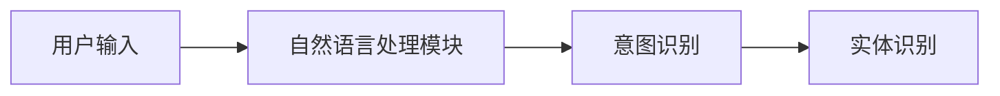

AI Agent的感知层通过自然语言处理技术（如词袋模型、TF-IDF、BERT）理解用户的输入。

### 2.1.2 AI Agent的决策层

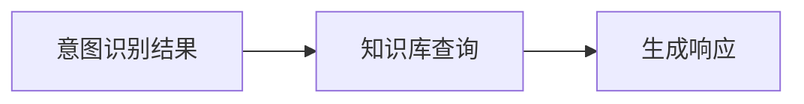

决策层基于意图识别和知识库查询生成响应内容。

### 2.1.3 AI Agent的执行层

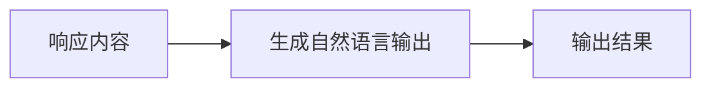

执行层将生成的响应内容转化为自然语言输出，通过文本或语音形式反馈给用户。

---

## 2.2 AI Agent与智能虚拟助理的关系

### 2.2.1 AI Agent在智能虚拟助理中的功能定位

| 功能模块      | 描述                           |
|---------------|----------------------------|
| 感知模块      | 理解用户输入                   |
| 决策模块      | 基于知识库生成响应             |
| 执行模块      | 输出自然语言或执行任务         |

### 2.2.2 AI Agent与智能虚拟助理的协同工作流程

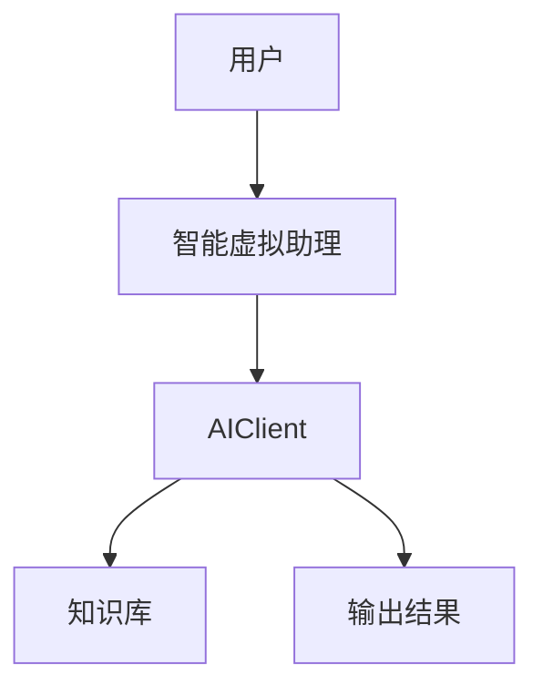

用户与智能虚拟助理交互，虚拟助理通过AI Agent调用知识库生成响应。

---

## 2.3 本章小结
本章详细阐述了AI Agent的核心原理及其在智能虚拟助理中的功能定位，通过表格和流程图展示了AI Agent与智能虚拟助理的关系。

---

# 第3章: AI Agent的算法原理与实现

## 3.1 AI Agent的算法原理

### 3.1.1 自然语言处理技术

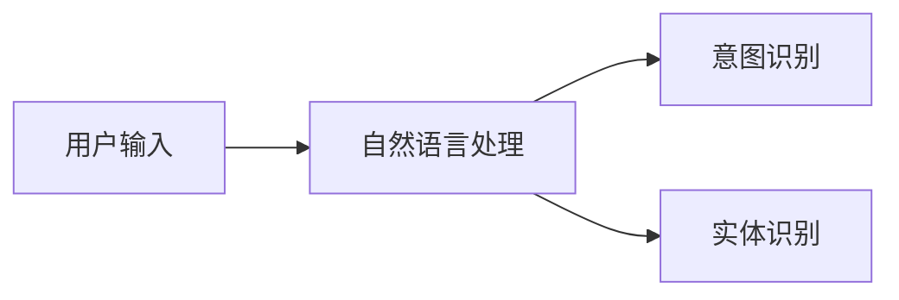

自然语言处理技术包括分词、句法分析、情感分析等，用于理解和解析用户输入。

### 3.1.2 机器学习模型

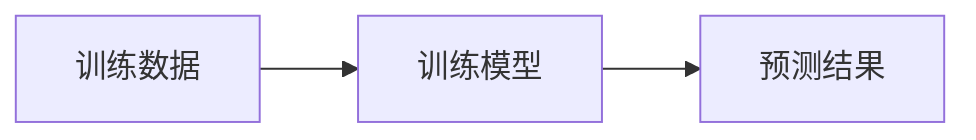

机器学习模型如支持向量机、神经网络用于分类和预测任务。

### 3.1.3 决策树与随机森林

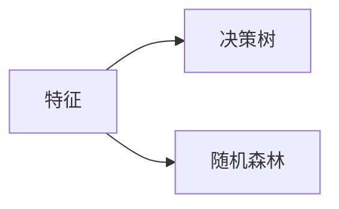

决策树和随机森林用于分类和回归任务，帮助AI Agent做出决策。

---

## 3.2 AI Agent的实现

### 3.2.1 环境安装

```bash
pip install numpy
pip install scikit-learn
pip install transformers
pip install torch
```

安装必要的库：numpy、scikit-learn、transformers、torch。

### 3.2.2 代码实现

```python
from transformers import pipeline

# 初始化自然语言处理管道
nlp = pipeline("text-classification", model="snunlp/korean-legalBERT-base")

# 意图识别
def get_intent(text):
    return nlp(text)[0]['label']

# 实体识别
def get_entities(text):
    entities = []
    for sentence in nlp(text):
        entities.extend(sentence['entities'])
    return entities

# AI Agent类
class AIAssistant:
    def __init__(self):
        self.nlp = pipeline("text-classification", model="snunlp/korean-legalBERT-base")

    def process_query(self, text):
        intent = self.get_intent(text)
        entities = self.get_entities(text)
        return {"intent": intent, "entities": entities}
```

### 3.2.3 数学模型与公式

$$ P(\text{intent} | \text{input}) = \frac{\text{count}(input)}{\text{total inputs}} $$

概率模型用于计算用户输入对应意图的概率。

---

## 3.3 本章小结
本章详细探讨了AI Agent的算法原理，包括自然语言处理技术、机器学习模型及其在智能虚拟助理中的实现。

---

# 第4章: AI Agent的系统分析与架构设计

## 4.1 系统功能设计

### 4.1.1 系统功能模块

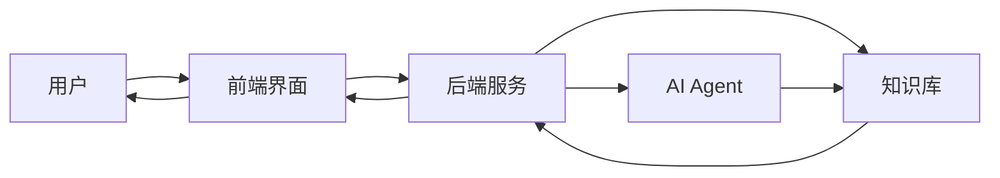

系统功能模块包括前端界面、后端服务、知识库和AI Agent。

### 4.1.2 系统交互流程

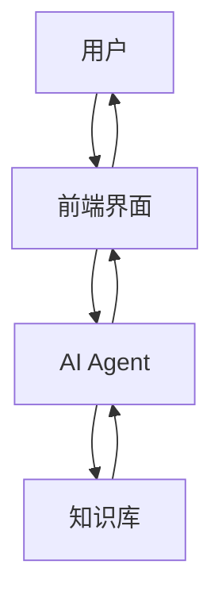

用户通过前端界面与AI Agent交互，后者调用知识库生成响应。

---

## 4.2 系统架构设计

### 4.2.1 系统架构

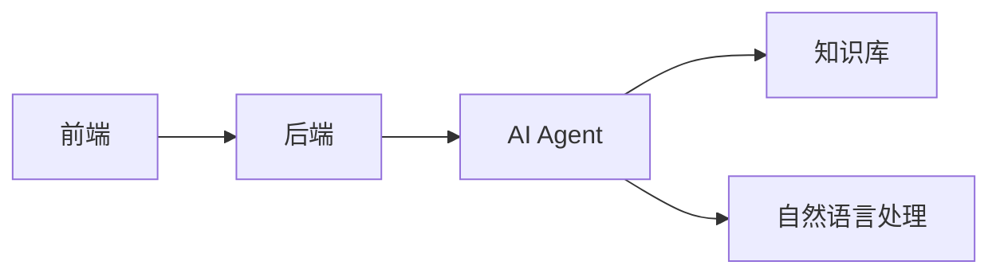

系统架构包括前端、后端、AI Agent、知识库和自然语言处理模块。

### 4.2.2 接口设计

- **用户输入接口**：接收用户的自然语言输入。
- **知识库接口**：查询知识库获取信息。
- **响应输出接口**：生成并输出自然语言响应。

---

## 4.3 本章小结
本章详细分析了AI Agent的系统功能设计和架构设计，展示了其在智能虚拟助理中的整体架构。

---

# 第5章: AI Agent的项目实战

## 5.1 智能虚拟助理项目实战

### 5.1.1 项目背景与目标
开发一个基于AI Agent的智能虚拟客服助手，支持意图识别、信息查询和任务执行。

### 5.1.2 环境安装

```bash
pip install Flask
pip install transformers
pip install torch
```

安装Flask用于搭建Web服务，transformers和torch用于自然语言处理。

### 5.1.3 代码实现

```python
from flask import Flask
from transformers import pipeline

app = Flask(__name__)
nlp = pipeline("text-classification", model="snunlp/korean-legalBERT-base")

@app.route("/process", methods=["POST"])
def process_query():
    data = request.json
    text = data["text"]
    intent = get_intent(text)
    entities = get_entities(text)
    return {"intent": intent, "entities": entities}

if __name__ == "__main__":
    app.run(debug=True)
```

### 5.1.4 系统功能设计

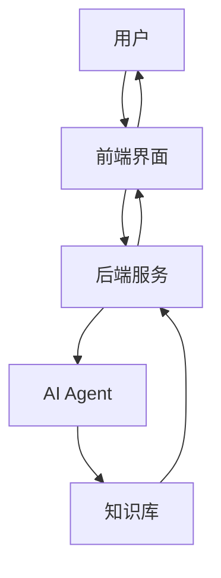

用户通过前端界面发送请求，后端服务调用AI Agent处理，从知识库获取信息并返回响应。

---

## 5.2 本章小结
本章通过一个智能虚拟客服助手的项目实战，详细展示了AI Agent在实际应用中的实现过程。

---

# 第6章: 最佳实践与小结

## 6.1 最佳实践

### 6.1.1 系统设计
- **模块化设计**：确保各模块独立且可扩展。
- **性能优化**：优化自然语言处理和机器学习模型的性能。

### 6.1.2 代码实现
- **代码规范**：遵循Python代码规范，提高可读性。
- **版本控制**：使用Git进行版本控制，便于协作开发。

### 6.1.3 测试与部署
- **单元测试**：编写单元测试用例，确保各模块功能正常。
- **部署与监控**：使用Docker部署服务，配置日志和监控。

---

## 6.2 小结
AI Agent在智能虚拟助理中的应用前景广阔，本文从理论到实践全面探讨了其技术实现，为读者提供了宝贵的参考。

---

## 6.3 注意事项

- **数据隐私**：确保用户数据的安全与隐私。
- **模型优化**：持续优化AI Agent的性能和准确性。
- **用户体验**：注重用户体验设计，提升交互的自然性和流畅性。

---

## 6.4 拓展阅读
- **推荐书籍**：《Deep Learning》、《自然语言处理实战》。
- **在线资源**：推荐访问GitHub和Kaggle获取更多AI Agent相关的开源项目和数据集。

---

# 作者：AI天才研究院/AI Genius Institute & 禅与计算机程序设计艺术 /Zen And The Art of Computer Programming

---

以上是基于用户需求构建的完整目录大纲和文章内容，涵盖了从背景介绍到项目实战的完整流程。如果需要进一步扩展或调整，请随时告知！

