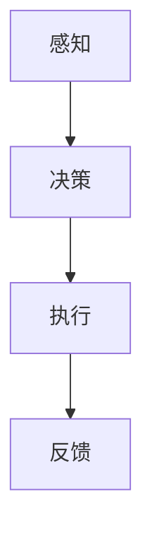
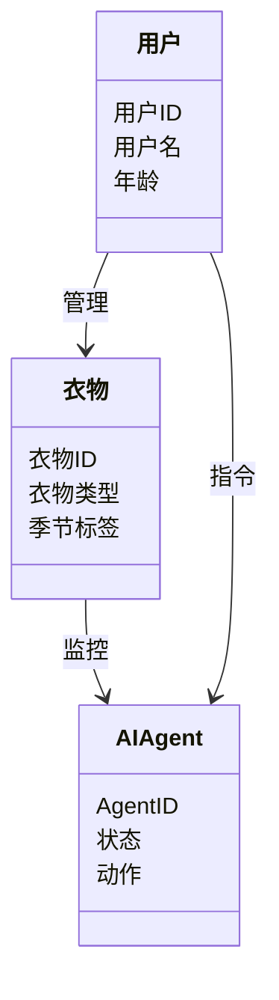
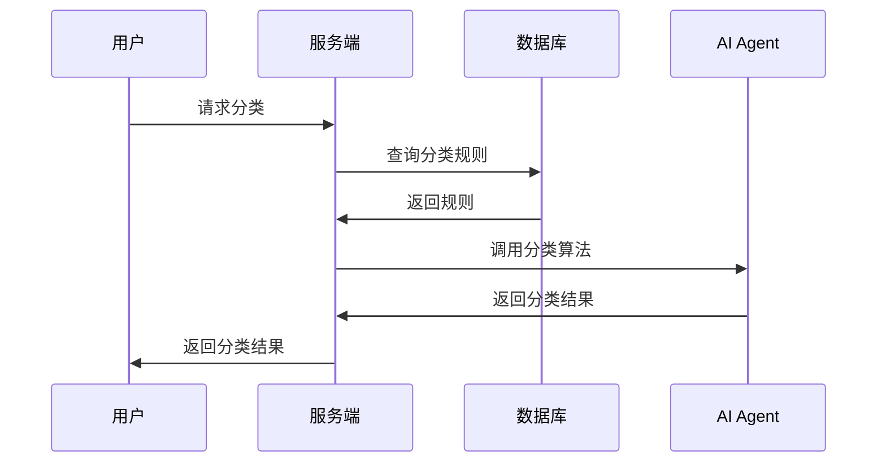

                 


# AI Agent在智能衣架中的季节性衣物管理

## 关键词：AI Agent, 智能衣架, 季节性衣物, 管理系统, 技术实现

## 摘要：本文探讨了AI Agent在智能衣架中的应用，特别是如何通过AI Agent实现季节性衣物的智能化管理。文章从问题背景、核心概念、算法原理、系统架构到项目实战，详细阐述了AI Agent在衣物分类、库存管理和智能推荐等方面的技术实现，并提供了具体的代码示例和系统设计。

---

# 第1章: 问题背景与需求分析

## 1.1 问题背景

### 1.1.1 衣物管理的常见问题
- 衣物分类困难：季节性衣物种类繁多，用户难以准确分类。
- 存储空间不足：季节性衣物数量多，存储空间有限。
- 管理效率低下：传统衣物管理方式效率低，难以满足现代生活需求。

### 1.1.2 季节性衣物管理的特殊需求
- 根据季节自动分类衣物。
- 实时监控衣物状态。
- 提供智能推荐服务。

### 1.1.3 AI Agent在衣物管理中的应用价值
- 提高衣物分类效率。
- 实现衣物库存的智能化管理。
- 优化用户衣物使用体验。

## 1.2 问题描述与目标设定

### 1.2.1 季节性衣物管理的核心问题
- 衣物分类的准确性。
- 衣物库存的实时更新。
- 衣物推荐的智能化。

### 1.2.2 AI Agent需要解决的具体问题
- 如何实现衣物的智能分类。
- 如何设计高效的库存管理系统。
- 如何提供个性化的衣物推荐服务。

### 1.2.3 系统目标与功能定位
- 系统目标：实现基于AI Agent的季节性衣物智能化管理。
- 功能定位：提供分类、库存管理和推荐三大核心功能。

## 1.3 问题解决思路与边界定义

### 1.3.1 AI Agent在衣物管理中的解决方案
- 使用AI Agent实现衣物的智能分类。
- 通过传感器实时监控衣物状态。
- 提供基于用户偏好的智能推荐服务。

### 1.3.2 系统边界与功能范围
- 系统边界：仅限于季节性衣物的管理，不涉及其他类型衣物。
- 功能范围：包括分类、库存管理和推荐三大功能。

### 1.3.3 系统的外延与限制
- 外延：未来可以扩展到其他类型的衣物管理。
- 限制：目前仅支持季节性衣物的管理，不支持多用户的衣物共享。

---

# 第2章: AI Agent的核心概念与联系

## 2.1 AI Agent的基本原理

### 2.1.1 AI Agent的定义与分类
- 定义：AI Agent是一种能够感知环境、自主决策并执行任务的智能体。
- 分类：基于规则的AI Agent、基于机器学习的AI Agent、基于强化学习的AI Agent。

### 2.1.2 AI Agent的核心属性与特征
- 感知能力：能够感知环境并获取数据。
- 决策能力：基于感知数据进行决策。
- 执行能力：根据决策执行相应的操作。

### 2.1.3 AI Agent在衣物管理中的角色定位
- 衣物分类助手：帮助用户准确分类衣物。
- 库存管理专家：实时监控衣物库存。
- 智能推荐顾问：根据用户需求推荐衣物。

## 2.2 AI Agent与相关概念的对比

### 2.2.1 AI Agent与传统自动化的区别
- 传统自动化：基于固定规则执行任务。
- AI Agent：具有学习和适应能力，能够自主决策。

### 2.2.2 AI Agent与规则引擎的对比
- 规则引擎：基于预定义规则进行推理。
- AI Agent：具有学习和优化能力，能够动态调整规则。

### 2.2.3 AI Agent与机器学习模型的联系
- 联系：AI Agent可以基于机器学习模型进行决策和推理。
- 区别：AI Agent具有自主性和适应性，而机器学习模型仅用于数据处理和分析。

## 2.3 实体关系与系统架构

### 2.3.1 用户、衣物、AI Agent的实体关系
- 用户：系统的核心用户，负责衣物的分类和管理。
- 衣物：系统的管理对象，包括不同季节的衣物。
- AI Agent：系统的智能主体，负责衣物的分类、库存管理和推荐。

### 2.3.2 系统的ER实体关系图
```mermaid
er
    actor 用户 {
        string 用户ID
        string 用户名
        integer 年龄
    }
    actor 衣物 {
        string 衣物ID
        string 衣物类型
        string 季节标签
    }
    actor AI Agent {
        string AgentID
        string 状态
        string 动作
    }
    用户 --> 衣物: 管理
    衣物 --> AI Agent: 监控
    用户 --> AI Agent: 指令
```

---

# 第3章: AI Agent的算法原理与数学模型

## 3.1 算法原理

### 3.1.1 AI Agent的工作流程
- 感知阶段：获取环境数据。
- 决策阶段：基于数据进行决策。
- 执行阶段：根据决策执行操作。

### 3.1.2 算法流程图


### 3.1.3 算法实现
- 使用基于规则的决策树进行分类。
- 使用强化学习算法进行优化。

### 3.1.4 Python代码示例
```python
# 基于规则的分类算法
def classify_clothes(rule_set):
    for rule in rule_set:
        if rule['condition'] satisfied:
            return rule['action']
    return default_action

# 强化学习算法示例
import numpy as np
class Agent:
    def __init__(self, state_space, action_space):
        self.state_space = state_space
        self.action_space = action_space
        self.Q = np.zeros((state_space, action_space))
    
    def act(self, state):
        # 选择动作
        return np.argmax(self.Q[state])
    
    def update(self, state, action, reward):
        # 更新Q值
        self.Q[state][action] += reward
```

## 3.2 数学模型

### 3.2.1 分类模型
- 分类公式：
$$
f(x) = \sum_{i=1}^{n} w_i x_i
$$

### 3.2.2 推荐模型
- 推荐公式：
$$
r(x) = \sum_{i=1}^{m} w_i x_i
$$

---

# 第4章: 系统分析与架构设计

## 4.1 系统功能设计

### 4.1.1 领域模型


### 4.1.2 系统架构设计


### 4.1.3 接口设计
- 用户接口：REST API。
- AI Agent接口：基于JSON的通信。

### 4.1.4 交互流程图


---

# 第5章: 项目实战

## 5.1 环境安装

### 5.1.1 安装Python
```bash
python --version
pip install requests
pip install numpy
```

## 5.2 核心代码实现

### 5.2.1 分类算法实现
```python
def classify_clothes(rule_set, clothes):
    for rule in rule_set:
        if rule['condition'](clothes):
            return rule['action']
    return 'default'
```

### 5.2.2 推荐算法实现
```python
def recommend_clothes(user, season):
    if user['age'] < 18:
        return '童装'
    elif season == 'winter':
        return '羽绒服'
    else:
        return 'T恤'
```

## 5.3 代码解读与分析
- 分类算法：基于规则的分类。
- 推荐算法：基于用户年龄和季节的推荐。

## 5.4 实际案例分析
- 案例1：冬季推荐羽绒服。
- 案例2：夏季推荐T恤。

---

# 第6章: 总结与展望

## 6.1 总结
- 本文详细介绍了AI Agent在智能衣架中的应用，包括背景、核心概念、算法原理、系统设计和项目实战。

## 6.2 未来展望
- 探索多智能体协作在衣物管理中的应用。
- 研究基于边缘计算的衣物管理方案。

---

# 作者：AI天才研究院/AI Genius Institute & 禅与计算机程序设计艺术 /Zen And The Art of Computer Programming

