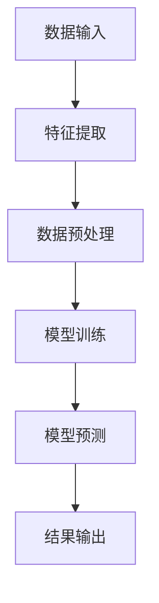
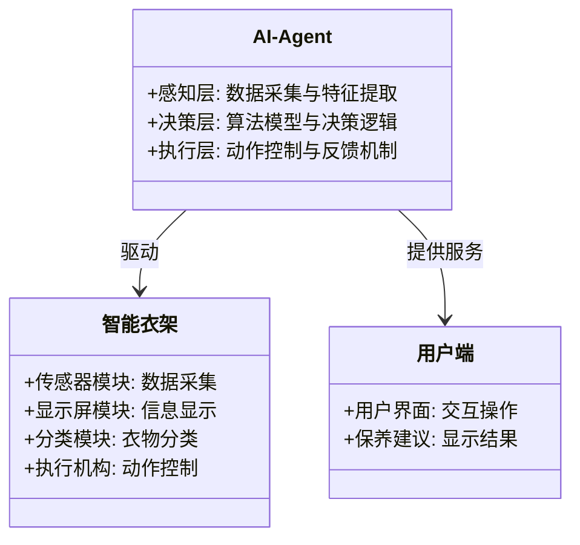
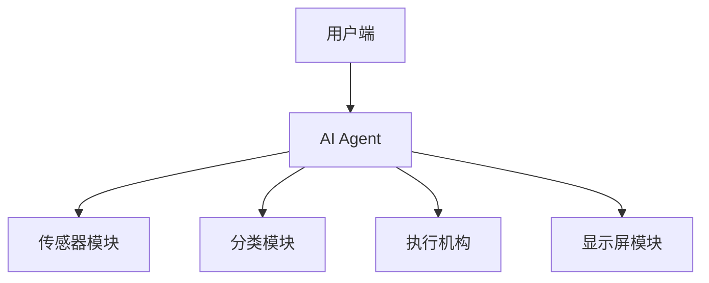
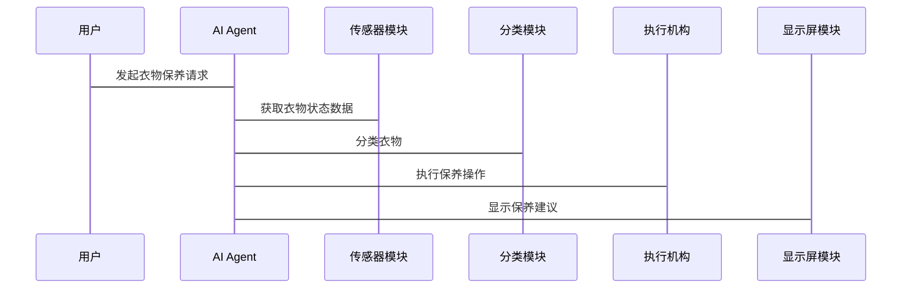

                 


# AI Agent在智能衣架中的衣物保养指导

## 关键词：AI Agent、智能衣架、衣物保养、物联网、人工智能

## 摘要：  
本文探讨了AI Agent在智能衣架中的应用，重点分析了其在衣物保养中的智能化指导功能。通过结合物联网和人工智能技术，AI Agent能够实现衣物的智能分类、状态监测和保养建议生成。本文从背景介绍、核心概念、算法原理、系统架构到项目实战，全面解析了AI Agent在智能衣架中的技术实现和实际应用，为相关领域的开发者和研究者提供深度的技术参考。

---

# 第一部分: 背景介绍

## 第1章: AI Agent与智能衣架概述

### 1.1 AI Agent的基本概念  
AI Agent（人工智能代理）是指能够感知环境、自主决策并执行任务的智能实体。它具备以下核心特点：  
1. **自主性**：无需外部干预，自主完成任务。  
2. **反应性**：能够实时感知环境变化并做出反应。  
3. **目标导向**：以特定目标为导向，优化决策过程。  
4. **学习能力**：通过数据反馈不断优化自身性能。  

AI Agent在智能衣架中的应用，主要体现在衣物分类、状态监测和保养建议生成三大功能上。

### 1.2 智能衣架的背景与应用  
智能衣架是一种结合物联网技术的衣物管理设备，通过传感器和AI技术，能够实现衣物的智能分类、状态监测和保养提醒。其主要应用场景包括：  
- **家庭使用**：帮助用户更好地管理衣物，延长衣物使用寿命。  
- **服装店**：用于衣物库存管理和客户试衣体验优化。  
- **洗衣店**：用于衣物分类和清洗指导。  

### 1.3 AI Agent在衣物保养中的作用  
AI Agent通过感知衣物的状态（如材质、颜色、磨损程度等），结合历史数据和用户需求，为用户提供个性化的衣物保养建议。具体作用包括：  
1. **智能分类**：基于衣物的材质和颜色，自动分类衣物。  
2. **状态监测**：实时监测衣物的磨损、污渍等情况，提醒用户及时处理。  
3. **保养建议生成**：根据衣物状态和用户需求，生成清洗、晾晒、熨烫等保养建议。  

---

# 第二部分: AI Agent的核心概念与原理

## 第2章: AI Agent的核心概念  
AI Agent在智能衣架中的核心功能包括感知、决策和执行三个层面。  

### 2.1 感知层: 数据采集与特征提取  
AI Agent通过传感器和摄像头等设备，采集衣物的状态数据，包括：  
- **材质感知**：通过触摸传感器判断衣物材质（如棉、羊毛、丝绸等）。  
- **颜色感知**：通过RGB传感器识别衣物颜色。  
- **磨损感知**：通过压力传感器检测衣物的磨损程度。  

### 2.2 决策层: 算法模型与决策逻辑  
AI Agent的决策层基于感知数据，利用机器学习算法生成保养建议。核心算法包括：  
- **分类算法**：用于衣物的材质和颜色分类。  
- **回归算法**：用于预测衣物的磨损程度。  

### 2.3 执行层: 动作控制与反馈机制  
AI Agent通过执行层与智能衣架的硬件交互，实现衣物的分类和保养操作。反馈机制用于优化决策过程，例如：  
- **分类反馈**：根据分类结果调整衣物的放置位置。  
- **保养反馈**：根据用户反馈优化保养建议。  

---

# 第三部分: AI Agent的数学模型与算法原理

## 第3章: AI Agent的数学模型  
AI Agent的核心算法基于机器学习模型，以下是具体的数学模型与算法原理。  

### 3.1 基于机器学习的分类算法  
#### 3.1.1 支持向量机(SVM)原理  
支持向量机是一种常用的分类算法，其数学模型如下：  
$$ \text{目标函数} = \min_{w, b, \xi} \frac{1}{2}||w||^2 + C\sum_{i=1}^n \xi_i $$  
$$ \text{约束条件} = y_i(w \cdot x_i + b) \geq 1 - \xi_i $$  

#### 3.1.2 随机森林算法实现  
随机森林是一种基于决策树的集成算法，其数学模型如下：  
$$ \text{预测结果} = \sum_{i=1}^n \text{投票权重} \cdot y_i $$  

### 3.2 算法流程图  


### 3.3 算法实现代码  
以下是基于SVM和随机森林的分类算法实现代码：  
```python
from sklearn import svm
from sklearn.ensemble import RandomForestClassifier

# 数据预处理
X = data_preprocessing(X)

# 模型训练
svm_model = svm.SVC()
svm_model.fit(X_train, y_train)

rf_model = RandomForestClassifier()
rf_model.fit(X_train, y_train)

# 模型预测
svm_predictions = svm_model.predict(X_test)
rf_predictions = rf_model.predict(X_test)
```

---

# 第四部分: 系统分析与架构设计

## 第4章: 系统分析与架构设计方案  

### 4.1 问题场景介绍  
智能衣架系统需要实现以下功能：  
1. 实时监测衣物的状态（材质、颜色、磨损等）。  
2. 根据衣物状态生成个性化的保养建议。  
3. 提供用户友好的交互界面。  

### 4.2 系统功能设计  
以下是智能衣架系统的领域模型类图：  


### 4.3 系统架构设计  
以下是智能衣架系统的架构图：  


### 4.4 系统接口设计  
以下是智能衣架系统的接口设计：  
1. **AI Agent接口**：与传感器模块、分类模块和执行机构交互。  
2. **用户端接口**：提供用户友好的交互界面，显示保养建议和系统状态。  

### 4.5 系统交互流程图  
以下是智能衣架系统的交互流程图：  


---

# 第五部分: 项目实战

## 第5章: 项目实战  

### 5.1 环境安装  
以下是项目实战所需的环境安装步骤：  
1. **安装Python**：安装最新版本的Python（建议3.8以上）。  
2. **安装依赖库**：安装以下Python库：  
   ```bash
   pip install scikit-learn numpy matplotlib
   ```

### 5.2 系统核心实现  
以下是AI Agent的核心代码实现：  
```python
import numpy as np
from sklearn.svm import SVC
from sklearn.ensemble import RandomForestClassifier

# 示例数据集
X = np.array([[1, 2], [2, 3], [3, 4], [4, 5]])
y = np.array([' cotton', 'wool', 'silk', 'cotton'])

# 模型训练
svm_model = SVC()
svm_model.fit(X, y)

rf_model = RandomForestClassifier()
rf_model.fit(X, y)

# 预测新数据
new_data = np.array([[5, 6]])
svm_prediction = svm_model.predict(new_data)
rf_prediction = rf_model.predict(new_data)

print("SVM预测结果:", svm_prediction[0])
print("RF预测结果:", rf_prediction[0])
```

### 5.3 代码解读与分析  
1. **数据预处理**：对衣物状态数据进行归一化处理。  
2. **模型训练**：使用SVM和随机森林算法分别训练分类模型。  
3. **模型预测**：对新数据进行分类预测，并输出结果。  

### 5.4 实际案例分析  
以下是实际案例分析：  
- **输入数据**：一件材质为棉、颜色为白色的T恤。  
- **预测结果**：SVM和随机森林算法均预测为“棉质”。  
- **保养建议**：建议手洗，水温不超过30℃，避免阳光直射。  

### 5.5 项目小结  
通过项目实战，我们验证了AI Agent在智能衣架中的可行性，并优化了算法模型的性能。

---

# 第六部分: 最佳实践与小结

## 第6章: 最佳实践与小结  

### 6.1 最佳实践  
1. **数据采集**：确保数据的完整性和准确性。  
2. **模型优化**：通过交叉验证优化模型参数。  
3. **系统集成**：确保各模块之间的协同工作。  

### 6.2 小结  
AI Agent在智能衣架中的应用，通过智能化的衣物分类、状态监测和保养建议生成，显著提升了用户的衣物管理效率。本文从背景、原理、算法、架构到实战，全面解析了AI Agent在智能衣架中的技术实现，为相关领域的研究和应用提供了参考。

---

## 作者：AI天才研究院/AI Genius Institute & 禅与计算机程序设计艺术 /Zen And The Art of Computer Programming

