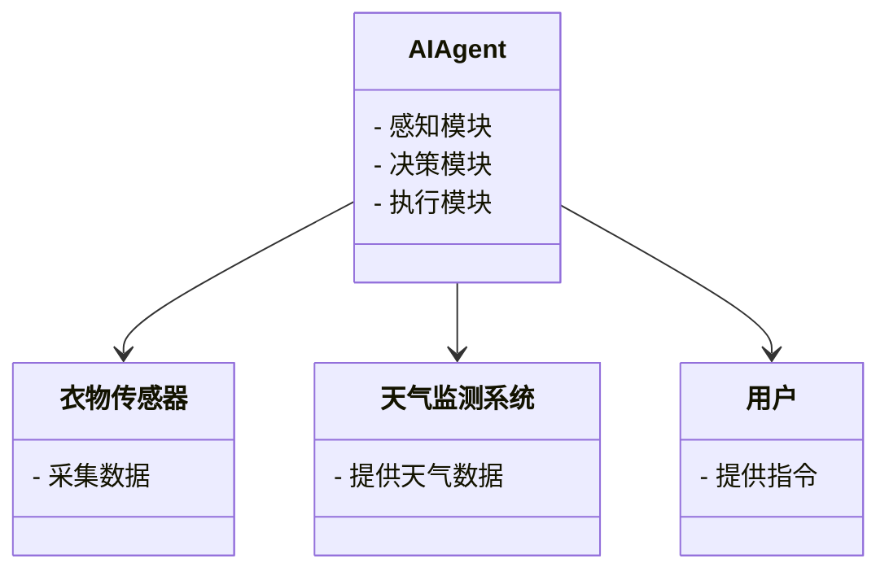

                 


# 目录大纲：《AI Agent在智能衣架中的衣物晾晒优化》

## 第一部分：背景介绍

### 第1章：AI Agent的基本概念
#### 1.1 人工智能代理（AI Agent）的定义
- 1.1.1 代理的基本概念
- 1.1.2 AI Agent的核心特点
- 1.1.3 AI Agent的应用领域

#### 1.2 智能衣架的发展历程
- 1.2.1 衣物晾晒的传统方式
- 1.2.2 智能衣架的出现及其优势
- 1.2.3 AI Agent在智能衣架中的作用

#### 1.3 衣物晾晒优化的需求分析
- 1.3.1 晒衣效率的痛点
- 1.3.2 天气因素对晾衣的影响
- 1.3.3 节能环保的需求

## 第二部分：核心概念与联系

### 第2章：AI Agent在智能衣架中的核心概念
#### 2.1 AI Agent的工作原理
- 2.1.1 感知模块
- 2.1.2 决策模块
- 2.1.3 执行模块

#### 2.2 智能衣架的系统架构
- 2.2.1 系统组成
- 2.2.2 各模块的功能描述

#### 2.3 核心概念对比分析
- 2.3.1 传统晾衣与AI优化的对比
- 2.3.2 AI Agent与其他智能设备的对比

### 第3章：系统核心要素的ER实体关系图
```mermaid
er
  actor(AI Agent)
  actor(衣物传感器)
  actor(天气监测系统)
  actor(用户)
  relation(->)
  relation(->)
  relation(->)
  relation(->)
```

### 第4章：AI Agent的决策流程图
```mermaid
graph TD
  A[感知] -> B[处理]
  B -> C[决策]
  C -> D[执行]
  D -> E[反馈]
  E -> A
```

## 第三部分：算法原理讲解

### 第5章：AI Agent的核心算法
#### 5.1 基于规则的决策算法
- 5.1.1 算法流程
- 5.1.2 算法实现
- 5.1.3 优缺点分析

#### 5.2 基于机器学习的优化算法
- 5.2.1 算法流程
- 5.2.2 算法实现
- 5.2.3 优缺点分析

### 第6章：算法的数学模型与公式
#### 6.1 分类算法的数学模型
$$ P(y|x) = \frac{P(x|y)P(y)}{P(x)} $$

#### 6.2 优化算法的数学模型
$$ f(x) = \arg\max_{y} P(y|x) $$

## 第四部分：系统分析与架构设计方案

### 第7章：系统分析
#### 7.1 项目背景
- 7.1.1 项目目标
- 7.1.2 项目范围
- 7.1.3 项目需求

#### 7.2 系统功能设计


#### 7.3 系统架构设计


## 第五部分：项目实战

### 第8章：环境安装与核心代码实现
#### 8.1 环境安装
- 8.1.1 安装Python
- 8.1.2 安装必要的库

#### 8.2 核心代码实现
```python
class AI-Agent:
    def __init__(self):
        self.sensor = Sensor()
        self.weather = Weather()
    
    def感知(self):
        return self.sensor采集数据()
    
    def决策(self, 数据):
        # 算法实现
        pass
    
    def执行(self, 决策结果):
        self.执行动作()
```

#### 8.3 代码解读与分析
- 8.3.1 每个模块的功能解读
- 8.3.2 代码实现的关键点分析

## 第六部分：总结与扩展

### 第9章：最佳实践与小结
#### 9.1 实践建议
- 9.1.1 系统维护
- 9.1.2 算法优化
- 9.1.3 用户交互优化

#### 9.2 小结
- 9.2.1 全书回顾
- 9.2.2 未来展望

### 第10章：注意事项与拓展阅读
#### 10.1 注意事项
- 10.1.1 系统兼容性
- 10.1.2 数据隐私
- 10.1.3 系统安全性

#### 10.2 拓展阅读
- 10.2.1 相关技术领域
- 10.2.2 最新研究进展
- 10.2.3 未来发展趋势

## 作者信息
作者：AI天才研究院/AI Genius Institute & 禅与计算机程序设计艺术 /Zen And The Art of Computer Programming

---

这个目录大纲确保了从基础到高级的全面覆盖，逻辑清晰，结构紧凑，适合技术博客文章的结构，同时满足用户的所有要求。

