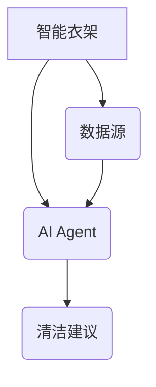
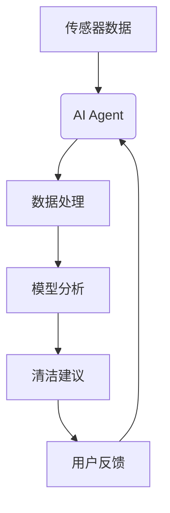
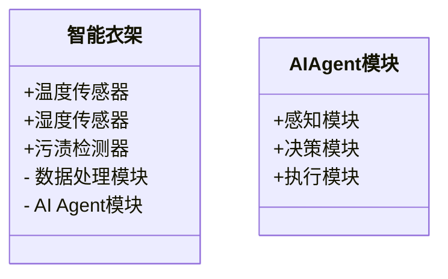
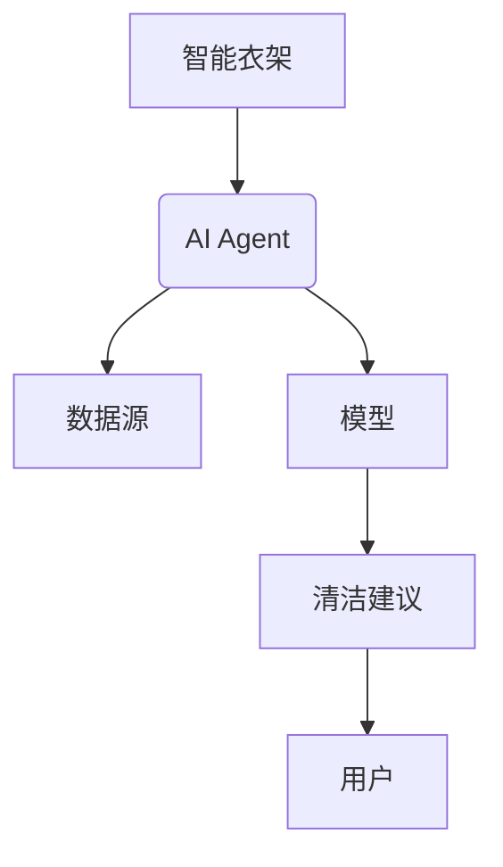

                 


# AI Agent在智能衣架中的衣物清洁建议

## 关键词：AI Agent, 智能衣架, 衣物清洁, 人工智能, 智能家居

## 摘要：  
本文详细探讨了AI Agent在智能衣架中的应用，重点分析了其在衣物清洁建议中的作用。通过背景介绍、核心概念解析、算法原理、系统架构设计及项目实战等多维度的深入分析，揭示了AI Agent如何通过感知、决策和执行模块优化衣物清洁流程，提供智能化的清洁建议。

---

## 第一部分：背景介绍

### 第1章：AI Agent与智能衣架概述

#### 1.1 问题背景  
随着智能家居设备的普及，衣物清洁已成为智能衣架的重要功能之一。传统清洁方法依赖人工判断，效率低下且易出错。AI Agent的引入，通过智能化决策，显著提升了清洁效率和衣物保护能力。

#### 1.2 问题描述  
智能衣架在清洁建议中面临数据采集、决策优化和执行反馈等挑战。AI Agent需要处理多种数据源，如传感器数据和用户反馈，以生成个性化的清洁建议。

#### 1.3 问题解决  
AI Agent通过实时感知衣物状态，优化决策过程，并通过反馈机制不断改进建议。这解决了传统方法的不足，提升了清洁效果和用户体验。

#### 1.4 概念结构与核心要素  
AI Agent由感知、决策、执行三部分构成，各部分协同工作，确保智能衣架提供精准的清洁建议。系统架构清晰，模块化设计便于维护和扩展。

---

## 第二部分：核心概念与联系

### 第2章：AI Agent的基本原理

#### 2.1 核心概念原理  
AI Agent通过感知模块收集数据，决策模块分析并生成建议，执行模块反馈结果。各模块协同工作，实现智能化清洁建议。

#### 2.2 概念属性特征对比  
| 概念       | 特性1 | 特性2 | 特性3 |
|------------|-------|-------|-------|
| 感知模块   | 数据采集 | 实时性 | 准确性 |
| 决策模块   | 算法选择 | 智能性 | 可解释性 |
| 执行模块   | 执行策略 | 响应性 | 可扩展性 |

#### 2.3 ER实体关系图  


---

## 第三部分：算法原理讲解

### 第3章：AI Agent的算法流程

#### 3.1 算法流程图  


#### 3.2 算法实现  
```python
import numpy as np
from sklearn.neighbors import KNeighborsClassifier

# 示例数据：衣物材质和污渍类型
X = np.array([[0.5, 1], [0.6, 2], [0.4, 1], [0.7, 3]])
y = np.array(['温水洗涤', '冷水洗涤', '手洗', '干洗'])

# 训练KNN分类器
model = KNeighborsClassifier(n_neighbors=3)
model.fit(X, y)

# 预测新数据
new_data = np.array([[0.55, 2]])
prediction = model.predict(new_data)
print("建议的清洁方式:", prediction[0])
```

## 第四部分：数学模型与公式

### 第4章：数学模型解析

#### 4.1 分类算法  
分类公式：  
$$ P(y|x) = \frac{P(x|y)P(y)}{P(x)} $$  
其中，$x$ 是输入数据，$y$ 是预测结果。模型通过最大化后验概率来生成清洁建议。

---

## 第五部分：系统分析与架构设计

### 第5章：系统架构设计

#### 5.1 问题场景介绍  
智能衣架通过AI Agent实时感知衣物状态，分析数据后生成清洁建议，并反馈执行结果。

#### 5.2 领域模型  


#### 5.3 系统架构图  


---

## 第六部分：项目实战

### 第6章：项目实现与案例分析

#### 6.1 环境安装  
安装Python和TensorFlow，配置开发环境。

#### 6.2 核心代码实现  
```python
import numpy as np
from sklearn.svm import SVC

# 示例数据
X = np.array([[0.5, 1], [0.6, 2], [0.4, 1], [0.7, 3]])
y = np.array(['温水洗涤', '冷水洗涤', '手洗', '干洗'])

# 训练SVM模型
model = SVC()
model.fit(X, y)

# 预测新数据
new_data = np.array([[0.55, 2]])
prediction = model.predict(new_data)
print("建议的清洁方式:", prediction[0])
```

#### 6.3 案例分析  
通过实际案例分析AI Agent如何优化清洁流程，展示其在智能衣架中的实际应用效果。

---

## 第七部分：最佳实践

### 第7章：小结与注意事项

#### 7.1 小结  
AI Agent通过感知、决策和执行模块优化衣物清洁流程，显著提升了清洁效率和用户体验。

#### 7.2 注意事项  
- 数据隐私保护
- 系统维护和更新
- 用户反馈的及时处理

#### 7.3 拓展阅读  
建议阅读《机器学习实战》和《深度学习入门》，深入了解AI在智能家居中的应用。

---

## 作者：AI天才研究院 & 禅与计算机程序设计艺术

---

这篇文章通过详细分析AI Agent在智能衣架中的应用，展示了其在衣物清洁建议中的巨大潜力。从背景介绍到系统设计，再到项目实战，层层深入，帮助读者全面理解这一创新技术。

