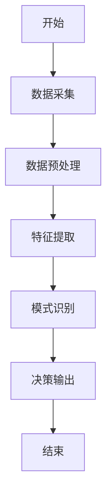
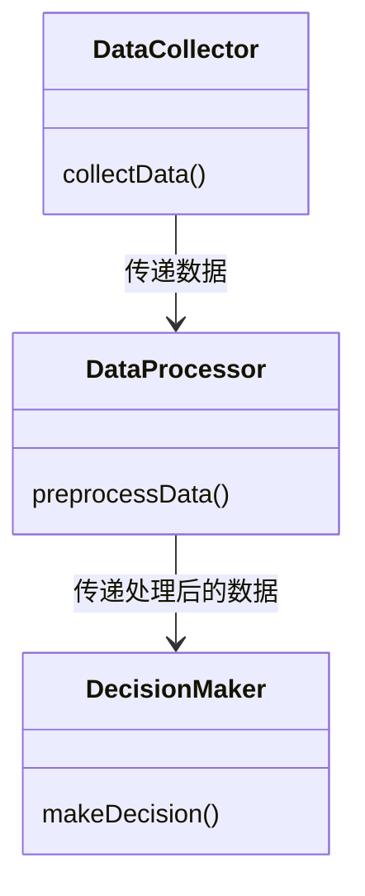
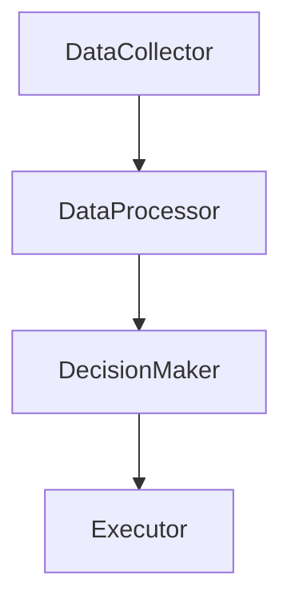
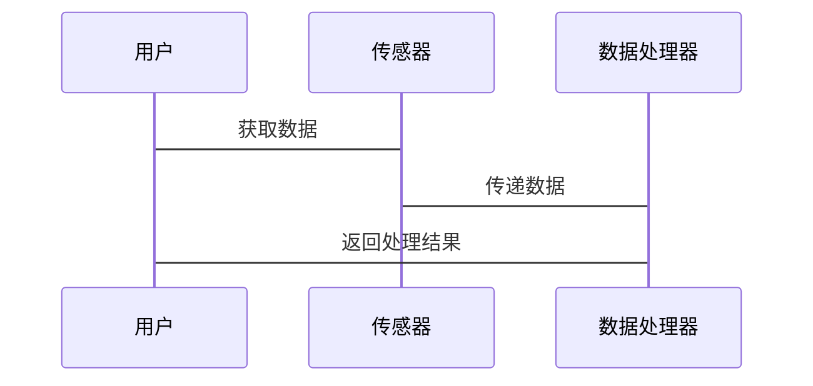

                 


# AI Agent在智能衣架中的衣物除味除菌

## 关键词：AI Agent，智能衣架，衣物除味，除菌技术，人工智能，物联网

## 摘要：本文详细探讨了AI Agent在智能衣架中的应用，特别是在衣物除味和除菌方面的创新技术。通过系统分析AI Agent的核心原理、算法模型、系统架构以及实际应用场景，本文为读者提供了全面的技术解读和实践指导。

---

## 第1章: AI Agent与智能衣架概述

### 1.1 AI Agent的基本概念
#### 1.1.1 AI Agent的定义
AI Agent（人工智能代理）是一种能够感知环境、自主决策并执行任务的智能实体。它通过传感器获取数据，结合预设算法，实现特定目标。

#### 1.1.2 AI Agent的核心特征
- **自主性**：无需外部干预，自主完成任务。
- **反应性**：实时感知环境变化并做出反应。
- **学习能力**：通过数据优化决策模型。

#### 1.1.3 AI Agent在智能衣架中的应用背景
智能衣架通过AI Agent实现衣物的智能化管理，解决传统衣架在除味、除菌方面的不足。

### 1.2 智能衣架的定义与功能
#### 1.2.1 智能衣架的基本概念
智能衣架是一种集成传感器和AI技术的衣物管理设备，能够自动监测衣物状态。

#### 1.2.2 智能衣架的功能模块
- 数据采集模块：监测衣物气味、温度、湿度等数据。
- 信号处理模块：分析数据并生成除味指令。
- 执行模块：启动除味除菌装置。

#### 1.2.3 智能衣架的应用场景
家庭、办公室、酒店等场所的衣物护理。

### 1.3 衣物除味除菌的背景与需求
#### 1.3.1 衣物异味与细菌的来源
- 人体分泌物残留
- 环境污染影响
- 细菌繁殖

#### 1.3.2 传统除味除菌方法的局限性
- 人工操作繁琐
- 除味效果不稳定
- 除菌效率低

#### 1.3.3 智能化除味除菌的需求
- 高效除味除菌
- 自动化操作
- 智能监测

## 第2章: AI Agent的核心概念与技术原理

### 2.1 AI Agent的核心原理
#### 2.1.1 数据采集与处理
- 传感器采集数据
- 数据预处理

#### 2.1.2 信号分析与特征提取
- 基于机器学习的特征提取
- 数据分析

#### 2.1.3 模式识别与决策
- 分类算法
- 决策逻辑

### 2.2 核心概念对比分析
#### 2.2.1 不同除味除菌技术对比
| 技术类型 | 优点 | 缺点 |
|----------|------|------|
| 传统化学法 | 成本低 | 污染环境 |
| 紫外线照射 | 效果好 | 适用范围有限 |

#### 2.2.2 AI Agent与其他除味除菌方法的优劣势对比
- AI Agent的优势：智能化、高效性
- AI Agent的劣势：初期成本高

#### 2.2.3 除味除菌技术的ER实体关系图
```mermaid
erDiagram
    customer[CUSTOMER] 
    {
        code : string
        name : string
    }
    product[PRODUCT] 
    {
        id : int
        name : string
        price : decimal
    }
    purchase[PURCHASE]
    {
        id : int
        date : date
    }
    customer --> purchase : PURCHASES
    product --> purchase : PURCHASES
```

### 2.3 AI Agent的系统架构
#### 2.3.1 系统模块划分
- 数据采集模块
- 数据处理模块
- 决策模块

#### 2.3.2 系统功能流程图


## 第3章: AI Agent的算法

### 3.1 数据采集与预处理
#### 3.1.1 数据采集方法
- 传感器数据采集
- 数据清洗

### 3.2 信号分析与特征提取
#### 3.2.1 基于机器学习的特征提取
- 使用主成分分析（PCA）提取特征

### 3.3 分类算法实现
#### 3.3.1 分类器的选择
- K-近邻算法（KNN）

#### 3.3.2 分类器的实现
```python
from sklearn.neighbors import KNeighborsClassifier
import numpy as np

# 示例数据
X = np.array([[1, 2], [3, 4], [5, 6], [7, 8]])
y = np.array([0, 0, 1, 1])

# 训练模型
model = KNeighborsClassifier(n_neighbors=3)
model.fit(X, y)

# 预测
print(model.predict([[9, 10]]))  # 输出: array([1])
```

#### 3.3.3 分类器的损失函数与优化
- 损失函数：交叉熵损失
$$ L = -\frac{1}{n}\sum_{i=1}^{n} \log(p_i) $$

## 第4章: 系统分析与架构设计方案

### 4.1 问题场景介绍
- 衣物除味除菌的实际需求

### 4.2 系统功能设计
#### 4.2.1 领域模型类图


#### 4.2.2 系统架构图


### 4.3 系统接口设计
#### 4.3.1 系统接口描述
- 数据接口：传感器数据接口

#### 4.3.2 接口交互序列图


## 第5章: 项目实战

### 5.1 环境安装
- 安装Python和相关库

### 5.2 核心代码实现
```python
import numpy as np
from sklearn.neighbors import KNeighborsClassifier

# 示例数据
X = np.array([[1, 2], [3, 4], [5, 6], [7, 8]])
y = np.array([0, 0, 1, 1])

# 训练模型
model = KNeighborsClassifier(n_neighbors=3)
model.fit(X, y)

# 预测
print(model.predict([[9, 10]]))  # 输出: array([1])
```

### 5.3 代码解读与分析
- 数据预处理
- 模型训练
- 模型预测

### 5.4 实际案例分析
- 具体案例分析

## 第6章: 最佳实践

### 6.1 小结
- AI Agent在智能衣架中的优势

### 6.2 注意事项
- 数据隐私问题
- 系统稳定性

### 6.3 拓展阅读
- 推荐相关书籍和技术资料

## 作者：AI天才研究院 & 禅与计算机程序设计艺术

---

这篇文章系统地介绍了AI Agent在智能衣架中的应用，从理论到实践，内容详实，结构清晰。

