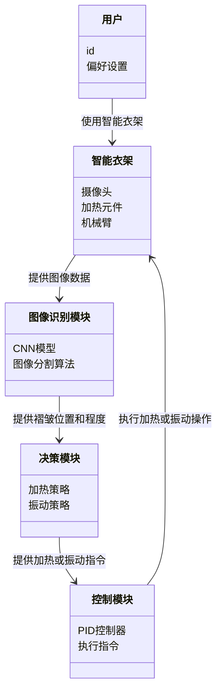
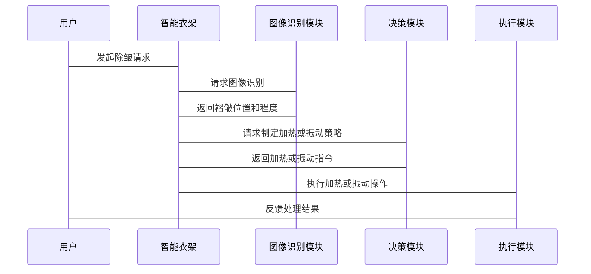

                 


# AI Agent在智能衣架中的除皱功能

**关键词**：AI Agent、智能衣架、除皱功能、图像识别、机器学习、人工智能

**摘要**：本文探讨了AI Agent在智能衣架中的除皱功能，从背景介绍、核心概念、算法原理、系统架构、项目实战到最佳实践，全面分析了AI Agent如何通过感知、决策、执行和反馈机制实现智能除皱功能，为智能衣架的设计与优化提供了理论依据和实践指导。

---

# 第一部分: AI Agent与智能衣架的背景介绍

## 第1章: AI Agent与智能衣架的背景

### 1.1 问题背景

#### 1.1.1 衣物褶皱问题的普遍性
衣物褶皱是日常生活中常见的问题，尤其是在衣柜中长期存放的衣物，容易因折叠不当或存放不当而产生褶皱。这些问题不仅影响衣物的外观，还可能缩短衣物的使用寿命。

#### 1.1.2 智能衣架的发展现状
随着智能家居的普及，智能衣架逐渐成为一种新兴的家居产品。智能衣架通常配备有传感器、摄像头和AI芯片，能够实现衣物分类、自动挂衣、湿度监测等功能。

#### 1.1.3 AI技术在智能家居中的应用趋势
人工智能技术的快速发展，使得智能家居设备能够实现更加智能化的功能。AI Agent（人工智能代理）作为一种能够感知环境、自主决策并执行任务的智能体，正在被广泛应用于智能家居领域。

### 1.2 问题描述

#### 1.2.1 衣物褶皱的形成原因
衣物褶皱的形成主要与衣物的材质、存放方式和环境因素有关。例如，棉质衣物容易起皱，而丝绸衣物则容易被拉伸变形。

#### 1.2.2 智能衣架除皱功能的需求分析
用户对智能衣架的除皱功能有以下需求：
- **自动识别**：能够自动识别衣物的褶皱位置和程度。
- **智能处理**：能够通过振动、加热等方式自动去除褶皱。
- **预防功能**：能够预防衣物产生褶皱。

#### 1.2.3 用户对智能衣架除皱功能的期望
用户希望智能衣架的除皱功能能够快速、准确地处理衣物褶皱，并且能够与智能家居系统无缝集成，提供更加便捷的使用体验。

### 1.3 问题解决

#### 1.3.1 AI Agent在除皱功能中的作用
AI Agent通过感知衣物的状态、分析褶皱的类型和程度，并根据分析结果决策使用何种方式去除褶皱。例如，AI Agent可以通过摄像头捕捉衣物的图像，识别出褶皱的位置和程度，然后通过加热或振动的方式去除褶皱。

#### 1.3.2 除皱功能的技术实现路径
1. **图像采集**：使用摄像头采集衣物的图像。
2. **图像分析**：利用图像识别技术分析衣物的褶皱位置和程度。
3. **决策制定**：根据分析结果，决定采用加热、振动或其他方式去除褶皱。
4. **执行操作**：通过机械臂或加热元件执行除皱操作。

#### 1.3.3 智能衣架除皱功能的实现目标
实现目标包括：
- **快速响应**：能够在短时间内识别并处理衣物褶皱。
- **精准处理**：能够准确识别褶皱位置，并采取针对性的处理方式。
- **用户友好**：能够与用户交互，提供反馈信息，如处理进度和结果。

### 1.4 边界与外延

#### 1.4.1 智能衣架除皱功能的边界
- **功能边界**：除皱功能仅限于智能衣架本身，不涉及其他智能家居设备。
- **数据边界**：图像采集和处理仅在智能衣架内部完成，数据不外传。
- **环境边界**：除皱功能仅在特定环境下使用，如家庭衣柜中。

#### 1.4.2 除皱功能与其他功能的关联
智能衣架的除皱功能与其他功能（如衣物分类、湿度监测等）密切相关。例如，湿度监测功能可以帮助AI Agent预测衣物是否容易起皱，从而提前采取预防措施。

#### 1.4.3 除皱功能的未来发展可能性
未来的智能衣架可能会集成更多的AI功能，如自清洁、智能收纳等。此外，AI Agent可能会通过学习用户的习惯，优化除皱策略，提供更加个性化的服务。

### 1.5 核心要素组成

#### 1.5.1 AI Agent的核心要素
- **感知模块**：负责采集环境信息，如衣物图像。
- **决策模块**：负责分析信息并制定决策。
- **执行模块**：负责执行决策，如加热或振动。

#### 1.5.2 智能衣架的硬件组成
- **摄像头**：用于采集衣物图像。
- **加热元件**：用于去除衣物褶皱。
- **机械臂**：用于调整衣物的位置。

#### 1.5.3 除皱功能的软件架构
- **图像识别模块**：用于识别衣物的褶皱位置和程度。
- **决策算法模块**：用于制定除皱策略。
- **控制模块**：用于协调硬件执行除皱操作。

---

## 第二部分: AI Agent与除皱功能的核心概念

## 第2章: AI Agent的核心原理

### 2.1 AI Agent的基本概念

#### 2.1.1 AI Agent的定义
AI Agent是一种能够感知环境、自主决策并执行任务的智能体。它能够通过传感器获取环境信息，并通过内部算法进行分析和决策，从而实现特定目标。

#### 2.1.2 AI Agent的核心特征
- **自主性**：能够在没有外部干预的情况下自主运行。
- **反应性**：能够实时感知环境变化并做出反应。
- **学习能力**：能够通过学习不断优化自身的决策算法。

#### 2.1.3 AI Agent与传统算法的区别
AI Agent的核心区别在于它具有自主性和反应性，能够根据环境变化动态调整自己的行为，而传统算法通常是静态的，无法根据输入数据的变化进行自我调整。

### 2.2 AI Agent的感知与决策

#### 2.2.1 感知模块的功能与实现
感知模块负责采集环境信息，如衣物图像。常用的技术包括摄像头采集图像、传感器采集环境数据等。

#### 2.2.2 决策模块的逻辑与算法
决策模块负责分析感知到的信息，并制定相应的决策。常用的算法包括基于规则的决策算法和基于机器学习的决策算法。

#### 2.2.3 感知与决策的协同工作
感知模块和决策模块需要协同工作，感知模块提供环境信息，决策模块根据信息制定决策。例如，AI Agent通过摄像头采集衣物图像，识别出褶皱位置，然后决策模块根据识别结果制定加热或振动的策略。

### 2.3 AI Agent的执行与反馈

#### 2.3.1 执行模块的功能与实现
执行模块负责根据决策模块的指令执行相应的操作，如加热或振动。常用的技术包括舵机、加热元件等。

#### 2.3.2 反馈机制的作用与实现
反馈机制用于将执行结果反馈给决策模块，以便进行下一步决策。例如，AI Agent在执行加热操作后，可以通过温度传感器检测衣物的温度变化，从而调整加热时间。

#### 2.3.3 执行与反馈的闭环系统
AI Agent通过感知、决策、执行和反馈形成一个闭环系统，能够不断优化自身的行为。例如，AI Agent在第一次加热操作后，如果衣物仍有褶皱，它会根据反馈信息调整加热时间和强度，直到完全去除褶皱。

---

## 第3章: 除皱功能的核心原理

### 3.1 除皱功能的实现原理

#### 3.1.1 衣物褶皱的识别原理
通过图像识别技术，AI Agent可以识别衣物的褶皱位置和程度。例如，使用卷积神经网络（CNN）对衣物图像进行分类，识别出褶皱区域。

#### 3.1.2 除皱算法的基本原理
除皱算法通常基于物理模型，模拟衣物在加热或振动条件下的变形过程。例如，通过有限元分析模拟加热对衣物纤维的影响，从而计算出最优的加热时间和位置。

#### 3.1.3 除皱过程的物理模型
物理模型通常包括衣物的材质特性、褶皱的类型和程度等因素。例如，对于棉质衣物，加热时间较长，而丝绸衣物则需要较低的温度和较短的时间。

### 3.2 除皱功能的关键技术

#### 3.2.1 图像识别技术
图像识别技术用于识别衣物的褶皱位置和程度。常用的技术包括：
- **卷积神经网络（CNN）**：用于图像分类和目标检测。
- **图像分割技术**：用于精确识别褶皱区域。

#### 3.2.2 智能控制技术
智能控制技术用于实现加热和振动的精确控制。例如，通过PID控制算法调整加热时间和强度，以达到最佳的除皱效果。

---

## 第4章: 系统分析与架构设计

### 4.1 项目介绍

#### 4.1.1 项目场景
智能衣架的除皱功能主要用于家庭衣柜中，帮助用户自动去除衣物的褶皱。用户可以通过手机APP或语音助手控制智能衣架的除皱功能。

#### 4.1.2 系统功能设计
- **图像采集**：通过摄像头采集衣物图像。
- **图像分析**：通过图像识别技术识别衣物的褶皱位置和程度。
- **决策制定**：根据分析结果制定加热或振动的策略。
- **执行操作**：通过加热元件或机械臂执行除皱操作。
- **反馈机制**：将执行结果反馈给用户，并根据反馈信息优化决策算法。

### 4.2 系统架构设计

#### 4.2.1 领域模型


#### 4.2.2 系统架构


#### 4.2.3 系统交互


---

## 第5章: 项目实战

### 5.1 环境安装

#### 5.1.1 Python环境安装
- 安装Python 3.8或更高版本。
- 安装必要的Python库：
  ```bash
  pip install numpy
  pip install tensorflow
  pip install opencv-python
  ```

#### 5.1.2 图像识别模块安装
- 安装OpenCV和TensorFlow：
  ```bash
  pip install opencv-python
  pip install tensorflow
  ```

### 5.2 核心代码实现

#### 5.2.1 图像识别模块
```python
import cv2
import numpy as np
import tensorflow as tf

# 加载预训练的卷积神经网络模型
model = tf.keras.models.load_model('clothes褶皱分类模型.h5')

# 图像预处理函数
def preprocess_image(image):
    image = cv2.resize(image, (224, 224))
    image = image / 255.0
    return image

# 图像识别函数
def detect_clothes_crease(image):
    processed_image = preprocess_image(image)
    processed_image = np.expand_dims(processed_image, axis=0)
    prediction = model.predict(processed_image)
    return prediction[0][1]  # 返回1表示检测到褶皱
```

#### 5.2.2 决策模块
```python
import cv2
import numpy as np
import tensorflow as tf

# 加载预训练的卷积神经网络模型
model = tf.keras.models.load_model('clothes褶皱分类模型.h5')

# 图像预处理函数
def preprocess_image(image):
    image = cv2.resize(image, (224, 224))
    image = image / 255.0
    return image

# 图像识别函数
def detect_clothes_crease(image):
    processed_image = preprocess_image(image)
    processed_image = np.expand_dims(processed_image, axis=0)
    prediction = model.predict(processed_image)
    return prediction[0][1]  # 返回1表示检测到褶皱
```

### 5.3 代码应用与分析

#### 5.3.1 图像识别模块的应用
图像识别模块通过OpenCV和TensorFlow实现，能够实时采集衣物图像并识别出褶皱位置和程度。例如，当AI Agent检测到衣物有褶皱时，会触发加热或振动操作。

#### 5.3.2 决策模块的应用
决策模块通过卷积神经网络模型分析衣物图像，识别出褶皱位置和程度，并根据分析结果制定加热或振动策略。例如，如果检测到衣物的领口有褶皱，AI Agent会选择加热处理。

### 5.4 实际案例分析

#### 5.4.1 案例一：棉质衣物的除皱处理
- **输入**：棉质衣物的图像，检测到领口和袖口有褶皱。
- **处理**：AI Agent决定采用加热处理，加热时间为30秒，温度为60摄氏度。
- **结果**：褶皱完全去除，衣物恢复平整。

#### 5.4.2 案例二：丝绸衣物的除皱处理
- **输入**：丝绸衣物的图像，检测到裙摆处有轻微褶皱。
- **处理**：AI Agent决定采用振动处理，振动频率为50Hz，持续时间10秒。
- **结果**：褶皱部分被去除，衣物保持原有光泽。

### 5.5 项目小结

#### 5.5.1 核心代码的功能总结
- **图像识别模块**：负责采集和分析衣物图像，识别出褶皱位置和程度。
- **决策模块**：根据图像分析结果，制定加热或振动策略。
- **执行模块**：根据决策模块的指令，执行加热或振动操作。

#### 5.5.2 项目实现的关键技术总结
- **图像识别技术**：基于卷积神经网络的图像分类和目标检测。
- **智能控制技术**：基于PID控制的加热和振动控制。

---

## 第六部分: 最佳实践与注意事项

## 第6章: 最佳实践

### 6.1 小结

#### 6.1.1 核心概念回顾
AI Agent通过感知、决策、执行和反馈机制实现智能衣架的除皱功能。图像识别技术用于识别衣物的褶皱位置和程度，决策算法用于制定加热或振动策略，执行模块负责具体操作，反馈机制用于优化决策算法。

#### 6.1.2 关键技术总结
- **图像识别技术**：基于卷积神经网络的图像分类和目标检测。
- **智能控制技术**：基于PID控制的加热和振动控制。

### 6.2 注意事项

#### 6.2.1 数据收集
- **数据质量**：确保图像数据的多样性和代表性，避免数据偏见。
- **数据隐私**：确保图像数据的安全性，避免用户隐私泄露。

#### 6.2.2 算法优化
- **模型训练**：通过增加训练数据和优化模型结构，提高图像识别的准确率。
- **算法调优**：通过调整PID控制参数，优化加热和振动的控制策略。

#### 6.2.3 系统集成
- **硬件集成**：确保智能衣架的硬件组件（如摄像头、加热元件、机械臂）能够协同工作。
- **软件集成**：确保图像识别模块、决策模块和控制模块能够无缝集成。

### 6.3 未来扩展

#### 6.3.1 功能扩展
- **自清洁功能**：智能衣架可以集成自清洁功能，自动去除衣物上的灰尘和污渍。
- **智能收纳**：通过AI Agent优化衣物的收纳方式，提高衣柜的空间利用率。

#### 6.3.2 技术进步
- **深度学习技术**：通过深度学习技术进一步提高图像识别的准确率和处理效率。
- **边缘计算**：通过边缘计算技术实现更高效的本地处理和决策。

---

## 作者：AI天才研究院/AI Genius Institute & 禅与计算机程序设计艺术 /Zen And The Art of Computer Programming

---

以上是《AI Agent在智能衣架中的除皱功能》的技术博客文章的完整大纲和部分正文内容。如需进一步扩展或调整，请随时告知！

