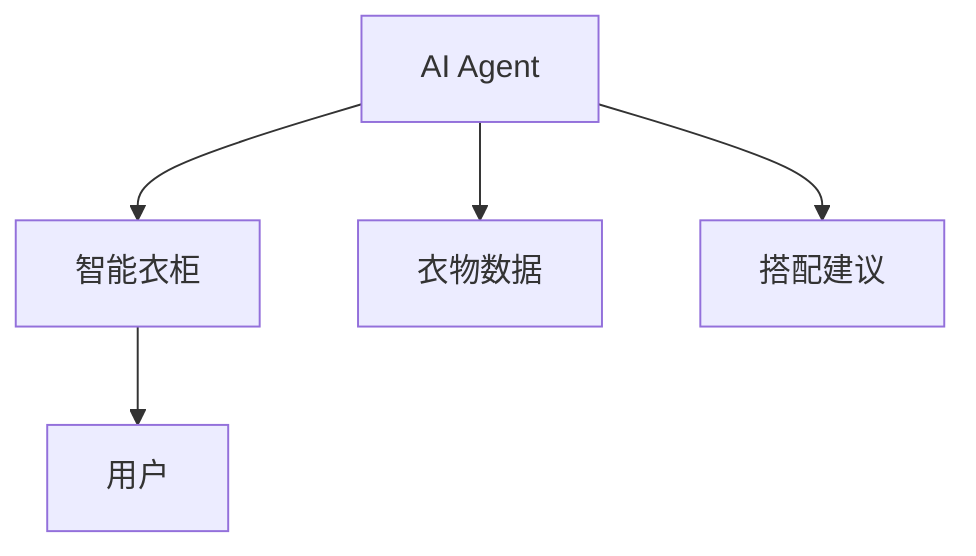
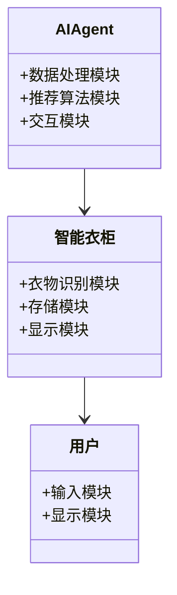
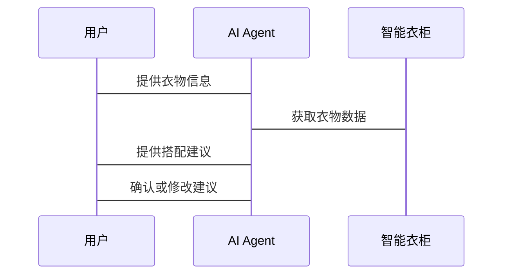
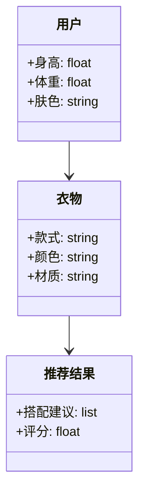

                 


# AI Agent在智能衣柜中的个人形象设计师

**关键词**: AI Agent, 智能衣柜, 个人形象设计, 人工智能, 服装推荐系统

**摘要**: 本文探讨了AI Agent在智能衣柜中的应用，特别是作为个人形象设计师的角色。通过分析AI Agent的基本概念、算法原理、系统架构，结合实际项目案例，展示了AI Agent如何通过协同过滤算法优化衣物推荐，帮助用户实现个性化的形象设计。

---

# 第1章: AI Agent与智能衣柜的背景介绍

## 1.1 AI Agent的基本概念

### 1.1.1 AI Agent的定义

AI Agent（人工智能代理）是一种能够感知环境、执行任务并做出决策的智能实体。它通过传感器获取信息，利用算法处理数据，并通过执行器与环境交互。AI Agent的核心目标是通过自动化和智能化的方式，帮助用户完成特定任务。

### 1.1.2 AI Agent的核心特点

- **自主性**: AI Agent能够自主决策，无需人工干预。
- **反应性**: 能够实时感知环境变化并做出反应。
- **目标导向**: 具有明确的目标，持续优化行为以达到目标。
- **学习能力**: 通过机器学习算法不断优化自身性能。

### 1.1.3 AI Agent与传统软件的区别

| 特性         | 传统软件            | AI Agent          |
|--------------|---------------------|-------------------|
| 智能性       | 无智能性             | 具有智能性         |
| 决策能力     | 无决策能力           | 具有决策能力       |
| 学习能力     | 无学习能力           | 具有学习能力       |
| 自适应性     | 无自适应性           | 具有自适应性       |

## 1.2 智能衣柜的定义与特点

### 1.2.1 智能衣柜的定义

智能衣柜是一种结合了物联网技术和人工智能的智能设备，能够通过传感器感知衣物的状态（如颜色、材质、尺寸等），并利用AI算法为用户提供个性化的衣物推荐和搭配建议。

### 1.2.2 智能衣柜的核心功能

- **衣物识别**: 通过图像识别技术自动识别衣物的款式、颜色和材质。
- **推荐系统**: 根据用户的身材、肤色、喜好和场合推荐合适的衣物搭配。
- **智能存储**: 自动分类和存储衣物，优化存储空间。
- **健康监测**: 监测衣物的使用情况，提醒用户更换或清洗。

### 1.2.3 智能衣柜与传统衣柜的区别

| 特性         | 传统衣柜            | 智能衣柜          |
|--------------|---------------------|-------------------|
| 智能性       | 无智能性             | 具有智能性         |
| 个性化推荐   | 无推荐功能           | 具有推荐功能       |
| 自动分类     | 无自动分类功能       | 具有自动分类功能   |
| 连接性       | 无网络连接           | 支持网络连接       |

## 1.3 个人形象设计的背景与需求

### 1.3.1 个人形象设计的基本概念

个人形象设计是指通过服装搭配和个人风格的塑造，提升个人形象的过程。它不仅关注外表的美观，还考虑场合、气质和个人特点。

### 1.3.2 个人形象设计的需求分析

- **个性化需求**: 用户希望获得符合自身特点的搭配建议。
- **便捷性需求**: 用户希望快速获得推荐，减少选择的时间成本。
- **专业性需求**: 用户希望推荐具有专业性，符合时尚潮流。

### 1.3.3 个人形象设计的边界与外延

- **边界**: 个人形象设计不涉及服装的设计和生产，仅限于搭配建议。
- **外延**: 包括服装租赁、搭配课程等延伸服务。

## 1.4 AI Agent在智能衣柜中的应用背景

### 1.4.1 AI技术在服装领域的应用现状

AI技术在服装领域的应用主要集中在图像识别、推荐系统和虚拟试衣等方面。然而，现有系统大多缺乏个性化和实时性，难以满足用户的深层需求。

### 1.4.2 AI Agent在个人形象设计中的优势

- **个性化推荐**: AI Agent能够根据用户的身材、肤色和偏好推荐合适的衣物。
- **实时反馈**: AI Agent能够实时感知用户的穿着效果，并提供调整建议。
- **持续优化**: 通过机器学习算法，AI Agent能够不断优化推荐结果。

### 1.4.3 AI Agent在智能衣柜中的潜在价值

AI Agent的应用能够显著提升智能衣柜的用户体验，使其成为用户日常生活中的重要助手。通过个性化推荐和智能管理，用户能够更高效地搭配衣物，提升形象。

---

# 第2章: AI Agent与智能衣柜的核心概念

## 2.1 AI Agent与智能衣柜的概念结构

### 2.1.1 AI Agent与智能衣柜的关系图



### 2.1.2 AI Agent在智能衣柜中的角色定位

AI Agent在智能衣柜中扮演着“智能大脑”的角色，负责处理数据、做出决策并提供服务。它通过与用户的交互，了解用户的需求，并通过智能衣柜的硬件设备实现衣物的识别和推荐。

### 2.1.3 智能衣柜的系统架构



## 2.2 AI Agent与个人形象设计的核心要素

### 2.2.1 个人形象设计的核心要素

- **用户身材**: 包括身高、体重、肩宽等身体数据。
- **肤色**: 包括肤色类型（如冷色调、暖色调）。
- **发型和面部特征**: 包括发型、脸型等。
- **场合和时间**: 包括日常、工作、社交等场合。

### 2.2.2 AI Agent在个人形象设计中的作用

- **数据采集**: 收集用户的身材、肤色等信息。
- **数据分析**: 分析数据并生成推荐方案。
- **实时反馈**: 根据用户的实时需求提供调整建议。

### 2.2.3 AI Agent与智能衣柜的交互流程



## 2.3 AI Agent与智能衣柜的核心属性对比

| 特性         | AI Agent                | 智能衣柜              |
|--------------|-------------------------|-----------------------|
| 功能         | 数据处理、推荐算法      | 衣物识别、存储         |
| 输入         | 用户需求、衣物数据      | 衣物信息              |
| 输出         | 搭配建议                | 显示结果              |
| 交互方式     | 用户输入、实时反馈      | 显示屏、语音交互       |

---

# 第3章: AI Agent在智能衣柜中的算法原理

## 3.1 协同过滤推荐算法

### 3.1.1 协同过滤算法的定义

协同过滤是一种基于用户行为和偏好进行推荐的算法。它通过分析用户的相似性，找到与用户兴趣相似的用户，推荐他们喜欢的物品。

### 3.1.2 协同过滤算法的实现步骤

1. **数据收集**: 收集用户的衣物偏好和购买记录。
2. **用户相似性计算**: 使用余弦相似度或欧几里得距离计算用户相似性。
3. **推荐生成**: 根据相似用户的偏好，推荐当前用户可能感兴趣的衣物。

### 3.1.3 协同过滤算法的数学模型

$$ sim(u, v) = \frac{\sum_{i} (r_{u,i} - \bar{r}_u)(r_{v,i} - \bar{r}_v)}{\sqrt{\sum_{i} (r_{u,i} - \bar{r}_u)^2} \sqrt{\sum_{i} (r_{v,i} - \bar{r}_v)^2}} $$

其中：
- \( sim(u, v) \) 是用户u和v之间的相似度。
- \( r_{u,i} \) 是用户u对物品i的评分。
- \( \bar{r}_u \) 是用户u的平均评分。

### 3.1.4 协同过滤算法的Python实现

```python
import numpy as np

def cosine_similarity(user_profile, item_profile):
    # 计算用户与物品的相似度
    user_vector = user_profile.values
    item_vector = item_profile.values
    dot_product = np.dot(user_vector, item_vector)
    user_norm = np.linalg.norm(user_vector)
    item_norm = np.linalg.norm(item_vector)
    return dot_product / (user_norm * item_norm)

# 示例数据
user_profile = pd.DataFrame({
    'item1': [5],
    'item2': [3],
    'item3': [4]
})

item_profile = pd.DataFrame({
    'item1': [5],
    'item2': [4],
    'item3': [3]
})

similarity = cosine_similarity(user_profile, item_profile)
print(similarity)
```

---

# 第4章: AI Agent在智能衣柜中的系统架构设计

## 4.1 项目介绍

本项目旨在开发一个基于AI Agent的智能衣柜系统，通过图像识别和协同过滤算法为用户提供个性化的衣物推荐和搭配建议。

## 4.2 系统功能设计

### 4.2.1 领域模型



### 4.2.2 系统架构


### 4.2.3 系统接口设计

- **输入接口**: 用户输入身高、体重、肤色等信息。
- **输出接口**: 显示推荐结果和搭配建议。

### 4.2.4 系统交互流程


---

# 第5章: 项目实战

## 5.1 环境安装

- **Python 3.8+**
- **TensorFlow 2.0+**
- **OpenCV 4.5+**

## 5.2 核心功能实现

### 5.2.1 图像识别

```python
import cv2

def detect_color(image_path):
    # 加载图像
    image = cv2.imread(image_path)
    # 转换为HSV颜色空间
    hsv = cv2.cvtColor(image, cv2.COLOR_BGR2HSV)
    # 提取颜色
    h, s, v = hsv[0][0]
    return (h, s, v)

# 示例
image_path = 'clothes.jpg'
print(detect_color(image_path))
```

### 5.2.2 推荐系统

```python
import pandas as pd
from sklearn.metrics.pairwise import cosine_similarity

# 示例数据
users = pd.DataFrame({
    'item1': [5, 4, 3],
    'item2': [3, 2, 1],
    'item3': [4, 5, 2]
})

# 计算相似度
similarity = cosine_similarity(users)
print(similarity)
```

---

# 第6章: 最佳实践

## 6.1 小结

通过本文的介绍，我们详细探讨了AI Agent在智能衣柜中的应用，特别是其在个人形象设计中的重要作用。通过协同过滤算法和系统架构设计，AI Agent能够为用户提供个性化的衣物推荐和搭配建议。

## 6.2 注意事项

- 数据隐私保护是AI Agent应用中的重要问题，需妥善处理用户数据。
- 系统的实时性和响应速度是用户体验的重要指标，需优化系统性能。
- 算法的准确性和推荐的合理性是系统的核心竞争力，需不断优化算法模型。

## 6.3 拓展阅读

- 《推荐系统实战》
- 《人工智能在服装领域的应用》
- 《智能衣柜的设计与实现》

---

作者：AI天才研究院/AI Genius Institute & 禅与计算机程序设计艺术 /Zen And The Art of Computer Programming

