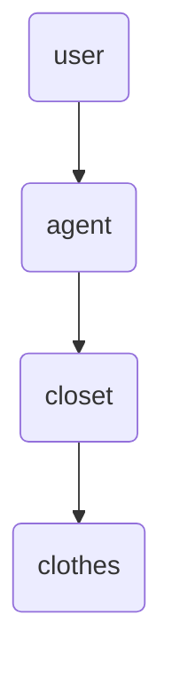
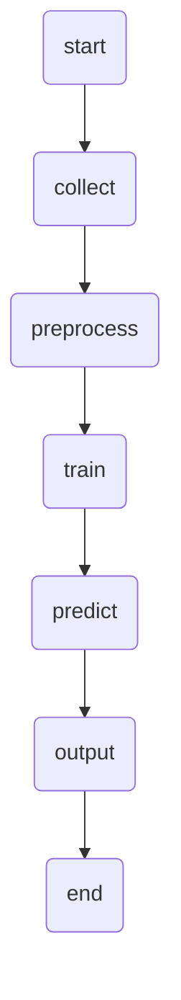
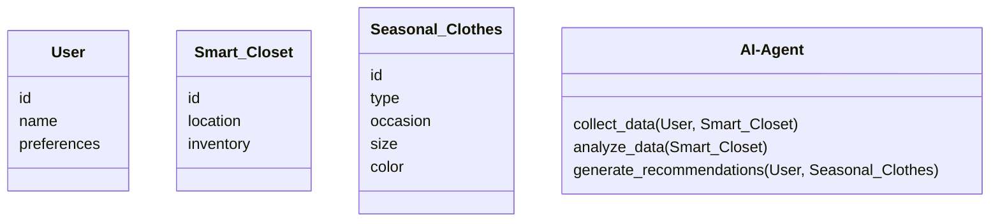

                 


# AI Agent在智能衣柜中的季节性衣物管理

> 关键词：AI Agent，智能衣柜，季节性衣物，推荐算法，系统架构，项目实战

> 摘要：本文详细探讨了AI Agent在智能衣柜中的应用，特别是针对季节性衣物的管理。通过分析AI Agent的核心原理、推荐算法、系统架构，并结合实际项目案例，阐述了如何利用AI技术提升衣物管理效率和用户体验。

---

# 第一部分: AI Agent在智能衣柜中的季节性衣物管理概述

## 第1章: AI Agent与智能衣柜的背景介绍

### 1.1 AI Agent的基本概念

#### 1.1.1 什么是AI Agent

人工智能代理（AI Agent）是一种能够感知环境、做出决策并执行任务的智能实体。在智能衣柜的应用中，AI Agent负责分析用户的衣物数据，提供个性化的推荐和管理建议。

#### 1.1.2 AI Agent的核心特征

AI Agent的核心特征包括：

1. **自主性**：能够独立执行任务，无需人工干预。
2. **反应性**：能够实时感知环境变化并做出响应。
3. **学习能力**：通过数据学习用户的偏好和行为模式。
4. **交互性**：能够与用户和其他系统进行有效交互。

#### 1.1.3 AI Agent在智能衣柜中的应用背景

随着智能硬件的普及，衣物管理逐渐从传统模式向智能化转变。AI Agent在智能衣柜中的应用，能够帮助用户更高效地管理衣物，特别是在季节性衣物的分类和推荐方面。

---

### 1.2 季节性衣物管理的挑战与需求

#### 1.2.1 季节性衣物管理的基本问题

季节性衣物管理的核心问题包括：

1. **衣物分类**：如何根据季节、场合和天气变化对衣物进行分类。
2. **推荐系统**：如何为用户提供个性化的衣物推荐。
3. **库存管理**：如何高效管理用户的衣物库存。

#### 1.2.2 用户需求分析

用户在季节性衣物管理中的需求包括：

1. **智能化推荐**：希望系统能够根据天气和场合推荐合适的衣物。
2. **便捷性**：希望系统能够自动分类和整理衣物。
3. **高效性**：希望系统能够快速响应并提供准确的建议。

#### 1.2.3 现有解决方案的局限性

现有的衣物管理解决方案主要依赖手动分类和简单的规则推荐，存在以下问题：

1. **缺乏智能化**：无法根据用户行为和偏好进行个性化推荐。
2. **效率低下**：手动分类和整理耗时耗力。
3. **数据孤岛**：缺乏跨平台的数据整合和分析。

---

## 第2章: AI Agent在智能衣柜中的核心概念与联系

### 2.1 AI Agent的核心原理

#### 2.1.1 AI Agent的感知机制

AI Agent通过以下方式感知环境：

1. **传感器数据**：如温度、湿度等环境数据。
2. **用户行为数据**：如用户的穿衣习惯、活动记录等。
3. **历史数据**：如过去的穿衣记录和天气数据。

#### 2.1.2 AI Agent的决策逻辑

AI Agent的决策逻辑包括以下几个步骤：

1. **数据收集**：收集用户的衣物数据和行为数据。
2. **数据分析**：分析数据，识别用户的偏好和需求。
3. **决策制定**：基于分析结果，制定衣物推荐和管理策略。

#### 2.1.3 AI Agent的执行方式

AI Agent通过以下方式执行任务：

1. **自动分类**：将衣物按照季节和场合分类。
2. **智能推荐**：为用户提供个性化的衣物推荐。
3. **库存更新**：实时更新衣物库存信息。

### 2.2 实体关系分析

#### 2.2.1 ER实体关系图



---

### 2.3 核心概念对比

#### 2.3.1 基于规则的AI Agent与基于学习的AI Agent对比

| 特性                | 基于规则的AI Agent         | 基于学习的AI Agent         |
|---------------------|---------------------------|---------------------------|
| 数据依赖            | 需要明确的规则和逻辑      | 需要大量数据进行训练      |
| 灵活性              | 较低，规则固定            | 较高，能够自适应变化      |
| 学习能力            | 无学习能力                | 具备学习能力              |

#### 2.3.2 基于知识图谱的AI Agent与基于数据驱动的AI Agent对比

| 特性                | 基于知识图谱的AI Agent     | 基于数据驱动的AI Agent    |
|---------------------|--------------------------|--------------------------|
| 数据来源            | 知识库和结构化数据        | 非结构化数据和实时数据    |
| 处理方式            | 基于图结构进行推理        | 基于统计和机器学习模型    |
| 优势                | 高度结构化，推理效率高     | 灵活性高，适应性强        |

---

## 第3章: AI Agent的推荐算法原理

### 3.1 推荐算法概述

#### 3.1.1 协同过滤推荐

协同过滤是一种基于用户行为相似性的推荐算法。通过分析用户的穿衣记录，找到与当前用户行为相似的其他用户，推荐他们喜欢的衣物。

#### 3.1.2 基于内容的推荐

基于内容的推荐算法通过分析衣物的属性（如颜色、材质、款式）进行推荐。适合于推荐特定风格的衣物。

#### 3.1.3 混合推荐模型

混合推荐模型结合了协同过滤和基于内容的推荐，能够在保证推荐准确性的基础上，提高推荐的多样性。

### 3.2 算法流程图



### 3.3 推荐算法的数学模型

#### 3.3.1 协同过滤的相似度计算

$$相似度 = \frac{\sum_{i} (r_{ui} - \bar{r}_u)(r_{vi} - \bar{r}_v)}{\sqrt{\sum_{i} (r_{ui} - \bar{r}_u)^2} \cdot \sqrt{\sum_{i} (r_{vi} - \bar{r}_v)^2}}$$

其中，$\bar{r}_u$ 和 $\bar{r}_v$ 分别表示用户u和v的平均评分。

---

## 第4章: 系统分析与架构设计方案

### 4.1 项目介绍

智能衣柜系统旨在通过AI Agent实现季节性衣物的智能化管理，提升用户体验。

### 4.2 系统功能设计

#### 4.2.1 领域模型



#### 4.2.2 系统架构设计

```mermaid
graph TD
User --> API Gateway
API Gateway --> Smart_Closet
Smart_Closet --> AI-Agent
AI-Agent --> Database
Database --> Seasonal_Clothes
```

#### 4.2.3 系统接口设计

系统主要接口包括：

1. **数据收集接口**：用于收集用户的衣物数据和行为数据。
2. **推荐接口**：用于根据用户需求生成推荐结果。
3. **库存管理接口**：用于更新和查询衣物库存信息。

---

## 第5章: 项目实战

### 5.1 环境安装

1. **安装Python和相关库**：
   ```bash
   pip install numpy pandas scikit-learn
   ```

2. **安装推荐算法库**：
   ```bash
   pip install surprise
   ```

### 5.2 核心代码实现

#### 5.2.1 数据预处理

```python
import pandas as pd
import numpy as np

# 读取数据
data = pd.read_csv('clothes.csv')

# 数据清洗
data.dropna(inplace=True)
data['season'] = data['season'].astype('category')
```

#### 5.2.2 推荐算法实现

```python
from surprise import Dataset, SVD

# 数据准备
train = data.drop('season', axis=1)
test = data[['season']]

# 训练模型
model = SVD(n_factors=50, n_iter=20, random_state=42)
model.fit(train)

# 生成推荐
predictions = model.test(test)
recommendations = pd.DataFrame(predictions)
```

---

## 第6章: 最佳实践与总结

### 6.1 小结

通过本文的分析，我们了解了AI Agent在智能衣柜中的应用，特别是季节性衣物的管理。AI Agent通过感知用户行为和环境变化，能够为用户提供智能化的衣物推荐和管理服务。

### 6.2 注意事项

1. **数据隐私**：在处理用户数据时，需要注意数据隐私保护。
2. **系统性能**：需要优化系统性能，确保推荐的实时性。
3. **用户体验**：在设计系统时，需要注重用户体验，确保界面友好。

### 6.3 拓展阅读

1. **推荐算法研究**：进一步研究混合推荐模型和深度学习模型的应用。
2. **智能衣柜系统优化**：探索更多AI技术在衣物管理中的应用。

---

作者：AI天才研究院/AI Genius Institute & 禅与计算机程序设计艺术 /Zen And The Art of Computer Programming

---

通过以上步骤，我们可以看到AI Agent在智能衣柜中的季节性衣物管理具有广阔的应用前景。未来，随着AI技术的不断发展，智能衣柜将变得更加智能化和个性化，为用户带来更优质的穿衣体验。

