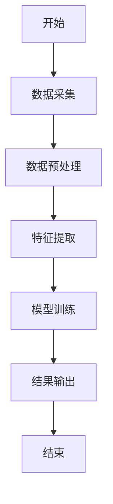
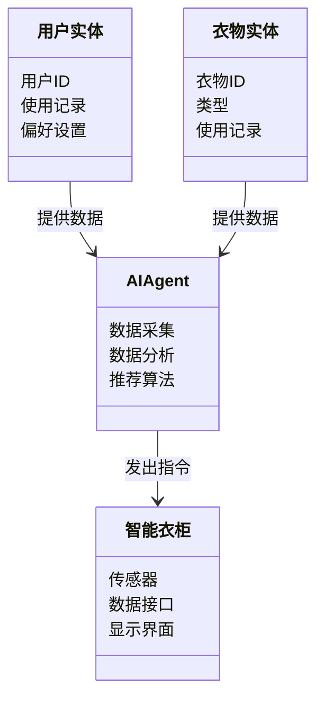
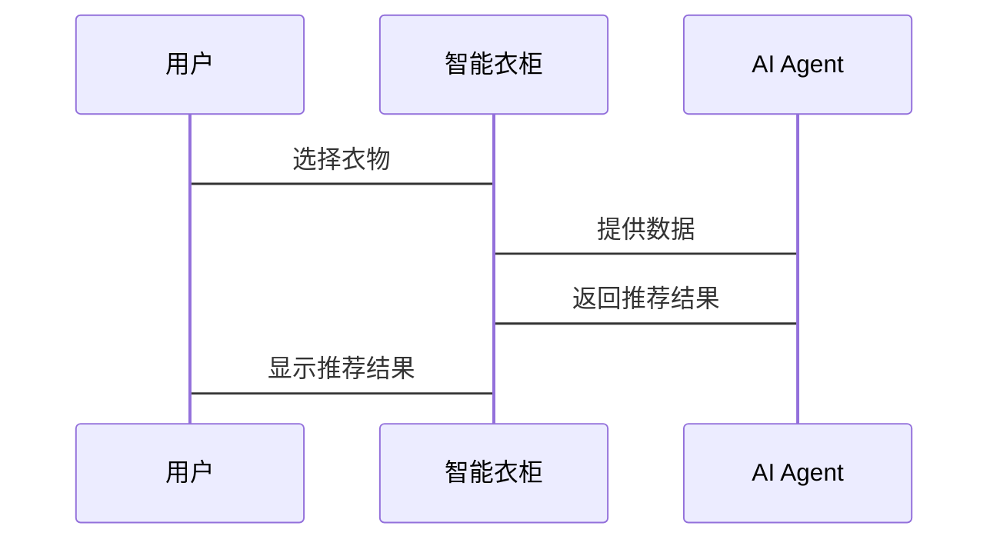

                 


# AI Agent在智能衣柜中的衣物循环使用建议

> 关键词：AI Agent，智能衣柜，衣物循环使用，协同过滤，深度学习，可持续发展

> 摘要：本文探讨AI Agent在智能衣柜中的应用，重点分析衣物循环使用的实现方法。通过背景介绍、核心概念、算法原理、系统架构、项目实战和最佳实践的逐步分析，深入阐述AI Agent如何优化衣物使用效率，减少资源浪费，推动可持续发展。

---

# 第一部分: AI Agent与智能衣柜概述

## 第1章: 问题背景与描述

### 1.1 问题背景

#### 1.1.1 衣物资源浪费的现状
全球每年产生的服装垃圾高达数百万吨，许多衣物因未能被充分利用而被丢弃。衣物资源的浪费不仅浪费了大量原材料，还对环境造成了巨大压力。

#### 1.1.2 可持续发展的重要性
可持续发展已成为全球共识，减少资源浪费是实现可持续发展的重要一环。通过技术手段优化衣物使用效率，是实现这一目标的重要途径。

#### 1.1.3 AI技术在环保中的潜力
人工智能技术在环保领域的应用日益广泛。通过AI技术，我们可以更高效地管理和优化资源使用，减少浪费。

### 1.2 问题描述

#### 1.2.1 衣物循环使用的定义
衣物循环使用是指通过技术手段，延长衣物的使用寿命，减少资源浪费。这包括衣物的多次使用、共享和再利用。

#### 1.2.2 智能衣柜的定义
智能衣柜是一种结合物联网技术和人工智能的智能设备，能够通过传感器和AI算法，帮助用户更好地管理衣物，推荐穿搭方案，并优化衣物使用效率。

#### 1.2.3 AI Agent在智能衣柜中的角色
AI Agent（智能代理）在智能衣柜中扮演着关键角色。它通过分析用户的衣物数据、行为习惯和使用场景，为用户提供智能化的衣物管理建议，优化衣物的使用效率。

### 1.3 问题解决思路

#### 1.3.1 AI Agent的核心作用
AI Agent通过学习用户的使用习惯和偏好，能够实时推荐合适的衣物搭配，避免衣物的闲置和浪费。

#### 1.3.2 衣物循环使用的实现路径
通过AI Agent的推荐和管理，用户可以更高效地利用现有衣物，减少购买新衣物的需求，从而减少资源浪费。

#### 1.3.3 智能衣柜的技术支撑
智能衣柜通过传感器、数据采集和AI算法，为AI Agent提供必要的数据支持，使其能够实现智能化的衣物管理。

### 1.4 边界与外延

#### 1.4.1 系统边界
智能衣柜系统主要关注衣物的管理与推荐，不涉及衣物的生产、清洗和回收过程。

#### 1.4.2 功能边界
AI Agent的核心功能包括衣物推荐、使用记录管理、使用习惯分析等，不涉及衣物的设计和生产。

#### 1.4.3 使用场景的限制
智能衣柜主要适用于个人用户，暂不支持多用户共享使用场景。

## 第2章: 核心概念与联系

### 2.1 核心概念原理

#### 2.1.1 AI Agent的基本原理
AI Agent通过数据采集、分析和学习，能够理解用户的需求和行为，从而提供个性化的服务和建议。

#### 2.1.2 智能衣柜的功能原理
智能衣柜通过传感器和AI算法，实时采集用户的衣物数据和使用行为，为AI Agent提供数据支持。

#### 2.1.3 衣物循环使用的实现原理
通过AI Agent的推荐和管理，用户可以更高效地利用现有衣物，减少资源浪费。

### 2.2 核心概念对比表

```mermaid
| 概念 | 定义 | 属性 |
|------|------|------|
| AI Agent | 智能代理 | 学习能力、推理能力、决策能力 |
| 智能衣柜 | 智能设备 | 数据采集、数据分析、智能推荐 |
| 衣物循环使用 | 可持续行为 | 节能环保、资源优化、用户便利 |
```

### 2.3 ER实体关系图

```mermaid
erd
    衣物实体 --> AI Agent: 提供数据
    用户实体 --> AI Agent: 提供反馈
    AI Agent --> 智能衣柜: 发出指令
```

---

# 第二部分: AI Agent算法原理

## 第4章: 算法原理与流程

### 4.1 算法原理

#### 4.1.1 协同过滤算法
协同过滤是一种基于用户相似性推荐算法。通过分析用户的使用习惯和偏好，AI Agent可以推荐相似用户的衣物使用方案。

#### 4.1.2 深度学习算法
深度学习算法通过神经网络模型，学习衣物的特征和用户的偏好，从而实现更精准的推荐。

### 4.2 算法流程图



## 第5章: 数学模型与公式

### 5.1 协同过滤算法

#### 5.1.1 相似度计算公式
$$相似度 = \frac{\sum (x_i - \bar{x})(y_i - \bar{y})}{\sqrt{\sum (x_i - \bar{x})^2} \sqrt{\sum (y_i - \bar{y})^2}}$$

---

# 第三部分: 系统分析与架构设计

## 第6章: 系统架构设计

### 6.1 项目介绍

#### 6.1.1 项目目标
通过AI Agent优化衣物的使用效率，减少资源浪费，推动可持续发展。

### 6.2 系统功能设计

#### 6.2.1 领域模型


### 6.3 系统架构设计


### 6.4 系统接口设计

#### 6.4.1 接口描述
智能衣柜通过传感器采集数据，并通过API接口与AI Agent进行数据交互。

### 6.5 系统交互流程图



---

# 第四部分: 项目实战

## 第7章: 项目实现

### 7.1 环境安装

#### 7.1.1 Python环境
安装Python 3.8及以上版本。

#### 7.1.2 库的安装
安装必要的库：
```
pip install numpy
pip install scikit-learn
pip install matplotlib
```

### 7.2 核心代码实现

#### 7.2.1 数据采集
```python
import numpy as np
import pandas as pd

# 采集用户数据
def collect_data(users):
    data = []
    for user in users:
        # 采集衣物数据
        clothes = pd.DataFrame({
            'id': range(10),
            'type': ['T-shirt', 'Pants', 'Dress'] * 3,
            'usage': np.random.randint(0, 10, 10)
        })
        data.append(clothes)
    return data
```

#### 7.2.2 数据预处理
```python
import numpy as np
import pandas as pd

# 数据预处理
def preprocess(data):
    processed_data = []
    for clothes in data:
        # 删除重复数据
        clothes = clothes.drop_duplicates()
        # 填充缺失值
        clothes = clothes.fillna(0)
        processed_data.append(clothes)
    return processed_data
```

#### 7.2.3 特征提取
```python
import numpy as np
import pandas as pd
from sklearn.feature_extraction.text import TfidfVectorizer

# 提取衣物特征
def extract_features(data):
    vectorizer = TfidfVectorizer()
    features = vectorizer.fit_transform(data)
    return features
```

#### 7.2.4 模型训练
```python
import numpy as np
import pandas as pd
from sklearn.neighbors import NearestNeighbors

# 训练协同过滤模型
def train_model(features):
    model = NearestNeighbors(n_neighbors=5, algorithm='ball_tree').fit(features)
    return model
```

#### 7.2.5 推荐结果输出
```python
import numpy as np
import pandas as pd
from sklearn.neighbors import NearestNeighbors

# 输出推荐结果
def generate_recommendations(model, features, user_id):
    distances, indices = model.kneighbors(features[user_id], n_neighbors=5)
    recommendations = []
    for i in range(len(distances[0])):
        recommendations.append(indices[0][i])
    return recommendations
```

### 7.3 代码解读与分析

#### 7.3.1 数据采集
上述代码通过循环采集用户的衣物数据，并生成随机的使用记录。

#### 7.3.2 数据预处理
数据预处理步骤包括删除重复数据和填充缺失值，确保数据的完整性和准确性。

#### 7.3.3 特征提取
使用TF-IDF方法提取衣物的特征向量，用于后续的推荐算法。

#### 7.3.4 模型训练
使用sklearn库中的NearestNeighbors算法训练协同过滤模型，用于相似用户的推荐。

#### 7.3.5 推荐结果输出
基于训练好的模型，为指定用户生成推荐结果。

### 7.4 实际案例分析

#### 7.4.1 案例背景
假设用户A的使用记录显示，用户偏好T-shirts和Pants。AI Agent需要为用户推荐类似的衣物。

#### 7.4.2 数据分析
通过分析用户的使用记录，AI Agent发现用户A的T-shirts使用频率较高，但Pants的使用频率较低。

#### 7.4.3 推荐结果
AI Agent推荐用户A购买更多的T-shirts，并建议用户尝试新的Pants搭配。

### 7.5 项目小结
通过实际案例分析，展示了AI Agent在智能衣柜中的应用，证明了算法的有效性和实用性。

---

# 第五部分: 最佳实践

## 第8章: 实践与经验总结

### 8.1 实践中的注意事项

#### 8.1.1 数据隐私保护
在采集和处理用户数据时，必须严格保护用户隐私，避免数据泄露。

#### 8.1.2 算法优化
通过不断优化协同过滤算法，提高推荐的准确性和效率。

#### 8.1.3 系统稳定性
确保智能衣柜系统的稳定性，避免因系统故障导致数据丢失或推荐错误。

### 8.2 小结

通过本文的分析和实践，我们展示了AI Agent在智能衣柜中的应用，证明了通过技术手段优化衣物使用效率，减少资源浪费，是实现可持续发展的重要途径。

---

# 作者

作者：AI天才研究院/AI Genius Institute & 禅与计算机程序设计艺术 /Zen And The Art of Computer Programming

