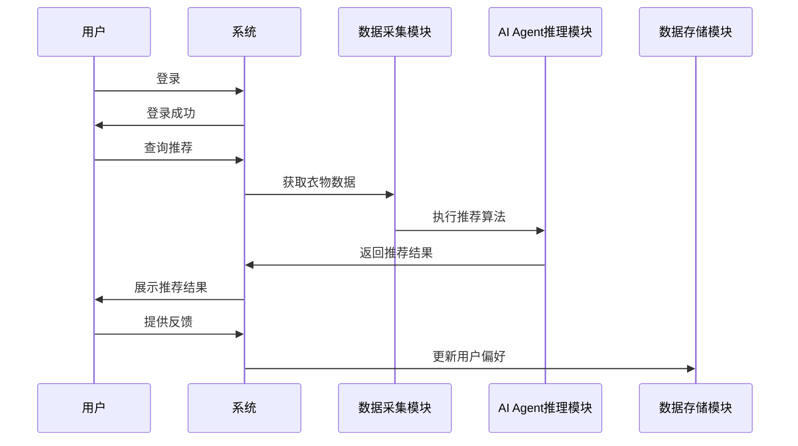

                 


# AI Agent在智能衣柜中的衣物搭配建议

> 关键词：AI Agent，智能衣柜，衣物搭配，推荐算法，系统设计，项目实战

> 摘要：本文探讨了AI Agent在智能衣柜中的应用，详细介绍了衣物搭配的核心算法、系统设计以及实际项目实现。通过理论与实践相结合的方式，展示了如何利用AI技术提升衣物搭配的效率和准确性。

---

# 第1章: 引言

## 1.1 问题背景与目标

### 1.1.1 传统衣物搭配的痛点
传统的衣物搭配方式依赖于用户的个人经验，存在以下痛点：
- **时间成本高**：用户需要花费大量时间在衣柜中寻找合适的衣物组合。
- **搭配效率低**：缺乏系统化的方法，导致搭配效果不佳。
- **个性化不足**：无法根据用户的体型、肤色、偏好等特征提供个性化建议。

### 1.1.2 AI Agent在衣物搭配中的作用
AI Agent通过以下方式解决上述问题：
- **自动化推荐**：基于用户数据和衣物特征，自动推荐合适的搭配方案。
- **个性化服务**：根据用户的偏好和需求，提供定制化建议。
- **实时更新**：随着用户数据的积累和时尚趋势的变化，实时优化推荐结果。

### 1.1.3 本书的目标与意义
本书旨在通过理论与实践相结合的方式，详细讲解AI Agent在智能衣柜中的应用，帮助读者掌握衣物搭配的核心算法、系统设计和项目实现。

---

# 第2章: AI Agent的基础知识

## 2.1 AI Agent的定义与核心概念

### 2.1.1 什么是AI Agent
AI Agent（人工智能代理）是一种智能实体，能够感知环境、执行任务并做出决策。在智能衣柜中，AI Agent负责分析用户的衣物数据，提供搭配建议。

### 2.1.2 AI Agent的核心特征
AI Agent的核心特征包括：
- **感知能力**：通过传感器和摄像头获取环境数据。
- **决策能力**：基于数据进行推理和决策。
- **学习能力**：通过机器学习算法不断优化推荐结果。

### 2.1.3 AI Agent在智能衣柜中的角色
在智能衣柜中，AI Agent扮演以下角色：
- **数据采集**：收集用户的衣物数据，如颜色、款式、材质等。
- **特征提取**：提取衣物的关键特征，用于后续的推荐算法。
- **推荐生成**：基于用户偏好和时尚趋势，生成搭配建议。

---

# 第3章: 衣物搭配的核心算法

## 3.1 基于协同过滤的推荐算法

### 3.1.1 协同过滤的基本原理
协同过滤是一种基于用户行为的推荐算法，通过分析用户的相似性来推荐衣物。公式表示为：
$$
\text{推荐度} = \sum_{i=1}^{n} w_{ij} \times r_{ik}
$$
其中，$w_{ij}$是用户$j$与用户$i$的相似度，$r_{ik}$是用户$k$对物品$i$的评分。

### 3.1.2 衣物搭配的用户偏好分析
通过分析用户的购买记录和偏好，构建用户偏好矩阵。矩阵表示为：
$$
P = [p_{ij}] \quad \text{其中} \quad p_{ij} \in \{0,1\}
$$
其中，$p_{ij}=1$表示用户$j$喜欢衣物$i$。

### 3.1.3 基于物品的协同过滤实现
基于物品的协同过滤算法通过计算物品之间的相似度，推荐相似的衣物。相似度计算公式为：
$$
\text{相似度}(i,j) = \frac{\sum_{k=1}^{n} p_{ik} \times p_{jk}}{\sqrt{\sum_{k=1}^{n} p_{ik}^2} \times \sqrt{\sum_{k=1}^{n} p_{jk}^2}}}
$$

## 3.2 基于深度学习的衣物搭配模型

### 3.2.1 神经网络在衣物搭配中的应用
深度学习模型（如卷积神经网络CNN和Transformer）可以提取衣物的高层次特征，提升推荐的准确性。

### 3.2.2 基于图像识别的衣物特征提取
通过图像识别技术提取衣物的颜色、款式和材质等特征。例如，使用目标检测算法检测衣物的关键部位。

### 3.2.3 Transformer模型在搭配推荐中的优势
Transformer模型通过全局上下文捕捉衣物搭配的关系，推荐效果优于传统的序列模型。

## 3.3 衣物搭配的数学模型与公式

### 3.3.1 用户偏好矩阵的构建
用户偏好矩阵表示为：
$$
U = [u_{ij}] \quad \text{其中} \quad u_{ij} \in \{0,1\}
$$
其中，$u_{ij}=1$表示用户$j$偏好衣物$i$的某种特征。

### 3.3.2 衣物特征向量的表示
衣物特征向量表示为：
$$
F = [f_{ik}] \quad \text{其中} \quad f_{ik} \in [0,1]
$$
其中，$f_{ik}$表示衣物$k$在特征$i$上的得分。

### 3.3.3 推荐评分的计算公式
推荐评分公式为：
$$
\hat{r}_{ij} = \sum_{k=1}^{m} w_{jk} \times f_{ik}
$$
其中，$w_{jk}$是权重系数，$f_{ik}$是衣物$k$的特征向量。

---

# 第4章: 系统分析与架构设计

## 4.1 问题场景与需求分析

### 4.1.1 智能衣柜的使用场景
智能衣柜的典型场景包括：
- 用户登录后，系统自动推荐搭配方案。
- 用户选择衣物后，系统更新推荐结果。

### 4.1.2 用户需求与功能列表
用户需求包括：
- **登录与注册**：用户管理功能。
- **数据采集**：采集衣物信息和用户偏好。
- **搭配推荐**：生成并展示搭配建议。
- **反馈机制**：用户对推荐结果进行评分和反馈。

### 4.1.3 系统边界与功能模块划分
系统边界包括：
- 与用户的交互界面。
- 与智能设备（如摄像头）的接口。

功能模块划分：
- 用户模块：管理用户信息。
- 数据模块：采集和存储衣物数据。
- 推荐模块：执行搭配推荐算法。
- 展示模块：展示推荐结果。

## 4.2 系统功能设计

### 4.2.1 用户界面模块
用户界面模块负责展示推荐结果和接收用户输入。使用React框架实现动态交互界面。

### 4.2.2 数据采集与处理模块
数据采集模块通过摄像头和传感器采集衣物信息，处理模块负责清洗和归类数据。

### 4.2.3 AI Agent推理模块
推理模块基于用户数据和衣物特征，执行推荐算法，生成搭配建议。

### 4.2.4 推荐结果展示模块
展示模块将推荐结果以可视化的方式呈现给用户。

## 4.3 系统架构设计

### 4.3.1 系统架构的分层设计
系统架构分为数据层、业务逻辑层和表现层：
- 数据层：存储用户和衣物数据。
- 业务逻辑层：执行推荐算法。
- 表现层：展示推荐结果。

### 4.3.2 模块间的交互关系
模块间的交互关系如图所示：

```mermaid
graph TD
    User --> Data采集模块
    Data采集模块 --> 数据存储模块
    数据存储模块 --> AI Agent推理模块
    AI Agent推理模块 --> 推荐结果展示模块
```

### 4.3.3 系统的可扩展性设计
系统设计遵循模块化原则，便于后续功能扩展。例如，新增一种推荐算法时，只需修改推理模块。

## 4.4 系统接口与交互流程

### 4.4.1 系统接口定义
系统接口包括：
- `/api/login`：用户登录接口。
- `/api/recommend`：获取推荐结果接口。
- `/api/feedback`：接收用户反馈接口。

### 4.4.2 用户与系统的交互流程
用户与系统的交互流程如下：



---

# 第5章: 项目实战与代码实现

## 5.1 开发环境搭建

### 5.1.1 Python环境安装
安装Python 3.8及以上版本，并安装以下库：
- `numpy`
- `pandas`
- `scikit-learn`
- `tensorflow`

### 5.1.2 数据集准备
准备一个包含衣物特征和用户偏好的数据集，格式如下：

```csv
用户ID,衣物ID,颜色,款式,材质
1,101,蓝色,衬衫,棉
1,102,蓝色,裤子,棉
```

## 5.2 系统核心实现

### 5.2.1 数据预处理
读取CSV文件并进行数据清洗：

```python
import pandas as pd

data = pd.read_csv('clothes.csv')
data.dropna(inplace=True)
print(data.head())
```

### 5.2.2 特征提取
提取衣物的颜色和款式特征：

```python
from sklearn.preprocessing import OneHotEncoder

encoder = OneHotEncoder()
encoder.fit(data[['颜色', '款式']])
features = encoder.transform(data[['颜色', '款式']]).toarray()
```

### 5.2.3 模型训练
训练协同过滤模型：

```python
from sklearn.metrics.pairwise import cosine_similarity

similarity_matrix = cosine_similarity(features)
```

### 5.2.4 API接口开发
开发RESTful API接口：

```python
from flask import Flask, request, jsonify

app = Flask(__name__)

@app.route('/recommend', methods=['POST'])
def recommend():
    user_id = request.json['user_id']
    # 获取推荐结果
    recommendations = get_recommendations(user_id)
    return jsonify({'recommendations': recommendations})

if __name__ == '__main__':
    app.run(debug=True)
```

---

# 第6章: 总结与展望

## 6.1 总结
本文详细介绍了AI Agent在智能衣柜中的应用，从算法原理到系统设计，再到项目实现，全面探讨了衣物搭配的智能化过程。

## 6.2 小结
通过本文的学习，读者可以掌握衣物搭配的核心算法和系统设计方法，为实际项目提供参考。

## 6.3 注意事项
在实际应用中，需要注意数据隐私和模型的可解释性问题。

## 6.4 拓展阅读
建议读者进一步阅读以下内容：
- 深度学习在时尚推荐中的应用。
- 时间序列分析在时尚趋势预测中的应用。

---

# 作者：AI天才研究院 & 禅与计算机程序设计艺术

---

通过以上结构，文章详细讲解了AI Agent在智能衣柜中的应用，从理论到实践，帮助读者全面掌握相关知识。

