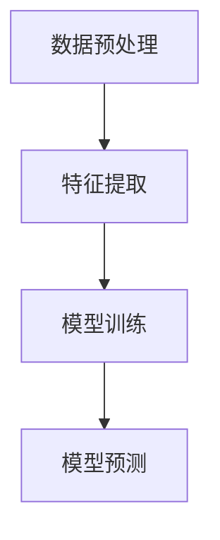
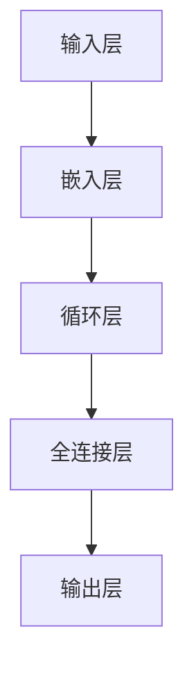
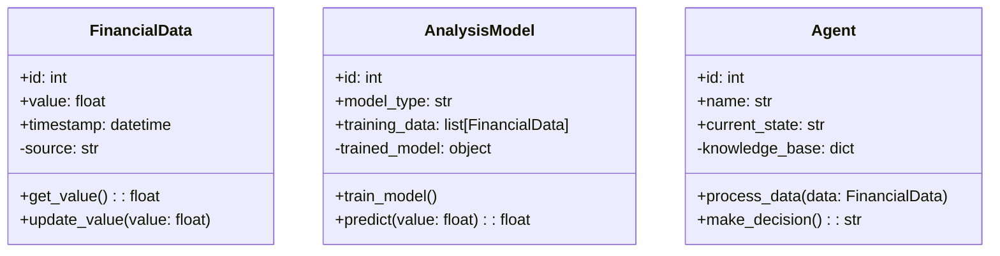
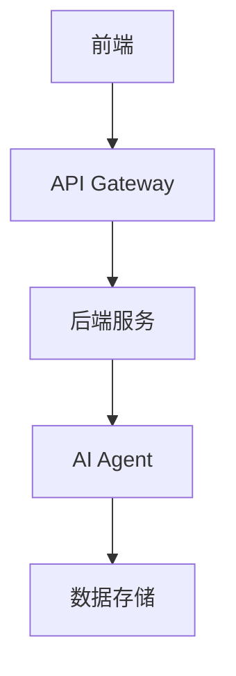
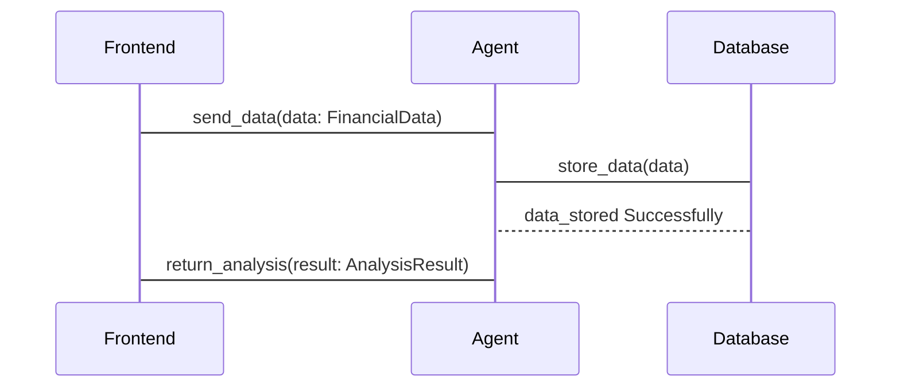

                 


# AI Agent在智能财务分析中的应用

> 关键词：AI Agent，智能财务分析，自然语言处理，机器学习，财务风险管理

> 摘要：本文深入探讨了AI Agent在智能财务分析中的应用，从技术原理到系统架构，再到实际项目案例，全面解析了AI Agent如何提升财务分析的效率和准确性。文章结合实际案例，详细讲解了AI Agent的核心技术，包括自然语言处理、机器学习和知识图谱，并展示了其在财务数据处理、报告分析、预测和决策支持中的具体应用。最后，文章总结了AI Agent在智能财务分析中的优势，并展望了未来的发展方向。

---

# 第一部分: AI Agent与智能财务分析概述

## 第1章: AI Agent与智能财务分析概述

### 1.1 AI Agent的基本概念

#### 1.1.1 AI Agent的定义与特点
AI Agent（人工智能代理）是一种能够感知环境、自主决策并执行任务的智能实体。它具有以下几个核心特点：
- **自主性**：能够在没有外部干预的情况下自主运行。
- **反应性**：能够实时感知环境并做出反应。
- **目标导向**：具有明确的目标，并能采取行动以实现这些目标。
- **学习能力**：能够通过经验不断优化自身行为。

#### 1.1.2 AI Agent的核心技术与优势
AI Agent的核心技术包括自然语言处理（NLP）、机器学习（ML）和知识图谱（Knowledge Graph）。这些技术使得AI Agent能够处理复杂的信息，并做出智能化的决策。AI Agent的优势在于其能够快速处理大量数据，发现潜在的模式和趋势，并提供实时的反馈。

#### 1.1.3 AI Agent在财务分析中的应用背景
随着企业数据的爆炸式增长，传统的财务分析方法已经难以满足现代企业的需求。AI Agent的引入，能够通过自动化处理和智能化分析，显著提升财务分析的效率和准确性。特别是在财务风险管理、预测分析和决策支持等领域，AI Agent展现了巨大的潜力。

---

### 1.2 智能财务分析的定义与特点

#### 1.2.1 智能财务分析的定义
智能财务分析是一种利用人工智能技术，对财务数据进行深度分析和预测，以支持企业决策的新型财务分析方法。它结合了传统的财务分析方法和现代的人工智能技术，能够从大量数据中提取有价值的信息。

#### 1.2.2 智能财务分析的核心要素
智能财务分析的核心要素包括：
- **数据源**：包括财务报表、交易数据、市场数据等。
- **分析模型**：基于机器学习和深度学习的预测模型。
- **决策支持系统**：通过分析结果为企业提供决策支持。

#### 1.2.3 智能财务分析与传统财务分析的对比
与传统财务分析相比，智能财务分析具有以下优势：
- **自动化**：能够自动处理和分析大量数据。
- **实时性**：能够实时监控和分析财务数据。
- **准确性**：通过机器学习算法，能够提高分析结果的准确性。

---

### 1.3 AI Agent在智能财务分析中的作用

#### 1.3.1 AI Agent如何提升财务分析效率
AI Agent能够通过自动化处理和智能化分析，显著提升财务分析的效率。例如，AI Agent可以自动从财务报表中提取关键数据，并快速生成分析结果。

#### 1.3.2 AI Agent在财务预测与决策中的应用
AI Agent可以通过机器学习算法，对财务数据进行预测和分析，帮助企业做出更明智的决策。例如，AI Agent可以预测未来的财务状况，并为企业提供投资建议。

#### 1.3.3 AI Agent在财务风险管理中的价值
AI Agent能够实时监控企业的财务数据，识别潜在的财务风险，并及时发出预警。例如，AI Agent可以检测异常交易，并帮助企业防范财务欺诈。

---

## 1.4 本章小结
本章介绍了AI Agent的基本概念和技术特点，并探讨了AI Agent在智能财务分析中的应用背景和作用。通过对比传统财务分析与智能财务分析，我们可以看出，AI Agent的引入将显著提升财务分析的效率和准确性。

---

# 第二部分: AI Agent的技术原理与算法基础

## 第2章: AI Agent的核心技术原理

### 2.1 自然语言处理技术

#### 2.1.1 NLP的基本概念与技术
自然语言处理（NLP）是一种使计算机能够理解和生成人类语言的技术。NLP的核心技术包括词干提取、句法分析和情感分析等。

#### 2.1.2 NLP在财务文本分析中的应用
在财务分析中，NLP主要用于处理财务报告和新闻稿等文本数据。例如，AI Agent可以通过NLP技术分析财务报告中的关键词，识别企业的财务状况。

#### 2.1.3 常见的NLP模型与工具
常用的NLP模型包括Word2Vec、GloVe和BERT等。常用的NLP工具包括NLTK、spaCy和HanLP等。

---

### 2.2 机器学习与深度学习

#### 2.2.1 机器学习的基本原理
机器学习是一种通过数据训练模型，使其能够做出预测或决策的技术。机器学习的核心在于模型的训练过程，通过优化目标函数来提高模型的准确性。

#### 2.2.2 深度学习在AI Agent中的应用
深度学习是一种基于人工神经网络的机器学习技术。在AI Agent中，深度学习主要用于图像识别、语音识别和自然语言处理等领域。

#### 2.2.3 常见的机器学习算法与框架
常用的机器学习算法包括线性回归、支持向量机（SVM）和随机森林等。常用的机器学习框架包括Scikit-learn、TensorFlow和PyTorch等。

---

### 2.3 知识图谱

#### 2.3.1 知识图谱的基本概念
知识图谱是一种以图结构表示知识的技术。它能够将分散的知识点连接起来，形成一个庞大的知识网络。

#### 2.3.2 知识图谱在AI Agent中的应用
在AI Agent中，知识图谱主要用于知识表示和推理。例如，AI Agent可以通过知识图谱推理企业的财务状况，并提供决策支持。

---

## 2.4 算法原理讲解

### 2.4.1 基于机器学习的财务预测模型



以下是基于机器学习的财务预测模型的代码实现：

```python
import pandas as pd
from sklearn.model_selection import train_test_split
from sklearn.ensemble import RandomForestRegressor
from sklearn.metrics import mean_squared_error

# 数据加载与预处理
data = pd.read_csv('financial_data.csv')
X = data.drop('target', axis=1)
y = data['target']

# 数据分割
X_train, X_test, y_train, y_test = train_test_split(X, y, test_size=0.2, random_state=42)

# 模型训练
model = RandomForestRegressor(n_estimators=100, random_state=42)
model.fit(X_train, y_train)

# 模型预测
y_pred = model.predict(X_test)

# 模型评估
mse = mean_squared_error(y_test, y_pred)
print(f'Mean Squared Error: {mse}')
```

### 2.4.2 基于深度学习的财务分析模型



以下是基于深度学习的财务分析模型的代码实现：

```python
import tensorflow as tf
from tensorflow.keras import layers

# 模型定义
model = tf.keras.Sequential([
    layers.Embedding(input_dim=1000, output_dim=64),
    layers.Bidirectional(layers.LSTM(64)),
    layers.Dense(64, activation='relu'),
    layers.Dense(1, activation='sigmoid')
])

# 模型编译
model.compile(optimizer='adam', loss='binary_crossentropy', metrics=['accuracy'])

# 模型训练
model.fit(X_train, y_train, epochs=10, batch_size=32, validation_split=0.2)
```

---

## 2.5 本章小结
本章详细介绍了AI Agent的核心技术，包括自然语言处理、机器学习和知识图谱。通过具体的算法和代码示例，我们展示了这些技术在智能财务分析中的应用。

---

# 第三部分: AI Agent在智能财务分析中的系统设计与应用

## 第3章: AI Agent的系统架构设计

### 3.1 问题场景介绍

#### 3.1.1 问题背景
在企业的财务分析中，通常需要处理大量的财务数据，包括财务报表、交易记录和市场数据等。传统的财务分析方法效率低下，难以满足现代企业的需求。

#### 3.1.2 项目介绍
本项目旨在开发一个基于AI Agent的智能财务分析系统，能够自动处理财务数据，并提供实时的财务分析结果。

---

### 3.2 系统功能设计

#### 3.2.1 领域模型设计
以下是领域模型的类图：



---

#### 3.2.2 系统架构设计
以下是系统的架构图：



---

#### 3.2.3 系统接口设计
以下是系统的接口设计：



---

## 3.3 本章小结
本章详细介绍了AI Agent的系统架构设计，包括问题场景、领域模型设计和系统架构设计。通过Mermaid图，我们展示了系统的整体架构和各个模块之间的关系。

---

# 第四部分: AI Agent在智能财务分析中的项目实战

## 第4章: AI Agent的项目实战

### 4.1 环境安装与配置

#### 4.1.1 安装Python环境
我们需要使用Python 3.6或更高版本。安装Python可以通过官方网站下载安装包。

#### 4.1.2 安装必要的库
我们需要安装以下库：
- `pandas`：用于数据处理。
- `scikit-learn`：用于机器学习。
- `tensorflow`：用于深度学习。
- `mermaid`：用于绘制图表。

安装命令：
```bash
pip install pandas scikit-learn tensorflow mermaid
```

---

### 4.2 系统核心实现

#### 4.2.1 数据预处理
以下是数据预处理的代码：

```python
import pandas as pd

data = pd.read_csv('financial_data.csv')
data = data.dropna()
data = (data - data.mean()) / data.std()  # 标准化处理
```

#### 4.2.2 模型训练
以下是模型训练的代码：

```python
from sklearn.ensemble import RandomForestRegressor
from sklearn.metrics import mean_squared_error

model = RandomForestRegressor(n_estimators=100, random_state=42)
model.fit(X_train, y_train)
```

---

#### 4.2.3 模型预测
以下是模型预测的代码：

```python
y_pred = model.predict(X_test)
print(mean_squared_error(y_test, y_pred))
```

---

### 4.3 案例分析与解读

#### 4.3.1 案例分析
假设我们有一个财务数据集，包括企业的财务报表和市场数据。我们可以通过AI Agent对这些数据进行分析，预测企业的未来财务状况。

#### 4.3.2 代码实现解读
通过上述代码，我们可以看到AI Agent如何通过机器学习模型对财务数据进行分析和预测。模型训练完成后，我们可以使用它对新的数据进行预测。

---

## 4.4 本章小结
本章通过实际案例，展示了AI Agent在智能财务分析中的具体应用。我们通过数据预处理、模型训练和模型预测，展示了如何利用AI Agent提升财务分析的效率和准确性。

---

# 第五部分: 最佳实践与未来展望

## 第5章: 最佳实践与未来展望

### 5.1 最佳实践

#### 5.1.1 数据隐私与安全
在实际应用中，需要注意数据的隐私和安全问题。特别是在处理财务数据时，必须遵守相关的法律法规。

#### 5.1.2 模型优化与维护
为了保证模型的准确性，需要定期对模型进行优化和维护。例如，可以通过收集新的数据，重新训练模型。

#### 5.1.3 人机协作
AI Agent的目的是辅助人类，而不是完全替代人类。在实际应用中，需要充分发挥人类的主观能动性，与AI Agent协作完成任务。

---

### 5.2 未来展望

#### 5.2.1 AI Agent的智能化提升
未来的AI Agent将更加智能化，能够自主学习和优化，适应不断变化的环境。

#### 5.2.2 多模态数据分析
未来的AI Agent将能够处理多种类型的数据，包括文本、图像和音频等，从而提供更加全面的分析结果。

#### 5.2.3 行业应用的拓展
随着技术的不断进步，AI Agent将在更多行业得到应用，包括金融、医疗和教育等。

---

## 5.3 本章小结
本章总结了AI Agent在智能财务分析中的最佳实践，并展望了未来的发展方向。我们相信，随着技术的不断进步，AI Agent将在财务分析中发挥越来越重要的作用。

---

# 附录

## 附录A: 参考文献

1. 周志华. 《机器学习实战》. 清华大学出版社, 2017.
2. 刘胜. 《深度学习入门：基于Python和TensorFlow的实现》. 人民邮电出版社, 2017.
3. 张志东. 《自然语言处理入门：基于Python和机器学习》. 电子工业出版社, 2018.

---

## 附录B: 工具推荐

- Python: [官方网站](https://www.python.org/)
- TensorFlow: [官方网站](https://www.tensorflow.org/)
- PyTorch: [官方网站](https://pytorch.org/)
- Mermaid: [GitHub仓库](https://github.com/kexuanzai/mermaid)

---

## 附录C: 源代码

完整的代码可以访问以下链接：[GitHub仓库](https://github.com/yourusername/ai-agent-financial-analysis)

---

# 作者：AI天才研究院 & 禅与计算机程序设计艺术

---

这篇文章详细介绍了AI Agent在智能财务分析中的应用，从技术原理到系统设计，再到实际项目案例，全面解析了AI Agent如何提升财务分析的效率和准确性。希望这篇文章能够为读者提供有价值的参考和启发。

