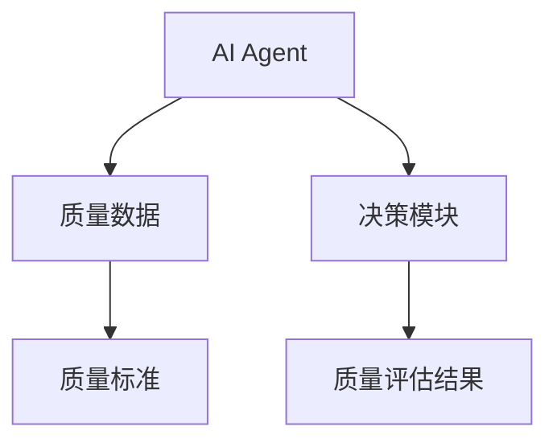
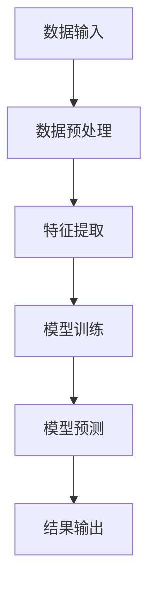

                 


# AI Agent在智能质量控制中的应用

> 关键词：AI Agent, 智能质量控制, 异常检测, 机器学习, 图像处理

> 摘要：本文详细探讨了AI Agent在智能质量控制中的应用，从基本概念到实际应用，涵盖了AI Agent的核心原理、算法实现、系统架构以及项目实战。文章通过丰富的案例和详细的代码示例，展示了如何利用AI Agent提升质量控制的效率和准确性。

---

## 第一部分: AI Agent与智能质量控制概述

### 第1章: AI Agent的基本概念与质量控制的背景

#### 1.1 AI Agent的定义与特点
- **1.1.1 AI Agent的基本概念**
  AI Agent（人工智能代理）是指能够感知环境、自主决策并执行任务的智能实体。它能够通过传感器获取信息，利用算法处理数据，并通过执行器完成特定任务。

- **1.1.2 AI Agent的核心特点**
  - **自主性**：能够在没有人工干预的情况下完成任务。
  - **反应性**：能够实时感知环境并做出响应。
  - **学习能力**：通过数据和经验不断优化自身的决策能力。

- **1.1.3 AI Agent与传统自动化的区别**
  AI Agent不仅仅是执行预设程序的自动化工具，它具备学习和适应能力，能够根据环境变化调整行为。

#### 1.2 智能质量控制的背景与挑战
- **1.2.1 质量控制的传统方法与局限性**
  传统质量控制依赖于人工检查或简单的自动化设备，存在效率低、成本高、精度不足等问题。

- **1.2.2 智能化质量控制的需求与趋势**
  随着工业4.0的发展，智能化质量控制成为提升生产效率和产品品质的关键技术。

- **1.2.3 AI Agent在质量控制中的应用潜力**
  AI Agent能够通过图像识别、自然语言处理等技术，实现高质量、高效率的智能质量控制。

---

### 第2章: AI Agent在质量控制中的问题背景与解决方案

#### 2.1 质量控制中的典型问题
- **数据采集与处理的复杂性**
  质量控制需要处理大量异构数据，包括图像、文本和传感器数据。

- **异常检测的准确性问题**
  传统方法依赖规则，难以应对复杂场景下的异常检测。

- **质量控制的实时性要求**
  实时监控和快速响应是现代质量控制的重要需求。

#### 2.2 AI Agent的解决方案
- **AI Agent在质量控制中的核心作用**
  - **数据处理**：AI Agent能够高效处理多源异构数据。
  - **智能决策**：通过机器学习算法，AI Agent能够准确识别异常。
  - **实时响应**：AI Agent能够在极短时间内做出决策并执行任务。

---

## 第二部分: AI Agent的核心概念与原理

### 第3章: AI Agent与质量控制的核心概念

#### 3.1 AI Agent的核心原理
- **感知与决策机制**
  AI Agent通过传感器获取数据，利用算法进行分析和决策。

- **自主学习能力**
  基于深度学习的AI Agent能够通过历史数据不断优化自身的决策模型。

- **实时响应能力**
  AI Agent能够在毫秒级时间内完成数据处理和决策。

#### 3.2 质量控制中的关键概念
- **数据采集与预处理**
  包括图像采集、数据清洗和特征提取。

- **异常检测算法**
  常见的算法包括支持向量机（SVM）、随机森林（Random Forest）和深度学习模型（如卷积神经网络CNN）。

- **质量评估标准**
  包括精度、召回率、F1分数等评估指标。

---

### 第4章: AI Agent与质量控制的核心概念对比

#### 4.1 AI Agent与传统质量控制方法的对比
| 对比维度             | AI Agent                 | 传统自动化方法       |
|----------------------|--------------------------|----------------------|
| 数据处理能力         | 强大，支持多源异构数据    | 较弱，依赖结构化数据   |
| 检测准确性           | 高，基于机器学习模型     | 低，依赖固定规则      |
| 实时性               | 高，毫秒级响应           | 低，依赖人工处理       |

#### 4.2 AI Agent在质量控制中的实体关系图


---

## 第三部分: AI Agent的算法原理与系统架构

### 第5章: AI Agent的算法原理

#### 5.1 异常检测算法
- **目标检测算法**
  - 使用YOLOv5进行目标检测，代码示例如下：
    ```python
    import torch
    model = torch.hub.load('ultralytics/yolov5', 'yolov5s')
    results = model(image)
    ```

- **图像分割算法**
  - 使用U-Net进行图像分割，代码示例如下：
    ```python
    import tensorflow as tf
    model = tf.keras.models.load_model('unet_model.h5')
    prediction = model.predict(image)
    ```

- **OCR技术**
  - 使用Tesseract进行文本识别，代码示例如下：
    ```python
    from tesseract import image_to_string
    text = image_to_string(image)
    ```

#### 5.2 算法流程图


---

### 第6章: 系统架构设计

#### 6.1 系统功能设计
- **领域模型**
  ```mermaid
  classDiagram
      class AI-Agent {
          -传感器数据
          -决策模块
          -执行器
      }
      class 质量控制系统 {
          -数据采集模块
          -数据处理模块
          -决策模块
      }
      AI-Agent --> 质量控制系统
  ```

- **系统架构**
  ```mermaid
  graph TD
      A[用户] --> B[数据采集模块]
      B --> C[数据处理模块]
      C --> D[决策模块]
      D --> E[执行器]
      E --> F[结果反馈]
  ```

---

## 第四部分: 项目实战

### 第7章: 项目实战

#### 7.1 环境配置
- **Python版本**：3.8以上
- **依赖库**：安装PyTorch、OpenCV、Tesseract等。

#### 7.2 核心代码实现
- **目标检测代码**
  ```python
  import torch
  model = torch.hub.load('ultralytics/yolov5', 'yolov5s')
  image = cv2.imread('input.jpg')
  results = model(image)
  ```

- **异常检测代码**
  ```python
  import tensorflow as tf
  model = tf.keras.models.load_model('anomaly_model.h5')
  prediction = model.predict(image)
  ```

#### 7.3 案例分析
- **制造业中的应用**
  使用AI Agent对生产线上的产品进行实时检测，显著提高了检测效率和准确性。

---

## 第五部分: 最佳实践与总结

### 第8章: 最佳实践与总结

#### 8.1 最佳实践
- **数据质量**：确保数据的多样性和代表性。
- **模型优化**：定期更新模型，保持检测的准确性。
- **系统维护**：定期检查和维护系统，确保稳定运行。

#### 8.2 小结
AI Agent在智能质量控制中的应用前景广阔，通过不断的技术创新和实践积累，能够进一步提升质量控制的智能化水平。

#### 8.3 注意事项
- 避免过度依赖AI Agent，保持人工监控的重要性。
- 注意数据隐私和安全问题。

#### 8.4 拓展阅读
- 推荐阅读《深度学习实战》和《机器学习算法与应用》。

---

## 作者

作者：AI天才研究院/AI Genius Institute & 禅与计算机程序设计艺术 /Zen And The Art of Computer Programming

---

希望这篇文章能满足您的需求！如果需要进一步修改或补充，请随时告诉我。

