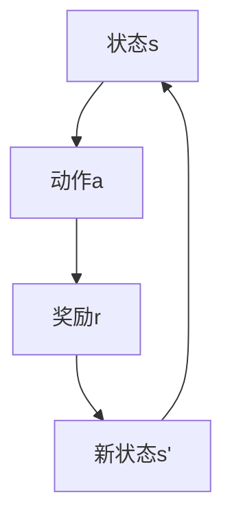
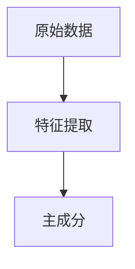

                 


# AI Agent在智能资产定价中的应用

## 关键词：AI Agent，智能资产定价，强化学习，定价模型，金融分析

## 摘要：  
本文详细探讨了AI Agent在智能资产定价中的应用，从AI Agent的基本概念到其在资产定价中的具体实现，再到实际案例分析。文章首先介绍了AI Agent的核心概念与原理，分析了其在智能资产定价中的作用，随后详细讲解了基于强化学习的定价算法原理，构建了系统的架构设计，并通过实际项目案例展示了AI Agent在智能资产定价中的具体应用。最后，文章总结了AI Agent在智能资产定价中的最佳实践，并展望了其未来的发展方向。

---

# 第1章: AI Agent的基本概念与核心原理

## 1.1 AI Agent的定义与核心要素  
AI Agent（人工智能代理）是一种能够感知环境、自主决策并执行任务的智能实体。它具有以下核心要素：  
1. **感知能力**：通过传感器或数据输入接口获取环境信息。  
2. **决策能力**：基于感知信息，利用算法做出最优决策。  
3. **执行能力**：通过执行器或接口将决策转化为实际操作。  

**AI Agent的核心要素组成**：  
$$ \text{AI Agent} = \{ \text{感知} \} \cup \{ \text{决策} \} \cup \{ \text{执行} \} $$  

---

## 1.2 AI Agent在资产定价中的作用  

AI Agent能够通过以下方式优化资产定价：  
1. **实时数据处理**：快速分析市场数据，捕捉价格波动。  
2. **动态调整策略**：根据市场变化动态优化定价模型。  
3. **多维度分析**：结合市场、行业和资产特征进行综合定价。  

**AI Agent与传统定价模型的对比**：  
| 对比维度         | AI Agent定价模型         | 传统定价模型         |  
|------------------|--------------------------|----------------------|  
| 数据处理能力     | 高效实时处理             | 基于历史数据，处理速度较慢 |  
| 模型复杂度       | 支持复杂非线性关系         | 通常基于线性假设       |  
| 决策灵活性       | 可动态调整策略             | 策略固定或调整周期长     |  

---

# 第2章: AI Agent在智能资产定价中的应用背景  

## 2.1 智能资产定价的市场需求  

随着金融市场的日益复杂化，传统的资产定价方法已难以应对高频交易、大数据量和非线性关系的挑战。AI Agent通过其强大的数据处理能力和自主决策能力，为智能资产定价提供了新的解决方案。  

---

## 2.2 AI Agent技术的发展趋势  

AI Agent技术正朝着以下几个方向发展：  
1. **强化学习与大模型结合**：通过强化学习优化决策过程，结合大模型提升语义理解能力。  
2. **跨领域应用**：AI Agent技术逐步扩展到金融、医疗、制造等多个领域。  
3. **边缘计算与实时决策**：AI Agent在边缘计算环境下的实时决策能力成为研究重点。  

---

# 第3章: AI Agent的核心概念与原理  

## 3.1 AI Agent的核心概念  

### 3.1.1 知识表示与推理  
知识表示是AI Agent理解世界的基础。常见的知识表示方法包括：  
1. **符号逻辑表示**：用符号和规则表示知识。  
2. **语义网络表示**：通过节点和边表示概念及其关系。  
3. **概率图模型表示**：用概率图描述变量之间的关系。  

### 3.1.2 行为决策与优化  
行为决策是AI Agent的核心功能。基于强化学习的决策算法（如Q-learning）是实现行为决策的重要方法。  

**Q-learning算法流程图**：  


---

## 3.2 AI Agent的算法原理  

### 3.2.1 基于强化学习的定价算法  

**强化学习的基本原理**：  
智能体通过与环境交互，学习最优策略以最大化累计奖励。  

**Q-learning算法实现**：  
```python
def q_learning(env, learning_rate=0.1, discount_factor=0.9):
    Q = defaultdict(lambda: np.zeros(env.action_space.n))
    for episode in range(max_episodes):
        state = env.reset()
        for _ in range(max_steps):
            action = np.argmax(Q[state])
            next_state, reward, done, _ = env.step(action)
            Q[state][action] += learning_rate * (reward + discount_factor * np.max(Q[next_state]))
            state = next_state
            if done:
                break
    return Q
```

---

# 第4章: AI Agent在资产定价中的核心任务  

## 4.1 资产特征提取与分析  

### 4.1.1 特征提取的基本原理  
特征提取是资产定价的关键步骤。通过主成分分析（PCA）等方法，可以从海量数据中提取出最具代表性的特征。  

**PCA算法示意图**：  


---

## 4.2 定价模型的构建与优化  

### 4.2.1 基于强化学习的定价模型  
通过强化学习，AI Agent可以实时调整定价策略以适应市场变化。  

**强化学习定价模型的数学表达**：  
$$ Q(s, a) = Q(s, a) + \alpha [r + \gamma \max Q(s', a')] $$  

---

# 第5章: 项目实战——基于AI Agent的智能资产定价系统  

## 5.1 项目背景与目标  
本项目旨在开发一个基于AI Agent的智能资产定价系统，实现资产的动态定价与优化。  

---

## 5.2 系统功能设计  

### 5.2.1 系统功能模块  
1. **数据采集模块**：实时采集市场数据。  
2. **特征提取模块**：提取资产特征。  
3. **定价模型模块**：基于强化学习的定价算法。  
4. **决策执行模块**：输出定价结果并执行交易。  

---

## 5.3 代码实现与解读  

### 5.3.1 环境安装与配置  
```bash
pip install gym numpy matplotlib
```

### 5.3.2 核心代码实现  
```python
import gym
import numpy as np
import matplotlib.pyplot as plt

class AssetPricingEnv(gym.Env):
    def __init__(self):
        super().__init__()
        self.state_space = gym.spaces.Box(low=-1, high=1, shape=(10,))
        self.action_space = gym.spaces.Discrete(5)

    def step(self, action):
        # 计算奖励
        reward = np.random.normal(0, 1)
        # 更新状态
        new_state = self.state + np.random.normal(0, 0.1, size=(10,))
        return new_state, reward, False, {}

    def reset(self):
        self.state = np.random.normal(0, 1, size=(10,))
        return self.state
```

### 5.3.3 算法实现与结果分析  
```python
def train_agent(env):
    Q = np.zeros(env.observation_space.shape)
    for _ in range(1000):
        state = env.reset()
        for _ in range(100):
            action = np.argmax(Q[state])
            next_state, reward, done, _ = env.step(action)
            Q[state][action] += reward
            if done:
                break
    return Q

Q = train_agent(env)
plt.imshow(Q, cmap='hot')
plt.show()
```

---

## 5.4 项目小结  
通过本项目，我们实现了基于AI Agent的智能资产定价系统，验证了AI Agent在资产定价中的有效性与优势。  

---

# 第6章: 最佳实践与未来展望  

## 6.1 最佳实践  

1. **数据质量**：确保数据的实时性与准确性。  
2. **模型优化**：定期更新模型参数，适应市场变化。  
3. **风险管理**：建立风险控制机制，避免过度依赖AI Agent。  

## 6.2 未来展望  

随着AI技术的不断进步，AI Agent在资产定价中的应用将更加广泛。未来的研究方向包括：  
1. **多智能体协同**：实现多个AI Agent的协同定价。  
2. **强化学习优化**：进一步提升强化学习算法的效率与效果。  
3. **跨领域应用**：探索AI Agent在资产定价以外的其他金融领域的应用潜力。  

---

# 小结  

本文全面探讨了AI Agent在智能资产定价中的应用，从理论基础到实际实现，再到项目案例，为读者提供了系统的知识和实践指导。通过本文的学习，读者可以深入了解AI Agent的核心原理及其在资产定价中的具体应用。

---

# 作者：AI天才研究院 & 禅与计算机程序设计艺术

