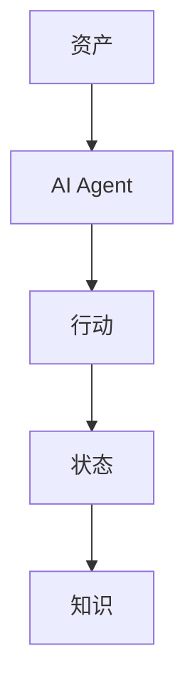
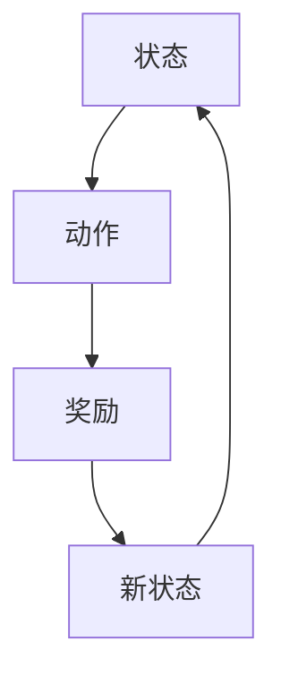
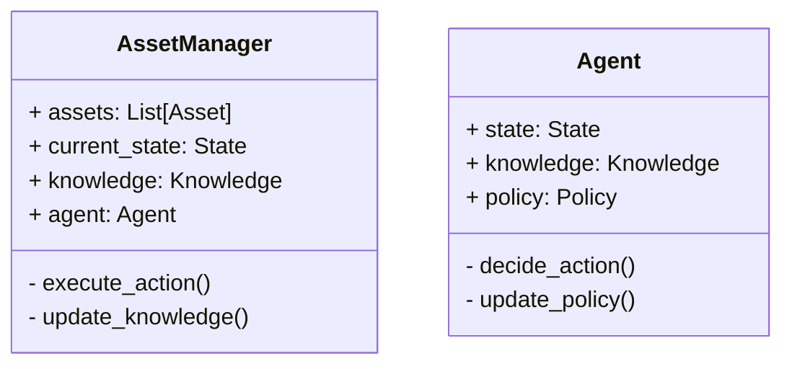
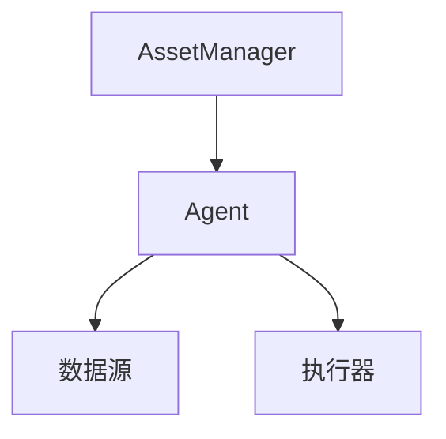
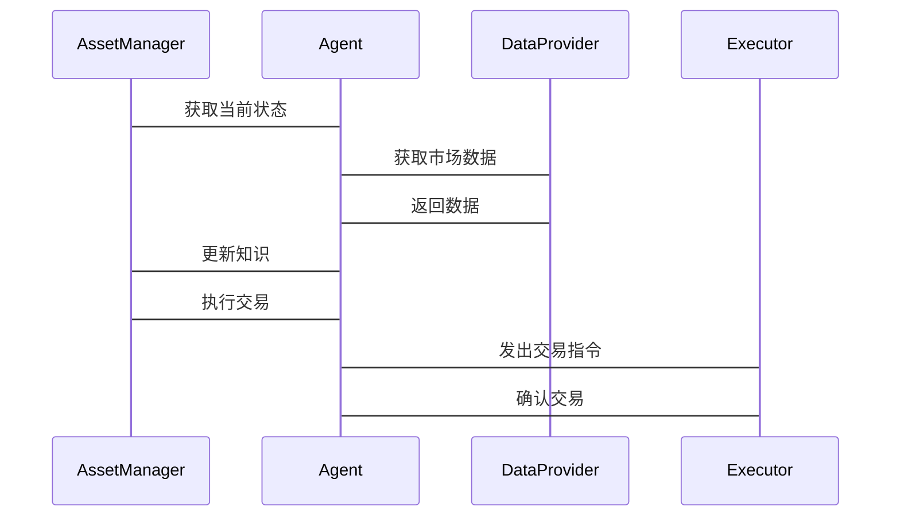

                 


# 《AI Agent在智能资产管理中的实践》

> 关键词：AI Agent，智能资产管理，强化学习，系统架构，项目实战

> 摘要：本文详细探讨了AI Agent在智能资产管理中的应用，从背景介绍到核心概念，再到算法原理、系统架构设计、项目实战以及最佳实践，为读者提供全面的指导。

---

# 第一部分：AI Agent与智能资产管理的背景介绍

## 第1章：AI Agent与智能资产管理概述

### 1.1 AI Agent的基本概念

#### 1.1.1 AI Agent的定义
AI Agent（人工智能代理）是一种能够感知环境并采取行动以实现目标的智能体。它通过传感器接收信息，利用计算模型进行决策，并通过执行器与环境交互。

#### 1.1.2 AI Agent的核心特征
- **自主性**：能够在没有外部干预的情况下独立运作。
- **反应性**：能够实时感知环境变化并做出反应。
- **学习能力**：通过经验改进性能。
- **决策能力**：基于当前状态和目标，选择最优行动。

#### 1.1.3 AI Agent与传统算法的区别
AI Agent不仅仅是执行预定义任务的程序，它具备自主决策和学习能力，能够适应动态变化的环境。

### 1.2 智能资产管理的背景

#### 1.2.1 资产管理的传统模式
传统资产管理依赖人工分析和经验判断，效率低且受主观因素影响大。

#### 1.2.2 智能化管理的需求
随着金融市场复杂化，投资者对实时决策、风险控制和收益优化的需求日益增长，传统模式已无法满足。

#### 1.2.3 AI Agent在资产管理中的应用前景
AI Agent能够实时处理大量数据，快速做出决策，帮助投资者优化资产配置，降低风险。

### 1.3 AI Agent与智能资产管理的结合

#### 1.3.1 AI Agent在资产管理中的角色
AI Agent作为智能资产管理的核心，负责数据处理、策略制定和实时交易执行。

#### 1.3.2 智能资产管理的核心问题
- **数据处理**：如何高效处理多源异构数据。
- **决策优化**：如何制定最优投资策略。
- **风险控制**：如何在动态市场中规避风险。

#### 1.3.3 AI Agent的解决方案
通过强化学习算法，AI Agent能够在复杂环境中找到最优路径，帮助实现资产的高效管理和风险控制。

## 1.4 本章小结
本章介绍了AI Agent的基本概念、智能资产管理的背景及其结合的必要性，为后续章节奠定了基础。

---

# 第二部分：AI Agent的核心概念与原理

## 第2章：AI Agent的核心概念与联系

### 2.1 AI Agent的核心概念

#### 2.1.1 知识表示
知识表示是AI Agent理解环境的基础，通常通过符号逻辑、概率模型或神经网络实现。

#### 2.1.2 行为决策
行为决策是基于当前状态和目标，选择最优行动的过程，涉及策略制定和执行。

#### 2.1.3 状态感知
状态感知是AI Agent通过传感器或数据源获取环境信息，形成对当前状态的理解。

### 2.2 核心概念的属性特征对比

| 概念       | 属性特征               |
|------------|------------------------|
| 知识表示    | 抽象性、结构化          |
| 行为决策    | 实时性、策略性          |
| 状态感知    | 实时性、多样性          |

### 2.3 ER实体关系图架构


## 2.4 本章小结
本章通过知识表示、行为决策和状态感知三个核心概念，构建了AI Agent的理论框架，并通过ER图展示了概念之间的关系。

---

# 第三部分：AI Agent的算法原理

## 第3章：AI Agent的算法原理

### 3.1 强化学习算法

#### 3.1.1 Q-learning算法
Q-learning是一种基于价值的强化学习算法，通过学习状态-动作价值函数来优化决策。

#### 3.1.2 Deep Q-Networks (DQN)算法
DQN通过深度神经网络近似Q值函数，解决了高维状态空间的问题。

#### 3.1.3 算法流程图


### 3.2 数学模型与公式

#### Q-learning算法
状态-动作价值函数更新公式：
$$ Q(s, a) = Q(s, a) + \alpha (r + \gamma \max Q(s', a') - Q(s, a)) $$

#### DQN算法
经验回放机制：
$$ (s, a, r, s') \in \text{经验回放池} $$

### 3.3 本章小结
本章详细讲解了强化学习算法的原理和实现，为AI Agent在智能资产管理中的应用提供了算法基础。

---

# 第四部分：AI Agent的系统架构设计

## 第4章：智能资产管理系统的架构设计

### 4.1 问题场景介绍
智能资产管理系统需要实时处理金融市场数据，制定投资策略，并执行交易。

### 4.2 系统功能设计

#### 4.2.1 领域模型类图


#### 4.2.2 系统架构图


### 4.3 接口设计与交互序列图

#### 4.3.1 接口设计
- 数据接口：提供实时市场数据。
- 执行接口：接收交易指令并执行交易。

#### 4.3.2 交互序列图


## 4.4 本章小结
本章通过系统架构设计，明确了智能资产管理系统的组成部分及其交互方式，为后续实现奠定了基础。

---

# 第五部分：AI Agent的项目实战

## 第5章：AI Agent在智能资产管理中的实战

### 5.1 环境安装与配置

#### 5.1.1 安装依赖
- Python 3.8+
- TensorFlow 2.0+
- Gym库

#### 5.1.2 安装命令
```bash
pip install numpy gym tensorflow
```

### 5.2 核心代码实现

#### 5.2.1 环境类实现
```python
import gym
import numpy as np

class TradingEnvironment(gym.Env):
    def __init__(self, data):
        self.data = data
        self.current_step = 0
        self.action_space = gym.spaces.Discrete(3)  # 0: 卖，1: 持有，2: 买
        self.observation_space = gym.spaces.Box(low=0, high=1, shape=(4,))
    
    def reset(self):
        self.current_step = 0
        return self._get_state()
    
    def _get_state(self):
        state = self.data[self.current_step]
        return state
    
    def step(self, action):
        reward = 0
        next_step = self.current_step + 1
        if next_step >= len(self.data):
            done = True
        else:
            done = False
            next_state = self.data[next_step]
            if action == 0:  # 卖
                reward = - (next_state['close'] - self.data[self.current_step]['close'])
            elif action == 1:  # 持有
                reward = (next_state['close'] - self.data[self.current_step]['close'])
            elif action == 2:  # 买
                reward = (next_state['close'] - self.data[self.current_step]['close'])
        self.current_step = next_step
        return self._get_state(), reward, done, {}
```

#### 5.2.2 AI Agent实现
```python
import numpy as np
import gym
from tensorflow.keras import layers

class AI_Agent:
    def __init__(self, state_space, action_space):
        self.state_space = state_space
        self.action_space = action_space
        self.model = self._build_model()
    
    def _build_model(self):
        model = tf.keras.Sequential()
        model.add(layers.Dense(32, activation='relu', input_dim=4))
        model.add(layers.Dense(16, activation='relu'))
        model.add(layers.Dense(self.action_space, activation='linear'))
        model.compile(optimizer='adam', loss='mse')
        return model
    
    def get_action(self, state):
        state = np.array([state])
        prediction = self.model.predict(state)
        action = np.argmax(prediction[0])
        return action
    
    def train(self, state, action, reward, next_state):
        state = np.array([state])
        next_state = np.array([next_state])
        target = self.model.predict(state)
        target[0][action] = reward + 0.95 * np.max(self.model.predict(next_state))
        self.model.fit(state, target, epochs=1, verbose=0)
```

### 5.3 实际案例分析与解读

#### 5.3.1 数据准备
```python
import pandas as pd

data = pd.read_csv('stock_data.csv')
```

#### 5.3.2 训练过程
```python
env = TradingEnvironment(data)
agent = AI_Agent(env.observation_space.shape, env.action_space.n)

for episode in range(100):
    state = env.reset()
    total_reward = 0
    while True:
        action = agent.get_action(state)
        next_state, reward, done, _ = env.step(action)
        agent.train(state, action, reward, next_state)
        total_reward += reward
        state = next_state
        if done:
            break
    print(f'Episode {episode}, Total Reward: {total_reward}')
```

### 5.4 本章小结
本章通过实际案例展示了AI Agent在智能资产管理中的应用，从环境配置到代码实现，详细解读了训练过程和结果。

---

# 第六部分：AI Agent的优化与扩展

## 第6章：AI Agent的优化与扩展

### 6.1 系统优化

#### 6.1.1 性能优化
- 使用GPU加速训练
- 增加模型层数和节点数

#### 6.1.2 模型优化
- 引入经验回放机制
- 使用更深的网络结构

### 6.2 功能扩展

#### 6.2.1 多资产配置
扩展系统以处理多资产类别，优化投资组合。

#### 6.2.2 风险控制
引入风险管理模块，实时监控和调整投资策略。

### 6.3 本章小结
本章探讨了AI Agent在智能资产管理中的优化方法和扩展方向，为实际应用提供了进一步的指导。

---

# 第七部分：总结与展望

## 第7章：总结与展望

### 7.1 本书总结
本书系统介绍了AI Agent在智能资产管理中的应用，从理论基础到实际实现，为读者提供了全面的知识体系。

### 7.2 未来展望
随着技术进步，AI Agent在智能资产管理中的应用将更加广泛，涉及更多领域和复杂场景。

### 7.3 最佳实践Tips
- 定期更新模型，适应市场变化。
- 结合人工分析，优化投资策略。
- 注重风险管理，确保系统稳定。

## 7.4 本章小结
本章总结了全书内容，并展望了未来的发展方向，为读者提供了进一步的学习和实践方向。

---

# 作者：AI天才研究院 & 禅与计算机程序设计艺术

---

这篇文章详细介绍了AI Agent在智能资产管理中的实践，从理论到实现，为读者提供了全面的指导。通过系统的章节安排和丰富的代码示例，帮助读者理解并应用AI Agent技术。

