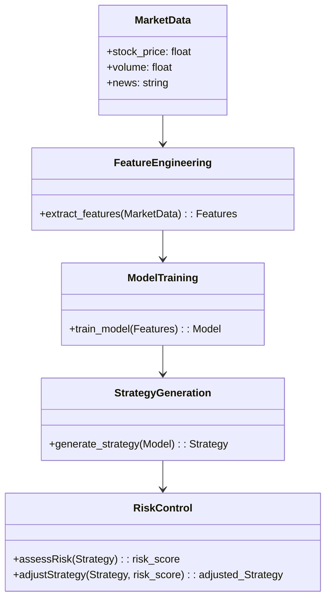
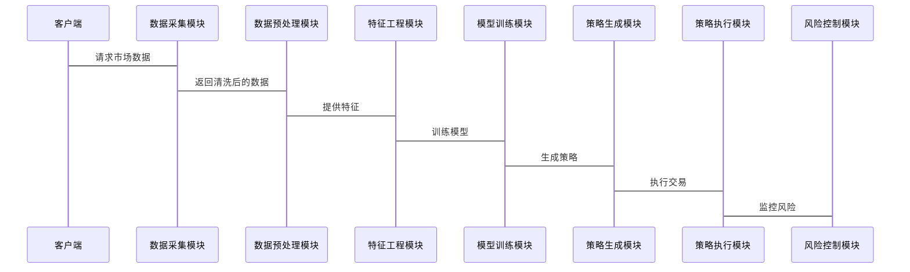

                 


# AI Agent在智能资产管理中的应用

## 关键词
AI Agent, 智能资产管理, 强化学习, 投资决策, 资产配置

## 摘要
随着人工智能技术的快速发展，AI Agent在智能资产管理中的应用日益广泛。本文从AI Agent的基本概念出发，详细探讨其在智能资产管理中的核心原理、算法实现以及系统架构设计。通过实际案例分析，展示AI Agent如何优化投资决策、提升资产配置效率，并提供最佳实践和注意事项，帮助读者深入了解其在智能资产管理中的潜力和应用前景。

---

# 第一部分: AI Agent与智能资产管理概述

## 第1章: AI Agent与智能资产管理概述

### 1.1 AI Agent的基本概念

#### 1.1.1 AI Agent的定义与特点
AI Agent（人工智能代理）是一种能够感知环境、自主决策并执行任务的智能实体。其特点包括：
- **自主性**：能够在没有外部干预的情况下独立运作。
- **反应性**：能够根据环境变化实时调整行为。
- **目标导向**：通过优化目标函数实现特定目标。
- **学习能力**：通过数据和经验不断优化自身的决策能力。

#### 1.1.2 智能资产管理的背景与现状
智能资产管理是利用人工智能技术优化资产配置和投资决策的过程。随着金融市场的复杂化和数据的爆炸式增长，传统的人工投资管理方式逐渐暴露出效率低下、决策滞后等问题。AI Agent通过处理海量数据、分析市场趋势，为投资者提供更加精准和及时的决策支持。

#### 1.1.3 AI Agent在智能资产管理中的作用
AI Agent在智能资产管理中的作用主要体现在以下几个方面：
1. **数据处理与分析**：通过机器学习算法对市场数据进行特征提取和预测。
2. **投资决策优化**：基于历史数据和市场动态，生成最优的投资策略。
3. **风险控制**：实时监控市场波动，调整投资组合以降低风险。

### 1.2 AI Agent与传统投资管理的对比

#### 1.2.1 传统投资管理的局限性
传统的投资管理方式依赖于人工分析和经验判断，存在以下局限性：
1. **效率低下**：人工分析数据耗时长，难以应对高频交易的需求。
2. **主观性强**：受个人经验和情绪影响，可能导致决策偏差。
3. **覆盖范围有限**：难以处理海量数据，难以捕捉全球市场机会。

#### 1.2.2 AI Agent的优势与创新
AI Agent通过自动化处理和分析海量数据，能够显著提升投资管理的效率和准确性。其优势包括：
1. **高速决策**：能够在毫秒级别完成数据处理和决策。
2. **数据驱动**：基于大量历史数据和实时信息，提供科学的投资建议。
3. **自适应性**：能够根据市场变化动态调整投资策略。

#### 1.2.3 AI Agent在智能资产管理中的应用前景
随着技术的进步，AI Agent在智能资产管理中的应用前景广阔。其在量化交易、风险控制、资产配置等方面的优势将推动金融行业向智能化、自动化方向发展。

### 1.3 智能资产管理的核心要素

#### 1.3.1 数据来源与处理
智能资产管理依赖于多源异构数据的处理，包括：
- **市场数据**：股票价格、指数、成交量等。
- **新闻数据**：财经新闻、公司公告等。
- **社交媒体数据**：投资者情绪分析。

#### 1.3.2 模型构建与优化
构建高性能的机器学习模型是智能资产管理的核心。常用模型包括：
- **强化学习模型**：用于动态决策和策略优化。
- **神经网络模型**：用于非线性特征提取和预测。
- **集成学习模型**：通过集成多个模型提升性能。

#### 1.3.3 策略执行与风险控制
策略执行是将模型生成的决策转化为实际操作的过程，而风险控制则是确保投资组合在市场波动中保持稳定。

---

# 第二部分: AI Agent的核心原理与算法

## 第2章: AI Agent的核心原理

### 2.1 AI Agent的决策机制

#### 2.1.1 状态空间与动作空间
- **状态空间**：描述市场和投资组合的状态，如当前资产价格、持有比例等。
- **动作空间**：AI Agent可执行的操作，如买入、卖出、持有等。

#### 2.1.2 价值函数与策略函数
- **价值函数**：评估某个状态下采取某种动作后的预期收益。
- **策略函数**：确定在某个状态下应采取的动作，以最大化长期收益。

#### 2.1.3 探索与利用的平衡
在强化学习中，AI Agent需要在探索新策略和利用已知策略之间找到平衡，以避免陷入局部最优。

### 2.2 AI Agent的学习机制

#### 2.2.1 监督学习与无监督学习
- **监督学习**：基于标记数据进行模型训练，如回归和分类任务。
- **无监督学习**：通过聚类分析发现数据中的隐含结构。

#### 2.2.2 强化学习与模仿学习
- **强化学习**：通过与环境交互获得奖励，优化策略。
- **模仿学习**：从人类专家的决策中学习，生成类似的策略。

#### 2.2.3 迁移学习与终身学习
- **迁移学习**：将已有的知识应用到新的任务中。
- **终身学习**：持续学习和适应新的环境变化。

### 2.3 AI Agent的推理与规划

#### 2.3.1 知识表示与推理
通过知识图谱和逻辑推理，AI Agent能够理解市场动态和投资逻辑。

#### 2.3.2 状态转移与路径规划
利用马尔可夫决策过程（MDP）进行状态转移和路径规划，生成最优投资路径。

#### 2.3.3 多目标优化与权衡
在多目标优化问题中，AI Agent需要在收益、风险、流动性之间找到最佳平衡点。

### 2.4 本章小结

---

## 第3章: AI Agent的核心算法

### 3.1 强化学习算法

#### 3.1.1 Q-Learning算法
Q-Learning是一种经典的强化学习算法，通过更新Q值表来学习最优策略。

$$ Q(s, a) = Q(s, a) + \alpha [r + \gamma \max Q(s', a') - Q(s, a)] $$

#### 3.1.2 Deep Q-Networks (DQN)算法
DQN通过深度神经网络近似Q值函数，能够处理高维状态空间。

#### 3.1.3 Policy Gradient方法
Policy Gradient方法直接优化策略，通过梯度上升最大化期望收益。

### 3.2 监督学习算法

#### 3.2.1 线性回归与逻辑回归
- **线性回归**：用于预测连续型目标变量。
- **逻辑回归**：用于分类任务，如判断股票上涨或下跌。

#### 3.2.2 支持向量机(SVM)
SVM适用于小样本和高维数据的分类与回归任务。

#### 3.2.3 神经网络与深度学习
深度学习模型如LSTM和Transformer在处理时间序列数据和文本数据方面表现优异。

### 3.3 模型解释性与可解释性算法

#### 3.3.1 SHAP值
SHAP（Shapley Additive exPlanations）用于解释模型的预测结果，揭示每个特征对决策的影响。

#### 3.3.2 LIME解释方法
LIME（Local Interpretable Model-agnostic Explanations）通过局部拟合线性模型，解释模型的预测结果。

#### 3.3.3 Attention机制
Attention机制能够突出模型关注的重要特征，增强解释性。

### 3.4 算法实现与优化

#### 3.4.1 算法实现的代码框架
```python
class AI-Agent:
    def __init__(self):
        # 初始化参数
    def perceive(self, state):
        # 感知环境状态
    def decide(self, state):
        # 根据状态做出决策
    def learn(self, state, action, reward):
        # 更新模型参数
```

#### 3.4.2 超参数优化与调参技巧
使用网格搜索（Grid Search）和随机搜索（Random Search）优化算法的超参数。

#### 3.4.3 并行计算与分布式训练
利用多线程和分布式计算框架（如Spark、TensorFlow分布式）提升训练效率。

### 3.5 本章小结

---

# 第三部分: 智能资产管理系统架构与实现

## 第4章: 智能资产管理系统架构

### 4.1 系统整体架构

#### 4.1.1 数据源模块
- **数据采集**：从多个数据源获取市场数据。
- **数据清洗**：处理缺失值和异常值。
- **数据转换**：将数据转换为适合模型输入的形式。

#### 4.1.2 数据预处理模块
- **特征工程**：提取有意义的特征，如动量、相对强弱指数（RSI）等。
- **数据增强**：通过数据变换提升模型的泛化能力。

#### 4.1.3 模型训练模块
- **模型选择**：根据任务需求选择合适的算法。
- **模型训练**：在训练数据上优化模型参数。
- **模型评估**：通过测试集评估模型的性能。

#### 4.1.4 策略生成与执行模块
- **策略生成**：根据模型预测生成投资策略。
- **策略执行**：将策略转化为实际的交易操作。

#### 4.1.5 风险控制模块
- **风险评估**：评估投资组合的风险。
- **风险对冲**：通过套期保值等方式降低风险。

### 4.2 系统功能设计

#### 4.2.1 领域模型


#### 4.2.2 系统架构设计


#### 4.2.3 接口设计与交互流程


### 4.3 项目实战

#### 4.3.1 环境安装与配置
安装必要的库：
```bash
pip install numpy pandas scikit-learn tensorflow keras matplotlib
```

#### 4.3.2 核心代码实现

##### 数据处理
```python
import pandas as pd
import numpy as np

# 数据加载
data = pd.read_csv('stock_data.csv')

# 特征工程
def extract_features(data):
    # 计算动量
    data['Momentum'] = data['Close'].pct_change()
    # 计算相对强弱指数
    data['RSI'] = ta.RSI(data['Close'], window=14)
    return data

features = extract_features(data)
```

##### 模型训练
```python
from tensorflow.keras.models import Sequential
from tensorflow.keras.layers import Dense, LSTM

# 模型定义
model = Sequential()
model.add(LSTM(64, input_shape=(None, 64)))
model.add(Dense(1))
model.compile(loss='mse', optimizer='adam')
```

##### 策略回测
```python
import backtrader as bt

# 回测策略
class MyStrategy(bt.Strategy):
    def __init__(self):
        self.model = load_model('my_model.h5')
        self.data = self.datas[0]

    def next(self):
        # 预测信号
        prediction = self.model.predict(...)
        if prediction > 0.5:
            self.buy()
        else:
            self.sell()

# 回测环境
cerebro = bt.Cerebro()
cerebro.addstrategy(MyStrategy)
cerebro.adddata(data)
cerebro.run()
```

#### 4.3.3 实际案例分析
以股票投资为例，通过模型预测股票价格走势，生成买入、卖出信号，并进行回测和风险评估。

### 4.4 最佳实践与注意事项

#### 4.4.1 经验总结
- **数据质量**：确保数据的准确性和完整性。
- **模型选择**：根据任务需求选择合适的算法。
- **风险控制**：始终将风险控制放在首位。

#### 4.4.2 注意事项
- **过拟合风险**：避免在训练数据上过度拟合，影响测试表现。
- **计算资源**：确保有足够的计算资源进行训练和推理。
- **法律法规**：遵守相关金融法规，避免不合规操作。

#### 4.4.3 未来趋势
- **多模态数据**：结合文本、图像等多种数据源进行分析。
- **自适应模型**：开发能够自适应市场变化的AI Agent。
- **伦理与责任**：关注AI在金融领域的伦理问题和责任归属。

### 4.5 本章小结

---

# 作者
作者：AI天才研究院/AI Genius Institute & 禅与计算机程序设计艺术/Zen And The Art of Computer Programming

---

通过以上内容，文章详细阐述了AI Agent在智能资产管理中的应用，从理论到实践，涵盖了核心概念、算法原理和系统架构设计，为读者提供了全面的知识体系和实用的代码示例。

