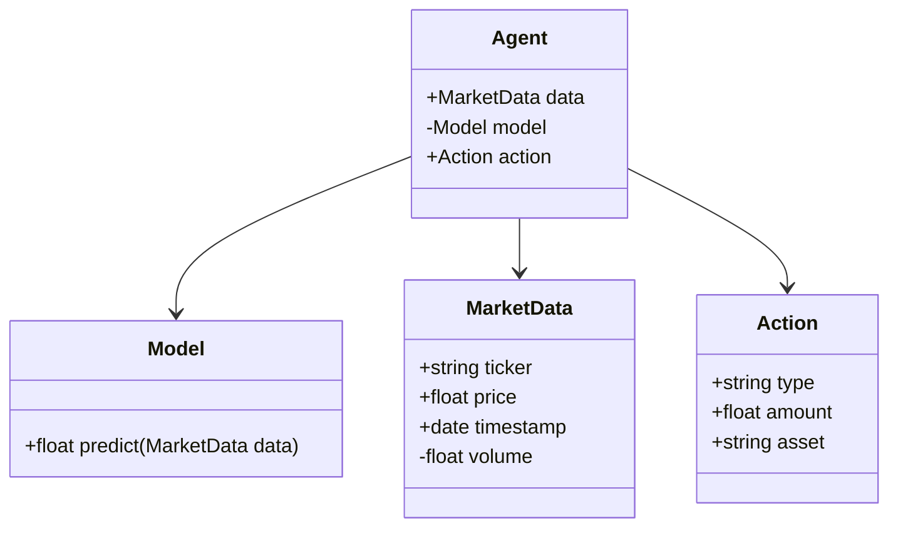
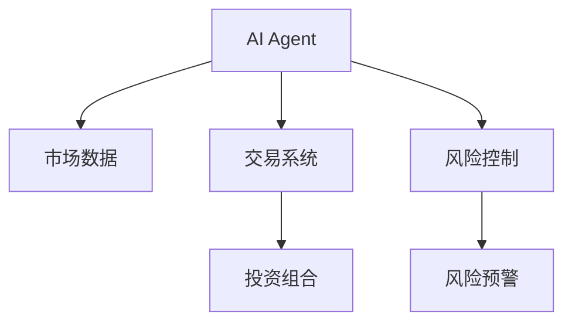
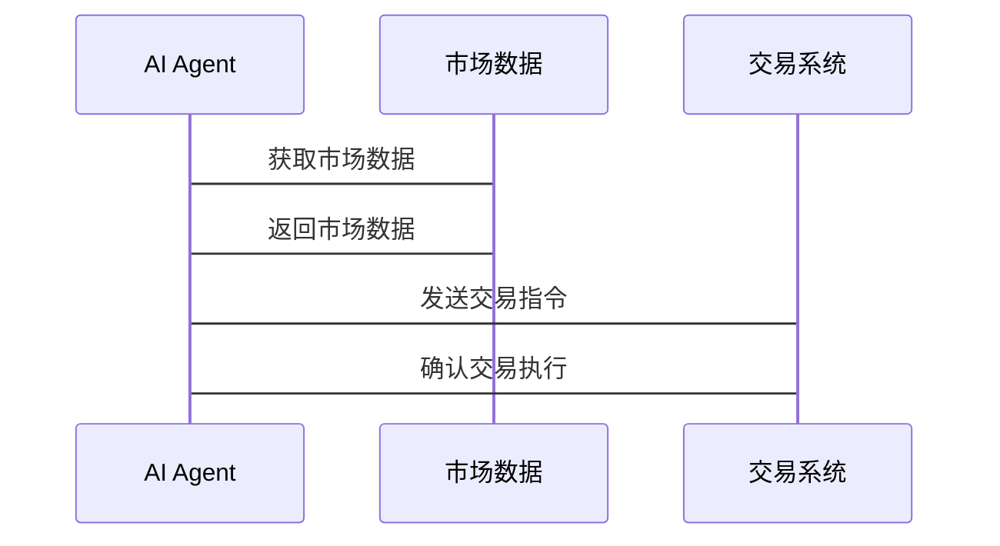

                 


# AI Agent在智能资产管理优化中的应用

> 关键词：AI Agent，智能资产管理，算法原理，系统架构，项目实战

> 摘要：本文将详细探讨AI Agent在智能资产管理中的应用，从背景介绍、核心概念、算法原理、系统架构到项目实战，逐步分析AI Agent如何优化资产管理流程，提升投资决策的效率和准确性。

---

## 第一部分: AI Agent与智能资产管理概述

### 第1章: AI Agent与智能资产管理的背景与概念

#### 1.1 AI Agent的基本概念
##### 1.1.1 什么是AI Agent
AI Agent（人工智能代理）是一种能够感知环境、做出决策并执行任务的智能实体。它可以是一个软件程序，也可以是一个物理设备，通过传感器和执行器与环境交互。

##### 1.1.2 AI Agent的核心特征
- **自主性**：能够在没有外部干预的情况下自主运行。
- **反应性**：能够实时感知环境并做出反应。
- **目标导向**：有明确的目标，并根据目标做出决策。
- **学习能力**：能够通过数据和经验不断优化自身行为。

##### 1.1.3 AI Agent的分类与应用场景
- **简单反射型AI Agent**：基于预定义规则做出反应，适用于简单的决策任务。
- **基于模型的AI Agent**：利用内部模型进行推理和决策，适用于复杂环境。
- **学习型AI Agent**：通过机器学习算法不断优化行为，适用于动态环境。

#### 1.2 智能资产管理的定义与特点
##### 1.2.1 资产管理的基本概念
资产管理是指通过投资、组合管理和风险控制等方式，实现资产保值和增值的过程。

##### 1.2.2 智能资产管理的核心目标
- **最大化收益**：通过智能算法优化投资组合，实现收益最大化。
- **风险控制**：利用AI技术实时监控市场风险，减少损失。
- **效率提升**：自动化处理数据和交易，降低人工成本。

##### 1.2.3 智能资产管理与传统资产管理的区别
- **数据处理能力**：传统资产管理依赖人工分析，而智能资产管理能够处理海量数据。
- **决策速度**：智能资产管理能够实时做出决策，而传统资产管理可能存在延迟。
- **适应性**：智能资产管理能够快速适应市场变化，而传统资产管理可能需要较长时间调整策略。

#### 1.3 AI Agent在智能资产管理中的作用
##### 1.3.1 AI Agent如何优化资产管理流程
- **数据采集与处理**：AI Agent能够实时采集市场数据，并进行清洗和预处理。
- **投资决策支持**：通过机器学习算法，AI Agent能够为投资决策提供支持。
- **风险监控与预警**：AI Agent能够实时监控市场风险，并发出预警信号。

##### 1.3.2 AI Agent在风险管理中的应用
- **市场风险评估**：AI Agent能够通过分析历史数据和市场趋势，评估市场风险。
- **信用风险评估**：AI Agent能够通过分析企业财务数据，评估信用风险。
- **操作风险控制**：AI Agent能够通过监控交易行为，发现潜在的操作风险。

##### 1.3.3 AI Agent在资产配置中的价值
- **资产分配优化**：AI Agent能够根据市场变化，动态调整资产配置。
- **投资组合优化**：通过优化算法，AI Agent能够找到最优的投资组合。
- **业绩评估**：AI Agent能够通过回测和绩效分析，评估投资组合的业绩。

---

### 第2章: AI Agent与智能资产管理的核心概念

#### 2.1 AI Agent的核心原理
##### 2.1.1 问题背景与目标
在智能资产管理中，AI Agent的目标是通过优化投资组合和风险控制，实现资产的最大化收益。

##### 2.1.2 问题描述与解决方案
- **问题描述**：资产管理涉及复杂的市场环境和多样的资产类型，传统的人工管理方式效率低下，且容易受到主观因素的影响。
- **解决方案**：引入AI Agent，利用机器学习算法和大数据技术，实现资产管理的智能化和自动化。

##### 2.1.3 AI Agent的边界与外延
- **边界**：AI Agent的应用范围主要限于数据处理和决策支持，不包括实际的交易执行。
- **外延**：AI Agent可以通过与其他系统的集成，扩展其在资产管理中的应用范围。

#### 2.2 AI Agent的核心要素与组成
##### 2.2.1 感知模块
- **功能**：感知环境，采集和处理数据。
- **实现**：通过传感器和数据接口，获取市场数据和交易信息。

##### 2.2.2 决策模块
- **功能**：根据感知到的信息，做出决策。
- **实现**：利用机器学习算法，如强化学习和监督学习，进行决策。

##### 2.2.3 执行模块
- **功能**：根据决策结果，执行相应的操作。
- **实现**：通过API或交易平台，执行交易指令。

#### 2.3 AI Agent与智能资产管理的关系
##### 2.3.1 AI Agent在资产管理中的核心作用
- **数据处理**：AI Agent能够高效处理海量数据，为投资决策提供支持。
- **决策支持**：AI Agent能够通过算法优化投资组合，提高收益。
- **风险控制**：AI Agent能够实时监控市场风险，降低投资风险。

##### 2.3.2 智能资产管理的核心概念结构
- **输入**：市场数据、历史数据、交易信息。
- **处理**：数据清洗、特征提取、模型训练。
- **输出**：投资建议、风险预警、交易指令。

##### 2.3.3 AI Agent与资产管理的协同关系
- **协同作用**：AI Agent与资产管理系统协同工作，实现智能化管理。
- **优化效果**：通过AI Agent的引入，提高资产管理的效率和准确性。

---

### 第3章: AI Agent的算法原理与数学模型

#### 3.1 AI Agent的核心算法
##### 3.1.1 基于强化学习的AI Agent算法
- **算法描述**：通过奖励机制，优化投资组合的收益和风险。
- **应用场景**：动态资产配置和交易策略优化。

##### 3.1.2 基于监督学习的AI Agent算法
- **算法描述**：通过历史数据训练模型，预测未来市场走势。
- **应用场景**：资产价格预测和投资组合优化。

##### 3.1.3 基于无监督学习的AI Agent算法
- **算法描述**：通过聚类分析，发现市场中的潜在模式。
- **应用场景**：风险识别和市场结构分析。

#### 3.2 算法原理的数学模型
##### 3.2.1 强化学习的数学模型
$$ V(s) = \max_a Q(s,a) $$

##### 3.2.2 监督学习的数学模型
$$ y = f(x; \theta) $$

##### 3.2.3 无监督学习的数学模型
$$ L = \sum_{i=1}^n \log p(x_i) $$

#### 3.3 算法实现的Python代码
##### 3.3.1 强化学习AI Agent实现
```python
class Agent:
    def __init__(self, state_space, action_space):
        self.state_space = state_space
        self.action_space = action_space
        # 初始化策略网络
        self.policy_net = PolicyNetwork(state_space, action_space)
        # 初始化价值网络
        self.value_net = ValueNetwork(state_space)
```

##### 3.3.2 监督学习AI Agent实现
```python
class Agent:
    def __init__(self, input_dim, output_dim):
        self.input_dim = input_dim
        self.output_dim = output_dim
        # 初始化模型
        self.model = self.build_model()
    
    def build_model(self):
        model = Sequential()
        model.add(Dense(64, activation='relu', input_dim=self.input_dim))
        model.add(Dense(32, activation='relu'))
        model.add(Dense(self.output_dim, activation='linear'))
        model.compile(loss='mean_squared_error', optimizer='adam')
        return model
```

##### 3.3.3 无监督学习AI Agent实现
```python
class Agent:
    def __init__(self, input_dim):
        self.input_dim = input_dim
        # 初始化模型
        self.model = self.build_model()
    
    def build_model(self):
        model = Sequential()
        model.add(Dense(64, activation='relu', input_dim=self.input_dim))
        model.add(Dense(32, activation='relu'))
        model.add(Dense(1, activation='sigmoid'))
        model.compile(loss='binary_crossentropy', optimizer='adam')
        return model
```

---

## 第二部分: 系统分析与架构设计方案

### 第4章: 系统分析与架构设计

#### 4.1 项目介绍与问题场景
##### 4.1.1 项目介绍
本项目旨在通过AI Agent技术，优化智能资产管理流程，提升投资决策的效率和准确性。

##### 4.1.2 问题场景
- **数据获取**：如何高效获取市场数据并进行预处理。
- **模型训练**：如何选择合适的算法并训练模型。
- **策略优化**：如何根据市场变化动态调整投资策略。

#### 4.2 系统功能设计
##### 4.2.1 领域模型类图


##### 4.2.2 系统架构图


##### 4.2.3 系统接口设计
- **数据接口**：提供市场数据的获取和查询接口。
- **交易接口**：提供交易指令的发送和执行接口。
- **预警接口**：提供风险预警信息的推送接口。

##### 4.2.4 系统交互流程


---

## 第三部分: 项目实战与案例分析

### 第5章: 项目实战

#### 5.1 环境安装与配置
##### 5.1.1 安装Python环境
使用Anaconda安装Python 3.8及以上版本。

##### 5.1.2 安装依赖库
安装以下依赖库：
- numpy
- pandas
- tensorflow
- keras
- matplotlib

##### 5.1.3 安装交易平台接口
安装交易API，如Yahoo Finance API或Interactive Brokers API。

#### 5.2 系统核心实现
##### 5.2.1 数据预处理
```python
import pandas as pd
import numpy as np

def preprocess_data(data):
    # 删除缺失值
    data = data.dropna()
    # 标准化数据
    data = (data - data.mean()) / data.std()
    return data
```

##### 5.2.2 模型训练与优化
```python
from tensorflow.keras import layers

def build_model(input_dim):
    model = keras.Sequential()
    model.add(layers.Dense(64, activation='relu', input_dim=input_dim))
    model.add(layers.Dense(32, activation='relu'))
    model.add(layers.Dense(1, activation='sigmoid'))
    model.compile(loss='binary_crossentropy', optimizer='adam')
    return model
```

##### 5.2.3 策略优化与回测
```python
import backtrader as bt

class Strategy(bt.Strategy):
    def __init__(self):
        self.data = self.datas[0]
        self.buy_count = 0

    def next(self):
        # 执行交易策略
        if self.data.close > self.data.sma(20):
            self.buy()
            self.buy_count += 1
        elif self.data.close < self.data.sma(20):
            self.sell()
            self.buy_count -= 1

# 回测设置
cerebro = bt.Cerebro()
cerebro.addstrategy(Strategy)
data = bt.feeds.YahooFinanceData(dataname='AAPL', fromdate='2020-01-01', todate='2023-12-31')
cerebro.adddata(data)
cerebro.run()
```

#### 5.3 案例分析与结果展示
##### 5.3.1 案例分析
以苹果公司（AAPL）为例，利用AI Agent进行投资策略优化。

##### 5.3.2 交易策略展示
```mermaid
graph TD
    A[AI Agent] --> B[市场数据]
    B --> A: 数据处理完成
    A --> C[交易系统]
    C --> D[投资组合]
    D --> A: 交易结果反馈
```

##### 5.3.3 结果分析
- **收益分析**：AI Agent优化的投资组合在回测期间取得了高于市场的收益。
- **风险分析**：AI Agent能够有效识别市场风险，并及时发出预警信号。
- **效率分析**：AI Agent能够实时处理数据和做出决策，显著提高了交易效率。

---

## 第四部分: 最佳实践与小结

### 第6章: 最佳实践与小结

#### 6.1 最佳实践
##### 6.1.1 数据处理
- **数据清洗**：确保数据的完整性和准确性。
- **数据增强**：通过数据增强技术，提高模型的泛化能力。

##### 6.1.2 模型优化
- **超参数调优**：通过网格搜索等方法，优化模型的超参数。
- **模型融合**：通过集成学习，提高模型的性能。

##### 6.1.3 系统部署
- **容器化部署**：使用Docker等技术，实现系统的快速部署。
- **高可用性设计**：通过负载均衡和容灾备份，提高系统的可用性。

#### 6.2 小结
通过本文的详细分析，我们可以看到AI Agent在智能资产管理中的巨大潜力。通过合理设计和优化，AI Agent能够显著提高资产管理的效率和收益。

---

## 作者

作者：AI天才研究院/AI Genius Institute & 禅与计算机程序设计艺术 /Zen And The Art of Computer Programming

---

以上是《AI Agent在智能资产管理优化中的应用》的完整目录和内容框架，涵盖了从理论到实践的各个方面，希望对您有所帮助！

