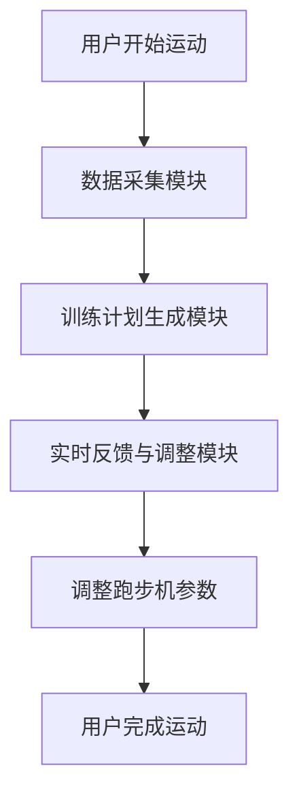
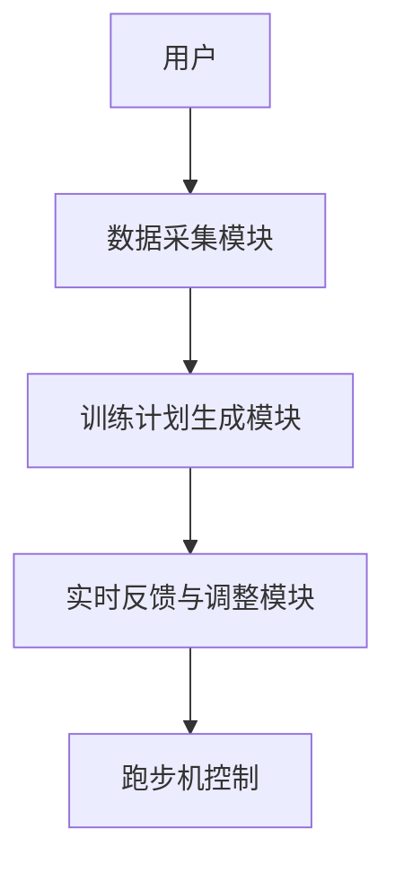

                 


# AI Agent在智能跑步机中的训练计划

## 关键词：AI Agent, 智能跑步机, 训练计划, 机器学习, 强化学习, 运动健身

## 摘要：本文深入探讨了AI Agent在智能跑步机中的应用，详细分析了AI Agent的核心原理、算法实现、系统架构以及在智能跑步机上的实际应用。通过结合强化学习和机器学习技术，本文提出了一个基于AI Agent的智能训练计划生成与优化系统，并通过实际案例展示了其在运动健身领域的巨大潜力。

---

# 第1章: AI Agent与智能跑步机概述

## 1.1 AI Agent的基本概念

### 1.1.1 AI Agent的定义
AI Agent（人工智能代理）是一种能够感知环境、自主决策并执行任务的智能实体。它通过与环境的交互，不断优化自身的行为以实现目标。

### 1.1.2 AI Agent的核心特征
- **自主性**：能够在没有外部干预的情况下自主运行。
- **反应性**：能够实时感知环境并做出反应。
- **目标导向**：所有行为都以实现特定目标为导向。
- **学习能力**：能够通过经验改进自身的表现。

### 1.1.3 AI Agent与传统算法的区别
| 特性         | AI Agent                     | 传统算法                   |
|--------------|------------------------------|-----------------------------|
| 行为模式     | 主动感知环境并采取行动       | 被动执行预设的步骤           |
| 决策方式     | 基于实时数据的动态决策       | 基于规则或固定逻辑的决策     |
| 适应能力     | 能够自适应环境变化           | 无法自适应，需人工调整         |
| 应用场景     | 适用于复杂、动态的环境       | 适用于简单、静态的任务         |

## 1.2 智能跑步机的基本概念

### 1.2.1 智能跑步机的功能特点
- **数据采集**：实时采集用户的运动数据，如心率、速度、步频等。
- **智能反馈**：根据用户的运动数据提供实时反馈，如调整跑步机速度或坡度。
- **个性化推荐**：基于用户数据推荐个性化的训练计划。
- **远程连接**：通过互联网与用户手机或其他设备连接，同步数据并提供远程指导。

### 1.2.2 智能跑步机的用户需求分析
用户的核心需求包括：
1. **个性化训练计划**：根据个人体质和目标定制训练方案。
2. **实时反馈与指导**：在运动过程中实时调整运动强度或姿势。
3. **健康数据分析**：提供详细的运动数据分析报告。
4. **远程支持**：通过手机或其他设备远程控制跑步机或获取指导。

### 1.2.3 智能跑步机的市场现状
随着人们对健康和运动的重视，智能跑步机市场快速增长。AI技术的引入进一步提升了智能跑步机的用户体验和功能。

## 1.3 AI Agent在智能跑步机中的应用背景

### 1.3.1 智能健身行业的发展趋势
智能健身行业正朝着个性化、智能化和数据化的方向发展。AI技术的引入使得健身设备能够更精准地满足用户需求。

### 1.3.2 AI技术在健身领域的应用潜力
AI Agent可以应用于运动计划制定、实时反馈与指导、健康数据分析等多个方面，为用户提供更智能、更个性化的健身服务。

### 1.3.3 本章小结
本章介绍了AI Agent和智能跑步机的基本概念，并分析了AI Agent在智能跑步机中的应用背景及其在智能健身行业中的潜力。

---

# 第2章: AI Agent的核心原理与技术

## 2.1 AI Agent的基本原理

### 2.1.1 AI Agent的感知机制
AI Agent通过传感器、摄像头等设备感知环境中的数据，如用户的运动数据、环境温度等。

### 2.1.2 AI Agent的决策机制
基于感知到的数据，AI Agent通过算法（如强化学习、机器学习）生成决策，如调整跑步机的速度或坡度。

### 2.1.3 AI Agent的执行机制
AI Agent根据决策结果执行具体动作，如控制跑步机的运动状态。

## 2.2 AI Agent的核心技术

### 2.2.1 机器学习算法
- **监督学习**：通过大量标注数据训练模型，使其能够预测新的数据。
- **无监督学习**：通过数据的内在结构发现隐藏模式。
- **强化学习**：通过与环境的交互，逐步优化行为策略。

### 2.2.2 自然语言处理技术
AI Agent能够理解用户的自然语言指令，并提供相应的反馈。

### 2.2.3 计算机视觉技术
通过摄像头捕捉用户的运动姿态，实时分析用户的运动情况。

## 2.3 AI Agent与智能跑步机的结合

### 2.3.1 数据采集与处理
AI Agent通过跑步机上的传感器采集用户的运动数据，并进行预处理和特征提取。

### 2.3.2 训练计划的生成与优化
基于用户的运动数据和目标，AI Agent生成个性化的训练计划，并通过强化学习不断优化计划。

### 2.3.3 实时反馈与调整机制
在用户运动过程中，AI Agent实时监测数据并动态调整跑步机的参数，以优化用户的运动体验。

## 2.4 本章小结
本章详细介绍了AI Agent的核心原理和关键技术，并分析了其在智能跑步机中的具体应用。

---

# 第3章: AI Agent的数学模型与算法

## 3.1 AI Agent的数学模型

### 3.1.1 状态空间模型
状态空间模型描述了AI Agent在不同状态下的行为。例如，在跑步机上，用户的运动状态可能包括速度、心率等参数。

### 3.1.2 动作空间模型
动作空间模型描述了AI Agent在每个状态下可以执行的动作，如调整速度、坡度等。

### 3.1.3 奖励函数模型
奖励函数用于衡量AI Agent行为的好坏。例如，当用户达到预期的运动目标时，AI Agent会获得正向奖励。

## 3.2 算法原理

### 3.2.1 Q-Learning算法
Q-Learning是一种经典的强化学习算法，通过更新Q值表来优化决策策略。其数学模型如下：

$$ Q(s, a) = Q(s, a) + \alpha (r + \gamma \max Q(s', a') - Q(s, a)) $$

其中：
- \( Q(s, a) \) 表示在状态 \( s \) 下执行动作 \( a \) 的价值。
- \( \alpha \) 是学习率。
- \( r \) 是奖励。
- \( \gamma \) 是折扣因子。
- \( s' \) 是下一个状态。

### 3.2.2 DQN算法
DQN（Deep Q-Network）算法结合了深度神经网络和Q-Learning，通过神经网络近似Q值函数。其训练过程如下：

1. 从环境获取状态 \( s \)。
2. 神经网络输出当前状态下的动作值 \( Q(s, a) \)。
3. 执行动作 \( a \)，并获得奖励 \( r \) 和下一个状态 \( s' \)。
4. 更新神经网络参数，以最小化预测值与实际值的差距。

### 3.2.3 强化学习的数学推导
强化学习的目标是最大化累积奖励，其数学形式可以表示为：

$$ \max_{\theta} \mathbb{E}[\sum_{t=0}^{\infty} \gamma^t r_t] $$

其中：
- \( \theta \) 是模型参数。
- \( \gamma \) 是折扣因子。

## 3.3 算法实现

### 3.3.1 算法流程图

```mermaid
graph LR
    A[开始] --> B[初始化参数]
    B --> C[接收状态s]
    C --> D[选择动作a]
    D --> E[执行动作a]
    E --> F[获取奖励r和状态s']
    F --> G[更新Q值或神经网络]
    G --> H[判断是否结束]
    H --> K[结束] {是}
    H --> I[继续]
    I --> C
```

### 3.3.2 算法代码实现
以下是一个简单的Q-Learning算法实现示例：

```python
import numpy as np

class QLearning:
    def __init__(self, state_space, action_space, gamma=0.9, epsilon=0.1, alpha=0.1):
        self.state_space = state_space
        self.action_space = action_space
        self.gamma = gamma
        self.epsilon = epsilon
        self.alpha = alpha
        self.q_table = np.zeros((state_space, action_space))
    
    def choose_action(self, state):
        if np.random.random() < self.epsilon:
            return np.random.randint(self.action_space)
        else:
            return np.argmax(self.q_table[state])
    
    def update_q_table(self, state, action, reward, next_state):
        q = self.q_table[state][action]
        max_next = np.max(self.q_table[next_state])
        self.q_table[state][action] = q + self.alpha * (reward + self.gamma * max_next)
```

### 3.3.3 算法优化策略
- **渐进式降低探索率**：随着训练的进行，逐渐降低随机选择动作的概率。
- **经验回放**：将经验存储在回放池中，随机采样以提高样本多样性。
- **目标网络**：使用目标网络来稳定训练过程。

## 3.4 本章小结
本章通过数学模型和算法推导，详细介绍了AI Agent的核心技术。通过Q-Learning和DQN算法的实现，展示了AI Agent在智能跑步机中的应用潜力。

---

# 第4章: 智能跑步机的系统架构与设计

## 4.1 系统架构概述

### 4.1.1 系统整体架构图


### 4.1.2 系统功能模块划分
- **数据采集模块**：采集用户的运动数据。
- **训练计划生成模块**：根据用户数据生成训练计划。
- **实时反馈与调整模块**：实时调整跑步机参数。

### 4.1.3 系统交互流程图



## 4.2 系统功能设计

### 4.2.1 用户信息采集模块
- **功能**：采集用户的基本信息（如年龄、体重、运动目标）和实时运动数据（如心率、速度）。
- **实现**：通过传感器和用户输入获取数据。

### 4.2.2 训练计划生成模块
- **功能**：根据用户信息生成个性化的训练计划。
- **实现**：基于强化学习算法，优化训练计划。

### 4.2.3 实时反馈与调整模块
- **功能**：实时调整跑步机参数，确保用户按照计划完成运动。
- **实现**：根据用户的实时数据动态调整速度、坡度等参数。

## 4.3 系统架构实现

### 4.3.1 系统架构图



### 4.3.2 模块交互流程图


### 4.3.3 系统接口设计
- **数据接口**：传感器数据接口和用户输入接口。
- **控制接口**：跑步机速度、坡度控制接口。

## 4.4 本章小结
本章详细介绍了智能跑步机的系统架构与设计，包括功能模块划分、系统架构图和交互流程图。

---

# 第5章: 项目实战——AI Agent训练计划的实现

## 5.1 项目环境搭建

### 5.1.1 开发工具安装
- **Python**：安装Python 3.8及以上版本。
- **深度学习框架**：安装TensorFlow或Keras。
- **可视化工具**：安装Graphviz和pydotplus。

### 5.1.2 开发环境配置
- **数据集**：准备用户的运动数据。
- **硬件设备**：连接跑步机的传感器。

## 5.2 系统核心实现源代码

### 5.2.1 数据采集模块

```python
import numpy as np

def collect_data(sensors):
    data = []
    for sensor in sensors:
        data.append(sensor.measure())
    return data
```

### 5.2.2 训练计划生成模块

```python
def generate_plan(user_info, data):
    plan = []
    for i in range(len(data)):
        action = choose_action(user_info, data[i])
        plan.append(action)
    return plan
```

### 5.2.3 实时反馈与调整模块

```python
def adjust_params(plan, data):
    for i in range(len(plan)):
        if data[i] < target:
            increase_speed()
        else:
            decrease_speed()
```

## 5.3 代码应用解读与分析
通过上述代码，AI Agent能够实时采集用户数据，生成训练计划，并根据实际运动情况动态调整跑步机参数，确保用户能够高效、安全地完成训练目标。

## 5.4 实际案例分析
假设用户目标是减脂，AI Agent会根据用户的运动数据动态调整跑步机的坡度和速度，确保用户的心率保持在减脂的最佳区间。

## 5.5 项目小结
本章通过实际案例展示了AI Agent在智能跑步机中的应用，详细讲解了项目的实现过程和代码实现。

---

# 第6章: 训练计划的优化与未来展望

## 6.1 训练计划的优化策略

### 6.1.1 参数优化
通过调整学习率、折扣因子等参数，进一步优化AI Agent的性能。

### 6.1.2 模型优化
引入更先进的强化学习算法（如PPO、A3C）进一步提升模型的性能。

### 6.1.3 用户反馈优化
根据用户的反馈进一步优化训练计划，提升用户体验。

## 6.2 未来展望
随着AI技术的不断发展，AI Agent在智能跑步机中的应用将更加智能化和个性化。未来的智能跑步机将能够更精准地满足用户的需求，提供更高效的运动体验。

## 6.3 本章小结
本章探讨了AI Agent训练计划的优化策略，并展望了未来的应用前景。

---

# 第7章: 最佳实践与注意事项

## 7.1 最佳实践

### 7.1.1 数据采集的准确性
确保数据采集的准确性，是AI Agent正常运行的前提。

### 7.1.2 算法的选择与优化
根据具体需求选择合适的算法，并不断优化算法性能。

### 7.1.3 系统的安全性
确保系统的安全性，防止数据泄露和系统攻击。

## 7.2 注意事项

### 7.2.1 数据隐私保护
用户数据的隐私保护是重中之重，必须采取严格的加密措施。

### 7.2.2 系统的可扩展性
设计时要考虑系统的可扩展性，方便未来功能的扩展。

### 7.2.3 系统的稳定性
确保系统的稳定性，避免因系统故障影响用户体验。

## 7.3 本章小结
本章总结了AI Agent在智能跑步机中的应用的最佳实践和注意事项，为读者提供了宝贵的参考。

---

# 作者：AI天才研究院/AI Genius Institute & 禅与计算机程序设计艺术 /Zen And The Art of Computer Programming

