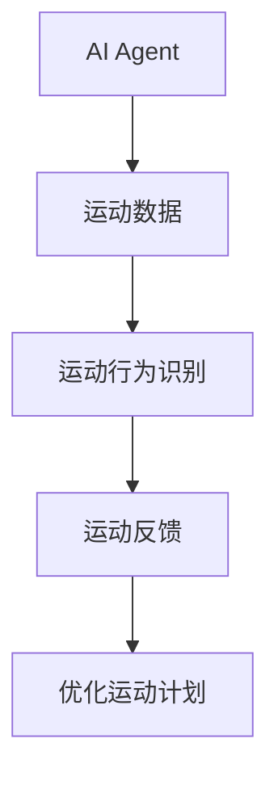

                 


# AI Agent在智能跳绳中的运动数据追踪

## 关键词：
AI Agent, 智能跳绳, 运动数据追踪, 传感器数据, 运动行为识别, 机器学习

## 摘要：
本文探讨了AI Agent在智能跳绳中的应用，详细分析了如何利用AI技术实现运动数据的实时追踪与优化。通过传感器数据采集、特征提取、模型训练等步骤，AI Agent能够精准识别运动行为，并为用户提供个性化的运动建议。文章从背景、原理、算法、系统架构到项目实战，全面阐述了AI Agent在智能跳绳中的技术实现与应用场景。

---

# 第一部分: AI Agent与运动数据追踪概述

## 第1章: AI Agent与运动数据追踪的背景介绍

### 1.1 AI Agent的基本概念

#### 1.1.1 什么是AI Agent
AI Agent（人工智能代理）是一种能够感知环境、执行任务并做出决策的智能实体。它可以是一个软件程序，也可以是一个物理设备，通过传感器和执行器与环境交互。AI Agent的核心目标是通过数据处理和智能算法，帮助用户完成特定任务或优化决策。

#### 1.1.2 AI Agent的核心特征
- **自主性**：AI Agent能够在没有外部干预的情况下独立运作。
- **反应性**：能够实时感知环境变化并做出响应。
- **目标导向**：基于目标驱动行为，优化决策过程。
- **学习能力**：通过机器学习算法不断优化性能。

#### 1.1.3 AI Agent的分类与应用场景
AI Agent可以分为**简单反射型**、**基于模型的反应型**、**目标驱动型**和**实用驱动型**。在运动数据追踪中，目标驱动型AI Agent最为常见，其应用场景包括运动行为识别、运动轨迹优化和个性化运动建议。

---

### 1.2 运动数据追踪的背景与意义

#### 1.2.1 运动数据追踪的定义
运动数据追踪是指通过传感器或其他设备，采集运动过程中产生的数据（如加速度、心率、位置等），并结合算法进行分析和处理的过程。其目的是为用户提供运动反馈、健康建议和运动优化方案。

#### 1.2.2 运动数据追踪的现状与挑战
- **现状**：运动数据追踪技术已广泛应用于健身设备、智能手机和可穿戴设备中。常见的技术包括加速度传感器、陀螺仪和心率监测器。
- **挑战**：数据准确性、实时性、用户隐私保护以及算法优化等问题仍需进一步解决。

#### 1.2.3 AI Agent在运动数据追踪中的作用
AI Agent能够通过机器学习算法，实时分析运动数据，识别运动行为，并提供个性化的运动建议。例如，在智能跳绳中，AI Agent可以分析用户的跳绳频率、节奏和姿态，帮助用户提高运动效率和减少受伤风险。

---

### 1.3 问题背景与问题描述

#### 1.3.1 运动数据追踪的核心问题
- 数据采集：如何准确采集运动数据？
- 数据分析：如何高效分析运动数据并提取有用信息？
- 数据应用：如何将运动数据应用于运动优化和健康反馈？

#### 1.3.2 AI Agent在运动数据追踪中的问题解决
AI Agent通过整合传感器数据和机器学习算法，能够实时分析运动数据并提供反馈。例如，AI Agent可以识别用户的运动模式，并根据数据优化运动计划。

#### 1.3.3 运动数据追踪的边界与外延
运动数据追踪的边界包括传感器数据的采集范围和数据处理的实时性。其外延则包括运动行为分析、健康监测和运动计划优化等领域。

---

### 1.4 概念结构与核心要素

#### 1.4.1 AI Agent与运动数据的关系
AI Agent通过处理运动数据，能够实现运动行为识别和运动优化。运动数据是AI Agent的输入，AI Agent的输出是运动反馈和建议。

#### 1.4.2 运动数据追踪的核心要素
- **传感器**：采集运动数据的核心设备。
- **算法**：分析运动数据的关键工具。
- **用户反馈**：运动数据的应用结果。

#### 1.4.3 AI Agent在运动数据追踪中的角色
AI Agent在运动数据追踪中扮演着数据处理、行为识别和决策优化的角色。它能够通过实时分析数据，帮助用户优化运动表现。

---

## 第2章: AI Agent与运动数据追踪的核心概念

### 2.1 AI Agent的原理与实现

#### 2.1.1 AI Agent的基本原理
AI Agent通过感知环境、处理数据、做出决策并执行动作来完成任务。在运动数据追踪中，AI Agent的核心任务是分析传感器数据并提供反馈。

#### 2.1.2 AI Agent的核心算法
AI Agent的核心算法包括**机器学习算法**（如支持向量机、随机森林）和**强化学习算法**（如Q-Learning）。这些算法用于分析运动数据并优化运动计划。

#### 2.1.3 AI Agent的实现步骤
1. 传感器数据采集。
2. 数据预处理与特征提取。
3. 算法训练与模型优化。
4. 数据分析与反馈生成。

---

### 2.2 运动数据追踪的原理与实现

#### 2.2.1 运动数据的采集与处理
运动数据的采集通常通过传感器完成，如加速度传感器、陀螺仪等。数据处理包括数据清洗、特征提取和数据转换。

#### 2.2.2 运动数据的特征提取
特征提取是运动数据处理的关键步骤。常见的运动数据特征包括加速度、频率、幅度和时域特征。

#### 2.2.3 运动数据的分析与应用
通过机器学习算法，AI Agent可以分析运动数据，识别运动行为并提供反馈。例如，在智能跳绳中，AI Agent可以通过分析跳绳频率和节奏，优化用户的跳绳计划。

---

### 2.3 AI Agent与运动数据的关系

#### 2.3.1 AI Agent如何处理运动数据
AI Agent通过传感器数据和机器学习算法，分析运动数据并提供反馈。例如，在智能跳绳中，AI Agent可以识别用户的跳绳姿势，并提供优化建议。

#### 2.3.2 AI Agent如何优化运动数据追踪
AI Agent通过实时分析运动数据，优化运动计划和反馈机制。例如，AI Agent可以根据用户的运动数据，调整运动强度和时间，以达到最佳运动效果。

#### 2.3.3 AI Agent与运动数据的关系图



---

## 第3章: AI Agent在智能跳绳中的运动数据追踪

### 3.1 AI Agent与智能跳绳的结合

#### 3.1.1 智能跳绳的基本原理
智能跳绳通过传感器采集运动数据，如跳绳频率、幅度和姿势。AI Agent通过分析这些数据，识别运动行为并提供反馈。

#### 3.1.2 AI Agent在智能跳绳中的作用
AI Agent在智能跳绳中用于实时分析运动数据，优化运动计划并提供个性化建议。

---

### 3.2 AI Agent与运动数据的交互流程

#### 3.2.1 数据采集
智能跳绳通过传感器采集运动数据，如加速度、陀螺仪数据和心率。

#### 3.2.2 数据分析
AI Agent通过机器学习算法分析运动数据，识别运动行为并提供反馈。

#### 3.2.3 数据应用
AI Agent根据分析结果，优化运动计划并提供个性化建议。

---

### 3.3 AI Agent与运动数据的优化策略

#### 3.3.1 数据预处理
数据预处理是运动数据追踪的关键步骤，包括数据清洗和特征提取。

#### 3.3.2 算法优化
通过优化机器学习算法，提高运动数据分析的准确性和效率。

---

## 第4章: 项目实战

### 4.1 环境安装与配置

#### 4.1.1 系统环境
需要安装Python、TensorFlow、传感器驱动等工具。

#### 4.1.2 传感器配置
配置加速度传感器和陀螺仪，确保数据采集正常。

---

### 4.2 系统核心实现

#### 4.2.1 数据采集代码

```python
import numpy as np
import pandas as pd

# 示例代码：从传感器获取数据
def get_sensor_data():
    # 模拟传感器数据
    data = np.random.randn(100, 3)
    return data

sensor_data = get_sensor_data()
print(sensor_data)
```

#### 4.2.2 数据分析代码

```python
from sklearn import svm

# 示例代码：训练机器学习模型
def train_model(data, labels):
    model = svm.SVC()
    model.fit(data, labels)
    return model

# 示例数据
data = np.random.randn(100, 3)
labels = np.random.randint(2, size=100)

model = train_model(data, labels)
print(model)
```

---

### 4.3 系统功能实现

#### 4.3.1 运动行为识别
通过机器学习算法，识别用户的运动行为，如跳绳姿势和频率。

#### 4.3.2 运动数据反馈
根据分析结果，提供运动反馈和优化建议。

---

## 第5章: 总结与展望

### 5.1 本章小结
AI Agent在智能跳绳中的运动数据追踪是一种创新的应用，通过传感器数据和机器学习算法，能够实时分析运动数据并提供反馈。

### 5.2 未来展望
未来，AI Agent在运动数据追踪中的应用将更加广泛，算法也将更加智能化和个性化。

---

## 作者：
AI天才研究院/AI Genius Institute & 禅与计算机程序设计艺术 /Zen And The Art of Computer Programming

