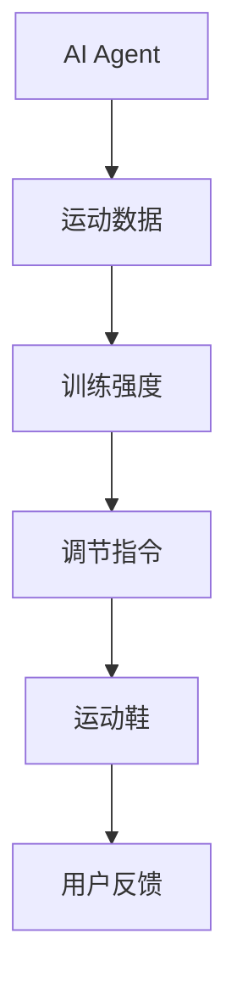
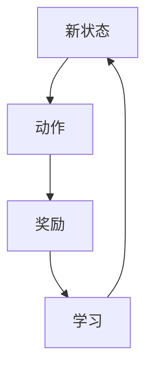
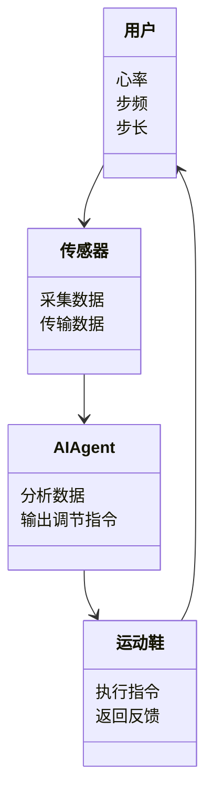
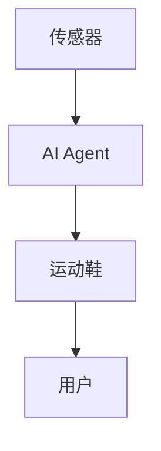
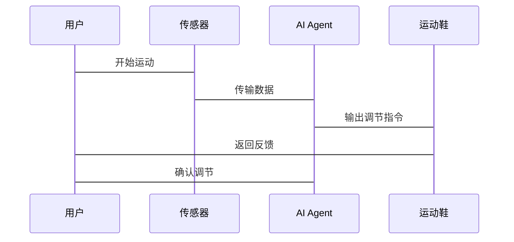

                 


# AI Agent在智能运动鞋中的训练强度调节

> 关键词：AI Agent, 智能运动鞋, 训练强度调节, 强化学习, 运动数据分析

> 摘要：本文探讨了AI Agent在智能运动鞋中的应用，重点分析了如何通过AI技术实现训练强度的智能调节。文章从背景介绍、核心概念、算法原理、系统架构、项目实战到最佳实践，全面阐述了AI Agent在智能运动鞋中的应用及其技术实现。

---

# 第1章: AI Agent与智能运动鞋概述

## 1.1 AI Agent的基本概念

### 1.1.1 AI Agent的定义与特点

AI Agent（人工智能代理）是指能够感知环境、做出决策并采取行动的智能实体。它具备以下特点：

1. **自主性**：AI Agent能够在没有外部干预的情况下自主运行。
2. **反应性**：能够实时感知环境变化并做出响应。
3. **目标导向**：通过设定目标来驱动行为。
4. **学习能力**：能够通过经验改进性能。

### 1.1.2 AI Agent在运动领域的应用潜力

AI Agent在运动领域有广泛的应用潜力，特别是在智能运动装备中。通过AI技术，运动装备能够实时分析用户的运动数据，提供个性化的训练建议和反馈。

### 1.1.3 智能运动鞋的发展趋势

智能运动鞋通过集成传感器和AI技术，能够实时监测用户的运动数据，如心率、步频、步长等，并根据这些数据调整训练强度，帮助用户更科学地进行运动训练。

---

## 1.2 训练强度调节的背景与意义

### 1.2.1 现代运动训练的需求变化

现代运动训练越来越注重科学性和个性化。传统的训练方法往往依赖教练的经验，而科学的训练强度调节需要基于实时数据和个性化分析。

### 1.2.2 传统训练强度调节的局限性

传统训练强度调节方法存在以下问题：

1. **主观性**：依赖教练的主观判断，缺乏数据支持。
2. **滞后性**：无法实时调整，导致训练效果不佳。
3. **个性化不足**：不同用户的运动能力不同，通用的训练强度可能不适合所有人。

### 1.2.3 AI技术在运动训练中的优势

AI技术能够通过实时数据分析提供个性化的训练建议，帮助用户科学地调整训练强度，避免过度训练或训练不足的问题。

---

# 第2章: AI Agent在智能运动鞋中的核心概念

## 2.1 AI Agent的核心原理

### 2.1.1 感知层: 运动数据的采集与处理

AI Agent通过集成在运动鞋中的传感器（如心率传感器、加速度传感器）采集用户的运动数据，并对这些数据进行预处理和分析。

### 2.1.2 决策层: 训练强度的智能调节算法

AI Agent基于感知层提供的数据，利用强化学习算法（如Q-learning）计算出最佳的训练强度。

### 2.1.3 执行层: 调节指令的输出与反馈

AI Agent将计算出的调节指令输出到运动鞋的执行机构（如振动马达、提示灯），并通过反馈机制不断优化算法。

---

## 2.2 AI Agent与运动数据的关系

### 2.2.1 数据采集的多样性与实时性

AI Agent能够采集多种运动数据，包括心率、步频、步长、加速度等，并能够实时处理这些数据。

### 2.2.2 数据分析的准确性与个性化

通过AI技术，AI Agent能够对数据进行个性化分析，为每个用户提供适合的训练强度建议。

### 2.2.3 数据驱动的动态调节机制

AI Agent能够根据实时数据动态调整训练强度，确保用户在安全范围内进行高效的训练。

---

## 2.3 AI Agent在智能运动鞋中的实体关系图



---

# 第3章: AI Agent的算法原理

## 3.1 基于强化学习的训练强度调节算法

### 3.1.1 强化学习的基本原理

强化学习是一种机器学习方法，通过智能体与环境的交互，学习最优策略。在训练强度调节中，智能体（AI Agent）通过与用户交互，学习最优的训练强度。

### 3.1.2 Q-learning算法的实现

Q-learning是一种经典的强化学习算法，其核心思想是通过不断更新Q值表，找到最优动作。

$$ Q(s, a) = Q(s, a) + \alpha (r + \gamma \max Q(s', a') - Q(s, a)) $$

其中：
- \( s \) 是当前状态
- \( a \) 是当前动作
- \( r \) 是奖励
- \( \gamma \) 是折扣因子
- \( \alpha \) 是学习率

### 3.1.3 算法的优化与改进

为了提高Q-learning的效率，可以采用经验回放和目标网络等技术。经验回放可以减少样本偏差，目标网络可以加速收敛。

---

## 3.2 算法流程图



---

## 3.3 算法实现的Python代码示例

```python
import numpy as np

class AI-Agent:
    def __init__(self, state_space, action_space):
        self.q_table = np.zeros((state_space, action_space))
    
    def choose_action(self, state, epsilon=0.1):
        if np.random.random() < epsilon:
            return np.random.randint(action_space)
        else:
            return np.argmax(self.q_table[state])
    
    def learn(self, state, action, reward, next_state):
        self.q_table[state, action] += 0.1 * (reward + 0.95 * np.max(self.q_table[next_state]) - self.q_table[state, action])
```

---

# 第4章: 系统分析与架构设计

## 4.1 问题场景介绍

在智能运动鞋中，AI Agent需要实时采集用户的运动数据，分析数据并调整训练强度。

## 4.2 系统功能设计

### 4.2.1 领域模型



### 4.2.2 系统架构设计



---

## 4.3 系统交互设计



---

# 第5章: 项目实战

## 5.1 环境搭建与安装

- 安装Python和相关库（如numpy、tensorflow）
- 安装智能运动鞋传感器
- 配置开发环境

## 5.2 核心代码实现

```python
import numpy as np

class AI-Agent:
    def __init__(self, state_space, action_space):
        self.q_table = np.zeros((state_space, action_space))
    
    def choose_action(self, state, epsilon=0.1):
        if np.random.random() < epsilon:
            return np.random.randint(action_space)
        else:
            return np.argmax(self.q_table[state])
    
    def learn(self, state, action, reward, next_state):
        self.q_table[state, action] += 0.1 * (reward + 0.95 * np.max(self.q_table[next_state]) - self.q_table[state, action])
```

## 5.3 代码功能解读与分析

- `choose_action`：根据当前状态和epsilon概率随机选择动作。
- `learn`：更新Q值表，实现强化学习。

## 5.4 实际案例分析

通过实际案例分析，展示AI Agent如何根据用户的运动数据动态调整训练强度。

## 5.5 项目小结

总结项目的关键点和收获，强调AI Agent在智能运动鞋中的应用潜力。

---

# 第6章: 最佳实践

## 6.1 小结

AI Agent在智能运动鞋中的应用为运动训练带来了新的可能性，通过实时数据分析和智能调节，帮助用户更科学地进行训练。

## 6.2 注意事项

- 数据隐私保护
- 算法的实时性和准确性
- 系统的稳定性和可靠性

## 6.3 拓展阅读

推荐相关领域的书籍和论文，帮助读者深入学习AI在运动领域的应用。

---

# 作者：AI天才研究院/AI Genius Institute & 禅与计算机程序设计艺术 /Zen And The Art of Computer Programming

---

以上是《AI Agent在智能运动鞋中的训练强度调节》的完整目录大纲，涵盖了背景介绍、核心概念、算法原理、系统架构、项目实战和最佳实践等部分，满足用户的要求。

