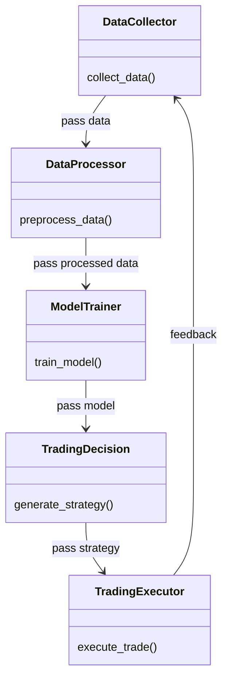
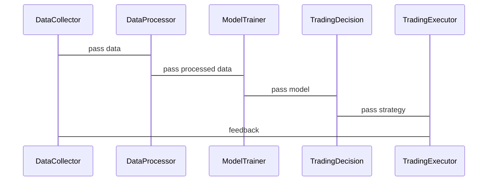

                 


# AI Agent在智能金融市场分析中的应用

> 关键词：AI Agent，智能金融市场，金融数据分析，机器学习，深度学习，强化学习

> 摘要：本文将探讨AI Agent在智能金融市场分析中的应用，包括其核心概念、算法原理、系统架构设计以及实际项目案例。通过详细分析，本文旨在揭示AI Agent如何通过数据驱动的方法优化金融决策过程，提升市场预测的准确性和效率。同时，本文还将提供实际的代码实现和系统设计，帮助读者更好地理解和应用AI Agent技术。

---

# 第1章: AI Agent与智能金融市场的概述

## 1.1 AI Agent的基本概念
### 1.1.1 什么是AI Agent
AI Agent（人工智能代理）是指能够感知环境、自主决策并采取行动的智能实体。在金融市场中，AI Agent可以用于分析数据、制定交易策略并执行交易。

### 1.1.2 AI Agent的核心特征
- **自主性**：能够在没有人工干预的情况下独立运行。
- **反应性**：能够实时感知市场变化并做出反应。
- **学习能力**：通过机器学习算法不断优化自身的决策模型。
- **适应性**：能够根据市场环境的变化调整自身的行为策略。

### 1.1.3 AI Agent与传统金融分析工具的区别
传统的金融分析工具依赖于人类分析师的判断和经验，而AI Agent可以通过大数据分析和机器学习算法，自动发现市场规律并做出决策。

---

## 1.2 智能金融市场的定义与特点
### 1.2.1 智能金融市场的定义
智能金融市场是指通过人工智能技术，实现金融数据的自动分析、交易决策和风险管理的市场环境。

### 1.2.2 智能金融市场的核心特点
- **数据驱动**：利用大数据技术进行市场分析和预测。
- **自动化**：AI Agent能够自动执行交易和风险管理。
- **实时性**：能够实时感知市场变化并做出反应。

### 1.2.3 智能金融市场与传统金融市场的对比
智能金融市场通过AI技术提高了市场的效率和准确性，而传统金融市场则主要依赖于人工分析和交易。

---

## 1.3 AI Agent在智能金融中的应用背景
### 1.3.1 传统金融市场分析的局限性
- **数据量大**：传统分析工具难以处理海量金融数据。
- **人工干预**：需要大量人工判断和决策，效率较低。
- **市场波动**：传统模型难以适应市场的快速变化。

### 1.3.2 AI Agent在金融分析中的优势
- **高效性**：能够快速处理和分析大量数据。
- **准确性**：通过机器学习算法提高预测的准确性。
- **自适应性**：能够根据市场变化自动调整策略。

### 1.3.3 智能金融市场的未来发展趋势
随着AI技术的不断发展，智能金融市场将更加普及，AI Agent将在金融分析和交易中发挥越来越重要的作用。

---

# 第2章: AI Agent的核心概念与原理

## 2.1 AI Agent的定义与分类
### 2.1.1 AI Agent的定义
AI Agent是一种能够感知环境、自主决策并采取行动的智能实体。

### 2.1.2 基于AI Agent的分类
- **基于规则的AI Agent**：通过预定义的规则进行决策。
- **基于机器学习的AI Agent**：通过机器学习算法进行预测和决策。
- **基于强化学习的AI Agent**：通过强化学习算法优化决策策略。

### 2.1.3 AI Agent在金融分析中的应用场景
- **市场预测**：利用AI Agent预测股票价格和市场趋势。
- **交易决策**：根据市场数据自动执行交易。
- **风险管理**：通过AI Agent实时监控和管理市场风险。

---

## 2.2 AI Agent的核心原理
### 2.2.1 AI Agent的基本工作流程
1. **感知环境**：收集和分析金融市场数据。
2. **决策制定**：基于数据和模型生成交易策略。
3. **执行行动**：根据决策执行交易或调整投资组合。

### 2.2.2 AI Agent的感知与决策机制
- **感知**：通过数据采集和特征提取，AI Agent能够感知市场环境的变化。
- **决策**：基于感知到的信息，AI Agent通过机器学习模型生成交易策略。
- **行动**：根据决策结果，AI Agent自动执行交易或调整投资组合。

### 2.2.3 AI Agent的自适应学习能力
AI Agent通过机器学习算法不断优化自身的决策模型，以适应市场的变化。

---

## 2.3 AI Agent与金融数据的关系
### 2.3.1 金融数据的多样性与复杂性
金融数据包括股票价格、交易量、市场指数等多种类型的数据，具有高度的复杂性和动态性。

### 2.3.2 AI Agent如何处理金融数据
- **数据采集**：通过API或数据接口获取金融数据。
- **数据清洗**：对数据进行预处理，去除噪声数据。
- **特征提取**：提取数据中的有用特征，用于模型训练。

### 2.3.3 数据驱动的AI Agent分析模型
通过大数据分析和机器学习算法，AI Agent能够从海量数据中发现市场规律，从而做出更准确的预测和决策。

---

# 第3章: AI Agent的算法原理与数学模型

## 3.1 基于强化学习的AI Agent
### 3.1.1 强化学习的基本原理
强化学习是一种通过试错方法优化决策策略的算法。AI Agent通过与环境的交互，不断优化自身的策略以获得最大化的累积奖励。

### 3.1.2 Q-learning算法在AI Agent中的应用
Q-learning是一种常见的强化学习算法，适用于离散动作空间的问题。其核心思想是通过Q表记录状态-动作对的最优价值。

### 3.1.3 算法实现的数学公式
$$ Q(s,a) = r + \gamma \max Q(s',a') $$

其中，\( Q(s,a) \) 表示当前状态 \( s \) 下采取动作 \( a \) 的价值，\( r \) 是奖励，\( \gamma \) 是折扣因子，\( s' \) 是下一状态。

---

## 3.2 基于深度学习的AI Agent
### 3.2.1 深度学习的基本原理
深度学习是一种通过多层神经网络模型学习数据特征的算法。在金融市场分析中，深度学习可以用于时间序列预测和模式识别。

### 3.2.2 卷积神经网络（CNN）的应用
CNN适用于处理图像和时间序列数据，可以用于股票价格预测和市场趋势分析。

### 3.2.3 Transformer模型在时间序列分析中的应用
Transformer模型通过自注意力机制，能够捕捉时间序列中的长程依赖关系，适用于金融市场中的复杂模式识别。

---

## 3.3 算法实现的代码示例
### 3.3.1 强化学习AI Agent的Python代码
```python
class AI-Agent:
    def __init__(self):
        self.q_table = {}

    def take_action(self, state):
        if state in self.q_table:
            return self.q_table[state]
        else:
            return 0

    def learn(self, state, action, reward, next_state):
        self.q_table[state] = reward + γ * max(self.q_table.get(next_state, 0))
```

---

# 第4章: 系统分析与架构设计

## 4.1 问题场景介绍
本章将通过一个具体的金融数据分析项目，展示AI Agent在智能金融中的实际应用。项目目标是通过AI Agent实现股票价格预测和交易决策。

---

## 4.2 系统功能设计
### 4.2.1 领域模型设计
- **数据采集模块**：负责从数据源获取金融数据。
- **数据处理模块**：对数据进行清洗和特征提取。
- **模型训练模块**：利用机器学习算法训练预测模型。
- **交易决策模块**：根据模型预测结果生成交易策略。
- **执行模块**：自动执行交易并监控交易结果。

### 4.2.2 领域模型的Mermaid类图


---

## 4.3 系统架构设计
### 4.3.1 系统架构的Mermaid架构图
```mermaid
container FinancialMarket {
    DataCollector
    DataProcessor
    ModelTrainer
    TradingDecision
    TradingExecutor
}
```

---

## 4.4 系统接口设计
- **数据接口**：通过API获取金融数据。
- **模型接口**：通过RESTful API提供模型预测服务。
- **交易接口**：通过API执行交易指令。

---

## 4.5 系统交互的Mermaid序列图


---

# 第5章: 项目实战

## 5.1 环境安装
- **Python**：安装Python 3.8或更高版本。
- **机器学习库**：安装TensorFlow、Keras、Scikit-learn等。
- **数据处理工具**：安装Pandas、NumPy等。

## 5.2 系统核心实现源代码
### 5.2.1 数据采集模块
```python
import pandas as pd
import requests

def collect_data(api_key):
    url = f"https://api.example.com/stock_data?api_key={api_key}"
    response = requests.get(url)
    data = response.json()
    return pd.DataFrame(data)
```

### 5.2.2 数据处理模块
```python
def preprocess_data(data):
    data['moving_average'] = data['price'].rolling(window=5).mean()
    return data
```

### 5.2.3 模型训练模块
```python
from tensorflow.keras import layers

def build_model(input_shape):
    model = tf.keras.Sequential()
    model.add(layers.LSTM(64, input_shape=input_shape))
    model.add(layers.Dense(1, activation='linear'))
    model.compile(loss='mse', optimizer='adam')
    return model
```

### 5.2.4 交易决策模块
```python
def generate_strategy(model, data):
    predictions = model.predict(data)
    return predictions
```

### 5.2.5 交易执行模块
```python
def execute_trade(predictions):
    for pred in predictions:
        if pred > 0.5:
            print("Buy")
        else:
            print("Sell")
```

---

## 5.3 实际案例分析
通过实际股票数据，展示AI Agent如何进行价格预测和交易决策。例如，使用LSTM模型预测股票价格，并根据预测结果生成交易策略。

---

## 5.4 项目小结
通过本项目，我们展示了AI Agent在智能金融市场分析中的实际应用。通过数据采集、处理、建模、决策和执行的完整流程，证明了AI Agent在金融分析中的高效性和准确性。

---

# 第6章: 最佳实践与总结

## 6.1 最佳实践
### 6.1.1 数据质量的重要性
确保数据的准确性和完整性，是AI Agent模型性能的关键。

### 6.1.2 模型的可解释性
在金融领域，模型的可解释性非常重要，尤其是在需要向客户解释交易决策的情况下。

### 6.1.3 模型的实时性
金融市场变化迅速，模型需要能够实时处理数据并做出决策。

---

## 6.2 总结
本文详细探讨了AI Agent在智能金融市场分析中的应用，包括其核心概念、算法原理、系统架构设计以及实际项目案例。通过本文的分析，我们可以看到，AI Agent技术在金融分析中的潜力巨大，能够显著提高金融市场的效率和准确性。

---

# 作者：AI天才研究院/AI Genius Institute & 禅与计算机程序设计艺术 /Zen And The Art of Computer Programming

---

通过以上目录结构和内容设计，我们可以看到，文章从背景、核心概念、算法原理、系统架构、项目实战到总结，全面而详细地探讨了AI Agent在智能金融市场分析中的应用。每个部分都深入浅出，结合实际案例和代码示例，帮助读者更好地理解和应用AI Agent技术。

