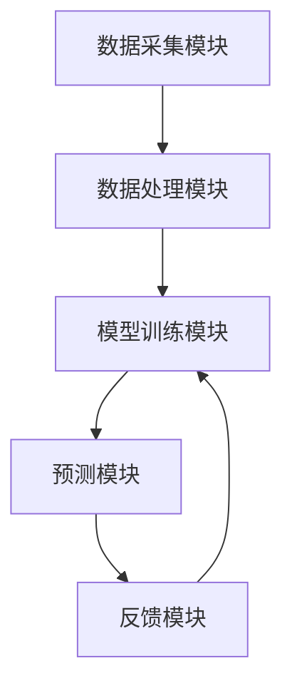
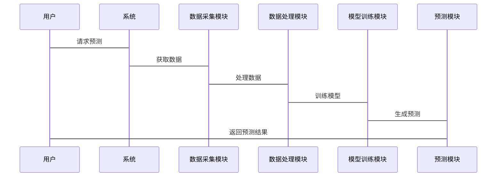

                 


# AI Agent在智能金融市场预测中的应用

> 关键词：AI Agent，金融市场，智能预测，强化学习，深度学习，自然语言处理

> 摘要：本文深入探讨了AI Agent在智能金融市场预测中的应用，从基本概念、核心算法到系统架构，再到项目实战，全面解析了AI Agent如何在金融市场中实现高效预测。文章结合理论与实践，通过具体的算法实现和系统设计，展示了AI Agent在金融预测中的潜力和优势。

---

## 第1章: AI Agent与金融市场的背景介绍

### 1.1 AI Agent的基本概念

#### 1.1.1 什么是AI Agent

AI Agent（人工智能代理）是一种智能系统，能够感知环境、自主决策并执行任务。它具备以下核心特征：

1. **自主性**：无需外部干预，自主执行任务。
2. **反应性**：能感知环境并实时做出反应。
3. **学习能力**：通过数据和经验不断优化自身行为。
4. **社交能力**：能够与其他Agent或人类进行交互。

AI Agent与传统算法的主要区别在于其自主性和适应性。传统算法依赖于预定义的规则，而AI Agent能够根据环境反馈动态调整策略。

#### 1.1.2 AI Agent的核心特征

- **知识表示**：AI Agent通过知识库或模型表示信息，如金融市场数据、历史价格等。
- **行为决策**：基于当前状态和目标，选择最优行动。
- **交互学习**：通过与环境和其他Agent的交互，不断优化自身的策略。

#### 1.1.3 AI Agent与传统算法的区别

| 特性                | AI Agent                              | 传统算法                              |
|---------------------|---------------------------------------|---------------------------------------|
| 决策方式            | 基于环境反馈动态调整                 | 预定义规则                            |
| 学习能力            | 具备学习能力                         | 无学习能力                           |
| 适应性              | 能适应环境变化                       | 适应性有限                           |

### 1.2 金融市场预测的挑战

#### 1.2.1 金融市场的复杂性

金融市场受多种因素影响，如经济指标、政策变化、市场情绪等，导致价格波动复杂且不可预测。

#### 1.2.2 数据的多维度与实时性

金融市场数据包括股票价格、交易量、新闻情绪等，数据维度多且需要实时处理，增加了预测的难度。

#### 1.2.3 市场行为的不确定性

市场参与者的行为复杂，价格波动往往受情绪影响，增加了预测的不确定性。

### 1.3 AI Agent在金融市场预测中的应用

#### 1.3.1 AI Agent的优势

- **高效性**：能够快速处理大量数据，实时做出决策。
- **适应性**：能够根据市场变化动态调整预测策略。
- **准确性**：通过学习历史数据，提高预测的准确性。

#### 1.3.2 AI Agent在金融预测中的具体应用

- **股票价格预测**：通过分析历史价格和市场情绪，预测未来股价走势。
- **市场情绪分析**：利用自然语言处理技术，分析新闻和社交媒体情绪，辅助投资决策。
- **风险评估与管理**：通过实时监控市场变化，评估投资组合风险，制定风险管理策略。

#### 1.3.3 AI Agent的未来发展趋势

随着技术的进步，AI Agent在金融市场的应用将更加广泛和深入。未来可能会出现更复杂的多Agent系统，能够协同工作，提供更精准的预测和决策支持。

---

## 第2章: AI Agent的核心概念与原理

### 2.1 AI Agent的结构与功能

#### 2.1.1 知识表示

知识表示是AI Agent理解世界的基础。常见的知识表示方法包括：

- **规则表示法**：通过预定义的规则描述知识，如“如果某股票价格连续上涨，则预测其将继续上涨”。
- **图表示法**：通过图结构表示实体之间的关系，如“公司A收购公司B”。
- **概率表示法**：通过概率模型描述不确定性，如贝叶斯网络。

#### 2.1.2 行为决策

行为决策是AI Agent的核心功能，主要依赖于决策算法。常用的决策算法包括：

- **基于规则的决策**：根据预定义的规则做出决策。
- **基于学习的决策**：通过机器学习模型学习决策策略。
- **基于强化学习的决策**：通过强化学习优化决策策略。

#### 2.1.3 交互学习

交互学习是AI Agent通过与环境和其他Agent交互来提升自身能力的过程。常见的交互学习方法包括：

- **强化学习**：通过奖励机制优化决策策略。
- **协作学习**：与其他Agent协作，共同完成任务。
- **对抗学习**：通过与对手博弈，提升自身策略的鲁棒性。

### 2.2 AI Agent的类型

#### 2.2.1 基于规则的AI Agent

基于规则的AI Agent依赖于预定义的规则进行决策。优点是简单易懂，缺点是难以应对复杂和动态变化的环境。

#### 2.2.2 基于学习的AI Agent

基于学习的AI Agent通过学习历史数据和经验来优化决策策略。常用的机器学习方法包括监督学习、无监督学习和半监督学习。

#### 2.2.3 混合型AI Agent

混合型AI Agent结合了基于规则和基于学习的方法，能够在复杂环境中灵活应对。例如，结合规则和强化学习，既能利用规则的确定性，又能通过学习适应变化。

### 2.3 AI Agent的核心算法

#### 2.3.1 强化学习

强化学习是一种通过试错学习优化决策策略的方法。常见的强化学习算法包括Q-learning和深度强化学习（如DQN）。

- **Q-learning算法**：通过更新Q值函数，找到最优动作序列。
  $$ Q(s, a) = r + \gamma \max Q(s', a') $$

- **DQN算法**：使用深度神经网络近似Q值函数，处理高维状态空间。

#### 2.3.2 深度学习

深度学习通过多层神经网络模型学习数据的高层次特征，常用于图像识别、自然语言处理等领域。

- **卷积神经网络（CNN）**：适用于图像数据的特征提取。
- **循环神经网络（RNN）**：适用于序列数据的处理，如时间序列预测。

#### 2.3.3 自然语言处理

自然语言处理（NLP）用于理解和生成人类语言，常用于市场情绪分析和新闻解读。

- **词嵌入（Word Embedding）**：将词语映射到高维向量空间。
- **BERT模型**：一种基于Transformer的预训练语言模型，用于上下文理解。

### 2.4 AI Agent在金融预测中的应用案例

#### 2.4.1 股票价格预测

AI Agent可以通过分析历史价格、市场情绪和新闻事件，预测股票价格走势。

#### 2.4.2 市场情绪分析

通过分析社交媒体和新闻媒体的情绪，AI Agent可以评估市场情绪，辅助投资决策。

#### 2.4.3 风险评估与管理

AI Agent可以实时监控市场变化，评估投资组合风险，并制定风险管理策略。

---

## 第3章: AI Agent的算法原理与实现

### 3.1 算法原理概述

AI Agent的算法原理主要包括知识表示、行为决策和交互学习三部分。

#### 3.1.1 强化学习的基本原理

强化学习通过试错机制优化决策策略。智能体在环境中执行动作，获得奖励或惩罚，从而学习最优策略。

#### 3.1.2 深度学习的基本原理

深度学习通过多层神经网络模型学习数据的高层次特征。模型通过反向传播算法优化权重，最小化预测误差。

#### 3.1.3 自然语言处理的基本原理

自然语言处理通过语言模型理解和生成人类语言。预训练模型如BERT能够捕捉上下文信息，辅助文本分析。

### 3.2 常见算法的实现细节

#### 3.2.1 Q-learning算法

Q-learning是一种经典的强化学习算法，适用于离散状态和动作空间。

- **Q值更新公式**：
  $$ Q(s, a) = Q(s, a) + \alpha [r + \gamma \max Q(s', a') - Q(s, a)] $$
  
- **实现步骤**：
  1. 初始化Q表。
  2. 确定当前状态s。
  3. 选择动作a（探索或利用）。
  4. 执行动作a，获得奖励r和新状态s'。
  5. 更新Q(s, a)。

#### 3.2.2 DQN算法

DQN通过神经网络近似Q值函数，处理高维状态空间。

- **网络结构**：
  - 输入层：接收环境状态。
  - 隐藏层：提取特征。
  - 输出层：预测Q值。

- **实现步骤**：
  1. 环境初始化。
  2. 神经网络初始化。
  3. 循环执行以下步骤直到终止条件满足：
     a. 从环境中获取状态s。
     b. 神经网络预测Q(s)。
     c. 选择动作a。
     d. 执行动作a，获得奖励r和新状态s'。
     e. 将经验(s, a, r, s')存储在经验回放库。
     f. 从经验回放库中随机抽取小批量经验，更新神经网络。

#### 3.2.3 BERT模型

BERT模型是一种预训练语言模型，用于自然语言处理任务。

- **预训练目标**：
  - 掩码语言模型：随机遮蔽部分词汇，预测词汇。
  - 下文关系判断：判断句子间的关系。

- **微调任务**：
  根据具体任务（如情感分析）调整模型。

### 3.3 算法的数学模型与公式

#### 3.3.1 强化学习的数学模型

强化学习的目标是找到最优策略π，使得累积奖励最大化。

- **贝尔曼方程**：
  $$ V(s) = \max_{a} [r(s,a) + \gamma V(s')] $$
  
- **Q值更新公式**：
  $$ Q(s, a) = r + \gamma \max Q(s', a') $$

#### 3.3.2 深度学习的数学模型

深度学习通过神经网络模型逼近目标函数。

- **损失函数**：
  $$ L = \frac{1}{N}\sum_{i=1}^{N}(y_i - \hat{y}_i)^2 $$

- **反向传播**：
  使用梯度下降优化模型参数。

#### 3.3.3 自然语言处理的数学模型

自然语言处理模型如BERT使用Transformer架构。

- **自注意力机制**：
  $$ \text{Attention}(Q, K, V) = \text{softmax}\left( \frac{QK^T}{\sqrt{d_k}} \right)V $$

- **位置编码**：
  通过位置编码将位置信息融入模型。

### 3.4 算法的实现步骤

#### 3.4.1 数据预处理

- **数据清洗**：处理缺失值、异常值。
- **特征提取**：提取有用的特征，如技术指标、市场情绪。
- **数据分割**：将数据划分为训练集、验证集和测试集。

#### 3.4.2 模型训练

- **选择算法**：根据任务选择合适的算法，如强化学习、深度学习或NLP。
- **参数设置**：设置模型超参数，如学习率、批次大小。
- **训练循环**：迭代训练模型，优化参数。

#### 3.4.3 模型评估

- **评估指标**：选择合适的评估指标，如准确率、召回率、F1分数。
- **性能分析**：分析模型在不同情况下的表现。
- **调优优化**：根据评估结果调整模型参数或结构。

---

## 第4章: AI Agent的系统分析与架构设计

### 4.1 系统架构设计

AI Agent在金融市场预测中的系统架构通常包括以下几个部分：

- **数据采集模块**：实时采集金融市场数据，如股票价格、交易量、新闻等。
- **数据处理模块**：对采集的数据进行清洗、特征提取和预处理。
- **模型训练模块**：训练AI Agent模型，优化决策策略。
- **预测模块**：根据当前市场状态，生成预测结果。
- **反馈模块**：根据实际市场反馈，更新模型参数。

#### 4.1.1 系统功能设计

- **数据采集**：从多个数据源（如API、数据库）获取金融市场数据。
- **数据处理**：清洗数据，提取特征，如移动平均线、相对强弱指数等。
- **模型训练**：使用强化学习、深度学习或NLP模型训练AI Agent。
- **预测生成**：根据当前市场状态，生成预测结果。
- **反馈优化**：根据实际市场反馈，优化模型参数。

#### 4.1.2 系统架构设计

使用mermaid绘制系统架构图：



#### 4.1.3 系统接口设计

系统接口设计包括数据接口、模型接口和反馈接口。

- **数据接口**：定义数据格式和API接口。
- **模型接口**：定义模型输入输出接口。
- **反馈接口**：定义反馈数据的格式和接口。

#### 4.1.4 系统交互设计

使用mermaid绘制系统交互序列图：



---

## 第5章: AI Agent的项目实战

### 5.1 项目背景

本项目旨在开发一个基于AI Agent的股票价格预测系统，利用强化学习算法优化投资策略。

### 5.2 环境配置

- **操作系统**：Linux/Windows/MacOS
- **编程语言**：Python 3.8+
- **深度学习框架**：TensorFlow/PyTorch
- **自然语言处理库**：Transformers库
- **数据处理工具**：Pandas、NumPy

### 5.3 系统核心实现

#### 5.3.1 数据采集

使用Yahoo Finance API获取股票历史数据。

```python
import pandas_datareader as pdr
import datetime

start = datetime.datetime(2020, 1, 1)
end = datetime.datetime(2023, 12, 31)

data = pdr.get_data_yahoo('AAPL', start, end)
```

#### 5.3.2 数据处理

对数据进行清洗和特征提取。

```python
import pandas as pd
import numpy as np

# 清洗数据
data.dropna(inplace=True)

# 特征提取
data['SMA_20'] = data['Close'].rolling(20).mean()
data['SMA_50'] = data['Close'].rolling(50).mean()
```

#### 5.3.3 模型训练

使用强化学习算法训练AI Agent。

```python
import gym
import numpy as np

class StockEnv(gym.Env):
    def __init__(self, data):
        self.data = data
        self.current_step = 0
        self.observation_space = gym.spaces.Box(low=0, high=1, shape=(1, 2))
        self.action_space = gym.spaces.Discrete(3)  # 0: 卖出，1: 持有，2: 买入

    def _get_state(self):
        state = np.array([self.data['Close'][self.current_step], 
                          self.data['SMA_20'][self.current_step]])
        return state

    def step(self, action):
        # 执行动作并获得奖励
        # 具体实现根据实际逻辑编写
        pass

    def render(self, mode='human'):
        # 可视化界面
        pass

    def reset(self):
        self.current_step = 0
        return self._get_state()
```

#### 5.3.4 预测与反馈

根据当前市场状态，生成预测结果，并根据实际结果优化模型。

```python
import gym
import numpy as np

env = StockEnv(data)
agent = DQNAgent(env.observation_space.shape, env.action_space.n)

for episode in range(1000):
    state = env.reset()
    total_reward = 0
    done = False
    while not done:
        action = agent.act(state)
        next_state, reward, done, _ = env.step(action)
        agent.remember(state, action, reward, next_state, done)
        agent.replay()
        total_reward += reward
        state = next_state
    print(f"Episode {episode}, Total Reward: {total_reward}")
```

### 5.4 案例分析

#### 5.4.1 数据预处理案例

以苹果股票为例，展示数据预处理过程。

```python
import pandas as pd
import matplotlib.pyplot as plt

data = pd.read_csv('aapl.csv')
data['Date'] = pd.to_datetime(data['Date'])
data.set_index('Date', inplace=True)

plt.plot(data['Close'])
plt.title('Apple Stock Price')
plt.xlabel('Date')
plt.ylabel('Price')
plt.show()
```

#### 5.4.2 模型训练案例

训练DQN模型，优化股票交易策略。

```python
# 训练过程
for episode in range(1000):
    state = env.reset()
    total_reward = 0
    done = False
    while not done:
        action = agent.act(state)
        next_state, reward, done, _ = env.step(action)
        agent.remember(state, action, reward, next_state, done)
        agent.replay()
        total_reward += reward
        state = next_state
    print(f"Episode {episode}, Total Reward: {total_reward}")
```

### 5.5 项目总结

通过本项目，我们展示了AI Agent在股票价格预测中的应用。通过强化学习算法，AI Agent能够根据市场反馈动态调整交易策略，实现高效的预测和交易。

---

## 第6章: 小结与展望

### 6.1 小结

本文详细介绍了AI Agent在智能金融市场预测中的应用，从基本概念、核心算法到系统架构，再到项目实战，全面解析了AI Agent在金融预测中的潜力和优势。通过具体案例，展示了AI Agent如何通过学习和优化，提高预测的准确性和效率。

### 6.2 未来展望

随着技术的进步，AI Agent在金融市场的应用将更加广泛和深入。未来可能会出现更复杂的多Agent系统，能够协同工作，提供更精准的预测和决策支持。同时，结合边缘计算和分布式技术，AI Agent将在实时交易和风险管理中发挥更大的作用。

---

## 作者：AI天才研究院（AI Genius Institute） & 禅与计算机程序设计艺术（Zen And The Art of Computer Programming）

---

**注意**：本文内容为理论与实践结合的技术博客文章，旨在提供关于AI Agent在智能金融市场预测中的应用的深入分析和见解。读者可以根据实际需求，结合具体情况进行应用和优化。

