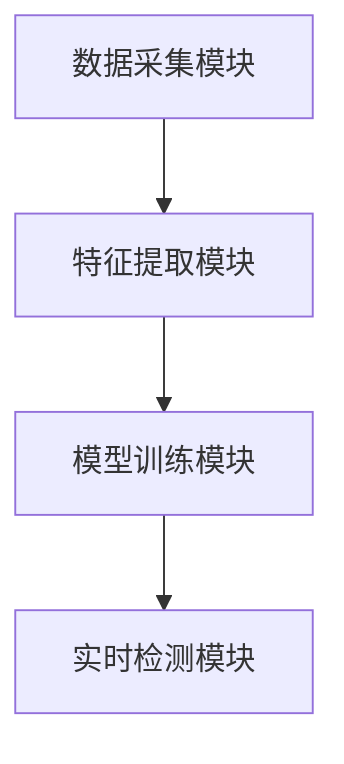
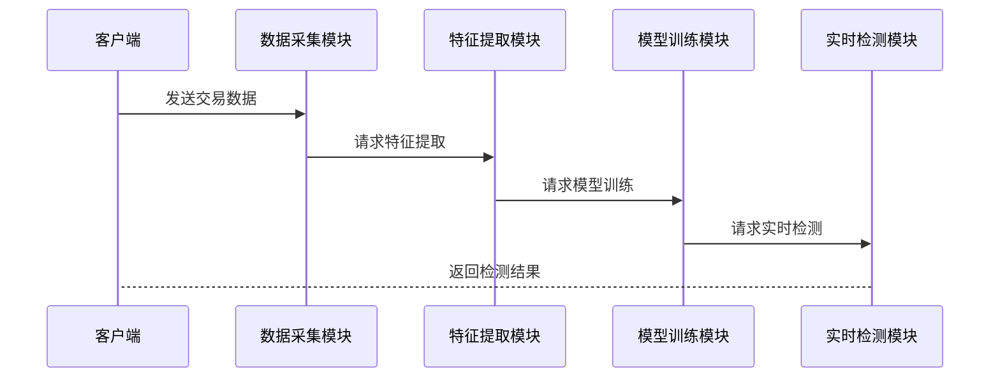

                 


# AI Agent在智能金融欺诈检测中的应用

> 关键词：AI Agent，金融欺诈检测，智能系统，算法原理，系统架构

> 摘要：随着金融交易的日益复杂化，金融欺诈检测变得越来越具有挑战性。本文探讨了AI Agent在金融欺诈检测中的应用，详细分析了其核心概念、算法原理、系统架构设计以及实际项目实现。通过结合理论与实践，本文旨在为读者提供一个全面的视角，理解如何利用AI Agent技术来提升金融欺诈检测的效率和准确性。

---

## 第1章: 问题背景与核心概念

### 1.1 问题背景

#### 1.1.1 金融欺诈的现状与挑战
随着全球金融交易的激增，金融欺诈行为日益猖獗。传统的基于规则的欺诈检测系统逐渐暴露出效率低下、误报率高、难以应对新型欺诈手段等缺陷。根据2022年的一项调查，全球金融欺诈造成的损失高达数千亿美元。传统的检测方法主要依赖人工审核和简单的规则匹配，难以应对复杂的欺诈模式。

#### 1.1.2 AI Agent在金融安全中的作用
AI Agent（人工智能代理）是一种能够感知环境、自主决策并执行任务的智能体。在金融欺诈检测中，AI Agent可以通过实时数据分析、模式识别和决策推理，快速识别异常交易行为，从而有效降低欺诈风险。

#### 1.1.3 智能金融欺诈检测的必要性
智能金融欺诈检测的必要性主要体现在以下几点：
1. **实时性**：能够快速响应交易行为，实时检测欺诈。
2. **准确性**：通过机器学习算法，提高欺诈检测的准确率。
3. **适应性**：能够自动适应新的欺诈模式，无需人工频繁调整规则。

### 1.2 核心概念与联系

#### 1.2.1 AI Agent的定义与特点
- **定义**：AI Agent是一种能够感知环境、自主决策并执行任务的智能体。
- **特点**：
  - **自主性**：能够在没有人工干预的情况下独立运行。
  - **反应性**：能够实时感知环境变化并做出反应。
  - **学习能力**：能够通过数据学习和优化自身的决策模型。

#### 1.2.2 金融欺诈检测的核心要素
- **交易数据**：包括交易金额、时间、地点、参与方等。
- **行为模式**：用户的交易习惯、频率、金额分布等。
- **异常检测**：识别偏离正常模式的交易行为。

#### 1.2.3 AI Agent与金融欺诈检测的关系
AI Agent通过以下方式与金融欺诈检测结合：
1. **数据采集**：实时收集交易数据。
2. **特征提取**：从交易数据中提取特征，如金额、时间间隔、地理位置等。
3. **模型训练**：基于历史数据训练欺诈检测模型。
4. **实时检测**：基于当前交易数据，实时判断是否存在欺诈行为。

### 1.3 本章小结
本章介绍了金融欺诈检测的背景与挑战，阐述了AI Agent的核心概念及其在金融欺诈检测中的作用，并总结了智能金融欺诈检测的必要性。

---

## 第2章: AI Agent的原理与架构

### 2.1 AI Agent的基本原理

#### 2.1.1 AI Agent的定义与分类
- **定义**：AI Agent是一种能够感知环境、自主决策并执行任务的智能体。
- **分类**：
  - **反应式AI Agent**：基于当前感知做出反应，不依赖历史状态。
  - **认知式AI Agent**：具备复杂推理和规划能力，能够处理复杂任务。

#### 2.1.2 AI Agent的核心算法
- **监督学习**：基于标记数据进行训练，如随机森林、神经网络等。
- **无监督学习**：基于未标记数据进行聚类分析，如K-means、DBSCAN等。
- **强化学习**：通过与环境互动，学习最优策略，如Q-Learning、Deep Q-Network等。

#### 2.1.3 AI Agent的架构设计
AI Agent的架构设计通常包括以下部分：
1. **感知层**：负责数据采集和特征提取。
2. **决策层**：负责模型训练和预测。
3. **执行层**：负责输出决策结果并采取行动。

### 2.2 金融欺诈检测中的AI Agent实现

#### 2.2.1 金融欺诈检测的关键技术
- **特征工程**：提取交易金额、时间、地点、用户行为等特征。
- **模型选择**：选择适合的机器学习算法，如XGBoost、LightGBM等。
- **实时处理**：采用流数据处理技术，如Apache Flink、Kafka等。

#### 2.2.2 AI Agent在欺诈检测中的应用流程
1. **数据采集**：实时采集交易数据。
2. **特征提取**：从交易数据中提取相关特征。
3. **模型训练**：基于历史数据训练欺诈检测模型。
4. **实时检测**：基于当前交易数据，实时判断是否存在欺诈行为。

#### 2.2.3 AI Agent的训练与优化
- **模型训练**：使用训练数据训练欺诈检测模型。
- **模型优化**：通过交叉验证、超参数调优等方式优化模型性能。
- **模型部署**：将训练好的模型部署到生产环境，进行实时检测。

### 2.3 本章小结
本章详细介绍了AI Agent的基本原理及其在金融欺诈检测中的实现流程，包括算法选择、架构设计和模型训练等内容。

---

## 第3章: AI Agent的算法原理与数学模型

### 3.1 AI Agent的算法原理

#### 3.1.1 金融欺诈检测的算法选择
- **监督学习**：适用于有标签的欺诈数据。
- **无监督学习**：适用于无标签的欺诈数据。
- **半监督学习**：结合有标签和无标签数据进行训练。

#### 3.1.2 AI Agent的算法实现
- **监督学习算法**：随机森林、XGBoost、神经网络。
- **无监督学习算法**：K-means、DBSCAN、Isolation Forest。
- **强化学习算法**：Q-Learning、Deep Q-Network。

#### 3.1.3 算法实现的流程
1. **数据预处理**：清洗数据、特征工程。
2. **模型训练**：选择合适的算法进行训练。
3. **模型评估**：通过准确率、召回率、F1分数等指标评估模型性能。
4. **模型部署**：将训练好的模型部署到生产环境，进行实时检测。

### 3.2 AI Agent的数学模型

#### 3.2.1 监督学习模型
- **随机森林**：基于决策树的集成算法，适用于分类任务。
  - 核心公式：随机森林通过投票机制输出最终结果。
  - $$ y = \text{多数投票}(\text{决策树预测结果}) $$
  
- **XGBoost**：梯度提升树算法，适用于分类和回归任务。
  - 核心公式：梯度提升通过不断优化损失函数，逐步逼近最优解。
  - $$ \text{损失函数} = \text{目标函数} + \text{正则化项} $$

#### 3.2.2 无监督学习模型
- **Isolation Forest**：基于隔离森林的无监督异常检测算法。
  - 核心公式：通过随机子空间划分，隔离异常点。
  - $$ \text{异常分数} = \text{路径长度} / \text{最大路径长度} $$

#### 3.2.3 强化学习模型
- **Deep Q-Network**：基于深度强化学习的欺诈检测算法。
  - 核心公式：通过神经网络近似Q值函数，实现最优决策。
  - $$ Q(s, a) = \text{神经网络}(s, a) $$

### 3.3 算法实现与代码示例

#### 3.3.1 监督学习实现
```python
from sklearn.ensemble import RandomForestClassifier
from sklearn.metrics import accuracy_score

# 数据预处理
X_train, y_train = prepare_data()

# 模型训练
model = RandomForestClassifier().fit(X_train, y_train)

# 模型评估
y_pred = model.predict(X_test)
print("准确率:", accuracy_score(y_pred, y_test))
```

#### 3.3.2 无监督学习实现
```python
from sklearn.ensemble import IsolationForest

# 数据预处理
X = normalize_data()

# 模型训练
model = IsolationForest().fit(X)

# 异常检测
y_pred = model.predict(X_test)
print("异常样本:", y_pred[y_pred == -1])
```

#### 3.3.3 强化学习实现
```python
import numpy as np
from tensorflow.keras import layers

# 定义神经网络
model = tf.keras.Sequential([
    layers.Dense(64, activation='relu'),
    layers.Dense(1, activation='sigmoid')
])

# 定义损失函数和优化器
model.compile(optimizer='adam', loss='binary_crossentropy')

# 模型训练
model.fit(X_train, y_train, epochs=10, batch_size=32)
```

### 3.4 本章小结
本章详细介绍了AI Agent在金融欺诈检测中的算法原理，包括监督学习、无监督学习和强化学习的核心公式、实现流程和代码示例。

---

## 第4章: 金融欺诈检测系统的架构设计

### 4.1 系统功能设计

#### 4.1.1 系统功能模块划分
- **数据采集模块**：实时采集交易数据。
- **特征提取模块**：从交易数据中提取特征。
- **模型训练模块**：训练欺诈检测模型。
- **实时检测模块**：基于当前交易数据，实时检测欺诈行为。

#### 4.1.2 系统功能流程图


### 4.2 系统架构设计

#### 4.2.1 分层架构设计
```mermaid
classDiagram
    class 数据采集模块 {
        void collectData()
    }
    class 特征提取模块 {
        void extractFeatures()
    }
    class 模型训练模块 {
        void trainModel()
    }
    class 实时检测模块 {
        void detectFraud()
    }
    数据采集模块 ->> 特征提取模块
    特征提取模块 ->> 模型训练模块
    模型训练模块 ->> 实时检测模块
```

#### 4.2.2 微服务架构设计
- **服务划分**：数据采集服务、特征提取服务、模型训练服务、实时检测服务。
- **服务交互**：通过API接口进行数据传递和结果返回。

### 4.3 系统接口设计

#### 4.3.1 API接口定义
- **数据采集接口**：`POST /api/collect`
- **特征提取接口**：`POST /api/feature`
- **模型训练接口**：`POST /api/train`
- **实时检测接口**：`POST /api/detect`

#### 4.3.2 接口交互流程


### 4.4 本章小结
本章详细介绍了金融欺诈检测系统的架构设计，包括功能模块划分、架构设计和接口设计等内容。

---

## 第5章: 项目实战与案例分析

### 5.1 环境安装与配置

#### 5.1.1 环境要求
- **操作系统**：Linux/Windows/MacOS
- **Python版本**：Python 3.6+
- **依赖库安装**：
  - `pip install numpy scikit-learn tensorflow`

#### 5.1.2 开发工具
- **代码编辑器**：VS Code、PyCharm
- **版本控制**：Git

### 5.2 系统核心实现

#### 5.2.1 数据采集模块实现
```python
import pandas as pd
import requests

# 从API获取交易数据
def collect_data(api_url):
    response = requests.get(api_url)
    data = response.json()
    return pd.DataFrame(data)
```

#### 5.2.2 特征提取模块实现
```python
from sklearn.preprocessing import StandardScaler

def extract_features(data):
    scaler = StandardScaler()
    features = scaler.fit_transform(data)
    return features
```

#### 5.2.3 模型训练模块实现
```python
from sklearn.ensemble import RandomForestClassifier

def train_model(features, labels):
    model = RandomForestClassifier().fit(features, labels)
    return model
```

#### 5.2.4 实时检测模块实现
```python
def detect_fraud(model, new_data):
    prediction = model.predict(new_data)
    return prediction
```

### 5.3 实际案例分析

#### 5.3.1 数据准备
```python
# 示例数据
data = {
    '交易金额': [100, 200, 300, 400, 500],
    '时间间隔': [1, 2, 3, 4, 5],
    '地理位置': ['A', 'B', 'C', 'D', 'E']
}
df = pd.DataFrame(data)
```

#### 5.3.2 特征提取
```python
features = extract_features(df)
```

#### 5.3.3 模型训练
```python
labels = [0, 0, 1, 1, 0]
model = train_model(features, labels)
```

#### 5.3.4 实时检测
```python
new_data = [[600, 7, 'F']]
prediction = detect_fraud(model, new_data)
print("预测结果:", prediction)
```

### 5.4 本章小结
本章通过实际案例分析，详细介绍了AI Agent在金融欺诈检测中的项目实现过程，包括环境配置、模块实现和案例分析等内容。

---

## 第6章: 最佳实践与注意事项

### 6.1 最佳实践

#### 6.1.1 数据质量
- 确保数据的完整性和准确性。
- 处理缺失值和异常值。

#### 6.1.2 模型优化
- 使用交叉验证和超参数调优优化模型性能。
- 定期更新模型，适应新的欺诈模式。

#### 6.1.3 系统安全
- 加强系统安全性，防止数据泄露。
- 定期进行安全漏洞扫描和修复。

### 6.2 注意事项

#### 6.2.1 模型解释性
- 确保模型的可解释性，便于分析和调试。
- 使用特征重要性分析工具，理解模型决策依据。

#### 6.2.2 实时性与延迟
- 优化系统性能，减少实时检测的延迟。
- 采用分布式架构，提高系统的吞吐量。

### 6.3 拓展阅读
- 《金融风险管理》
- 《机器学习实战》
- 《深入浅出人工智能》

### 6.4 本章小结
本章总结了AI Agent在金融欺诈检测中的最佳实践和注意事项，为读者提供了宝贵的实践经验。

---

## 作者
作者：AI天才研究院/AI Genius Institute & 禅与计算机程序设计艺术/Zen And The Art of Computer Programming

---

以上是《AI Agent在智能金融欺诈检测中的应用》的完整目录大纲和文章内容，您可以根据需要进一步补充细节。

