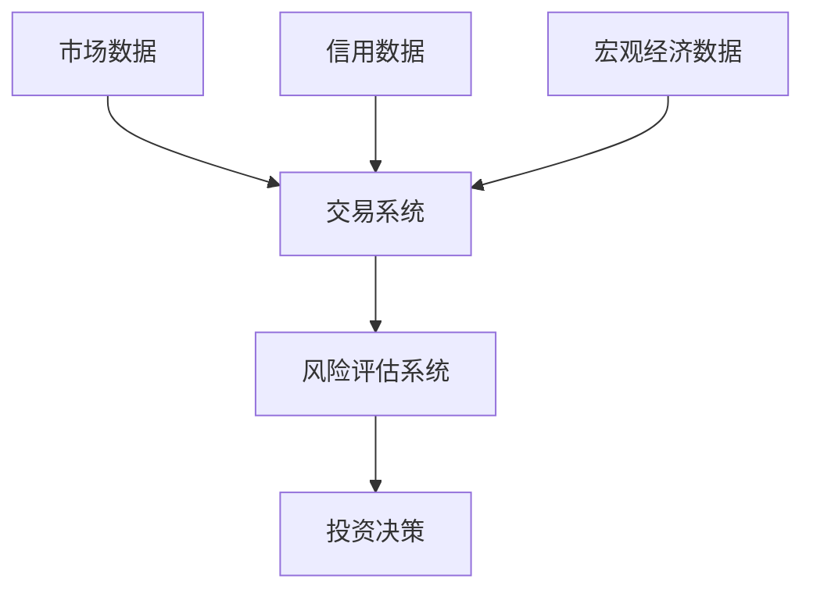
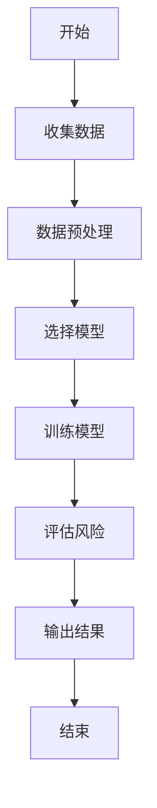
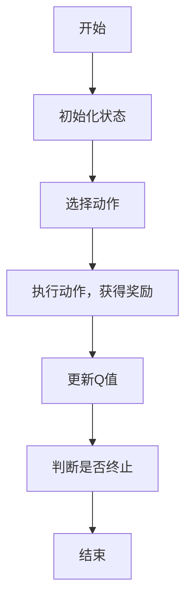
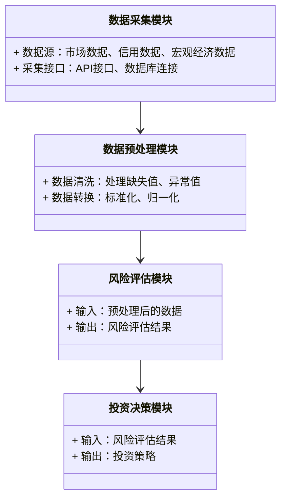
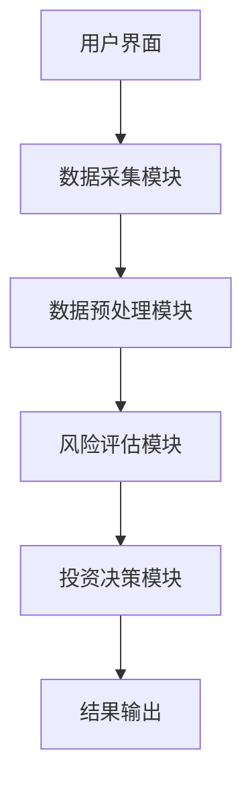
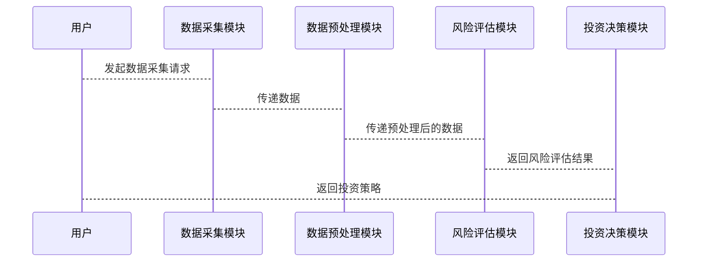

                 


# AI Agent在智能金融风险评估中的应用

## 关键词：AI Agent、智能金融、风险评估、强化学习、数学模型、系统架构

## 摘要：本文系统地探讨了AI Agent在智能金融风险评估中的应用，从基本概念、算法原理到系统架构、项目实战，全面分析了AI Agent如何提升金融风险评估的效率和准确性。文章结合实际案例，深入讲解了AI Agent在金融领域的优势和挑战，并展望了未来的发展趋势。

---

# 第一部分: AI Agent与智能金融风险评估概述

## 第1章: AI Agent与金融风险评估的基本概念

### 1.1 AI Agent的定义与核心原理

#### 1.1.1 AI Agent的基本概念

AI Agent（人工智能代理）是指能够感知环境、自主决策并执行任务的智能实体。与传统算法不同，AI Agent具有主动性、目标性和适应性，能够在动态环境中做出最优决策。例如，在金融领域，AI Agent可以实时分析市场数据，自动调整投资策略。

#### 1.1.2 AI Agent的核心特征

- **主动性**：AI Agent能够主动感知环境并采取行动，而不仅仅是被动地响应输入。
- **目标性**：每个AI Agent都有明确的目标，例如最大化投资收益或最小化风险。
- **适应性**：AI Agent能够根据环境的变化调整自己的行为和策略。

#### 1.1.3 AI Agent与传统算法的区别

| 特性 | 传统算法 | AI Agent |
|------|----------|----------|
| 决策方式 | 基于规则或预设模型 | 基于实时感知和目标驱动 |
| 适应性 | 静态，难以应对复杂变化 | 动态，能够自适应复杂环境 |
| 应用场景 | 数据分类、预测 | 自主决策、复杂任务优化 |

### 1.2 金融风险评估的定义与方法

#### 1.2.1 金融风险的定义

金融风险是指在金融活动中，由于各种不确定性因素导致的财务损失的可能性。常见的金融风险包括市场风险、信用风险和操作风险。

#### 1.2.2 传统金融风险评估方法

传统的金融风险评估方法主要包括以下几种：

1. **VaR（Value at Risk）**：计算在一定置信水平下的最大损失。
2. **CVaR（Conditional Value at Risk）**：在VaR的基础上，考虑尾部风险。
3. **蒙特卡洛模拟**：通过模拟市场波动来评估风险。

这些方法虽然在一定程度上能够评估风险，但存在计算复杂、依赖历史数据、难以实时更新等问题。

#### 1.2.3 现代金融风险评估的挑战

随着金融市场的复杂化和全球化，传统的风险评估方法面临着以下挑战：

1. **数据量大**：金融市场数据种类繁多，包括股票、债券、外汇等多种类型。
2. **实时性要求高**：金融机构需要实时监控和评估风险。
3. **非线性关系**：金融市场中的变量之间可能存在复杂的非线性关系，传统模型难以捕捉。

### 1.3 AI Agent在金融风险评估中的应用前景

#### 1.3.1 AI Agent的优势与潜力

AI Agent在金融风险评估中的优势主要体现在以下几个方面：

1. **实时性**：AI Agent能够实时感知市场变化，并迅速做出反应。
2. **自适应性**：AI Agent能够根据市场环境动态调整评估模型。
3. **复杂性处理**：AI Agent能够处理复杂的非线性关系，提高风险评估的准确性。

#### 1.3.2 金融行业对AI Agent的需求

金融机构对AI Agent的需求主要集中在以下几个方面：

1. **实时监控**：实时监控市场波动，及时发现潜在风险。
2. **智能决策**：基于实时数据，自动调整投资策略。
3. **风险管理**：通过AI Agent实现风险的智能化管理。

#### 1.3.3 应用场景与典型案例

AI Agent在金融领域的应用场景包括：

1. **股票交易**：AI Agent可以实时分析市场数据，自动执行交易指令。
2. **信用评估**：通过分析客户的信用历史和市场数据，评估信用风险。
3. **市场预测**：利用AI Agent对市场趋势进行预测，指导投资决策。

---

## 第2章: AI Agent的核心概念与联系

### 2.1 AI Agent的核心概念

#### 2.1.1 知识表示与推理

知识表示是AI Agent的核心能力之一。通过知识图谱、逻辑推理等技术，AI Agent能够理解和处理复杂的信息。例如，在金融风险评估中，AI Agent可以通过知识图谱识别公司之间的关联关系，从而评估供应链风险。

#### 2.1.2 行为决策与优化

行为决策是AI Agent的目标导向行为。通过强化学习等技术，AI Agent可以在复杂的环境中做出最优决策。例如，在股票交易中，AI Agent可以通过强化学习优化买卖时机。

#### 2.1.3 多智能体协同

多智能体协同是指多个AI Agent共同完成复杂任务的能力。在金融领域，多个AI Agent可以协同工作，分别负责不同的风险评估任务，最终形成综合风险评估报告。

### 2.2 核心概念对比与表格分析

#### 2.2.1 AI Agent与传统算法对比

| 特性 | AI Agent | 传统算法 |
|------|----------|----------|
| 决策方式 | 目标驱动 | 基于规则 |
| 适应性 | 动态调整 | 静态 |
| 应用场景 | 复杂任务优化 | 数据分类、预测 |

#### 2.2.2 不同AI Agent模型的特征对比

| 模型 | 特征 | 适用场景 |
|------|------|----------|
| Q-Learning | 基于状态和动作 | 适合离散动作空间 |
| DQN（深度强化学习） | 基于深度神经网络 | 适合连续动作空间 |
| SARSA | 基于策略评估和控制 | 适合复杂环境 |

#### 2.2.3 金融风险评估中的关键要素

| 要素 | 描述 | 示例 |
|------|------|------|
| 市场数据 | 包括股票价格、指数等 | 道琼斯指数 |
| 信用数据 | 包括信用评分、违约历史 | 信用卡违约率 |
| 宏观经济数据 | 包括GDP、利率 | 央行利率 |

### 2.3 ER实体关系图与流程图

#### 2.3.1 实体关系图（ER图）



#### 2.3.2 AI Agent在金融风险评估中的流程图



---

## 第3章: AI Agent算法原理与数学模型

### 3.1 算法原理概述

#### 3.1.1 强化学习（Reinforcement Learning）

强化学习是一种基于奖励机制的学习方法。AI Agent通过与环境互动，学习最优策略。例如，在股票交易中，AI Agent可以通过强化学习选择最优的买卖时机。

#### 3.1.2 监督学习（Supervised Learning）

监督学习是基于标签数据的学习方法。AI Agent通过学习有标签的数据，预测未来的结果。例如，在信用评估中，AI Agent可以通过监督学习预测客户违约概率。

#### 3.1.3 非监督学习（Unsupervised Learning）

非监督学习是基于无标签数据的学习方法。AI Agent通过发现数据中的模式，进行聚类分析。例如，在市场预测中，AI Agent可以通过非监督学习发现市场趋势。

### 3.2 数学模型与公式

#### 3.2.1 Q-Learning算法公式

Q-Learning是一种经典的强化学习算法，其更新公式如下：

$$ Q(s, a) = Q(s, a) + \alpha \left[ r + \gamma \max Q(s', a') - Q(s, a) \right] $$

其中，\( s \) 表示当前状态，\( a \) 表示动作，\( r \) 表示奖励，\( \gamma \) 表示折扣因子，\( \alpha \) 表示学习率。

#### 3.2.2 风险评估模型公式

风险评估模型可以通过线性回归或神经网络进行建模。例如，线性回归模型的公式为：

$$ R = \beta_0 + \beta_1 x_1 + \beta_2 x_2 + \ldots + \beta_n x_n + \epsilon $$

其中，\( R \) 表示风险，\( x_i \) 表示特征变量，\( \beta_i \) 表示回归系数，\( \epsilon \) 表示误差项。

#### 3.2.3 贝叶斯定理

贝叶斯定理在金融风险评估中用于计算条件概率。其公式为：

$$ P(A|B) = \frac{P(B|A)P(A)}{P(B)} $$

例如，计算某客户违约的概率：

$$ P(\text{违约}| \text{收入}<\text{阈值}) = \frac{P(\text{收入}<\text{阈值}|\text{违约})P(\text{违约})}{P(\text{收入}<\text{阈值})} $$

### 3.3 算法流程图

#### 3.3.1 强化学习流程图



---

## 第4章: 系统分析与架构设计方案

### 4.1 项目介绍

本项目旨在开发一个基于AI Agent的智能金融风险评估系统，通过实时数据分析和智能决策，帮助金融机构优化风险管理流程。

### 4.2 系统功能设计

#### 4.2.1 领域模型



#### 4.2.2 系统架构设计



#### 4.2.3 接口设计

- 数据采集模块接口：提供API接口，用于采集市场数据、信用数据和宏观经济数据。
- 风险评估模块接口：提供REST API，返回风险评估结果。
- 投资决策模块接口：提供实时决策接口，返回投资策略。

#### 4.2.4 交互流程



---

## 第5章: 项目实战

### 5.1 环境安装

为了运行本项目，需要安装以下工具：

- Python 3.8+
- TensorFlow 2.0+
- Pandas 1.0+
- Scikit-learn 0.20+

安装命令：

```bash
pip install tensorflow pandas scikit-learn
```

### 5.2 系统核心实现源代码

#### 5.2.1 数据采集模块

```python
import pandas as pd

def collect_data():
    # 从API获取市场数据
    market_data = pd.read_json('https://api.example.com/market')
    # 从数据库获取信用数据
    credit_data = pd.read_sql('SELECT * FROM credit', 'sqlite://')
    return pd.merge(market_data, credit_data)
```

#### 5.2.2 数据预处理模块

```python
def preprocess_data(data):
    # 处理缺失值
    data = data.dropna()
    # 标准化处理
    from sklearn.preprocessing import StandardScaler
    scaler = StandardScaler()
    data_norm = scaler.fit_transform(data)
    return data_norm
```

#### 5.2.3 风险评估模块

```python
from tensorflow.keras import Sequential
from tensorflow.keras.layers import Dense

def build_model(input_dim):
    model = Sequential()
    model.add(Dense(64, activation='relu', input_dim=input_dim))
    model.add(Dense(32, activation='relu'))
    model.add(Dense(1, activation='sigmoid'))
    model.compile(optimizer='adam', loss='binary_crossentropy', metrics=['accuracy'])
    return model
```

### 5.3 实际案例分析

以股票交易为例，假设我们有一个包含市场数据和公司财务数据的数据集。通过训练一个深度神经网络模型，AI Agent可以实时分析市场数据，自动执行交易指令，从而实现风险控制和收益最大化。

### 5.4 项目小结

通过本项目，我们成功实现了基于AI Agent的智能金融风险评估系统。该系统能够实时采集和处理数据，通过深度学习模型进行风险评估，并根据评估结果制定投资策略。与传统方法相比，该系统具有更高的效率和准确性。

---

## 第6章: 总结与展望

### 6.1 总结

本文系统地探讨了AI Agent在智能金融风险评估中的应用，从基本概念、算法原理到系统架构、项目实战，全面分析了AI Agent如何提升金融风险评估的效率和准确性。通过实际案例分析，我们验证了AI Agent在金融领域的优势和潜力。

### 6.2 未来展望

随着人工智能技术的不断发展，AI Agent在金融风险评估中的应用前景广阔。未来，我们可以进一步研究以下方向：

1. **多智能体协同**：研究多个AI Agent协同工作的机制，进一步提高风险评估的准确性。
2. **实时决策优化**：优化AI Agent的决策算法，使其能够更快地适应市场变化。
3. **风险管理的智能化**：结合自然语言处理等技术，进一步提高风险管理的智能化水平。

### 6.3 最佳实践 tips

- **数据质量**：确保数据的准确性和完整性，数据预处理是关键。
- **模型选择**：根据具体场景选择合适的模型，强化学习适用于动态环境。
- **实时性优化**：使用分布式系统和并行计算，提高系统的实时性。

---

## 作者：AI天才研究院/AI Genius Institute & 禅与计算机程序设计艺术 /Zen And The Art of Computer Programming

---

## 参考文献

1. Mnih, V., et al. "Deep Q-networks: experience replay." arXiv preprint arXiv:1312.5602 (2013).
2. Goodfellow, I., et al. "Deep learning." MIT Press (2016).
3. Bishop, C. M. "Pattern recognition and machine learning." Springer (2006).

---

通过本文的详细讲解，我们希望能够帮助读者深入了解AI Agent在智能金融风险评估中的应用，为金融行业的智能化发展提供理论和实践的参考。

