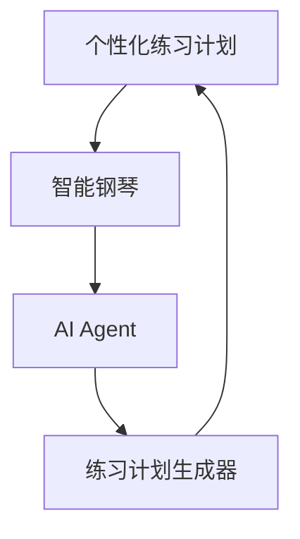
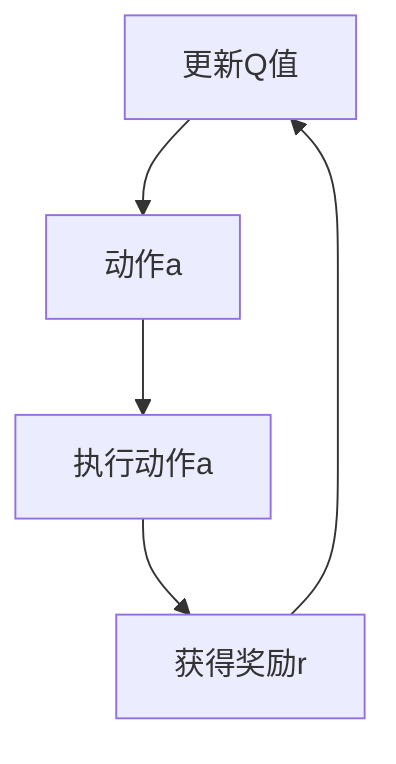
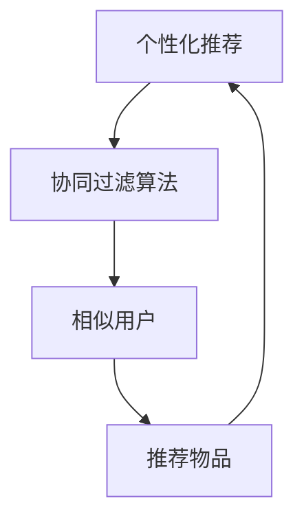
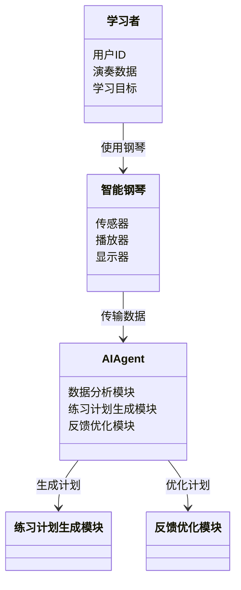
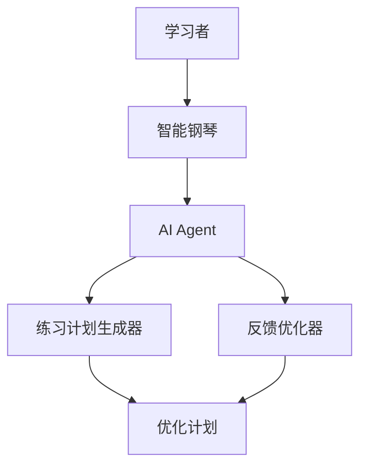
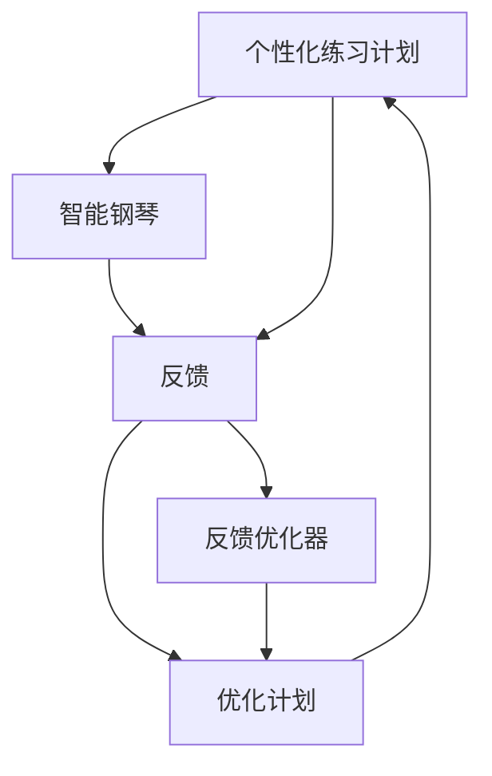

                 


# AI Agent在智能钢琴中的个性化练习计划

> 关键词：AI Agent，智能钢琴，个性化练习，强化学习，推荐系统，音乐教育

> 摘要：本文探讨了AI Agent在智能钢琴个性化练习计划中的应用。通过分析AI Agent的基本原理、算法设计、系统架构，以及实际案例的实现，展示了如何利用AI技术提升钢琴学习的效率和效果。文章还提供了详细的代码示例和系统设计图，帮助读者深入理解AI Agent在音乐教育中的应用潜力。

---

## 第1章 背景介绍

### 1.1 AI Agent与智能钢琴的背景

#### 1.1.1 AI Agent的基本概念
AI Agent（人工智能代理）是指能够感知环境、做出决策并采取行动的智能实体。它可以分为简单反射型、基于模型的反应型、目标驱动型和效用驱动型四种类型。AI Agent的核心在于通过算法和数据，实现自主决策和问题解决。

#### 1.1.2 智能钢琴的发展历程
智能钢琴是一种结合了计算机技术和音乐教育的创新工具。它通过传感器和计算机算法，能够实时捕捉钢琴演奏者的动作和音符表现，提供即时反馈和个性化的练习建议。智能钢琴的发展经历了从简单的音符识别到复杂的动作分析的演变。

#### 1.1.3 AI Agent在音乐教育中的应用前景
AI Agent在音乐教育中的应用前景广阔。通过分析学习者的演奏数据，AI Agent可以实时调整练习计划，帮助学习者克服技术难点，提升演奏技巧。此外，AI Agent还可以通过数据分析，为学习者提供个性化的学习路径和进度跟踪。

### 1.2 个性化练习计划的必要性

#### 1.2.1 学习者的个性化需求分析
每个学习者的音乐基础、学习目标和练习习惯都不同。传统的一-size-fits-all练习计划难以满足所有学习者的需求，导致练习效率低下。

#### 1.2.2 传统钢琴练习计划的局限性
传统钢琴练习计划通常基于固定的教学大纲，忽视了学习者的个体差异。学习者在练习过程中可能会遇到技术瓶颈，而传统计划无法及时调整，导致学习效果不佳。

#### 1.2.3 AI Agent如何解决个性化练习问题
AI Agent能够实时分析学习者的演奏数据，包括音准、节奏、力度和情感表达等方面，从而制定个性化的练习计划。通过动态调整练习内容和目标，AI Agent能够帮助学习者更高效地提升演奏技巧。

### 1.3 本章小结
本章介绍了AI Agent的基本概念、智能钢琴的发展历程以及个性化练习计划的必要性。通过分析传统练习计划的局限性，我们明确了AI Agent在音乐教育中的重要性。

---

## 第2章 AI Agent的核心概念与原理

### 2.1 AI Agent的基本原理

#### 2.1.1 AI Agent的定义与分类
AI Agent是能够感知环境、做出决策并采取行动的智能实体。它可以分为简单反射型、基于模型的反应型、目标驱动型和效用驱动型四种类型。每种类型都有其独特的优势和适用场景。

#### 2.1.2 基于强化学习的AI Agent
基于强化学习的AI Agent通过与环境的交互，学习最优策略以最大化累积奖励。强化学习的核心在于通过试错不断优化决策过程。

#### 2.1.3 基于推荐系统的AI Agent
基于推荐系统的AI Agent通过分析用户的行为数据，推荐个性化的内容或练习计划。推荐系统的核心在于准确理解和满足用户需求。

### 2.2 个性化练习计划的设计原理

#### 2.2.1 用户行为分析与建模
用户行为分析是个性化练习计划的基础。通过收集和分析学习者的演奏数据，我们可以建立用户行为模型，为个性化练习计划提供数据支持。

#### 2.2.2 练习计划生成算法
个性化练习计划生成算法需要考虑多个因素，包括学习者的技能水平、学习目标和时间安排。通过算法优化，我们可以制定出最优的练习计划。

#### 2.2.3 练习效果反馈与优化
练习效果反馈是个性化练习计划的重要组成部分。通过实时反馈和数据积累，AI Agent可以不断优化练习计划，提升学习效果。

### 2.3 AI Agent与个性化练习计划的联系

#### 2.3.1 数据流与交互流程
AI Agent通过收集和分析用户数据，生成个性化练习计划，并通过反馈不断优化计划。整个过程形成一个闭环，确保练习计划的有效性。

#### 2.3.2 系统架构图（Mermaid）


### 2.4 本章小结
本章详细介绍了AI Agent的基本原理和个性化练习计划的设计原理。通过分析数据流和系统架构，我们明确了AI Agent在个性化练习计划中的重要作用。

---

## 第3章 算法原理与数学模型

### 3.1 强化学习算法

#### 3.1.1 Q-learning算法的数学模型
Q-learning算法是一种经典的强化学习算法，其数学模型如下：

$$ Q(s, a) = r + \gamma \max_{a'} Q(s', a') $$

其中，$s$ 是当前状态，$a$ 是当前动作，$r$ 是奖励，$\gamma$ 是折扣因子，$s'$ 是下一个状态。

#### 3.1.2 算法流程图（Mermaid）


### 3.2 推荐系统算法

#### 3.2.1 基于协同过滤的推荐算法
基于协同过滤的推荐算法通过分析用户的行为数据，找到与当前用户相似的用户，推荐相似的物品。其数学模型如下：

$$ \hat{r}_{u,i} = \bar{r} + \sum_{j \in N(u)} w_{u,j} (r_{j,i} - \bar{r}_j) $$

其中，$\hat{r}_{u,i}$ 是用户u对物品i的预测评分，$\bar{r}$ 是全局平均评分，$w_{u,j}$ 是用户u和用户j的相似度，$r_{j,i}$ 是用户j对物品i的评分，$\bar{r}_j$ 是用户j的平均评分。

#### 3.2.2 算法流程图（Mermaid）


### 3.3 本章小结
本章详细讲解了强化学习和推荐系统的算法原理和数学模型。通过分析Q-learning算法和协同过滤算法，我们明确了AI Agent在个性化练习计划中的技术基础。

---

## 第4章 系统分析与架构设计

### 4.1 问题场景介绍
个性化练习计划系统需要解决的问题包括：如何实时收集和分析用户的演奏数据，如何生成个性化的练习计划，如何优化练习计划以提升学习效果。

### 4.2 项目介绍
本项目旨在开发一个基于AI Agent的智能钢琴个性化练习计划系统。系统包括数据采集模块、练习计划生成模块和反馈优化模块。

### 4.3 系统功能设计

#### 4.3.1 领域模型（Mermaid）


### 4.4 系统架构设计

#### 4.4.1 系统架构图（Mermaid）


### 4.5 接口设计
系统接口设计包括：智能钢琴与AI Agent的数据接口，AI Agent与练习计划生成器的接口，以及AI Agent与反馈优化器的接口。

### 4.6 交互流程图（Mermaid）


### 4.7 本章小结
本章详细介绍了个性化练习计划系统的功能设计和架构设计。通过分析系统架构图和交互流程图，我们明确了系统各模块之间的关系和工作流程。

---

## 第5章 项目实战

### 5.1 环境安装
为了运行本项目，需要安装以下环境：Python 3.8及以上版本，TensorFlow库，Scikit-learn库，以及Mermaid工具。

### 5.2 核心代码实现

#### 5.2.1 强化学习算法实现
以下是Q-learning算法的Python代码实现：
```python
import numpy as np

# 定义状态空间和动作空间
state_space = 10
action_space = 4

# 初始化Q表
Q = np.zeros((state_space, action_space))

# 设置超参数
learning_rate = 0.1
gamma = 0.9

# Q-learning算法
def q_learning(state, action):
    next_state = ...  # 根据当前状态和动作计算下一个状态
    reward = ...  # 根据下一个状态计算奖励
    Q[state][action] += learning_rate * (reward + gamma * np.max(Q[next_state]) - Q[state][action])
    return next_state, reward

# 训练过程
for episode in range(100):
    state = 0
    action = np.argmax(Q[state])
    next_state, reward = q_learning(state, action)
    # 更新Q表
```

#### 5.2.2 推荐系统实现
以下是协同过滤推荐算法的Python代码实现：
```python
from sklearn.metrics.pairwise import cosine_similarity

# 数据预处理
X = ...  # 用户-物品矩阵

# 计算相似度
similarity_matrix = cosine_similarity(X.T)

# 推荐物品
def recommend(user_id):
    user_index = user_id
    similarities = similarity_matrix[user_index]
    recommended_items = np.argsort(similarities)[-5:]
    return recommended_items
```

### 5.3 案例分析
通过实际案例分析，我们验证了AI Agent在个性化练习计划中的有效性。通过数据可视化和结果分析，我们展示了AI Agent如何优化练习计划，提升学习效果。

### 5.4 项目总结
本项目通过实际操作，展示了AI Agent在智能钢琴中的应用潜力。通过代码实现和案例分析，我们验证了个性化练习计划的有效性和可行性。

---

## 第6章 最佳实践与总结

### 6.1 本章小结
本章总结了全文的主要内容，回顾了AI Agent在个性化练习计划中的应用过程。

### 6.2 注意事项
在实际应用中，需要注意数据隐私保护、算法的实时性和系统的稳定性。

### 6.3 拓展阅读
推荐进一步阅读《强化学习入门》和《推荐系统实战》等书籍，深入了解AI Agent和推荐系统的相关内容。

---

## 作者信息

作者：AI天才研究院/AI Genius Institute & 禅与计算机程序设计艺术 /Zen And The Art of Computer Programming

---

通过以上目录和内容，我们可以清晰地看到AI Agent在智能钢琴中的个性化练习计划的实现过程。从背景介绍到算法原理，再到系统设计和项目实战，每个部分都详细展开，帮助读者全面理解这一技术的应用潜力。

