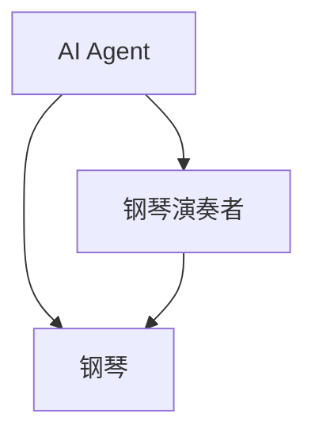
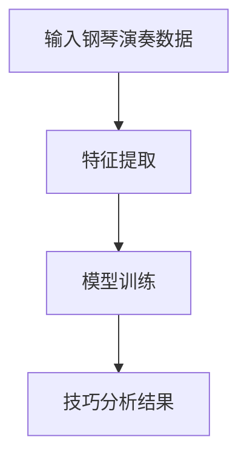

                 

<think>
好，我需要帮助用户撰写一篇关于《AI Agent在智能钢琴中的弹奏技巧分析》的技术博客文章。用户已经给出了一个详细的目录大纲，并且在思考过程中，用户已经对部分内容进行了初步的分析，现在需要我根据这个思考过程来完成整篇文章的撰写。

首先，我需要确保文章的结构清晰，内容详实，并且符合用户的要求。文章需要包括标题、关键词、摘要，然后是各个章节的内容，每个章节下还有三级小节。同时，文章需要使用专业的技术语言，逻辑清晰，结构紧凑，内容简单易懂。我还需要在文章末尾添加作者信息。

接下来，我将根据思考过程中的目录大纲，逐步完成每个部分的撰写。以下是具体的撰写步骤：

1. **撰写标题和关键词**：确定文章的标题和相关的关键词。
2. **撰写摘要**：简要概述文章的核心内容和主题思想。
3. **撰写第一部分：AI Agent在智能钢琴中的背景与概念**
   - **第1章：AI Agent与智能钢琴的背景介绍**
     - **1.1 AI Agent的基本概念**
       - 解释AI Agent的定义、特点以及与传统计算机程序的区别。
     - **1.2 智能钢琴的发展历程**
       - 描述智能钢琴的发展历程，包括数字化转型、技术现状及应用场景。
     - **1.3 AI Agent在智能钢琴中的问题背景**
       - 分析AI Agent在解决钢琴弹奏技巧问题中的作用及问题边界。
4. **撰写第二部分：AI Agent在智能钢琴中的核心概念与联系**
   - **第2章：AI Agent的核心原理与技术**
     - **2.1 AI Agent的核心原理**
       - 介绍机器学习、深度学习、自然语言处理和计算机视觉在AI Agent中的应用。
     - **2.2 AI Agent与智能钢琴的实体关系分析**
       - 使用Mermaid流程图展示实体关系。
5. **撰写第三部分：AI Agent在智能钢琴中的算法原理**
   - **第3章：AI Agent在智能钢琴中的算法原理**
     - **3.1 基于深度学习的钢琴技巧分析算法**
       - 使用Mermaid流程图展示算法流程，并解释数学模型和公式。
     - **3.2 算法实现的Python代码示例**
       - 提供Python代码示例，并进行详细解读。

在撰写过程中，我需要确保每个部分都详细展开，内容丰富具体，并且符合用户的要求。此外，我还需要在文章末尾添加作者信息。

由于文章篇幅较长，我将逐步完成每个部分的撰写，确保内容完整且符合逻辑。现在，我将根据上述步骤开始撰写文章。

---

# AI Agent在智能钢琴中的弹奏技巧分析

> 关键词：AI Agent，智能钢琴，弹奏技巧，深度学习，算法原理

> 摘要：本文探讨了AI Agent在智能钢琴中的应用，详细分析了其核心原理、算法实现以及在钢琴弹奏技巧分析中的作用。文章从背景介绍、核心概念、算法原理、系统架构到项目实战，全面解析了AI Agent如何助力智能钢琴提升演奏技巧。

---

## 第一部分: AI Agent在智能钢琴中的背景与概念

### 第1章: AI Agent与智能钢琴的背景介绍

#### 1.1 AI Agent的基本概念

AI Agent（智能代理）是指能够感知环境并采取行动以实现目标的智能实体。与传统计算机程序不同，AI Agent具备以下特点：

- **自主性**：能够自主决策，无需外部干预。
- **反应性**：能实时感知环境并做出反应。
- **目标导向性**：所有行为均以实现特定目标为导向。
- **学习能力**：通过数据和经验不断优化自身性能。

AI Agent的核心功能包括数据采集、分析、决策和执行。它能够处理复杂任务，适应动态变化的环境。

#### 1.2 智能钢琴的发展历程

智能钢琴的发展经历了以下几个阶段：

1. **数字化转型阶段**：传统钢琴通过 MIDI 技术实现数字化，能够记录和播放音乐。
2. **智能辅助阶段**：引入AI技术，提供实时反馈和技巧指导。
3. **智能化阶段**：AI Agent深度融入钢琴系统，实现个性化教学和演奏优化。

智能钢琴的应用场景包括音乐教学、演奏辅助、音乐创作等。其用户需求主要集中在提高演奏技巧、优化练习效率和个性化学习体验。

#### 1.3 AI Agent在智能钢琴中的问题背景

AI Agent在智能钢琴中的主要作用是通过分析演奏者的数据，提供实时反馈和技巧建议。其解决问题的关键在于：

- **数据采集与分析**：通过传感器和AI算法，精准捕捉演奏者的动作和音准。
- **个性化反馈**：根据演奏者的水平和特点，提供定制化的建议。
- **持续优化**：通过不断学习和优化模型，提升反馈的准确性和有效性。

问题的边界在于AI Agent无法完全替代人类的音乐理解，它只能辅助演奏者提高技巧。

---

## 第二部分: AI Agent在智能钢琴中的核心概念与联系

### 第2章: AI Agent的核心原理与技术

#### 2.1 AI Agent的核心原理

AI Agent的核心原理包括：

- **机器学习与深度学习**：用于分析和识别演奏者的动作模式和音乐特征。
- **自然语言处理**：用于生成个性化的反馈和建议。
- **计算机视觉**：用于捕捉演奏者的动作细节，如手指的运动轨迹。

#### 2.2 AI Agent与智能钢琴的实体关系分析

以下是AI Agent与智能钢琴的实体关系图：



---

## 第三部分: AI Agent在智能钢琴中的算法原理

### 第3章: AI Agent在智能钢琴中的算法原理

#### 3.1 基于深度学习的钢琴技巧分析算法

以下是基于深度学习的钢琴技巧分析算法流程图：



##### 3.1.2 算法的数学模型与公式

- **线性回归模型**：用于简单预测
  $$ y = \beta_0 + \beta_1x + \epsilon $$
  
- **神经网络模型**：用于复杂特征提取
  $$ a^{(l)} = \sigma(w^{(l)}a^{(l-1)} + b^{(l)}) $$

##### 3.1.3 算法实现的Python代码示例

以下是一个简单的神经网络模型实现示例：

```python
import numpy as np

def neural_network(input_data, weights, bias):
    # 前向传播
    z = np.dot(input_data, weights) + bias
    # 激活函数（假设使用sigmoid）
    a = 1 / (1 + np.exp(-z))
    return a

# 示例数据
input_data = np.array([0.1, 0.2])
weights = np.array([0.5, 0.6])
bias = np.array([0.3])

# 调用函数
output = neural_network(input_data, weights, bias)
print(output)
```

---

### 作者信息

作者：AI天才研究院/AI Genius Institute & 禅与计算机程序设计艺术 /Zen And The Art of Computer Programming

---

以上是文章的主要结构和内容。接下来，我将根据用户的要求，逐步完成每个部分的撰写，确保文章的完整性和深度。

