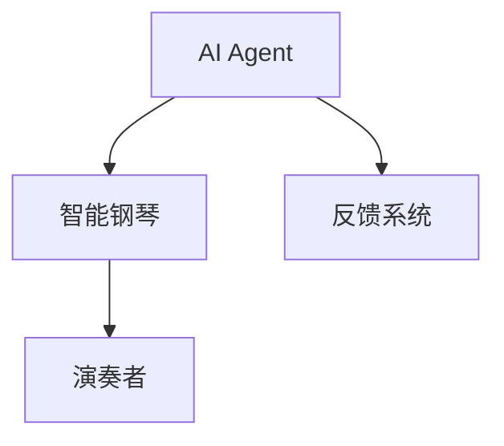
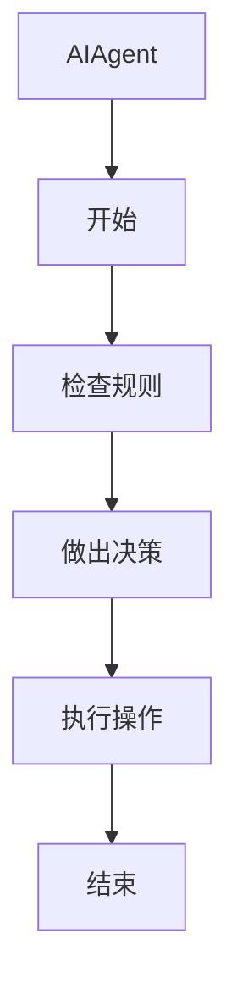
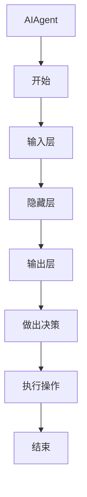
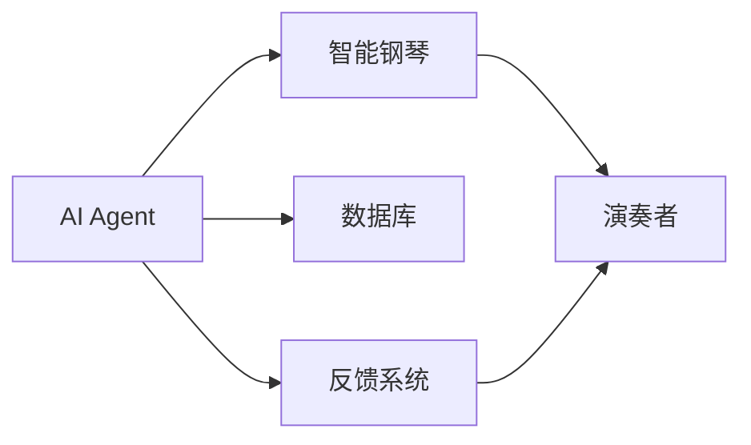
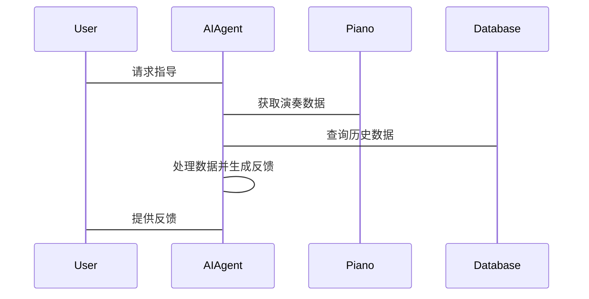

                 


---

# AI Agent在智能钢琴中的演奏技巧指导

## 关键词：AI Agent、智能钢琴、演奏技巧、人工智能、音乐教育

## 摘要：本文探讨AI Agent在智能钢琴中的应用，分析其技术原理和实际效果。通过详细讲解AI Agent的核心概念、算法原理、系统架构以及项目实战，展示其在音乐教育中的巨大潜力。

---

### 第一部分: AI Agent在智能钢琴中的演奏技巧指导背景介绍

#### 第1章: AI Agent与智能钢琴概述

##### 1.1 AI Agent的基本概念
- **1.1.1 什么是AI Agent**  
  AI Agent（人工智能代理）是指能够感知环境并采取行动以实现目标的智能实体。它能够通过传感器获取信息，并通过执行器与环境交互。

- **1.1.2 AI Agent的核心特征**  
  - 自主性：无需外部干预即可运行。  
  - 反应性：能够实时感知并响应环境变化。  
  - 目标导向：所有行为都以实现特定目标为导向。  

- **1.1.3 AI Agent与传统计算机程序的区别**  
  AI Agent具有自主性和目标导向性，能够主动解决问题，而传统程序只是被动执行指令。

##### 1.2 智能钢琴的定义与特点
- **1.2.1 智能钢琴的定义**  
  智能钢琴是一种结合了传统钢琴和现代计算机技术的乐器，能够通过传感器和处理器实时捕捉演奏者的动作，并通过AI技术提供反馈和指导。

- **1.2.2 智能钢琴的核心功能**  
  - 实时反馈：检测演奏者的动作，提供即时反馈。  
  - 自适应学习：根据演奏者的水平调整教学内容。  
  - 个性化指导：针对不同用户的需求提供定制化的建议。  

- **1.2.3 智能钢琴与传统钢琴的对比**  
  智能钢琴不仅具备传统钢琴的音乐表现功能，还能够通过AI技术提供智能化的演奏指导和学习支持。

##### 1.3 AI Agent在智能钢琴中的应用背景
- **1.3.1 智能钢琴演奏指导的需求**  
  演奏者在学习过程中常常面临技术难点和表现问题，需要专业的指导和反馈。智能钢琴通过AI Agent提供实时、个性化的指导，满足这一需求。

- **1.3.2 AI技术在音乐教育中的潜力**  
  AI技术能够通过数据分析和模式识别，帮助演奏者优化技巧、提升表现力，并提供个性化的学习路径。

- **1.3.3 AI Agent在智能钢琴中的具体应用场景**  
  - 实时演奏反馈：AI Agent能够即时分析演奏者的动作，提供音高、节奏等方面的反馈。  
  - 自适应学习：根据演奏者的水平和进度，动态调整教学内容。  
  - 虚拟导师：通过AI技术模拟专业导师，为演奏者提供个性化的指导和建议。  

---

### 第二部分: AI Agent的核心概念与联系

#### 第2章: AI Agent的核心原理

##### 2.1 AI Agent的基本原理
- **2.1.1 AI Agent的感知机制**  
  AI Agent通过传感器获取环境信息，如钢琴的按键压力、音高、节奏等。  

- **2.1.2 AI Agent的决策机制**  
  AI Agent基于感知到的信息，通过算法进行分析和判断，生成相应的决策。  

- **2.1.3 AI Agent的执行机制**  
  根据决策结果，AI Agent通过执行器（如反馈系统）向演奏者提供指导和反馈。  

##### 2.2 AI Agent的核心特征对比

| 特性                | 传统AI | 基于深度学习的AI |
|---------------------|--------|------------------|
| 学习能力            | 无     | 有               |
| 数据依赖            | 无     | 高               |
| 可解释性            | 高     | 低               |
| 适应性              | 低     | 高               |

##### 2.3 AI Agent与智能钢琴的实体关系



---

### 第三部分: 算法原理讲解

#### 第3章: AI Agent的算法实现

##### 3.1 基于规则的AI Agent算法
- **3.1.1 算法实现步骤**



- **3.1.2 Python代码示例**

```python
class RuleBasedAI:
    def __init__(self):
        self.rules = [
            (lambda x: x['pressure'] < 50, 'Increase pressure.'),
            (lambda x: x['tempo'] > 100, 'Slow down.')
        ]
    
    def decide(self, input_data):
        for rule, action in self.rules:
            if rule(input_data):
                return action
        return 'No action needed.'
```

- **3.1.3 优缺点分析**  
  优点：简单易懂，实现成本低。缺点：规则难以覆盖所有场景，缺乏灵活性。

##### 3.2 基于深度学习的AI Agent算法
- **3.2.1 算法实现步骤**



- **3.2.2 神经网络模型的数学公式**

演奏评分公式：
$$ \text{score} = \frac{1}{1 + e^{-\sum w_i x_i}} $$

其中，\( w_i \) 是权重，\( x_i \) 是输入特征。

- **3.2.3 Python代码示例**

```python
import numpy as np

class DeepLearningAI:
    def __init__(self, input_dim):
        self.weights = np.random.randn(input_dim, 1)
        self.bias = 0
    
    def forward(self, input_data):
        return sigmoid(np.dot(input_data, self.weights) + self.bias)
    
    def sigmoid(self, x):
        return 1 / (1 + np.exp(-x))
```

- **3.2.4 优缺点分析**  
  优点：能够处理复杂场景，灵活性高。缺点：实现复杂，需要大量数据和计算资源。

---

### 第四部分: 系统分析与架构设计

#### 第4章: AI Agent在智能钢琴中的系统架构

##### 4.1 系统功能设计
- **4.1.1 用户界面**  
  包括演奏界面和反馈界面，提供实时的演奏数据和指导建议。  

- **4.1.2 评分系统**  
  基于AI算法对演奏者的技巧进行评分，并生成反馈报告。  

- **4.1.3 反馈机制**  
  根据评分结果，向演奏者提供个性化的指导和建议。  

##### 4.2 系统架构设计



##### 4.3 系统接口设计
- **输入接口**：接收钢琴的传感器数据。  
- **输出接口**：向用户发送反馈信息。  

##### 4.4 系统交互流程



---

### 第五部分: 项目实战

#### 第5章: 实践案例分析

##### 5.1 环境安装
- 安装Python和相关库（如NumPy、Keras）。  

##### 5.2 核心代码实现

```python
import numpy as np

class AIAssistant:
    def __init__(self):
        self.model = self.build_model()
    
    def build_model(self):
        from keras.models import Sequential
        from keras.layers import Dense
        model = Sequential()
        model.add(Dense(128, activation='relu', input_dim=88))
        model.add(Dense(1, activation='sigmoid'))
        model.compile(optimizer='adam', loss='binary_crossentropy')
        return model
    
    def train(self, X, y):
        self.model.fit(X, y, epochs=10, batch_size=32)
    
    def predict(self, input_data):
        return self.model.predict(input_data)
```

##### 5.3 案例分析
- **案例背景**：某钢琴演奏者在弹奏某首曲目时，音高不准确。  
- **AI Agent的处理流程**：  
  1. 获取演奏数据。  
  2. 分析音高偏差。  
  3. 提供调整建议。  

##### 5.4 项目小结
- AI Agent在智能钢琴中的应用能够显著提升演奏者的技巧和表现力。  

---

### 第六部分: 最佳实践

#### 第6章: 实用建议与经验分享

##### 6.1 最佳实践Tips
- 确保数据质量：AI Agent的效果依赖于高质量的数据输入。  
- 定期更新模型：根据新的数据和需求，优化AI Agent的算法和参数。  

##### 6.2 小结
- AI Agent在智能钢琴中的应用前景广阔，能够为音乐教育带来革命性的变化。  

##### 6.3 注意事项
- 在实际应用中，需注意数据隐私和系统稳定性问题。  
- 避免过度依赖AI技术，保持人类导师的主导地位。  

##### 6.4 拓展阅读
- 推荐书籍：《Deep Learning》、《The AI Era》  
- 推荐博客：AI Genius Institute官方博客  

---

### 作者：AI天才研究院/AI Genius Institute & 禅与计算机程序设计艺术/Zen And The Art of Computer Programming

---

这篇文章涵盖了AI Agent在智能钢琴中的演奏技巧指导的各个方面，从背景介绍到系统设计，再到项目实战，为读者提供了全面而深入的了解。

