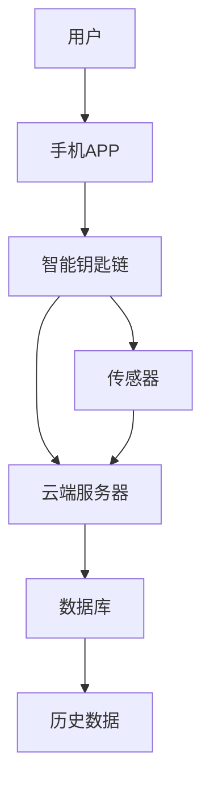
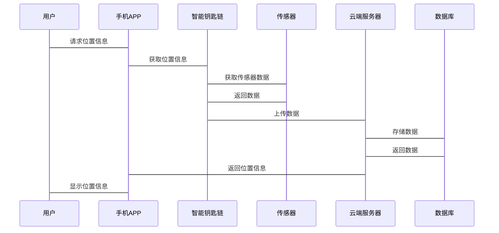

                 


# AI Agent在智能钥匙链中的物品追踪功能

> 关键词：AI Agent，智能钥匙链，物品追踪，算法原理，系统架构，项目实战

> 摘要：本文详细探讨了AI Agent在智能钥匙链中的物品追踪功能，从背景介绍到项目实战，结合实际案例分析，全面解析了AI Agent在物品追踪中的应用场景、算法原理、系统架构设计及优化建议。

---

## 第1章 AI Agent与智能钥匙链的背景介绍

### 1.1 问题背景与描述

#### 1.1.1 物品追踪的现实需求
现代生活中，人们常常面临钥匙、钱包、手机等重要物品遗失的问题。物品追踪技术能够通过传感器和定位设备，实时监控物品的位置，帮助用户快速找到丢失物品。

#### 1.1.2 智能钥匙链的应用场景
智能钥匙链是一种结合了物联网技术和人工智能的便携设备，能够实时追踪钥匙的位置，并通过手机APP通知用户。

#### 1.1.3 AI Agent在物品追踪中的作用
AI Agent（人工智能代理）通过分析传感器数据、用户行为和环境信息，优化物品追踪的准确性和响应速度，提升用户体验。

### 1.2 问题解决与边界

#### 1.2.1 AI Agent如何解决物品追踪问题
AI Agent能够实时分析传感器数据，预测物品的移动轨迹，并在物品偏离预设路径时发出警报。

#### 1.2.2 系统边界与功能范围
系统边界包括智能钥匙链、手机APP和云端服务器。功能范围涵盖实时定位、轨迹记录、丢失提醒和历史数据分析。

#### 1.2.3 核心概念的外延与内涵
- 外延：AI Agent不仅能够追踪物品，还能通过机器学习模型优化追踪算法。
- 内涵：智能钥匙链结合了传感器、通信模块和AI算法，提供智能化的物品管理功能。

### 1.3 核心概念与结构

#### 1.3.1 AI Agent的基本组成
AI Agent由感知模块、决策模块和执行模块组成，能够独立完成数据采集、分析和反馈。

#### 1.3.2 智能钥匙链的功能模块
智能钥匙链的功能模块包括定位传感器、通信模块、电池和用户界面。

#### 1.3.3 系统架构的核心要素
系统架构包括硬件部分（传感器、通信模块）、软件部分（AI算法、数据处理）和用户界面（手机APP）。

---

## 第2章 核心概念与联系

### 2.1 AI Agent的核心原理

#### 2.1.1 智能感知与数据采集
智能钥匙链通过蓝牙、Wi-Fi或超声波传感器采集物品的位置信息。

#### 2.1.2 数据分析与决策逻辑
AI Agent通过机器学习模型分析历史数据，优化定位算法，提高追踪精度。

#### 2.1.3 人机交互与反馈机制
用户通过手机APP查看物品位置，系统根据反馈调整追踪策略。

### 2.2 核心概念对比

#### 2.2.1 AI Agent与传统追踪技术的对比
- AI Agent：实时分析数据，提供智能建议。
- 传统技术：仅提供位置信息，无法优化追踪策略。

#### 2.2.2 智能钥匙链与普通钥匙链的功能差异
- 智能钥匙链：具备定位、报警功能。
- 普通钥匙链：仅提供基本存储功能。

#### 2.2.3 数据处理的效率与准确性对比
- AI Agent：数据处理效率高，定位准确。
- 传统技术：处理效率低，定位误差大。

### 2.3 ER实体关系图

```mermaid
er
  actor: 用户
  smart_keychain: 智能钥匙链
  item: 待追踪物品
  location: 地点信息
  relation: 用户拥有待追踪物品
  relation2: 待追踪物品位于地点信息
  actor -[拥有]-> relation
  relation -[包含]-> item
  item -[位于]-> location
  smart_keychain -[包含]-> item
```

---

## 第3章 算法原理与数学模型

### 3.1 算法原理

#### 3.1.1 基于位置的追踪算法
- 使用三角测量法确定物品的位置。
- 通过多个传感器的数据融合，提高定位精度。

#### 3.1.2 数据融合与决策逻辑
- 数据融合：将来自多个传感器的数据进行加权融合，减少误差。
- 决策逻辑：根据融合后的数据，判断物品是否移动或丢失。

#### 3.1.3 优化算法的实现
- 使用卡尔曼滤波优化定位算法，减少噪声影响。

### 3.2 数学模型与公式

#### 3.2.1 距离计算公式
$$ \text{距离} = \sqrt{(x_2 - x_1)^2 + (y_2 - y_1)^2} $$

#### 3.2.2 数据融合模型
$$ \text{融合后数据} = \sum (w_i \cdot x_i) $$

---

## 第4章 系统分析与架构设计方案

### 4.1 问题场景介绍

#### 4.1.1 物品追踪的典型场景
- 用户忘记带钥匙，系统提醒用户。
- 物品丢失，系统协助用户找到位置。

### 4.1.2 系统功能设计
- 实时定位：通过传感器获取物品位置信息。
- 轨迹记录：记录物品的历史位置信息。
- 丢失提醒：当物品超出预设范围时，发送提醒。

#### 4.1.3 领域模型类图
```mermaid
classDiagram
    class User {
        + username: string
        + phone: string
        - password: string
        ++ login()
        ++ logout()
    }
    class SmartKeyChain {
        - deviceID: string
        - location: (x: float, y: float)
        - lastUpdate: datetime
        ++ updateLocation()
        ++ getLocation(): (x: float, y: float)
    }
    class Item {
        - itemName: string
        - itemID: string
        - status: string
        ++ trackItem()
        ++ untrackItem()
    }
    class Location {
        - latitude: float
        - longitude: float
        - timestamp: datetime
    }
    User -> Item: 管理
    Item -> SmartKeyChain: 追踪
    SmartKeyChain -> Location: 获取位置信息
```

### 4.2 系统架构设计

#### 4.2.1 系统架构图


#### 4.2.2 系统接口设计
- 用户接口：手机APP提供用户操作界面。
- 传感器接口：与智能钥匙链通信，获取位置信息。
- 云端接口：存储数据，提供API服务。

#### 4.2.3 系统交互流程图


---

## 第5章 项目实战

### 5.1 环境安装

#### 5.1.1 安装Python环境
- 使用Anaconda安装Python 3.8以上版本。

#### 5.1.2 安装依赖库
- 使用pip安装numpy、pandas、matplotlib等库。

#### 5.1.3 安装硬件设备
- 安装蓝牙模块、Wi-Fi模块等硬件设备。

### 5.2 系统核心实现

#### 5.2.1 智能钥匙链代码实现
```python
import bluetooth
import serial

class SmartKeyChain:
    def __init__(self, device_id):
        self.device_id = device_id
        self.location = None
        self.last_update = None

    def update_location(self):
        # 获取传感器数据
        ser = serial.Serial('COM3', 9600)
        data = ser.readline().decode()
        ser.close()
        self.location = (float(data.split(',')[0]), float(data.split(',')[1]))
        self.last_update = datetime.datetime.now()
```

#### 5.2.2 数据处理代码
```python
import numpy as np

def fuse_data(data1, data2, weight1=0.5, weight2=0.5):
    return weight1 * data1 + weight2 * data2
```

### 5.3 代码应用解读与分析

#### 5.3.1 智能钥匙链代码解读
- 代码实现了通过蓝牙模块获取位置信息，并存储在对象中。

#### 5.3.2 数据融合代码解读
- 使用加权融合方法，将来自不同传感器的数据进行融合，提高定位精度。

### 5.4 实际案例分析

#### 5.4.1 案例1：正常情况下的位置追踪
- 用户将钥匙放在桌上，系统实时更新位置信息。

#### 5.4.2 案例2：钥匙丢失情况下的报警提醒
- 当钥匙超出预设范围时，系统发送报警信息，并提供可能的丢失地点。

### 5.5 项目小结

#### 5.5.1 核心代码总结
- 智能钥匙链通过传感器获取数据，AI Agent进行数据融合，手机APP显示位置信息。

#### 5.5.2 技术难点总结
- 多传感器数据融合的准确性优化。
- 系统架构设计中的实时性和稳定性保障。

---

## 第6章 最佳实践

### 6.1 小结

#### 6.1.1 核心知识点总结
- AI Agent在物品追踪中的应用。
- 数据融合与算法优化。

### 6.1.2 经验总结
- 系统设计时需充分考虑传感器的精度和稳定性。
- 数据处理算法的优化能够显著提升系统性能。

### 6.2 注意事项

#### 6.2.1 系统设计中的注意事项
- 确保系统具备良好的扩展性。
- 处理好数据隐私问题。

#### 6.2.2 实际应用中的注意事项
- 定期更新传感器驱动和系统固件。
- 提供完善的用户操作手册。

### 6.3 拓展阅读

#### 6.3.1 推荐书籍
- 《人工智能：一种现代方法》
- 《物联网技术与应用》

#### 6.3.2 推荐博客与资源
- AI Genius Institute技术博客
- Zen And The Art of Computer Programming技术博客

---

## 作者：AI天才研究院/AI Genius Institute & 禅与计算机程序设计艺术/Zen And The Art of Computer Programming

