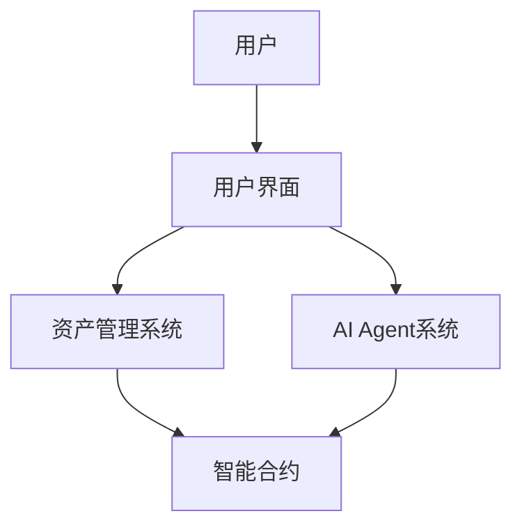

                 


# AI Agent在智能钱包中的个人财务健康顾问

> 关键词：AI Agent，智能钱包，个人财务健康，人工智能技术，金融领域应用

> 摘要：随着人工智能技术的快速发展，AI Agent（人工智能代理）在智能钱包中的应用越来越广泛。本文将深入探讨AI Agent如何作为个人财务健康顾问，帮助用户优化财务管理。通过分析AI Agent的核心算法、系统架构设计以及实际案例，本文旨在为读者提供一份全面的技术指南，展示AI Agent在智能钱包中的潜力与实现方式。

---

## 第一部分: AI Agent与智能钱包的背景与概念

### 第1章: AI Agent与智能钱包的背景介绍

#### 1.1 AI Agent的基本概念
##### 1.1.1 AI Agent的定义与特点
AI Agent（人工智能代理）是指能够感知环境、自主决策并执行任务的智能实体。AI Agent的核心特点包括：
- **自主性**：能够自主决策和行动。
- **反应性**：能够实时感知环境并做出反应。
- **学习能力**：能够通过数据和经验不断优化自身性能。

##### 1.1.2 AI Agent的核心要素与功能
AI Agent的核心功能包括：
- 数据收集与处理
- 智能决策与推荐
- 自动执行与反馈

##### 1.1.3 AI Agent在金融领域的应用现状
AI Agent在金融领域的应用主要集中在智能投资、风险管理、客户支持等方面。通过AI Agent，金融机构能够实现自动化服务和个性化推荐，提升用户体验和效率。

#### 1.2 智能钱包的概念与发展
##### 1.2.1 智能钱包的定义与技术基础
智能钱包是一种结合了区块链技术和人工智能的数字钱包，能够实现资产的安全存储、智能合约执行和自动化财务管理。

##### 1.2.2 智能钱包的功能与应用场景
智能钱包的主要功能包括：
- 数字资产存储与管理
- 智能合约自动执行
- 财务健康评估与优化

##### 1.2.3 智能钱包的现状与发展趋势
随着区块链技术和人工智能的快速发展，智能钱包的应用场景不断拓展，未来将成为数字资产管理的核心工具。

#### 1.3 AI Agent与智能钱包的结合
##### 1.3.1 AI Agent在智能钱包中的角色定位
AI Agent作为智能钱包的核心模块，负责数据处理、决策制定和任务执行。

##### 1.3.2 AI Agent与智能钱包的协同工作原理
AI Agent通过智能合约与智能钱包交互，实时分析用户的财务数据，提供个性化的财务健康评估和优化建议。

##### 1.3.3 AI Agent在个人财务健康中的应用前景
通过AI Agent，个人用户能够实现资产的智能化管理，提升财务健康水平，降低风险。

---

## 第二部分: AI Agent与智能钱包的核心概念与联系

### 第2章: AI Agent与智能钱包的核心概念分析

#### 2.1 AI Agent的原理与实现
##### 2.1.1 AI Agent的基本原理
AI Agent通过感知环境、分析数据、制定决策并执行任务来实现智能化服务。其核心原理包括：
- 数据采集与预处理
- 模型训练与优化
- 决策制定与执行

##### 2.1.2 AI Agent的核心算法与技术
AI Agent的主要算法包括：
- 机器学习算法：用于模式识别和数据分类。
- 自然语言处理算法：用于文本理解和生成。
- 强化学习算法：用于策略优化和自主决策。

##### 2.1.3 AI Agent的训练与优化
AI Agent的训练过程包括数据采集、特征提取、模型训练和参数调优。通过不断优化模型，AI Agent能够提升其决策能力和用户体验。

#### 2.2 智能钱包的系统架构
##### 2.2.1 智能钱包的功能模块划分
智能钱包的主要功能模块包括：
- 资产管理模块：负责数字资产的存储与管理。
- 智能合约模块：负责智能合约的编译、部署和执行。
- 财务健康模块：负责财务数据分析与健康评估。

##### 2.2.2 智能钱包的数据流与交互流程
智能钱包的数据流包括：
1. 用户发起交易请求。
2. 智能合约模块解析请求并生成交易指令。
3. 资产管理模块执行交易指令。
4. AI Agent模块分析交易结果并生成反馈。

##### 2.2.3 智能钱包的安全性与隐私保护
智能钱包通过加密技术、多因素认证和隐私保护算法，确保用户资产的安全性和隐私性。

#### 2.3 AI Agent与智能钱包的关系
##### 2.3.1 AI Agent作为智能钱包的智能中枢
AI Agent在智能钱包中扮演智能中枢的角色，负责数据处理、决策制定和任务执行。

##### 2.3.2 AI Agent与智能钱包的实体关系图
以下是AI Agent与智能钱包的实体关系图：

```mermaid
erDiagram
    actor 用户
    actor 开发者
    actor 金融机构
    class 智能钱包
    class AI Agent
    class 智能合约
    class 财务数据
    user -> 智能钱包 : 使用钱包
    开发者 -> 智能合约 : 部署合约
    AI Agent -> 财务数据 : 分析数据
    智能合约 <-> 智能钱包 : 执行合约
    AI Agent <-> 智能钱包 : 提供服务
```

##### 2.3.3 AI Agent与智能钱包的核心属性对比
以下是AI Agent与智能钱包的核心属性对比表：

| 属性 | AI Agent | 智能钱包 |
|------|----------|----------|
| 功能 | 数据分析与决策 | 资产存储与管理 |
| 技术基础 | 人工智能 | 区块链技术 |
| 应用场景 | 智能决策、客户支持 | 数字资产存储、智能合约 |
| 关键能力 | 自主决策、学习优化 | 安全存储、智能执行 |

---

## 第三部分: AI Agent的算法原理与数学模型

### 第3章: AI Agent的算法原理

#### 3.1 AI Agent的核心算法
##### 3.1.1 基于机器学习的AI Agent算法
机器学习算法是AI Agent的核心算法之一，主要用于数据分类和模式识别。常见的机器学习算法包括：
- **线性回归**：用于预测和回归分析。
- **决策树**：用于分类和回归。
- **随机森林**：用于分类和回归，基于多个决策树的集成。

##### 3.1.2 基于自然语言处理的AI Agent算法
自然语言处理算法用于文本理解和生成。常见的NLP算法包括：
- **词袋模型**：用于文本表示。
- **TF-IDF**：用于关键词提取。
- **BERT**：用于文本理解和生成。

##### 3.1.3 基于强化学习的AI Agent算法
强化学习算法用于策略优化和自主决策。常见的强化学习算法包括：
- **Q-Learning**：用于离线策略优化。
- **Deep Q-Networks (DQN)**：用于在线策略优化。
- **Policy Gradient Methods**：用于直接优化策略。

#### 3.2 算法实现的数学模型
##### 3.2.1 机器学习模型的数学公式
线性回归的数学公式为：
$$ y = \beta_0 + \beta_1x + \epsilon $$

决策树的数学公式为：
$$ f(x) = \text{sign}(\sum_{i=1}^n w_i h_i(x)) $$

随机森林的数学公式为：
$$ f(x) = \text{sign}\left(\sum_{i=1}^n \frac{1}{n} \text{sign}(h_i(x))\right) $$

##### 3.2.2 自然语言处理模型的数学公式
词袋模型的数学公式为：
$$ v(x) = \left\{ \text{count}(w) \mid w \in \text{vocab} \right\} $$

TF-IDF的数学公式为：
$$ \text{TF-IDF}(w, d) = \text{TF}(w, d) \times \text{IDF}(w) $$

##### 3.2.3 强化学习模型的数学公式
Q-Learning的数学公式为：
$$ Q(s, a) = r + \gamma \max_{a'} Q(s', a') $$

---

## 第四部分: 系统分析与架构设计

### 第4章: 系统分析与架构设计

#### 4.1 系统架构设计
##### 4.1.1 系统功能模块划分
智能钱包系统的功能模块包括：
- 用户界面模块：负责用户交互。
- 资产管理模块：负责数字资产的存储与管理。
- AI Agent模块：负责数据分析与决策。
- 智能合约模块：负责智能合约的执行。

##### 4.1.2 系统架构图
以下是智能钱包系统的架构图：



##### 4.1.3 系统交互流程
智能钱包系统的交互流程包括：
1. 用户通过用户界面发起交易请求。
2. 资产管理系统接收请求并验证资产信息。
3. AI Agent系统分析交易数据并生成决策。
4. 智能合约模块执行交易指令。
5. 系统反馈交易结果给用户。

---

## 第五部分: 项目实战

### 第5章: 项目实战

#### 5.1 环境安装与配置
##### 5.1.1 Python环境安装
安装Python和必要的开发库：
```bash
python -m pip install --upgrade pip
pip install numpy scikit-learn spacy transformers
```

##### 5.1.2 智能钱包开发环境配置
配置智能钱包开发环境：
```bash
git clone https://github.com/your-repository/ai-agent-wallet.git
cd ai-agent-wallet
pip install -r requirements.txt
```

#### 5.2 系统核心实现
##### 5.2.1 AI Agent模块实现
实现AI Agent的核心算法：
```python
import numpy as np
from sklearn.tree import DecisionTreeClassifier

# 示例数据
X = np.array([[1, 2], [3, 4], [5, 6]])
y = np.array([0, 1, 0])

# 训练模型
model = DecisionTreeClassifier()
model.fit(X, y)

# 预测
print(model.predict([[2, 3]]))  # 输出: array([0])
```

##### 5.2.2 智能合约模块实现
实现智能合约的功能：
```solidity
contract FinancialAdvisor {
    function analyze(Transaction calldata _tx) external pure returns (string memory) {
        // 示例分析逻辑
        return "Transaction is valid";
    }
}
```

#### 5.3 实际案例分析
##### 5.3.1 案例背景
用户希望通过AI Agent优化其投资组合。

##### 5.3.2 数据分析与决策
AI Agent通过分析用户的历史交易数据，生成投资建议：
```python
# 示例代码
data = pd.read_csv('financial_data.csv')
model.predict(data)
```

---

## 第六部分: 最佳实践与总结

### 第6章: 最佳实践与总结

#### 6.1 小结
AI Agent在智能钱包中的应用前景广阔，能够显著提升用户的财务管理效率和体验。

#### 6.2 注意事项
- 数据隐私与安全保护
- 模型的可解释性与透明性
- 系统的可靠性和稳定性

#### 6.3 拓展阅读
- 推荐阅读《人工智能: 一种现代的方法》
- 关注最新的AI Agent与智能钱包技术动态

---

作者：AI天才研究院/AI Genius Institute & 禅与计算机程序设计艺术 /Zen And The Art of Computer Programming

---

感谢您的阅读！希望本文能够帮助您深入了解AI Agent在智能钱包中的应用及其在个人财务健康顾问中的潜力！

