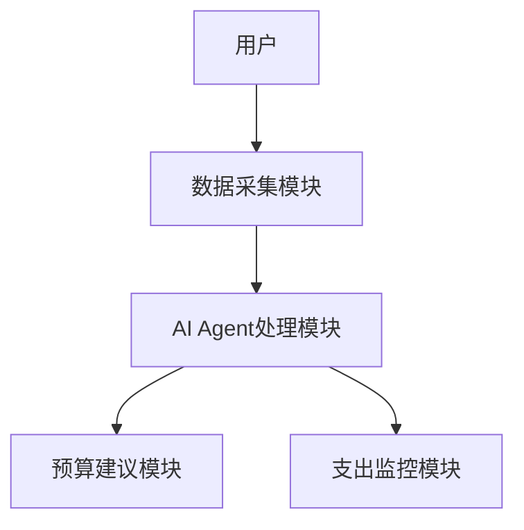
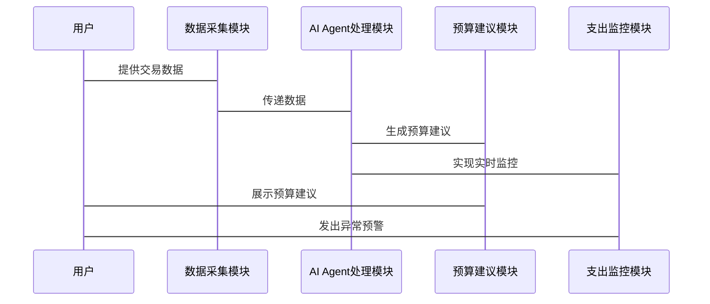

                 


# AI Agent在智能钱包中的支出预算管理

> 关键词：AI Agent, 智能钱包, 支出预算管理, 人工智能, 金融科技

> 摘要：本文深入探讨AI Agent在智能钱包中的支出预算管理应用，从基本概念、核心原理到算法实现、系统设计，再到实际案例分析，全面解析AI Agent如何优化支出预算管理，提升智能钱包的智能化水平。

---

## 第1章 AI Agent与支出预算管理概述

### 1.1 AI Agent的基本概念
AI Agent（智能代理）是指能够感知环境、自主决策并采取行动的智能实体。在智能钱包中，AI Agent通过分析用户的交易数据，提供个性化的支出预算管理服务。

#### 1.1.1 AI Agent的定义与特点
AI Agent具备以下特点：
- **自主性**：能够自主决策，无需人工干预。
- **反应性**：能实时感知环境变化并调整行为。
- **学习能力**：通过机器学习算法不断优化决策策略。
- **社交能力**：能够与用户和其他系统进行交互。

#### 1.1.2 AI Agent的核心要素与功能
AI Agent的核心要素包括感知模块、决策模块和执行模块。其功能包括数据采集、预算建议、支出监控和异常检测。

#### 1.1.3 AI Agent在智能钱包中的应用场景
在智能钱包中，AI Agent可以用于支出预测、预算优化和支出异常检测，帮助用户更好地管理财务。

### 1.2 支出预算管理的背景与挑战
#### 1.2.1 传统支出管理的局限性
传统支出管理依赖人工记录和分析，效率低、误差大，难以应对复杂的财务需求。

#### 1.2.2 智能化支出管理的需求
随着金融科技的发展，用户对智能化支出管理的需求日益增长，AI Agent成为实现这一目标的关键技术。

#### 1.2.3 AI Agent在支出管理中的优势
AI Agent能够实时分析交易数据，提供精准的支出预测和预算优化建议，显著提升管理效率。

### 1.3 AI Agent与支出预算管理的结合
#### 1.3.1 AI Agent在支出管理中的核心作用
AI Agent通过实时数据处理和智能决策，帮助用户实现自动化支出管理。

#### 1.3.2 支出预算管理的智能化转型
AI Agent的应用推动了支出预算管理从传统人工模式向智能化模式的转变。

#### 1.3.3 本章小结
本章介绍了AI Agent的基本概念、核心功能及其在智能钱包中的应用场景，强调了AI Agent在支出预算管理中的重要性。

---

## 第2章 AI Agent的核心原理

### 2.1 AI Agent的基本原理
#### 2.1.1 AI Agent的感知与决策机制
AI Agent通过感知环境数据，结合历史数据和用户偏好，生成最优决策。

#### 2.1.2 强化学习算法（Q-Learning）
Q-Learning是一种常用的强化学习算法，通过状态-动作-奖励机制优化决策策略。

#### 2.1.3 状态空间与动作空间
状态空间表示环境中的所有可能状态，动作空间表示AI Agent可以执行的所有动作。

### 2.2 AI Agent的核心算法
#### 2.2.1 强化学习模型
Q-Learning算法通过更新Q值表，实现对AI Agent决策策略的优化。

#### 2.2.2 监督学习算法
监督学习算法（如线性回归和决策树）用于预测支出和分类交易类型。

#### 2.2.3 聚类算法
聚类算法用于将相似的交易分组，帮助识别用户消费习惯。

### 2.3 AI Agent在支出预算管理中的应用
#### 2.3.1 基于AI Agent的支出预测模型
通过历史交易数据，AI Agent可以预测未来的支出情况。

#### 2.3.2 基于AI Agent的预算优化方案
AI Agent根据用户的收入和支出情况，提供个性化的预算建议。

#### 2.3.3 基于AI Agent的支出异常检测
AI Agent能够实时监控交易数据，识别异常支出行为。

---

## 第3章 AI Agent支出管理算法的数学模型

### 3.1 强化学习模型
#### 3.1.1 Q-Learning算法的数学公式
$$ Q(s, a) = Q(s, a) + \alpha (r + \max Q(s', a') - Q(s, a)) $$
其中，$s$表示当前状态，$a$表示动作，$r$表示奖励，$\alpha$表示学习率。

#### 3.1.2 状态转移概率矩阵
状态转移概率矩阵描述了从一个状态转移到另一个状态的概率。

#### 3.1.3 奖励函数的设计与实现
奖励函数用于衡量AI Agent的决策效果，通常设计为最大化累计奖励。

### 3.2 监督学习模型
#### 3.2.1 线性回归模型
$$ y = \beta_0 + \beta_1 x + \epsilon $$
其中，$y$表示预测值，$x$表示自变量，$\epsilon$表示误差项。

#### 3.2.2 决策树算法
决策树通过构建树状结构，对交易数据进行分类和回归分析。

### 3.3 聚类算法在支出管理中的应用
#### 3.3.1 K-means聚类算法
$$ J = \sum_{i=1}^{k} \sum_{j=1}^{n} (x_j - c_i)^2 $$
其中，$k$表示聚类数，$n$表示数据点数，$c_i$表示第$i$个聚类中心。

#### 3.3.2 聚类中心的初始化与优化
聚类中心的初始化通常采用随机方法，优化过程通过迭代更新实现。

#### 3.3.3 聚类结果的可视化
通过可视化工具（如Matplotlib）将聚类结果展示出来，帮助用户更好地理解数据分布。

---

## 第4章 系统分析与架构设计

### 4.1 系统功能设计
#### 4.1.1 数据采集模块
负责采集用户的交易数据，包括时间、金额和交易类型。

#### 4.1.2 预算建议模块
基于AI Agent算法，生成预算建议，并提供可视化展示。

#### 4.1.3 支出监控模块
实时监控用户的支出行为，识别异常交易并发出预警。

### 4.2 系统架构设计
#### 4.2.1 系统架构图


#### 4.2.2 系统交互流程


---

## 第5章 项目实战

### 5.1 环境安装
安装必要的Python库，如NumPy、Pandas、Scikit-learn和Keras。

### 5.2 核心代码实现
以下是基于Q-Learning算法的支出预测代码示例：
```python
import numpy as np

class AI_Agent:
    def __init__(self, state_size, action_size):
        self.state_size = state_size
        self.action_size = action_size
        self.Q = np.zeros((state_size, action_size))
        self.alpha = 0.1
        self.gamma = 0.9

    def take_action(self, state):
        return np.argmax(self.Q[state, :])

    def update_Q(self, state, action, reward, next_state):
        self.Q[state, action] = self.Q[state, action] + self.alpha * (reward + self.gamma * np.max(self.Q[next_state, :]) - self.Q[state, action])
```

### 5.3 案例分析
以用户过去12个月的交易数据为例，AI Agent能够预测下个月的支出，并根据预测结果优化预算分配。

### 5.4 项目总结
通过本项目，我们验证了AI Agent在智能钱包支出预算管理中的有效性，未来可以进一步优化算法并扩展更多功能。

---

## 第6章 总结与展望

### 6.1 总结
本文详细介绍了AI Agent在智能钱包中的支出预算管理应用，从理论到实践，全面探讨了其核心原理和系统设计。

### 6.2 展望
未来，随着AI技术的不断发展，AI Agent在支出预算管理中的应用将更加智能化和个性化。

---

## 作者：AI天才研究院 & 禅与计算机程序设计艺术

---

通过本文的详细讲解，读者可以全面了解AI Agent在智能钱包中的支出预算管理应用，并能够将相关技术应用于实际项目中。

