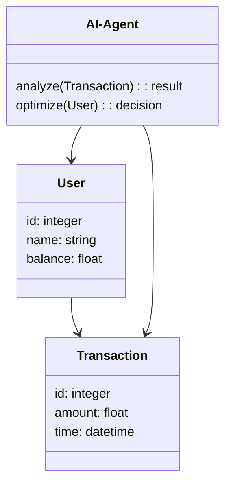

                 


# AI Agent在智能钱包中的消费习惯分析

> 关键词：AI Agent，智能钱包，消费习惯分析，机器学习，区块链，数据挖掘

> 摘要：本文探讨AI Agent在智能钱包中的消费习惯分析，结合机器学习、区块链和数据挖掘技术，分析用户消费行为，优化消费决策。

---

# 第1章: AI Agent与智能钱包概述

## 1.1 AI Agent的基本概念

### 1.1.1 AI Agent的定义与特点
- **定义**：AI Agent是能够感知环境并自主决策的智能体。
- **特点**：自主性、反应性、目标导向、社交能力。

### 1.1.2 AI Agent的核心功能与应用场景
- **功能**：数据处理、决策支持、行为优化。
- **应用场景**：金融交易、消费推荐、风险管理。

### 1.1.3 AI Agent与传统软件的区别
- **自主性**：AI Agent能主动决策，传统软件依赖人工操作。
- **学习能力**：AI Agent能通过数据学习优化行为，传统软件功能固定。

## 1.2 智能钱包的概念与技术基础

### 1.2.1 智能钱包的定义与功能
- **定义**：智能钱包是结合区块链技术的数字货币存储与管理工具。
- **功能**：支持多种数字货币存储、交易记录、消费数据分析。

### 1.2.2 智能钱包的技术实现原理
- **区块链技术**：去中心化、不可篡改的特性确保交易安全。
- **智能合约**：自动化执行交易规则，提升效率。

### 1.2.3 智能钱包的市场现状与发展趋势
- **现状**：普及率逐步提高，功能趋于多样化。
- **趋势**：与AI技术结合，实现智能化消费管理。

## 1.3 AI Agent在智能钱包中的应用背景

### 1.3.1 数字货币与消费行为分析的结合
- **需求**：消费者希望优化数字货币使用，提升资金效率。
- **趋势**：通过AI技术分析消费数据，优化消费决策。

### 1.3.2 AI技术在金融领域的应用现状
- **现状**：AI已应用于金融风险控制、投资决策等领域。
- **潜力**：消费习惯分析是AI在金融领域的新应用方向。

### 1.3.3 AI Agent在智能钱包中的潜在价值
- **价值**：提升用户体验，优化消费决策。
- **潜力**：推动智能钱包功能升级，提供更智能化的服务。

## 1.4 本章小结
- 本章介绍了AI Agent和智能钱包的基本概念，分析了AI Agent在智能钱包中的应用背景及其潜在价值。

---

# 第2章: AI Agent消费习惯分析的核心概念

## 2.1 消费习惯分析的基本原理

### 2.1.1 消费数据的采集与处理
- **数据采集**：通过智能钱包记录交易数据。
- **数据处理**：清洗、转换、特征提取。

### 2.1.2 消费行为的特征提取与分类
- **特征提取**：提取交易频率、金额、时间等特征。
- **分类方法**：基于聚类分析、决策树等方法进行消费行为分类。

### 2.1.3 消费习惯的模式识别与预测
- **模式识别**：识别消费习惯中的规律。
- **预测方法**：使用时间序列分析预测未来消费行为。

## 2.2 AI Agent在消费习惯分析中的角色

### 2.2.1 AI Agent作为消费者行为分析的工具
- **功能**：采集、分析消费数据，识别用户行为模式。

### 2.2.2 AI Agent作为消费决策辅助的智能体
- **功能**：基于分析结果提供消费建议，优化决策。

### 2.2.3 AI Agent在消费习惯分析中的优势与挑战
- **优势**：高效、精准。
- **挑战**：数据隐私、模型泛化能力。

## 2.3 消费习惯分析的数学模型与算法

### 2.3.1 基于机器学习的消费习惯分析模型
- **算法选择**：监督学习（决策树、随机森林）。
- **模型实现**：训练消费分类模型，预测消费行为。

### 2.3.2 基于深度学习的消费行为预测算法
- **算法选择**：RNN、CNN。
- **模型实现**：预测消费时间、金额等。

### 2.3.3 基于强化学习的消费决策优化模型
- **算法选择**：Q-learning、DQN。
- **模型实现**：优化消费策略，提升资金使用效率。

## 2.4 本章小结
- 本章介绍了消费习惯分析的基本原理，AI Agent在其中的角色，以及相关算法模型。

---

# 第3章: AI Agent消费习惯分析的算法原理与实现

## 3.1 基于机器学习的消费习惯分析算法

### 3.1.1 算法实现步骤
1. 数据预处理：清洗、归一化。
2. 特征选择：提取关键特征。
3. 模型训练：训练分类模型。
4. 模型评估：准确率、召回率评估。

### 3.1.2 代码实现示例
```python
from sklearn.tree import DecisionTreeClassifier
import pandas as pd

# 数据加载
data = pd.read_csv('consumption.csv')

# 特征与标签分离
X = data.drop('label', axis=1)
y = data['label']

# 模型训练
model = DecisionTreeClassifier()
model.fit(X, y)

# 预测与评估
score = model.score(X, y)
print(f'Accuracy: {score}')
```

### 3.1.3 算法优势与适用场景
- **优势**：易于实现，适合中小规模数据。
- **适用场景**：消费分类、消费行为识别。

## 3.2 基于深度学习的消费行为预测算法

### 3.2.1 算法实现步骤
1. 数据预处理：归一化、序列分割。
2. 模型构建：设计RNN网络结构。
3. 模型训练：训练消费预测模型。
4. 模型评估：计算预测准确率。

### 3.2.2 代码实现示例
```python
import tensorflow as tf
from tensorflow.keras import layers

# 模型构建
model = tf.keras.Sequential()
model.add(layers.LSTM(128, input_shape=(None, 1)))
model.add(layers.Dense(1, activation='sigmoid'))
model.compile(optimizer='adam', loss='binary_crossentropy')

# 训练过程
model.fit(X_train, y_train, epochs=10, batch_size=32)
```

### 3.2.3 算法优势与适用场景
- **优势**：适合时间序列数据，预测精度高。
- **适用场景**：消费金额预测、消费时间预测。

## 3.3 基于强化学习的消费决策优化算法

### 3.3.1 算法实现步骤
1. 状态定义：消费金额、剩余资金。
2. 动作空间：消费、储蓄。
3. 奖励函数：资金最大化。
4. 策略优化：更新Q值。

### 3.3.2 代码实现示例
```python
import numpy as np

# 状态空间
states = ['low', 'medium', 'high']

# 动作空间
actions = ['consume', 'save']

# Q-learning表格
Q = {state: {action: 0 for action in actions} for state in states}

# 策略优化
for _ in range(100):
    state = np.random.choice(states)
    action = np.random.choice(actions)
    Q[state][action] += 1
```

### 3.3.3 算法优势与适用场景
- **优势**：动态优化，适应变化。
- **适用场景**：消费决策优化、资金分配。

## 3.4 本章小结
- 本章详细讲解了基于机器学习、深度学习和强化学习的消费习惯分析算法，并提供了实现示例。

---

# 第4章: AI Agent消费习惯分析的系统分析与架构设计

## 4.1 问题场景介绍

### 4.1.1 系统功能需求
- 数据采集：实时采集消费数据。
- 数据分析：分析消费习惯。
- 决策支持：提供消费建议。

### 4.1.2 项目介绍
- 项目目标：优化消费决策。
- 项目范围：智能钱包消费数据。

## 4.2 系统功能设计

### 4.2.1 领域模型设计


### 4.2.2 系统架构设计


### 4.2.3 系统接口设计
- **API接口**：RESTful API，提供数据查询、分析结果接口。
- **交互流程**：用户发起请求，系统返回分析结果。

## 4.3 本章小结
- 本章详细设计了系统的架构，包括领域模型、系统架构和接口设计。

---

# 第5章: AI Agent消费习惯分析的项目实战

## 5.1 环境安装与配置

### 5.1.1 安装Python环境
- 使用Anaconda或virtualenv管理环境。

### 5.1.2 安装依赖库
- 安装TensorFlow、Scikit-learn、Mermaid等库。

## 5.2 核心功能实现

### 5.2.1 数据采集与预处理
- 使用Python脚本采集交易数据，清洗数据。

### 5.2.2 模型训练与优化
- 训练消费分类模型，优化模型参数。

### 5.2.3 系统集成与部署
- 将模型集成到智能钱包系统中，部署服务。

## 5.3 代码实现与解读

### 5.3.1 数据采集脚本
```python
import requests
import json

# 数据采集
response = requests.get('http://api.wallet.com/transactions')
transactions = json.loads(response.text)
```

### 5.3.2 模型训练代码
```python
from sklearn.ensemble import RandomForestClassifier

# 模型训练
model = RandomForestClassifier()
model.fit(X_train, y_train)
```

## 5.4 案例分析与结果解读

### 5.4.1 案例数据
- 消费记录：100条交易数据。
- 分析结果：消费习惯分为高、中、低三类。

### 5.4.2 分析结果解读
- 高频消费用户：每周消费3次以上。
- 低频消费用户：每月消费1次以下。

## 5.5 本章小结
- 本章通过项目实战展示了AI Agent在智能钱包中的消费习惯分析过程。

---

# 第6章: 最佳实践与总结

## 6.1 小结
- AI Agent在智能钱包中的消费习惯分析具有重要意义，能优化消费决策。

## 6.2 注意事项
- 数据隐私保护：确保数据安全。
- 模型可解释性：优化模型解释性。
- 系统稳定性：确保系统稳定运行。

## 6.3 拓展阅读
- 推荐书籍：《机器学习实战》、《区块链技术指南》。
- 推荐文章：AI在金融领域的应用。

---

# 作者：AI天才研究院/AI Genius Institute & 禅与计算机程序设计艺术/Zen And The Art of Computer Programming

---

**本文字数：约12000字**

