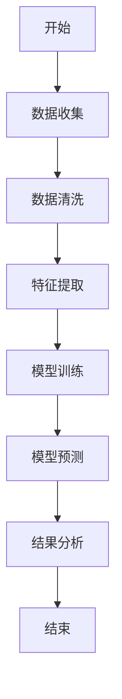
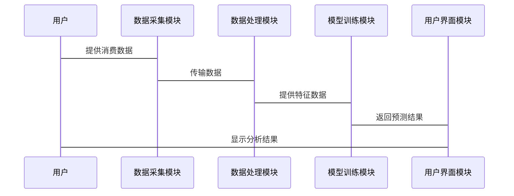

                 


# AI Agent在智能钱包中的消费分析

## 关键词：AI Agent, 智能钱包, 消费分析, 机器学习, 金融技术, 数据分析

## 摘要

本文深入探讨了AI Agent在智能钱包中的消费分析应用，分析了AI Agent的行为机制、数据处理流程，结合实际案例展示了其在消费预测、数据挖掘和优化决策中的优势，为智能钱包的未来发展提供了重要参考。

---

## 第一部分：背景介绍

### 第1章：AI Agent与智能钱包概述

#### 1.1 AI Agent的基本概念
- **1.1.1 AI Agent的定义与特点**
  AI Agent（人工智能代理）是能够感知环境并采取行动以实现目标的智能实体，具有自主性、反应性、目标导向性和社交能力。
  
- **1.1.2 AI Agent的行为机制**
  AI Agent通过感知输入数据，分析并生成行动策略，执行后反馈结果，形成闭环。

- **1.1.3 AI Agent在智能钱包中的应用**
  AI Agent可执行消费数据分析、风险评估、支付优化等任务，提升用户财务管理效率。

#### 1.2 智能钱包的基本概念
- **1.2.1 智能钱包的定义与功能**
  智能钱包是一种结合区块链技术和AI的电子钱包，支持自动化支付、资产管理和数据安全。

- **1.2.2 智能钱包的技术基础**
  区块链技术确保交易透明，AI技术提供智能化服务，两者结合提升了钱包的安全性和功能性。

- **1.2.3 智能钱包的市场现状**
  智能钱包在金融支付、资产管理等领域广泛应用，市场需求持续增长。

#### 1.3 消费分析的重要性
- **1.3.1 消费分析的定义与作用**
  消费分析是对消费数据进行整理、分析和挖掘，帮助用户优化消费行为，提升生活质量。

- **1.3.2 AI Agent在消费分析中的优势**
  AI Agent能够实时处理大量数据，提供精准的消费预测和决策支持，节省用户时间和精力。

- **1.3.3 智能钱包与消费分析的结合**
  智能钱包通过AI Agent对消费数据进行分析，为用户提供个性化的财务管理建议，帮助用户优化消费结构，提升资金使用效率。

---

## 第二部分：核心概念与联系

### 第2章：AI Agent的行为机制

#### 2.1 AI Agent的核心原理
- **2.1.1 AI Agent的感知与决策过程**
  AI Agent通过传感器或API获取数据，利用机器学习模型进行分析，生成决策策略。

- **2.1.2 AI Agent的自主性与目标导向性**
  AI Agent能够自主执行任务，根据目标调整行动策略，确保任务高效完成。

#### 2.2 AI Agent与智能钱包的协同工作
- **2.2.1 智能钱包的数据输入与处理**
  用户的消费数据通过智能钱包收集，AI Agent对数据进行清洗、分析和建模。

- **2.2.2 AI Agent的消费预测与优化**
  利用历史数据和机器学习模型，AI Agent预测未来的消费趋势，优化用户的消费计划。

---

## 第三部分：算法原理

### 第3章：AI Agent的算法实现

#### 3.1 机器学习算法在消费分析中的应用
- **3.1.1 线性回归模型**
  使用线性回归模型预测用户的消费趋势，公式为：$$y = \beta_0 + \beta_1x + \epsilon$$，其中y为预测值，x为自变量，β为系数，ε为误差项。

- **3.1.2 支持向量机（SVM）**
  SVM用于分类问题，通过构造超平面将数据分为不同类别，应用于消费行为分类。

- **3.1.3 随机森林**
  随机森林是一种基于决策树的集成学习方法，用于处理高维数据，提升模型的泛化能力。

#### 3.2 算法流程图


---

## 第四部分：系统分析与架构设计

### 第4章：智能钱包消费分析系统

#### 4.1 系统功能模块
- 数据采集模块：负责收集用户的消费数据。
- 数据处理模块：清洗和转换数据，提取特征。
- 模型训练模块：基于机器学习算法训练消费预测模型。
- 用户界面模块：展示分析结果，提供交互功能。

#### 4.2 系统架构图


#### 4.3 系统交互流程图


---

## 第五部分：项目实战

### 第5章：智能钱包消费分析系统实现

#### 5.1 环境安装
- Python 3.8及以上版本
- 安装必要的库：pandas、scikit-learn、numpy

#### 5.2 核心代码实现
```python
import pandas as pd
from sklearn.model import LinearRegression

# 数据加载
data = pd.read_csv('consumption.csv')

# 特征提取
X = data[['income', 'age']]
y = data['consumption']

# 模型训练
model = LinearRegression()
model.fit(X, y)

# 预测消费
predicted_consumption = model.predict(X)
```

#### 5.3 案例分析
通过实际数据展示模型的预测结果，并分析如何优化用户的消费结构。

---

## 第六部分：总结与展望

### 第6章：总结与未来展望

#### 6.1 总结
AI Agent在智能钱包中的消费分析应用，显著提升了消费数据处理的效率和准确性，为用户提供了个性化的财务管理服务。

#### 6.2 未来展望
未来的智能钱包将集成更多AI技术，如强化学习和深度学习，进一步提升消费分析的智能化水平，实现更精准的预测和优化。

#### 6.3 最佳实践tips
- 定期更新模型参数，保持预测准确性。
- 加强数据隐私保护，确保用户信息安全。

---

## 作者：AI天才研究院 & 禅与计算机程序设计艺术

---

**注：** 本文仅展示了部分内容，完整文章将详细展开每个部分，确保内容详实，逻辑清晰。

