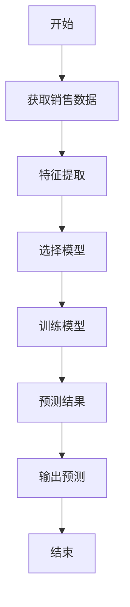
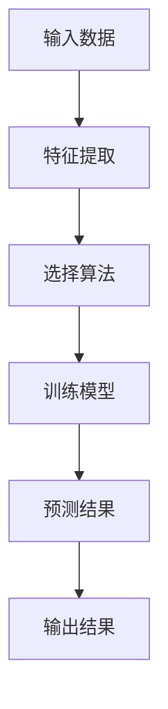

                 


# AI Agent在智能销售预测中的应用

## 关键词：AI Agent, 智能销售预测, 机器学习, 数据挖掘, 销售预测

## 摘要：  
本文探讨了AI Agent在智能销售预测中的应用，分析了AI Agent的基本概念、算法原理及其在销售预测中的价值。通过案例分析和系统设计，展示了如何利用AI Agent技术优化销售预测过程，提高预测准确性和实时性。文章还详细介绍了AI Agent的数学模型和实现方法，并展望了未来的发展方向。

---

# 第一部分: AI Agent与智能销售预测的背景介绍

## 第1章: AI Agent与智能销售预测概述

### 1.1 AI Agent的基本概念

#### 1.1.1 AI Agent的定义  
AI Agent（人工智能代理）是指能够感知环境、自主决策并执行任务的智能实体。它通过传感器获取数据，利用算法进行分析和推理，最终做出决策并执行操作。  

#### 1.1.2 AI Agent的核心特征  
AI Agent具有以下核心特征：  
1. **自主性**：能够自主决策，无需外部干预。  
2. **反应性**：能够实时感知环境并做出响应。  
3. **目标导向**：基于目标进行决策和行动。  
4. **学习能力**：能够通过数据学习和优化模型。  

#### 1.1.3 AI Agent与传统销售预测的区别  
传统的销售预测方法依赖于统计分析和人工经验，而AI Agent销售预测结合了机器学习和实时数据处理，能够实现动态调整和高精度预测。

### 1.2 智能销售预测的背景与挑战

#### 1.2.1 销售预测的传统方法与局限性  
传统销售预测方法包括时间序列分析和回归分析等，但存在以下局限性：  
1. **静态性**：难以适应市场变化。  
2. **低精度**：依赖人工经验，存在主观性。  
3. **计算复杂**：处理大规模数据时效率低下。  

#### 1.2.2 数据驱动销售预测的兴起  
随着大数据技术的发展，企业开始利用海量数据进行销售预测，数据驱动的方法逐渐取代传统方法。  

#### 1.2.3 智能销售预测的核心问题  
智能销售预测的核心问题是如何通过AI Agent实时分析数据，优化预测模型，并实现动态调整。

### 1.3 AI Agent在销售预测中的应用价值

#### 1.3.1 提高预测准确性  
AI Agent能够利用机器学习算法，从历史数据中发现规律，提高预测的准确性。  

#### 1.3.2 实现实时预测与动态调整  
AI Agent能够实时获取数据并进行预测，及时调整预测模型以应对市场变化。  

#### 1.3.3 优化销售策略与资源分配  
通过AI Agent的预测结果，企业可以优化销售策略和资源分配，提高整体销售效率。

### 1.4 本章小结  
本章介绍了AI Agent的基本概念、特征及其在销售预测中的应用价值，为后续内容奠定了基础。

---

# 第二部分: AI Agent的核心概念与原理

## 第2章: AI Agent的核心概念与联系

### 2.1 AI Agent的原理分析

#### 2.1.1 知识表示与推理  
知识表示是AI Agent的核心，通常采用符号逻辑或概率模型。推理过程基于知识库中的规则进行。  

#### 2.1.2 行为决策机制  
AI Agent的行为决策机制包括状态感知、目标设定和行动选择。  

#### 2.1.3 与销售预测的结合方式  
AI Agent通过实时数据采集、特征提取和模型训练，实现销售预测的动态调整。

### 2.2 核心概念对比分析

#### 2.2.1 AI Agent与传统预测模型的对比  
| 特性       | AI Agent                     | 传统预测模型                 |
|------------|------------------------------|------------------------------|
| 自主性     | 高                           | 低                           |
| 反应性     | 高                           | 低                           |
| 学习能力   | 强                           | 弱                           |

#### 2.2.2 不同AI Agent算法的特征对比  
| 算法类型       | 基于规则的AI Agent | 基于机器学习的AI Agent | 基于强化学习的AI Agent |
|----------------|----------------------|--------------------------|--------------------------|
| 适用场景       | 简单规则场景         | 复杂模式场景             | 动态策略优化场景         |
| 学习能力       | 无                   | 弱                     | 强                     |

#### 2.2.3 销售预测中的关键要素对比  
| 要素         | 数据质量             | 模型选择               | 预测精度               |
|--------------|----------------------|-------------------------|-------------------------|
| 重要性       | 高                   | 高                     | 高                     |

### 2.3 实体关系图与流程图分析

#### 2.3.1 AI Agent销售预测的ER实体关系图  
```mermaid
er
  actor(Agent, id, name)
  actor(Customer, id, name)
  actor(SalesData, id, value)
  relation(Agent --> SalesData, "预测")
  relation(Customer --> SalesData, "购买")
```

#### 2.3.2 AI Agent预测流程图  


### 2.4 本章小结  
本章详细分析了AI Agent的核心概念及其在销售预测中的应用，通过对比和图表帮助读者理解AI Agent的工作原理。

---

# 第三部分: AI Agent的算法原理与数学模型

## 第3章: AI Agent的算法原理

### 3.1 常见AI Agent算法介绍

#### 3.1.1 基于规则的AI Agent  
基于规则的AI Agent通过预定义的规则进行决策，适用于简单场景。  

#### 3.1.2 基于机器学习的AI Agent  
基于机器学习的AI Agent利用历史数据训练模型，适用于复杂场景。  

#### 3.1.3 基于强化学习的AI Agent  
基于强化学习的AI Agent通过与环境互动，学习最优策略，适用于动态场景。

### 3.2 算法流程图分析

#### 3.2.1 基于机器学习的AI Agent流程图  


### 3.3 算法实现代码示例

#### 3.3.1 基于机器学习的AI Agent代码示例  
```python
import pandas as pd
from sklearn.model

