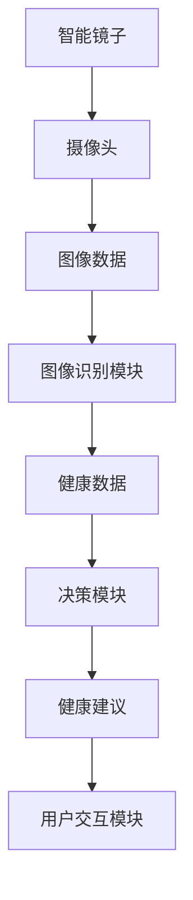
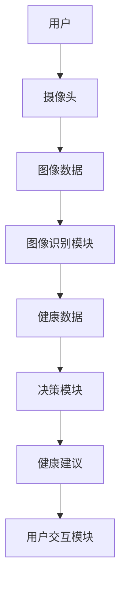

                 


# AI Agent在智能镜子中的每日健康检查系统

## 关键词
AI Agent, 智能镜子, 健康检查系统, 图像识别, 强化学习, 深度学习, 系统架构

## 摘要
本文将详细探讨AI Agent在智能镜子中的应用，特别是如何通过每日健康检查系统提升用户体验。文章首先介绍AI Agent和智能镜子的基本概念，分析其在健康监测中的潜力。接着，深入讲解AI Agent的核心算法原理，包括图像识别和强化学习等技术。然后，通过系统架构设计和项目实战，展示如何实现一个高效的每日健康检查系统。最后，结合实际案例和最佳实践，总结系统的优缺点，并展望未来的发展方向。

---

# 第一部分: 背景介绍与核心概念

## 第1章: AI Agent与智能镜子概述

### 1.1 AI Agent的基本概念
AI Agent，即人工智能代理，是一种能够感知环境、自主决策并执行任务的智能实体。它通过传感器获取信息，利用算法处理数据，并通过执行器与环境交互。AI Agent的核心特点包括自主性、反应性、目标导向和学习能力。

#### AI Agent的核心功能
- **感知**：通过摄像头、麦克风等设备获取环境数据。
- **决策**：基于感知数据，利用算法做出最优决策。
- **执行**：通过执行器（如显示器、扬声器）与用户交互或执行任务。

### 1.2 智能镜子的基本概念
智能镜子是一种集成了AI技术的镜子，能够通过摄像头和传感器获取用户的生理数据（如面部表情、皮肤状况）和环境数据（如光线、温度）。智能镜子不仅可以作为传统镜子使用，还可以提供健康监测、天气预报、日程管理等多种功能。

#### 智能镜子的功能与技术基础
- **功能**：健康监测、天气预报、日程管理、智能家居控制。
- **技术基础**：计算机视觉、图像处理、语音识别、自然语言处理。

### 1.3 每日健康检查系统的需求与目标
每日健康检查系统的目标是通过智能镜子实时监测用户的健康状况，提供个性化的健康建议。主要需求包括：
- **实时监测**：采集用户的生理数据，如面部表情、皮肤状况、体温。
- **数据分析**：利用AI算法分析数据，识别健康问题。
- **个性化建议**：根据分析结果，提供健康建议。

---

## 第2章: AI Agent在智能镜子中的核心机制

### 2.1 AI Agent的核心原理
AI Agent通过感知、决策和执行三个步骤实现功能。感知阶段通过摄像头采集用户图像，利用图像识别技术提取特征；决策阶段通过强化学习算法优化健康建议；执行阶段通过显示器和扬声器与用户交互。

#### AI Agent的决策机制
- **强化学习**：通过奖励机制优化决策策略。
- **规则引擎**：基于预设规则生成健康建议。

### 2.2 智能镜子的健康监测系统架构
健康监测系统由硬件和软件两部分组成。硬件包括摄像头、传感器和显示屏，软件包括数据采集模块、数据分析模块和用户交互模块。

#### 系统架构图


---

## 第3章: 算法原理与数学模型

### 3.1 图像识别算法
图像识别是AI Agent实现健康监测的核心技术之一。常用的算法包括卷积神经网络（CNN）和图像分割技术。

#### 图像分类算法实现
```python
import tensorflow as tf
from tensorflow.keras import layers

model = tf.keras.Sequential([
    layers.Conv2D(32, (3,3), activation='relu', input_shape=(224, 224, 3)),
    layers.MaxPooling2D((2,2)),
    layers.Conv2D(64, (3,3), activation='relu'),
    layers.MaxPooling2D((2,2)),
    layers.Flatten(),
    layers.Dense(128, activation='relu'),
    layers.Dense(1, activation='sigmoid')
])
```

### 3.2 强化学习算法
强化学习通过奖励机制优化AI Agent的决策策略。常用算法包括Q-learning和深度强化学习（DRL）。

#### 强化学习数学模型
```latex
$$ Q(s, a) = Q(s, a) + \alpha \left( r + \max_{a'} Q(s', a') - Q(s, a) \right) $$
```

---

## 第4章: 系统分析与架构设计

### 4.1 项目介绍
每日健康检查系统旨在通过智能镜子实时监测用户的健康状况，提供个性化的健康建议。系统由硬件和软件两部分组成。

### 4.2 系统功能设计
- **数据采集**：采集用户的生理数据。
- **数据分析**：分析数据，识别健康问题。
- **用户交互**：显示健康建议。

### 4.3 系统架构设计


---

## 第5章: 项目实战

### 5.1 环境安装
安装必要的库：
```bash
pip install tensorflow numpy matplotlib
```

### 5.2 系统核心实现
实现图像识别模块：
```python
import cv2

def detect_face(image):
    gray = cv2.cvtColor(image, cv2.COLOR_BGR2GRAY)
    face_cascade = cv2.CascadeClassifier('haarcascade_frontalface_default.xml')
    faces = face_cascade.detectMultiScale(gray, 1.1, 4)
    return faces
```

### 5.3 实际案例分析
通过实际案例分析，验证系统的有效性。例如，当用户面部表情紧张时，系统会建议进行放松训练。

---

## 第6章: 总结与扩展

### 6.1 最佳实践
- 定期更新模型，提升识别精度。
- 提供多样化的健康建议，满足不同用户需求。

### 6.2 小结
本文详细探讨了AI Agent在智能镜子中的应用，分析了系统的架构和算法原理，展示了如何通过技术实现每日健康检查系统。

### 6.3 注意事项
- 确保数据隐私，避免用户信息泄露。
- 定期维护系统，提升用户体验。

### 6.4 拓展阅读
- 探索更多AI技术在健康监测中的应用。
- 研究更先进的AI算法，如Transformer和大语言模型。

---

# 作者：AI天才研究院/AI Genius Institute & 禅与计算机程序设计艺术 /Zen And The Art of Computer Programming

