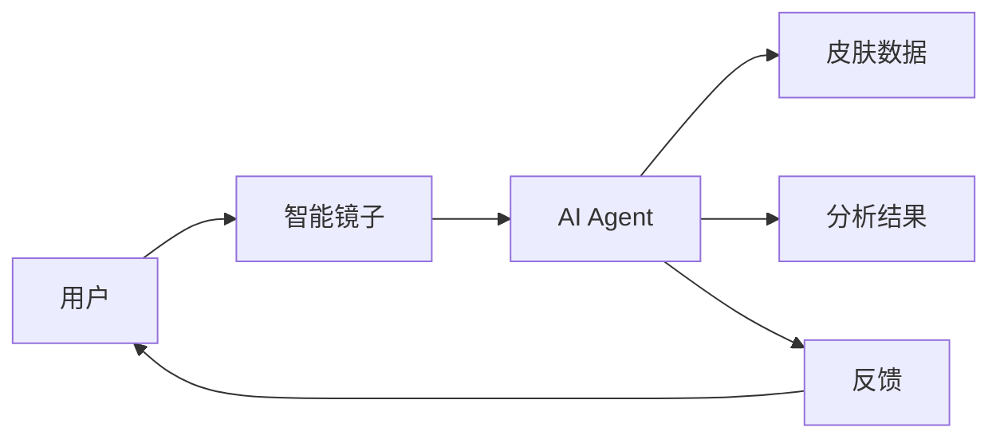

                 


# AI Agent在智能镜子中的皮肤状况分析

## 关键词：AI Agent, 智能镜子, 皮肤状况分析, 计算机视觉, 传感器技术, 人工智能

## 摘要：  
本文深入探讨AI Agent在智能镜子中的应用，特别是在皮肤状况分析方面的技术细节。通过背景介绍、核心概念、算法原理、系统架构、项目实战和最佳实践等多个方面，系统性地分析AI Agent如何通过智能镜子实现高效的皮肤健康监测。文章结合理论与实践，提供丰富的代码示例和详细的数学模型，帮助读者全面理解AI Agent在智能镜子中的工作原理和实际应用。

---

## 第一部分：背景介绍

### 第1章：AI Agent与智能镜子概述

#### 1.1 AI Agent的基本概念
- **1.1.1 AI Agent的定义与特点**
  - AI Agent是具有感知环境、自主决策和执行任务能力的智能实体。
  - 具备学习能力、适应性、推理能力和交互能力。

- **1.1.2 AI Agent的核心要素与功能**
  - 数据采集：通过传感器或摄像头获取环境信息。
  - 数据处理：利用算法对数据进行分析和处理。
  - 决策与反馈：基于分析结果生成行动计划并执行。

- **1.1.3 AI Agent的应用场景与优势**
  - 应用场景：智能助手、自动驾驶、智能安防等。
  - 优势：自动化、智能化、高效性。

#### 1.2 智能镜子的概念与技术背景
- **1.2.1 智能镜子的定义与功能**
  - 智能镜子是一种集成AI技术的交互式镜子，具备环境感知和智能分析能力。
  - 主要功能：健康监测、信息查询、智能家居控制等。

- **1.2.2 智能镜子的核心技术**
  - 计算机视觉：用于图像识别和处理。
  - 传感器技术：用于数据采集和环境感知。
  - AI算法：用于数据分析和决策。

- **1.2.3 智能镜子的市场现状与发展前景**
  - 当前市场：智能家居设备普及，AI技术快速发展。
  - 发展前景：随着AI和IoT技术的进步，智能镜子将更加智能化和普及化。

#### 1.3 肤色状况分析的背景与意义
- **1.3.1 皮肤健康的重要性**
  - 皮肤健康直接关系到整体健康状况，如皮肤疾病、紫外线伤害等。
  - 通过及时监测和分析，可以预防皮肤问题的发生。

- **1.3.2 现有皮肤分析技术的局限性**
  - 传统方法：依赖人工观察，效率低且不准确。
  - 现有技术：部分依赖简单图像处理，缺乏深度分析。

- **1.3.3 AI Agent在智能镜子中的应用潜力**
  - 利用AI Agent的智能分析能力，实现高效、精准的皮肤健康监测。
  - 提供个性化的健康建议，提升用户体验。

---

## 第二部分：核心概念与联系

### 第2章：AI Agent与智能镜子的协同工作原理

#### 2.1 AI Agent在智能镜子中的角色
- **2.1.1 AI Agent作为智能镜子的“大脑”**
  - AI Agent负责处理输入数据，生成分析结果，并通过智能镜子的用户界面进行反馈。
  - 通过AI算法实现对皮肤状况的实时监测和分析。

- **2.1.2 AI Agent的功能模块划分**
  - 数据采集模块：通过摄像头获取用户的面部图像。
  - 数据处理模块：利用计算机视觉技术进行图像分析。
  - 决策与反馈模块：基于分析结果生成健康建议或提醒。

- **2.1.3 AI Agent的核心优势**
  - 高效性：快速处理数据并生成反馈。
  - 智能性：能够学习和适应用户的需求。
  - 便捷性：用户可以通过镜子进行实时监测和健康咨询。

#### 2.2 智能镜子的硬件与软件架构
- **2.2.1 硬件部分**
  - 摄像头：用于捕捉用户的面部图像。
  - 环境传感器：用于检测光线、温度等环境因素。
  - 显示屏：用于显示分析结果和健康建议。

- **2.2.2 软件部分**
  - 操作系统：如Linux或RTOS，负责硬件管理和任务调度。
  - AI算法：如卷积神经网络（CNN）用于图像识别和分类。
  - 用户界面：图形化的界面，便于用户操作和查看结果。

#### 2.3 AI Agent与智能镜子的交互机制
- **2.3.1 用户输入与AI Agent的响应**
  - 用户在镜子前进行操作，如触摸屏幕或语音指令。
  - AI Agent接收输入并触发相应的分析任务。

- **2.3.2 数据流的传输与处理流程**
  - 摄像头捕获图像数据，传输至AI Agent进行处理。
  - AI Agent分析数据并生成反馈，通过显示屏呈现给用户。

---

### 第3章：AI Agent与智能镜子的实体关系分析

#### 3.1 ER实体关系图
```mermaid
erDiagram
    user} o- "拥有"
    mirror
    agent
    skin_data} o- "包含"
    analysis_result
    feedback
    user} o- "使用"
    mirror
    agent
    mirror} o- "集成"
    camera,sensor,display
    agent} o- "运行"
    algorithm,decision_logic
    analysis_result} o- "基于"
    skin_data
    feedback} o- "来自"
    analysis_result
    feedback} o- "发送给"
    user
```

#### 3.2 Mermaid流程图


---

## 第三部分：算法原理讲解

### 第4章：皮肤状况分析的算法原理

#### 4.1 基于计算机视觉的图像处理
- **4.1.1 图像采集与预处理**
  - 使用摄像头捕获面部图像，分辨率和光照条件需优化。
  - 预处理步骤：去噪、灰度化、二值化。

- **4.1.2 特征提取**
  - 使用边缘检测技术提取皮肤轮廓。
  - 通过颜色空间转换（RGB转HSV）分析皮肤颜色特征。

- **4.1.3 分类算法**
  - 使用支持向量机（SVM）或随机森林（RF）进行皮肤状态分类。
  - 分类特征：皮肤颜色、纹理、斑点数量。

#### 4.2 基于AI的皮肤健康评估
- **4.2.1 深度学习模型**
  - 使用卷积神经网络（CNN）进行图像分类。
  - 网络结构：卷积层、池化层、全连接层。

- **4.2.2 模型训练与优化**
  - 数据集：收集和标注皮肤图像，包括健康、干燥、过敏等状态。
  - 训练方法：使用交叉验证和正则化技术防止过拟合。

- **4.2.3 模型评估**
  - 评估指标：准确率、召回率、F1分数。
  - 调优参数：学习率、批量大小、训练轮数。

#### 4.3 算法实现的Python代码示例
```python
import cv2
import numpy as np
from sklearn.svm import SVC

# 图像预处理
def preprocess_image(image):
    gray = cv2.cvtColor(image, cv2.COLOR_BGR2GRAY)
    blurred = cv2.GaussianBlur(gray, (5, 5), 0)
    return blurred

# 特征提取
def extract_features(image):
    features = []
    for i in range(image.shape[0]):
        row = image[i]
        features.append(np.mean(row))
    return features

# 分类器训练
def train_classifier(X_train, y_train):
    clf = SVC(C=1.0, kernel='rbf', gamma=0.1)
    clf.fit(X_train, y_train)
    return clf

# 示例使用
image = cv2.imread('face.jpg')
preprocessed = preprocess_image(image)
features = extract_features(preprocessed)
X_train = [features]
y_train = ['healthy']
clf = train_classifier(X_train, y_train)
print("Classifier trained.")
```

---

### 第5章：数学模型与公式

#### 5.1 颜色空间转换公式
- RGB颜色空间转换为HSV：
  \[
  H = \text{计算色调},\quad S = \text{计算饱和度},\quad V = \text{计算明度}
  \]

#### 5.2 皮肤分类模型的损失函数
- 使用交叉熵损失函数：
  \[
  \text{Loss} = -\frac{1}{N}\sum_{i=1}^{N} y_i \log(p_i) + (1 - y_i) \log(1 - p_i)
  \]
  其中，\( p_i \) 是模型预测的概率，\( y_i \) 是真实标签。

#### 5.3 模型优化中的正则化
- L2正则化：
  \[
  \text{Loss}_{\text{total}} = \text{Loss} + \lambda \sum_{i} w_i^2
  \]
  其中，\( \lambda \) 是正则化参数，\( w_i \) 是模型权重。

---

## 第四部分：系统分析与架构设计

### 第6章：智能镜子的系统架构设计

#### 6.1 系统功能设计
- **领域模型**：
  ```mermaid
  classDiagram
    class User
    class SmartMirror
    class AIAgent
    class SkinData
    class AnalysisResult
    class Feedback
    User --> SmartMirror
    SmartMirror --> AIAgent
    AIAgent --> SkinData
    AIAgent --> AnalysisResult
    AnalysisResult --> Feedback
    Feedback --> User
  ```

- **系统架构**：
  ```mermaid
  architecture
  芯片级
    + CPU
    + GPU
    + 内存
  模块级
    + 摄像头模块
    + 传感器模块
    + 显示屏模块
    + AI处理模块
  系统级
    + 数据采集
    + 数据处理
    + 分析引擎
    + 用户界面
  ```

#### 6.2 系统接口设计
- **摄像头接口**：提供视频流采集接口。
- **传感器接口**：获取环境数据，如光照强度。
- **用户界面接口**：显示分析结果和健康建议。

#### 6.3 系统交互设计
- **交互流程**：
  ```mermaid
  sequenceDiagram
    User -> SmartMirror: 打开镜子
    SmartMirror -> AIAgent: 获取皮肤数据
    AIAgent -> SkinData: 数据采集
    AIAgent -> AnalysisResult: 分析数据
    AIAgent -> Feedback: 生成反馈
    Feedback -> User: 显示结果
  ```

---

### 第7章：项目实战

#### 7.1 环境安装
- 安装Python和相关库：
  ```bash
  pip install numpy cv2 scikit-learn
  ```

#### 7.2 核心代码实现
- 皮肤数据采集与处理：
  ```python
  import cv2
  import numpy as np

  def capture_skin_image():
      cap = cv2.VideoCapture(0)
      ret, frame = cap.read()
      if ret:
          cv2.imwrite('skin.jpg', frame)
      cap.release()

  capture_skin_image()
  ```

- 分类器训练与预测：
  ```python
  from sklearn.svm import SVC
  import joblib

  def train_classifier(X_train, y_train):
      clf = SVC()
      clf.fit(X_train, y_train)
      joblib.dump(clf, 'skin_classifier.pkl')
      return clf

  def predict_health(image):
      clf = joblib.load('skin_classifier.pkl')
      features = extract_features(image)
      return clf.predict([features])[0]

  train_classifier(X_train, y_train)
  ```

#### 7.3 案例分析与实际应用
- 案例1：健康皮肤分析
  - 输入：健康皮肤图像
  - 输出：健康状态为“正常”。

- 案例2：过敏皮肤分析
  - 输入：红肿皮肤图像
  - 输出：健康状态为“过敏”，并建议使用抗过敏产品。

---

### 第8章：最佳实践

#### 8.1 小结
- AI Agent在智能镜子中的应用前景广阔，特别是在皮肤健康监测方面。
- 通过AI技术和传感器的结合，可以实现高效、精准的皮肤分析。

#### 8.2 注意事项
- 数据隐私保护：确保用户数据的安全性。
- 系统稳定性：确保AI算法的实时性和可靠性。
- 用户体验优化：提供友好的交互界面和及时的反馈。

#### 8.3 拓展阅读
- 推荐书籍：《机器学习实战》、《深度学习入门》。
- 推荐论文：基于深度学习的皮肤疾病诊断研究。

---

## 作者：AI天才研究院 & 禅与计算机程序设计艺术

