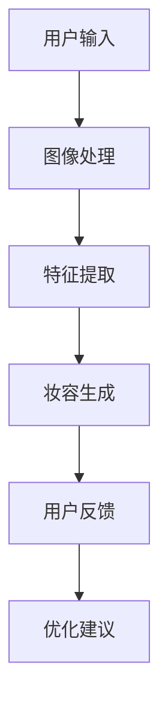

                 


# AI Agent在智能镜框中的妆容建议

> 关键词：AI Agent, 智能镜框, 妆容建议, 计算机视觉, 人工智能, 机器学习

> 摘要：本文探讨AI Agent在智能镜框中的妆容建议应用，涵盖技术背景、核心算法、系统设计及实战案例，深入分析实现细节和实际应用。

---

## 第一部分: AI Agent与智能镜框的背景与基础

### 第1章: AI Agent与智能镜框概述

#### 1.1 AI Agent的基本概念
- **什么是AI Agent**：AI Agent是指能够感知环境、自主决策并执行任务的智能体，具备学习、推理和自适应能力。
- **AI Agent的核心特征**：
  - 感知与交互能力
  - 自主决策能力
  - 学习与适应能力
- **AI Agent与传统算法的区别**：AI Agent具备自主性和适应性，能够处理动态环境中的复杂问题，而传统算法通常基于静态规则。

#### 1.2 智能镜框的概念与应用场景
- **智能镜框的定义**：智能镜框是一种集成AI技术的镜子，能够通过摄像头和传感器捕捉用户面部信息，提供实时的妆容建议和其他个性化服务。
- **智能镜框的主要功能**：
  - 妆容推荐
  - 皮肤分析
  - 美容建议
  - 虚拟试妆
- **智能镜框的应用场景**：
  - 化妆品店
  - 个人美容护理
  - 远程化妆指导

#### 1.3 妆容建议的核心问题
- **妆容建议的定义**：基于用户的面部特征、肤色、场合等信息，提供个性化的化妆建议。
- **妆容建议的关键问题**：
  - 面部特征识别
  - 化妆方案生成
  - 用户偏好分析
- **妆容建议的实现挑战**：
  - 数据多样性与准确性
  - 实时性与响应速度
  - 用户隐私保护

---

## 第二部分: AI Agent的核心技术与原理

### 第2章: AI Agent的核心技术

#### 2.1 计算机视觉技术
- **图像处理基础**：包括图像增强、边缘检测、特征提取等技术，用于处理用户面部图像。
- **人脸识别技术**：通过深度学习模型识别用户面部特征，如眼睛、鼻子、嘴巴的位置。
- **人像分割技术**：将用户面部与背景分离，实现精准的化妆建议。

#### 2.2 自然语言处理技术
- **文本理解基础**：解析用户的语言输入，理解其需求和偏好。
- **基于上下文的语义分析**：分析用户的反馈，优化妆容建议。
- **对话生成技术**：通过自然语言生成，与用户进行交互，提供个性化的建议。

#### 2.3 机器学习与深度学习
- **传统机器学习算法**：如支持向量机（SVM）、随机森林（Random Forest）等，用于分类和回归任务。
- **深度学习模型**：如卷积神经网络（CNN）和生成对抗网络（GAN），用于图像识别和生成任务。
- **神经网络基础**：介绍神经网络的结构、训练过程和优化方法。

---

## 第三部分: AI Agent的数学模型与算法原理

### 第3章: 妆容建议的数学模型

#### 3.1 图像处理的数学模型
- **图像变换矩阵**：用于图像的旋转、缩放和翻转，公式如下：
  $$
  \begin{pmatrix}
  \cos\theta & -\sin\theta & 0 \\
  \sin\theta & \cos\theta & 0 \\
  0 & 0 & 1
  \end{pmatrix}
  $$
- **颜色空间转换**：从RGB到HSV的颜色空间转换，用于分析肤色和色调。
- **基于相似度的匹配算法**：使用余弦相似度计算图像相似性：
  $$
  \text{相似度} = \frac{\sum_{i=1}^{n} w_i x_i}{\sqrt{\sum_{i=1}^{n} w_i^2 x_i^2}}
  $$

#### 3.2 人脸识别的数学模型
- **基于特征向量的识别**：提取面部特征向量，使用欧氏距离进行分类。
- **基于概率的分类模型**：如高斯判别分析（GDA），用于计算概率分布。
- **深度学习模型的数学表达**：以卷积神经网络为例，介绍其前向传播过程：
  $$
  a^{(l)} = \sigma(w^{(l)} a^{(l-1)} + b^{(l)})
  $$

---

## 第四部分: 系统分析与架构设计

### 第4章: 系统功能设计

#### 4.1 系统功能模块划分
- **用户输入模块**：接收用户的面部图像和偏好输入。
- **图像处理模块**：对图像进行预处理和特征提取。
- **算法计算模块**：基于特征生成妆容建议。
- **用户反馈模块**：收集用户反馈，优化建议。

#### 4.2 系统功能流程图


### 第5章: 系统架构设计

#### 5.1 系统架构设计
- **分层架构设计**：分为数据层、业务逻辑层和用户界面层。
- **微服务架构设计**：将功能模块化，便于扩展和维护。
- **系统扩展性设计**：通过负载均衡和分布式存储实现高可用性。

#### 5.2 系统接口设计
- **API接口定义**：如RESTful API，用于模块之间的通信。
- **接口调用流程**：展示模块间的交互流程。

---

## 第五部分: 项目实战与应用案例

### 第6章: 项目实战

#### 6.1 环境安装与配置
- **开发环境搭建**：安装Python、TensorFlow、OpenCV等依赖库。
- **依赖库安装**：使用pip安装所需库，如`pip install numpy tensorflow pillow`.

#### 6.2 核心算法实现
- **图像处理代码**：实现面部特征提取和图像变换。
```python
import cv2
import numpy as np

def face_detection(image):
    gray = cv2.cvtColor(image, cv2.COLOR_BGR2GRAY)
    face_cascade = cv2.CascadeClassifier('haarcascade_frontalface_default.xml')
    faces = face_cascade.detectMultiScale(gray, 1.3, 5)
    return faces
```

---

## 第六部分: 应用案例与总结

### 第7章: 应用案例分析
- **实际案例分析**：展示智能镜框在化妆品店的应用场景。
- **详细解读与剖析**：分析系统的实际运行效果和用户反馈。

---

## 作者：AI天才研究院/AI Genius Institute & 禅与计算机程序设计艺术 /Zen And The Art of Computer Programming

---

通过以上结构，文章详细探讨了AI Agent在智能镜框中的妆容建议应用，从理论到实践，结合技术背景、算法实现和系统设计，为读者提供全面而深入的指导。

