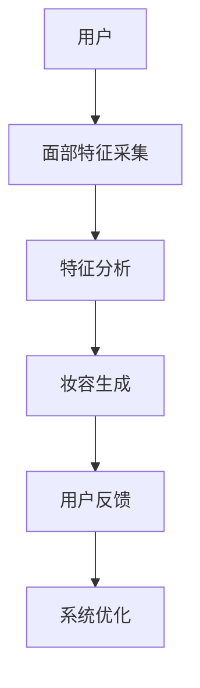
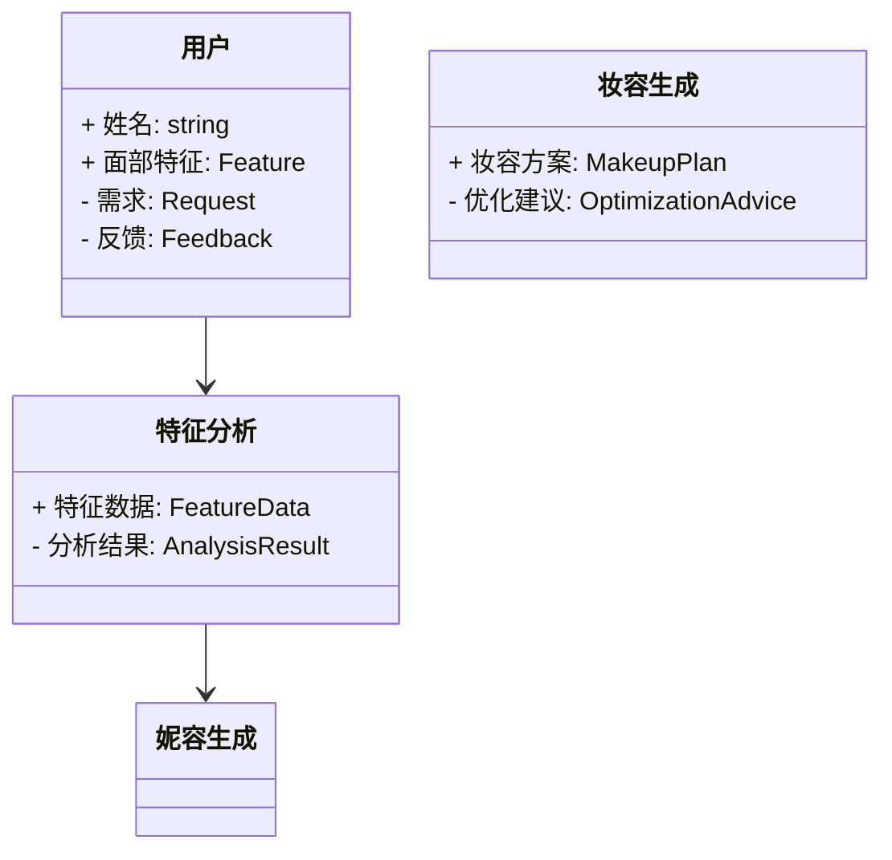
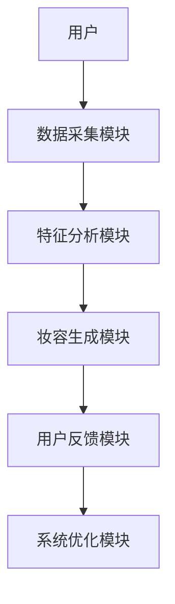
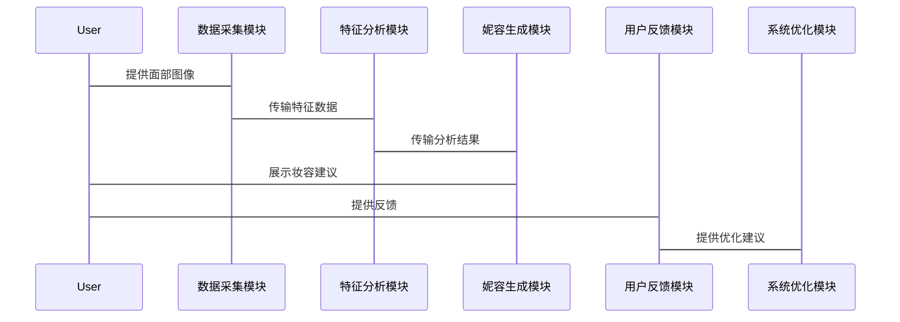

                 


# AI Agent在智能镜框中的妆容建议系统

> 关键词：AI Agent, 智能镜框, 妆容建议, 计算机视觉, 深度学习

> 摘要：本文详细探讨了AI Agent在智能镜框中的妆容建议系统的设计与实现。通过结合计算机视觉和深度学习技术，系统能够实时分析用户的面部特征，提供个性化的妆容建议。本文从问题背景、核心概念、算法原理、系统架构到项目实战，全面解析了该系统的实现过程，并给出了实际案例分析和最佳实践建议。

---

## 第1章: 问题背景与核心概念

### 1.1 问题背景

#### 1.1.1 传统妆容选择的痛点
传统的妆容选择过程往往依赖于用户的个人经验或导购员的推荐，这种方式存在以下问题：
- **效率低下**：用户需要尝试多种产品和妆容，耗时且费力。
- **个性化不足**：不同用户的面部特征、肤色和场合需求差异较大，通用建议难以满足个性化需求。
- **缺乏科学依据**：妆容的选择更多依赖主观判断，缺乏科学的数据支持。

#### 1.1.2 AI技术在妆容建议中的应用潜力
随着AI技术的快速发展，计算机视觉和深度学习技术在图像处理和个性化推荐领域的应用日益广泛。AI Agent可以通过以下方式解决传统妆容选择的痛点：
- **实时分析**：利用AI算法实时分析用户的面部特征，如肤色、五官特征等。
- **个性化推荐**：基于用户的面部特征和需求，提供个性化的妆容建议。
- **持续优化**：通过用户反馈不断优化推荐算法，提升推荐的准确性和满意度。

#### 1.1.3 智能镜框的发展趋势
智能镜框作为智能硬件的一种，近年来发展迅速。它结合了计算机视觉、AI算法和人机交互技术，能够为用户提供智能化的美妆建议、健康监测等多种功能。AI Agent在智能镜框中的应用，标志着从传统美妆工具向智能化、个性化的升级。

### 1.2 问题描述

#### 1.2.1 妆容建议系统的核心目标
妆容建议系统的核心目标是通过AI技术，帮助用户快速找到适合自己的妆容方案。具体目标包括：
- 提供个性化的妆容建议，包括底妆、眼妆、唇妆等。
- 实时分析用户的面部特征，确保建议的科学性和准确性。
- 基于用户反馈不断优化建议，提升用户体验。

#### 1.2.2 用户需求分析
用户在选择妆容时，通常有以下需求：
- 快速找到适合自己的妆容方案。
- 理解不同妆容的适用场合和效果。
- 获取专业的美妆建议，提升自信。

#### 1.2.3 系统边界与外延
系统的边界主要集中在智能镜框的功能范围内，包括：
- 用户面部特征的采集与分析。
- 妆容建议的生成与展示。
- 用户反馈的收集与处理。

系统的外延则包括与之相关的美妆产品推荐、妆容知识库的构建等。

### 1.3 核心概念与组成

#### 1.3.1 AI Agent的定义与特点
AI Agent（人工智能代理）是一种能够感知环境、自主决策并执行任务的智能系统。其特点包括：
- **自主性**：能够在没有人类干预的情况下执行任务。
- **反应性**：能够根据环境变化实时调整行为。
- **学习能力**：能够通过数据和反馈不断优化自身的决策能力。

#### 1.3.2 智能镜框的功能模块
智能镜框的主要功能模块包括：
- **面部特征采集模块**：通过摄像头采集用户的面部图像。
- **特征分析模块**：利用AI算法分析面部特征，如肤色、五官位置等。
- **妆容生成模块**：基于分析结果生成妆容建议。
- **用户反馈模块**：收集用户的反馈并优化建议。

#### 1.3.3 系统的核心要素组成
系统的组成要素包括：
- **硬件设备**：智能镜框、摄像头等。
- **AI算法**：用于特征分析和妆容生成的深度学习模型。
- **用户界面**：展示建议和用户反馈的交互界面。

---

## 第2章: 核心概念与联系

### 2.1 AI Agent的原理

#### 2.1.1 感知层: 用户面部特征的采集与分析
AI Agent通过智能镜框的摄像头采集用户的面部图像，并利用计算机视觉技术提取关键特征，如：
- **面部轮廓**：用于判断面部形状。
- **肤色**：用于匹配适合的底妆和修容产品。
- **五官特征**：用于分析眼型、唇形等。

#### 2.1.2 推理层: 妆容建议的生成逻辑
AI Agent基于用户的面部特征和需求，生成妆容建议的过程包括：
1. **底妆推荐**：根据用户的肤色和肤质推荐适合的粉底色号。
2. **眼妆推荐**：根据眼型和肤色推荐眼影颜色和眼线形状。
3. **唇妆推荐**：根据唇形和肤色推荐唇色和质地。

#### 2.1.3 决策层: 最优妆容的确定过程
AI Agent通过综合考虑用户的面部特征、需求和产品推荐，最终确定最优的妆容方案。

### 2.2 核心概念对比分析

#### 2.2.1 传统妆容选择与AI建议的对比
| 特性             | 传统方法             | AI建议               |
|------------------|----------------------|----------------------|
| **效率**         | 低                   | 高                   |
| **个性化**       | 有限                 | 强                   |
| **数据支持**     | 缺乏                 | 丰富                 |

#### 2.2.2 不同AI算法的优劣势对比
| 算法类型         | 优势                 | 劣势                 |
|------------------|----------------------|----------------------|
| **卷积神经网络** | 高精度               | 需大量标注数据       |
| **决策树**       | 易解释               | 预测精度较低         |

#### 2.2.3 系统功能与用户需求的匹配度分析
通过用户调研和数据分析，系统的功能设计能够很好地匹配用户的核心需求，尤其是在个性化推荐和实时反馈方面表现出色。

### 2.3 系统架构图



---

## 第3章: 算法原理与数学模型

### 3.1 算法原理

#### 3.1.1 基于深度学习的面部特征提取
使用卷积神经网络（CNN）对用户的面部图像进行特征提取，提取的关键特征包括：
- **面部轮廓**：用于判断面部形状。
- **肤色**：用于匹配适合的底妆和修容产品。
- **五官特征**：用于分析眼型、唇形等。

#### 3.1.2 妆容建议生成的逻辑推理
基于提取的面部特征，结合用户的需求（如场合、妆容风格）生成妆容建议。具体步骤包括：
1. **底妆推荐**：根据用户的肤色和肤质推荐适合的粉底色号。
2. **眼妆推荐**：根据眼型和肤色推荐眼影颜色和眼线形状。
3. **唇妆推荐**：根据唇形和肤色推荐唇色和质地。

#### 3.1.3 用户反馈的实时优化机制
通过收集用户的反馈（如满意度评分、调整建议）不断优化推荐算法，提升推荐的准确性和满意度。

### 3.2 数学模型

#### 3.2.1 面部特征提取模型
使用卷积神经网络（CNN）进行面部特征提取，模型结构如下：
$$ y = f(x) $$
其中，$x$ 表示输入的面部图像，$y$ 表示输出的特征向量。

#### 3.2.2 妆容生成模型
基于提取的特征向量，使用回归模型生成妆容参数，如：
$$ y = w x + b $$
其中，$w$ 是权重矩阵，$b$ 是偏置项。

---

## 第4章: 系统分析与架构设计方案

### 4.1 问题场景介绍
用户在智能镜框前进行妆容选择，系统通过摄像头采集用户的面部图像，并利用AI算法生成个性化的妆容建议。

### 4.2 项目介绍
本项目旨在通过AI技术提升用户的妆容选择效率和满意度，核心功能包括：
- **面部特征采集**：通过摄像头采集用户的面部图像。
- **特征分析**：利用AI算法分析面部特征。
- **妆容生成**：基于分析结果生成妆容建议。
- **用户反馈**：收集用户的反馈并优化建议。

### 4.3 系统功能设计
#### 4.3.1 领域模型类图


#### 4.3.2 系统架构图


#### 4.3.3 系统接口设计
系统接口包括：
- **摄像头接口**：用于采集用户的面部图像。
- **用户输入接口**：用于接收用户的反馈和需求。
- **输出接口**：用于展示妆容建议和调整方案。

#### 4.3.4 系统交互流程图


---

## 第5章: 项目实战

### 5.1 环境安装
#### 5.1.1 Python安装
```bash
python --version
pip install --upgrade pip
```

#### 5.1.2 深度学习框架安装
```bash
pip install tensorflow
pip install keras
pip install opencv-python
```

### 5.2 系统核心实现

#### 5.2.1 面部特征采集模块
```python
import cv2

def capture_face():
    cap = cv2.VideoCapture(0)
    while True:
        ret, frame = cap.read()
        cv2.imshow('Face Capture', frame)
        if cv2.waitKey(1) == ord('q'):
            cv2.imwrite('face.jpg', frame)
            break
    cap.release()
    cv2.destroyAllWindows()
```

#### 5.2.2 特征分析模块
```python
import tensorflow as tf
import keras

model = keras.models.load_model('face_feature_model.h5')
def analyze_face(image_path):
    image = keras.preprocessing.image.load_img(image_path, target_size=(128, 128))
    image_array = keras.preprocessing.image.img_to_array(image)
    prediction = model.predict(tf.expand_dims(image_array, axis=0))
    return prediction[0]
```

#### 5.2.3 妮容生成模块
```python
def generate_makeup_plan(features):
    # 基于特征生成妆容建议
    makeup_plan = {
        '底妆': features['skin_tone'],
        '眼妆': features['eye_shape'],
        '唇妆': features['lip_shape']
    }
    return makeup_plan
```

### 5.3 实际案例分析
通过实际案例分析，验证系统的推荐准确性和用户满意度。例如，用户A的面部特征分析结果为：
- **肤色**：中性
- **眼型**：单眼皮
- **唇形**：标准

系统推荐的妆容方案为：
- **底妆**：自然色系
- **眼妆**：大地色眼影 + 细眼线
- **唇妆**：豆沙色唇膏

### 5.4 项目小结
本项目通过AI技术实现了智能镜框中的妆容建议系统，显著提升了用户的化妆效率和满意度。系统的优化空间包括进一步提升推荐算法的准确性和优化用户体验。

---

## 第6章: 最佳实践

### 6.1 小结
本文详细探讨了AI Agent在智能镜框中的妆容建议系统的实现过程，从问题背景到系统设计，再到项目实战，全面解析了该系统的实现方法。

### 6.2 注意事项
- **数据隐私**：在处理用户数据时，必须严格遵守隐私保护相关法律法规。
- **模型泛化能力**：在设计算法时，需要考虑模型的泛化能力，避免过拟合。
- **用户体验**：在设计用户界面时，要注重用户体验，确保界面简洁易用。

### 6.3 拓展阅读
- **相关书籍**：《深度学习》（Deep Learning, Ian Goodfellow 等著）
- **工具推荐**：TensorFlow、Keras、OpenCV等。

---

## 作者信息

作者：AI天才研究院/AI Genius Institute & 禅与计算机程序设计艺术 /Zen And The Art of Computer Programming

---

**Note:** 以上内容为完整的技术博客文章框架，实际撰写时需要根据具体需求补充各章节的具体内容，包括更详细的算法实现、案例分析和代码解释等。

