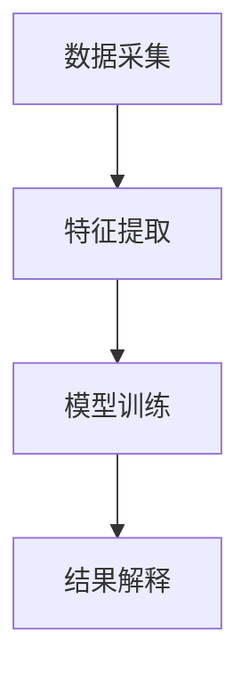

                 


# AI Agent在智能镜框中的心理状态评估

> 关键词：AI Agent, 心理状态评估, 智能眼镜, 机器学习, 心理健康

> 摘要：  
本文详细探讨了AI Agent在智能镜框中进行心理状态评估的核心技术与实现方法。通过分析心理状态评估的关键维度、AI Agent的工作原理以及相关算法，本文为读者提供了一套完整的解决方案，涵盖数据采集、特征提取、模型训练与优化、系统架构设计等关键环节。结合实际案例与项目实战，本文深入浅出地展示了如何利用AI技术提升心理健康监测的效率与准确性。

---

## 第一部分：AI Agent与心理状态评估的背景介绍

### 第1章：AI Agent的基本概念

#### 1.1 AI Agent的定义与特点
AI Agent（人工智能代理）是指能够感知环境、执行任务并做出决策的智能实体。它具备以下特点：
- **自主性**：能够在没有外部干预的情况下自主运作。
- **反应性**：能够实时感知环境变化并做出响应。
- **目标导向**：具有明确的目标，并通过行动实现目标。

#### 1.2 心理状态评估的核心概念
心理状态评估是指通过分析个体的行为、语言、生理数据等信息，推断其心理状态（如情绪、认知状态等）。在智能镜框中，AI Agent可以通过以下方式实现心理状态评估：
- **数据采集**：通过传感器获取用户的生理数据（如心率、体温）和行为数据（如眨眼频率、头部姿势）。
- **语言分析**：通过语音识别和自然语言处理技术分析用户的语言特征（如语调、语速）。

#### 1.3 AI Agent在心理状态评估中的作用
AI Agent在心理状态评估中扮演着关键角色，主要体现在以下几个方面：
- **实时监测**：通过传感器实时采集用户数据，快速分析并反馈心理状态。
- **个性化评估**：根据用户的个性化特征（如年龄、性别、性格）调整评估模型，提高评估的准确性。
- **主动干预**：在检测到异常心理状态时，主动提供干预建议或触发预警机制。

### 第2章：AI Agent与心理状态评估的核心概念

#### 2.1 心理状态评估的关键维度
心理状态评估可以从以下几个关键维度进行：
1. **情绪状态**：包括愤怒、快乐、悲伤等基本情绪。
2. **认知状态**：包括注意力、记忆力、决策能力等认知功能。
3. **行为模式**：包括动作频率、语言习惯等行为特征。

#### 2.2 AI Agent在心理状态评估中的核心要素
AI Agent在心理状态评估中需要考虑以下几个核心要素：
- **数据来源**：包括生理数据（如心率、体温）、语言数据（如语调、语速）和行为数据（如头部姿势、眨眼频率）。
- **数据处理**：需要对采集到的数据进行清洗、归一化处理，提取有用的特征。
- **模型训练**：通过机器学习算法（如支持向量机、神经网络）训练心理状态评估模型。
- **结果解释**：将模型输出的结果转化为可理解的心理状态描述。

#### 2.3 心理状态评估与AI Agent的系统架构
心理状态评估与AI Agent的系统架构可以分为以下几个部分：
1. **数据采集层**：负责采集用户的生理数据、语言数据和行为数据。
2. **数据处理层**：对采集到的数据进行预处理和特征提取。
3. **模型训练层**：利用机器学习算法训练心理状态评估模型。
4. **结果解释层**：将模型输出的结果转化为可理解的心理状态描述，并提供干预建议。

---

## 第二部分：AI Agent心理状态评估的算法原理

### 第3章：AI Agent心理状态评估的算法原理

#### 3.1 数据预处理与特征提取
##### 3.1.1 数据清洗与标准化
在数据预处理阶段，需要对采集到的数据进行清洗和标准化处理。例如，心率数据可能包含噪声，需要通过滤波算法进行去噪处理。

##### 3.1.2 特征提取方法
从原始数据中提取有用的特征是心理状态评估的关键步骤。例如，可以通过统计方法提取心率变异性（HRV）作为情绪状态的特征。

##### 3.1.3 数据增强技术
为了提高模型的泛化能力，可以对数据进行数据增强处理。例如，通过改变语速、语调等方式增强语音数据的多样性。

#### 3.2 模型训练与优化
##### 3.2.1 支持向量机（SVM）模型
支持向量机是一种常用的分类算法，适用于小规模数据集的分类任务。在心理状态评估中，可以使用SVM模型对情绪状态进行分类。

##### 3.2.2 神经网络模型
神经网络模型（如卷积神经网络、循环神经网络）适用于大规模数据集的分类任务。在心理状态评估中，可以使用深度学习模型对复杂的心理状态进行分类。

##### 3.2.3 集成学习方法
集成学习方法通过结合多个模型的预测结果，可以有效提高模型的准确性和鲁棒性。例如，可以通过集成SVM和神经网络模型的预测结果，进一步提高情绪状态分类的准确率。

#### 3.3 模型评估与结果解释
##### 3.3.1 模型评估指标
在模型评估阶段，可以使用准确率、召回率、F1值等指标来评估模型的性能。

##### 3.3.2 结果解释方法
通过可视化工具（如热图、混淆矩阵）可以直观地展示模型的预测结果和实际结果之间的差异。

---

## 第三部分：心理状态评估的数学模型与公式

### 第4章：心理状态评估的数学模型与公式

#### 4.1 基于支持向量机的分类模型
支持向量机的数学表达式如下：
$$
\text{max} \quad \frac{1}{2} \|\omega\|^2 \\
\text{subject to} \quad y_i (\omega \cdot x_i + b) \geq 1, \quad i = 1, 2, \dots, n
$$

其中，$\omega$ 是权重向量，$b$ 是偏置项，$y_i$ 是标签，$x_i$ 是输入样本。

#### 4.2 基于神经网络的情感分析模型
神经网络的情感分析模型通常包括输入层、隐藏层和输出层。输出层的激活函数可以使用sigmoid函数：
$$
a = \sigma(z) = \frac{1}{1 + e^{-z}}
$$

其中，$z$ 是输入到输出层的线性组合。

---

## 第四部分：AI Agent心理状态评估的系统架构设计

### 第5章：AI Agent心理状态评估的系统架构设计

#### 5.1 系统功能设计
系统的功能设计包括数据采集、特征提取、模型训练、结果解释等模块。以下是系统的功能模块图（使用Mermaid表示）：



#### 5.2 系统架构设计
系统的架构设计可以采用微服务架构，主要包括数据采集服务、特征提取服务、模型训练服务和结果解释服务。以下是系统的架构图（使用Mermaid表示）：

```mermaid
serviceDiagram
    participant 数据采集服务
    participant 特征提取服务
    participant 模型训练服务
    participant 结果解释服务
    数据采集服务 -> 特征提取服务: 提供特征数据
    特征提取服务 -> 模型训练服务: 提供特征向量
    模型训练服务 -> 结果解释服务: 提供分类结果
```

---

## 第五部分：AI Agent心理状态评估的项目实战

### 第6章：AI Agent心理状态评估的项目实战

#### 6.1 环境安装
在项目实战中，首先需要安装相关的开发环境和工具，例如：
- Python 3.8+
- TensorFlow 2.0+
- Scikit-learn 0.24+
- Mermaid CLI工具

#### 6.2 系统核心实现源代码
以下是系统的核心实现源代码示例：

```python
import numpy as np
from sklearn.svm import SVC
from sklearn.metrics import accuracy_score

# 数据预处理
X_train = ...  # 特征向量
y_train = ...  # 标签

# 模型训练
svm_model = SVC()
svm_model.fit(X_train, y_train)

# 模型预测
X_test = ...  # 测试样本
y_pred = svm_model.predict(X_test)

# 模型评估
accuracy = accuracy_score(y_test, y_pred)
print(f"模型准确率：{accuracy}")
```

#### 6.3 实际案例分析
以情绪状态分类为例，假设我们有以下训练数据：

| 特征向量 | 情绪标签 |
|----------|----------|
| [1, 2, 3] | 愉快     |
| [4, 5, 6] | 愤怒     |

通过训练SVM模型，我们可以对测试数据进行分类预测。例如，测试数据为[2, 3, 4]，模型预测其情绪标签为“愉快”。

---

## 第六部分：AI Agent心理状态评估的最佳实践

### 第7章：AI Agent心理状态评估的最佳实践

#### 7.1 小结
本文详细探讨了AI Agent在智能镜框中的心理状态评估技术，涵盖了数据采集、特征提取、模型训练与优化、系统架构设计等关键环节。

#### 7.2 注意事项
在实际应用中，需要注意以下几点：
- **数据隐私**：确保用户数据的安全性和隐私性。
- **模型泛化能力**：通过数据增强和模型集成等方法提高模型的泛化能力。
- **用户反馈**：根据用户的反馈不断优化模型和系统。

#### 7.3 拓展阅读
建议读者进一步阅读以下内容：
- 《机器学习实战》
- 《深度学习入门：基于Python的CNN、RNN、GAN基础》
- 《心理生理数据挖掘与分析》

---

## 作者信息

作者：AI天才研究院/AI Genius Institute & 禅与计算机程序设计艺术 /Zen And The Art of Computer Programming

---

**感谢您的耐心阅读！如果对本文有任何疑问或建议，请随时与我联系。**

