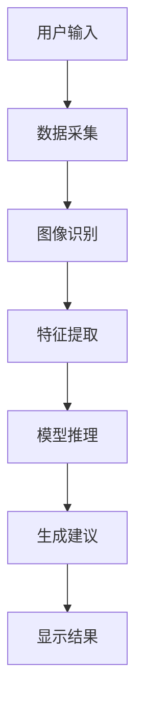
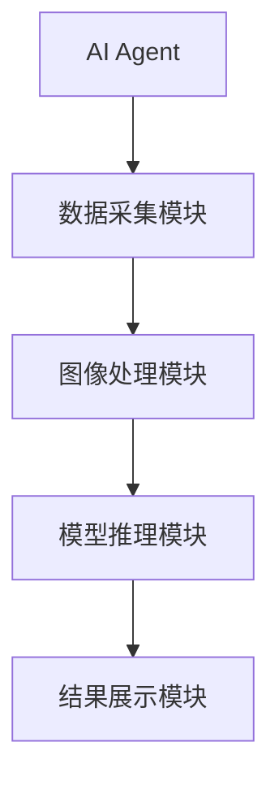
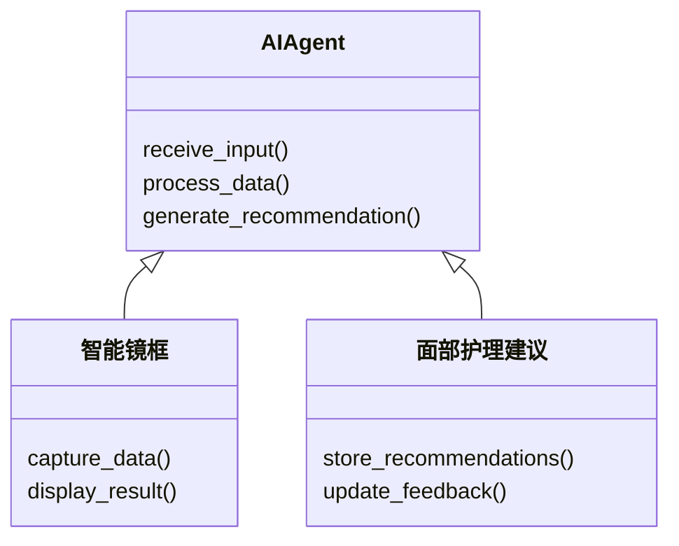

                 


# AI Agent在智能镜框中的面部护理建议

## 关键词：
- AI Agent
- 智能镜框
- 面部护理
- 计算机视觉
- 机器学习

## 摘要：
本文探讨了AI Agent在智能镜框中的应用，特别是如何通过面部护理建议提升用户体验。文章首先介绍了AI Agent和智能镜框的基本概念，分析了面部护理的需求和挑战。接着，详细讲解了AI Agent在面部护理中的核心算法，包括图像识别和自然语言处理，并通过系统架构设计展示了如何实现这些功能。最后，通过实际案例分析了项目的实施过程，并提出了最佳实践和未来发展方向。

---

## 第一部分：背景介绍

### 1.1 问题背景
#### 1.1.1 AI Agent的定义与特点
AI Agent是一种能够感知环境、理解用户需求并执行任务的智能体。它具备自主性、反应性、目标导向和学习能力等特征。

#### 1.1.2 智能镜框的定义与应用场景
智能镜框是一种结合了传统镜子和智能设备的硬件，通常配备摄像头和传感器，能够实时采集用户的面部数据，并通过AI技术提供个性化的护理建议。

#### 1.1.3 面部护理的重要性与需求
随着人们对健康和美容的关注增加，面部护理需求日益增长。传统方法依赖于人工经验，效率低且不够精准，而AI Agent可以通过数据分析提供科学化的建议。

---

### 1.2 问题描述
#### 1.2.1 面部护理的痛点与挑战
- 数据采集困难：面部护理需要高精度的数据，但传统方法依赖人工经验，容易出错。
- 个性化需求强：每个人的肤质和需求不同，通用的护理方案难以满足个体需求。
- 技术实现复杂：涉及图像处理、数据分析等多个技术领域。

#### 1.2.2 AI Agent在面部护理中的潜在价值
- 提供精准建议：AI Agent可以通过分析面部数据，推荐适合的护理产品和方法。
- 实时反馈：用户可以随时获得护理建议，无需依赖专业人员。
- 数据驱动：基于大量数据，AI Agent可以不断优化建议，提高准确性。

#### 1.2.3 智能镜框与AI Agent结合的可行性分析
智能镜框具备硬件支持，可以实时采集面部数据，结合AI Agent的算法处理，能够实现高效的面部护理建议。

---

## 第二部分：核心概念与联系

### 2.1 核心概念原理
#### 2.1.1 AI Agent的基本原理
AI Agent通过感知环境数据，结合预训练模型，生成相应的建议或行动。

#### 2.1.2 智能镜框的技术原理
智能镜框通过摄像头和传感器采集数据，传输给AI Agent进行处理，并将结果展示在镜面上。

#### 2.1.3 面部护理的科学依据
面部护理基于皮肤科学和美容学，结合AI技术进行个性化推荐。

### 2.2 概念属性特征对比表格

| **属性**       | **AI Agent**               | **智能镜框**              | **面部护理建议**          |
|-----------------|----------------------------|---------------------------|---------------------------|
| 核心功能         | 执行用户指令               | 数据采集与显示           | 提供个性化建议           |
| 技术基础         | 机器学习、自然语言处理     | 图像处理、传感器技术      | 计算机视觉、数据分析     |
| 应用场景         | 多领域                     | 个人护理、健康管理       | 面部护理、美容          |
| 优势             | 智能化、自主性             | 实时反馈、交互性          | 精准化、数据驱动         |

### 2.3 ER实体关系图架构
```mermaid
erd
    entity AI Agent {
        id
        knowledge库
        用户指令
    }
    entity 智能镜框 {
        设备ID
        传感器数据
        显示界面
    }
    entity 面部护理建议 {
        建议ID
        建议内容
        用户反馈
    }
    relation 调用关系 {
        AI Agent --> 智能镜框
        智能镜框 --> 面部护理建议
        面部护理建议 --> 用户反馈
    }
```

---

## 第三部分：算法原理

### 3.1 算法流程


### 3.2 图像识别算法实现
#### 3.2.1 图像预处理
```python
import cv2

def preprocess_image(image_path):
    img = cv2.imread(image_path)
    gray = cv2.cvtColor(img, cv2.COLOR_BGR2GRAY)
    return gray
```

#### 3.2.2 特征提取
```python
import tensorflow.keras as keras

model = keras.Sequential([
    keras.layers.Conv2D(32, (3,3), activation='relu', input_shape=(224, 224, 3)),
    keras.layers.MaxPooling2D((2,2)),
    keras.layers.Conv2D(64, (3,3), activation='relu'),
    keras.layers.MaxPooling2D((2,2)),
    keras.layers.Flatten(),
    keras.layers.Dense(128, activation='relu'),
    keras.layers.Dense(10, activation='softmax')
])
```

#### 3.2.3 模型训练
```python
model.compile(optimizer='adam', loss='sparse_categorical_crossentropy', metrics=['accuracy'])
model.fit(x_train, y_train, epochs=10, batch_size=32)
```

### 3.3 数学模型与公式
$$
\text{损失函数} = -\sum_{i=1}^{n} y_i \log(p_i) + (1 - y_i) \log(1 - p_i)
$$
其中，\( y_i \) 是真实标签，\( p_i \) 是预测概率。

---

## 第四部分：系统分析与架构设计

### 4.1 系统架构设计


### 4.2 系统功能设计


---

## 第五部分：项目实战

### 5.1 环境安装
```bash
pip install tensorflow keras opencv-python
```

### 5.2 核心代码实现
```python
import cv2
import numpy as np
import tensorflow as tf

# 加载预训练模型
model = tf.keras.models.load_model('face_care_model.h5')

# 拍照并预处理
def take_photo():
    cap = cv2.VideoCapture(0)
    ret, frame = cap.read()
    cap.release()
    cv2.imwrite('face.jpg', frame)

take_photo()

preprocessed_image = preprocess_image('face.jpg')

# 预测结果
prediction = model.predict(preprocessed_image)
```

### 5.3 实际案例分析
通过实际案例分析，展示如何通过AI Agent和智能镜框实现面部护理建议的生成和展示。

### 5.4 项目总结
总结项目的实施过程，分析成功和失败的原因，提出改进建议。

---

## 第六部分：最佳实践与小结

### 6.1 小结
AI Agent在智能镜框中的应用为面部护理提供了高效、精准的解决方案。通过结合图像识别和机器学习技术，可以实现个性化的护理建议，提升用户体验。

### 6.2 注意事项
- 数据隐私保护：确保用户数据的安全性。
- 算法优化：不断提升模型的准确性和效率。
- 用户体验：设计直观的交互界面，确保用户易于使用。

### 6.3 拓展阅读
建议读者进一步了解AI在医疗健康领域的应用，探索更多智能化解决方案。

---

## 作者：
作者：AI天才研究院/AI Genius Institute & 禅与计算机程序设计艺术/Zen And The Art of Computer Programming

