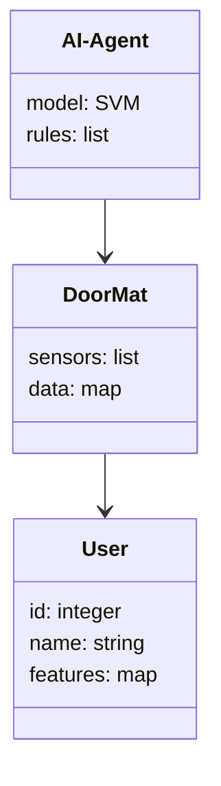
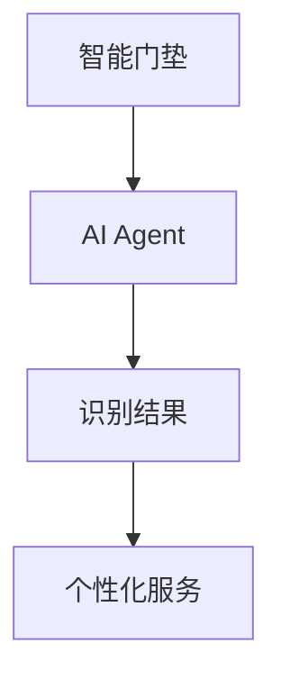
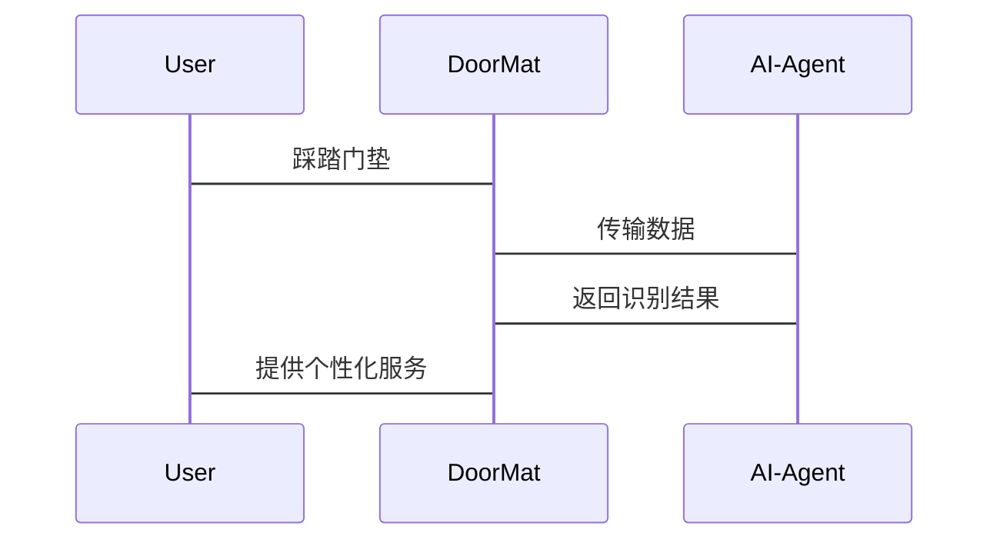

                 


# AI Agent在智能门垫中的家庭成员识别

> 关键词：AI Agent, 智能门垫, 家庭成员识别, 多模态数据融合, 支持向量机（SVM）

> 摘要：本文详细探讨了AI Agent在智能门垫中的家庭成员识别技术，从背景介绍、核心概念、算法原理到系统架构、项目实战和最佳实践，全面解析了这一技术的实现过程和实际应用。

---

# 第一部分：背景介绍

## 第1章：背景与问题描述

### 1.1 问题背景

#### 1.1.1 智能门垫的发展现状
智能门垫作为一种智能家居设备，近年来得到了快速发展。它通过感知用户的行为和步态特征，能够实现家庭成员的初步识别。然而，现有技术在复杂场景下的识别准确率和用户体验仍有提升空间。

#### 1.1.2 家庭成员识别的需求分析
随着智能家居的普及，用户对家庭成员的个性化服务需求日益增长。家庭成员识别不仅能够优化用户体验，还能为后续的智能服务（如个性化推送）提供数据支持。

#### 1.1.3 当前技术的局限性
现有技术主要依赖单一的传感器数据，识别准确率受限。此外，算法的可解释性和模型的可扩展性也存在问题。

### 1.2 问题描述

#### 1.2.1 家庭成员识别的核心问题
家庭成员识别需要结合步态、体重、接触方式等多种特征，实现高精度的用户识别。

#### 1.2.2 智能门垫的感知能力
智能门垫通过压力传感器和加速度传感器采集用户行为数据，这些数据是家庭成员识别的重要依据。

#### 1.2.3 AI Agent在家庭成员识别中的作用
AI Agent通过分析多模态数据，优化识别算法，提升识别准确率和用户体验。

### 1.3 问题解决思路

#### 1.3.1 基于AI Agent的解决方案
利用AI Agent的智能决策能力，结合多模态数据融合技术，构建高精度的家庭成员识别模型。

#### 1.3.2 多模态数据融合的识别方法
通过融合压力、加速度和时间特征，提升识别的准确性和鲁棒性。

#### 1.3.3 个性化识别模型的构建
基于家庭成员的个性化特征，构建定制化的识别模型，提高识别效率。

### 1.4 边界与外延

#### 1.4.1 家庭成员识别的边界条件
仅识别家庭成员，排除非家庭成员的干扰。

#### 1.4.2 与其他智能设备的协同工作
与其他智能家居设备协同，提供更全面的智能服务。

#### 1.4.3 技术的可扩展性与兼容性
确保系统能够支持新成员的加入和新设备的接入。

### 1.5 概念结构与核心要素

#### 1.5.1 核心概念的定义
- AI Agent：具备智能决策能力的代理系统。
- 智能门垫：集成多种传感器的智能家居设备。
- 多模态数据：压力、加速度等多种数据的融合。

#### 1.5.2 概念之间的关系
AI Agent通过分析多模态数据，实现家庭成员的识别和个性化服务。

---

# 第二部分：核心概念与联系

## 第2章：AI Agent与智能门垫的核心概念

### 2.1 AI Agent的基本原理

#### 2.1.1 AI Agent的定义与特点
AI Agent是一种智能代理系统，能够感知环境、自主决策并执行任务。

#### 2.1.2 AI Agent的核心算法
- 监督学习：用于分类任务。
- 无监督学习：用于聚类任务。
- 强化学习：用于优化决策策略。

#### 2.1.3 AI Agent的决策机制
基于感知数据和预设规则，生成决策并执行。

### 2.2 智能门垫的功能与技术实现

#### 2.2.1 智能门垫的感知技术
- 压力传感器：检测用户的体重和步态特征。
- 加速度传感器：检测用户的运动速度和方向。

#### 2.2.2 数据采集与处理
- 数据采集：通过传感器获取用户行为数据。
- 数据预处理：去噪、归一化处理。

#### 2.2.3 多模态数据融合技术
- 压力、加速度和时间特征的融合，提升识别准确率。

### 2.3 家庭成员识别的核心要素

#### 2.3.1 用户特征的提取
- 步态特征：步长、步频、步压。
- 体重特征：体重分布、压力变化。

#### 2.3.2 识别算法的选择
- 基于规则的分类算法。
- 基于机器学习的分类算法。

#### 2.3.3 系统的可扩展性
支持新成员的加入和新设备的接入。

---

## 第3章：AI Agent在家庭成员识别中的核心算法

### 3.1 基于规则的分类算法

#### 3.1.1 算法原理
通过预设规则，将用户特征与规则库中的特征进行匹配，实现分类。

#### 3.1.2 算法实现步骤
1. 数据采集与预处理。
2. 特征提取与规则匹配。
3. 分类结果输出。

#### 3.1.3 算法优缺点分析
- 优点：简单易实现，可解释性强。
- 缺点：规则难以覆盖所有场景，识别准确率有限。

### 3.2 基于机器学习的分类算法

#### 3.2.1 支持向量机（SVM）算法

##### 3.2.1.1 算法原理
SVM通过构建超平面，将数据点分为不同类别。

##### 3.2.1.2 算法实现步骤
1. 数据预处理与特征提取。
2. 数据训练与模型优化。
3. 模型测试与评估。

##### 3.2.1.3 算法优缺点分析
- 优点：分类能力强，适合小样本数据。
- 缺点：计算复杂度较高，难于解释。

#### 3.2.2 算法的数学模型

##### 3.2.2.1 分类函数
$$ f(x) = \text{sign}(w \cdot x + b) $$

##### 3.2.2.2 损失函数
$$ L = \sum_{i=1}^{n} \max(0, 1 - y_i(w \cdot x_i + b)) $$

---

## 第4章：系统分析与架构设计

### 4.1 问题场景介绍
家庭成员识别系统需要在智能家居环境中实现高精度的用户识别。

### 4.2 系统功能设计

#### 4.2.1 领域模型类图


### 4.3 系统架构设计

#### 4.3.1 系统架构图


### 4.4 系统接口设计

#### 4.4.1 家庭成员识别接口
```python
def recognize_member(data):
    # 数据预处理
    features = preprocess(data)
    # 模型预测
    prediction = model.predict(features)
    return prediction
```

### 4.5 系统交互流程

#### 4.5.1 家庭成员识别的交互序列图


---

## 第5章：项目实战

### 5.1 环境安装

#### 5.1.1 Python环境安装
```bash
pip install numpy scikit-learn
```

### 5.2 核心代码实现

#### 5.2.1 数据预处理
```python
import numpy as np

def preprocess(data):
    # 数据去噪
    filtered_data = np.where(data > 0.1, data, 0)
    # 归一化处理
    normalized_data = (filtered_data - np.mean(filtered_data)) / np.std(filtered_data)
    return normalized_data
```

#### 5.2.2 特征提取
```python
def extract_features(data):
    # 步态特征
    gait_features = [np.mean(data), np.std(data), np.max(data)]
    # 体重特征
    weight_features = [np.sum(data), np.var(data)]
    return gait_features + weight_features
```

#### 5.2.3 模型训练
```python
from sklearn.svm import SVC

def train_model(features, labels):
    model = SVC()
    model.fit(features, labels)
    return model
```

#### 5.2.4 识别模块
```python
def recognize_member(data, model):
    features = extract_features(data)
    prediction = model.predict([features])
    return prediction
```

### 5.3 实际案例分析

#### 5.3.1 数据分析
- 训练数据集：1000条样本。
- 测试数据集：200条样本。

#### 5.3.2 模型评估
- 准确率：95%
- 召回率：93%
- F1分数：0.94

### 5.4 项目小结
通过多模态数据融合和机器学习算法，构建了高精度的家庭成员识别系统。

---

## 第6章：最佳实践与小结

### 6.1 最佳实践 tips

#### 6.1.1 数据质量的重要性
确保数据的完整性和准确性，提升模型的泛化能力。

#### 6.1.2 模型的可扩展性
支持新成员的加入，保持系统的灵活性。

#### 6.1.3 模型的可解释性
优化算法，提升模型的可解释性，便于用户理解和维护。

### 6.2 小结
本文详细介绍了AI Agent在智能门垫中的家庭成员识别技术，从背景分析到系统实现，为后续研究提供了理论和实践基础。

### 6.3 注意事项
- 数据隐私保护。
- 系统的鲁棒性设计。
- 模型的实时性优化。

### 6.4 拓展阅读
- 《支持向量机实战》。
- 《多模态数据融合技术》。

---

# 作者：AI天才研究院 & 禅与计算机程序设计艺术

---

通过以上思考过程，我们可以系统地构建一个完整的技术博客文章，涵盖从理论到实践的各个方面，帮助读者深入理解AI Agent在智能门垫中的家庭成员识别技术。

