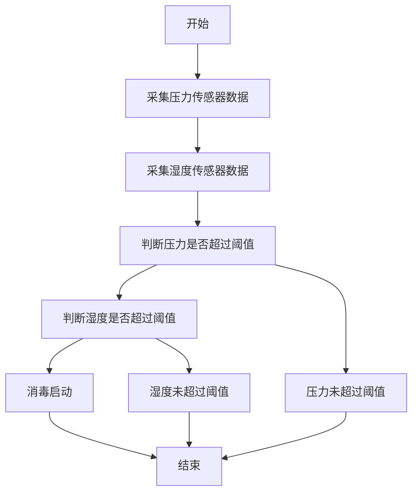
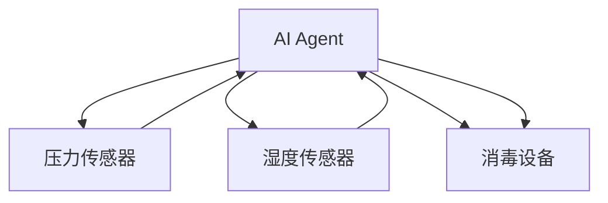
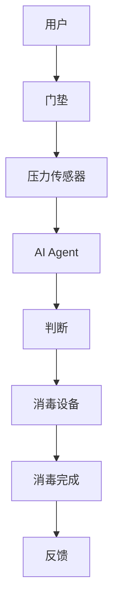

                 


# AI Agent在智能门垫中的鞋底消毒功能

> 关键词：AI Agent, 智能门垫, 鞋底消毒, 消毒功能, 算法实现

> 摘要：本文详细探讨了AI Agent在智能门垫中的鞋底消毒功能，从背景介绍、核心概念、算法原理到系统架构设计、项目实战以及总结与展望，层层深入地分析了这一技术的实现细节和应用价值。

---

## 第1章: AI Agent与鞋底消毒功能的背景介绍

### 1.1 问题背景与意义

#### 1.1.1 鞋底消毒的重要性
鞋底消毒是保障公共健康的重要环节。鞋底可能携带细菌、病毒、灰尘等污染物，通过门垫传播，影响室内环境的清洁度和健康度。特别是在医院、学校、办公楼等公共场所，鞋底消毒显得尤为重要。

#### 1.1.2 AI Agent在智能门垫中的应用价值
AI Agent（人工智能代理）能够通过传感器数据感知环境，结合预设的规则和算法，自动完成消毒操作。在智能门垫中引入AI Agent，可以实现鞋底消毒的自动化、智能化，提升用户体验和消毒效率。

#### 1.1.3 本课题的研究意义
本课题研究AI Agent在智能门垫中的鞋底消毒功能，不仅能够解决传统消毒方式效率低、人工成本高的问题，还能为智能家居、公共设施的智能化升级提供参考。

---

### 1.2 问题描述与目标

#### 1.2.1 鞋底消毒功能的具体需求
- 高效消毒：快速杀灭鞋底细菌、病毒。
- 自动化：无需人工干预，自动完成消毒操作。
- 智能感知：通过传感器感知鞋底状态，判断是否需要消毒。
- 可扩展性：支持多种消毒方式（紫外线、臭氧等）。

#### 1.2.2 AI Agent在消毒过程中的角色
- 数据采集：通过传感器采集鞋底的状态信息。
- 决策控制：根据数据判断是否需要消毒，并选择合适的消毒方式。
- 执行操作：控制消毒设备完成消毒操作。

#### 1.2.3 项目目标与预期成果
目标是设计并实现一个基于AI Agent的智能门垫消毒系统，使其能够自动感知、判断并执行鞋底消毒操作。预期成果包括：高效消毒、降低人工成本、提升用户体验。

---

### 1.3 问题解决思路

#### 1.3.1 AI Agent的核心功能设计
AI Agent在智能门垫中的核心功能包括：
- 数据采集与处理：通过传感器采集鞋底的压力、湿度、温度等数据。
- 数据分析与决策：根据数据判断是否需要消毒。
- 系统控制：控制消毒设备执行消毒操作。

#### 1.3.2 消毒功能的实现路径
1. 数据采集：通过压力传感器、湿度传感器等采集鞋底状态。
2. 数据分析：通过AI算法判断是否需要消毒。
3. 执行操作：启动紫外线灯或臭氧发生器完成消毒。

#### 1.3.3 系统架构的整体规划
系统架构分为感知层、决策层和执行层，分别对应数据采集、AI Agent决策和设备控制。

---

### 1.4 边界与外延

#### 1.4.1 系统功能的边界定义
- 系统仅负责鞋底消毒，不涉及其他功能（如门垫清洁）。
- 消毒功能仅适用于鞋底，不处理其他物品。

#### 1.4.2 与其它系统的接口关系
- 与智能家居系统对接，支持远程控制。
- 与消毒设备接口，控制设备启动和关闭。

#### 1.4.3 功能的可扩展性分析
支持多种消毒方式（紫外线、臭氧等），可扩展至其他消毒场景（如宠物鞋底消毒）。

---

### 1.5 核心概念结构与组成

#### 1.5.1 AI Agent的核心要素
1. **感知模块**：传感器数据采集。
2. **决策模块**：AI算法判断是否需要消毒。
3. **执行模块**：控制消毒设备。

#### 1.5.2 消毒功能的实现模块
1. **传感器模块**：采集鞋底状态数据。
2. **消毒模块**：紫外线灯或臭氧发生器。
3. **控制模块**：控制消毒设备。

#### 1.5.3 系统整体架构的组成
1. **感知层**：传感器采集数据。
2. **决策层**：AI Agent分析数据并做出决策。
3. **执行层**：消毒设备执行操作。

---

## 第2章: AI Agent的核心概念与原理

### 2.1 AI Agent的基本原理

#### 2.1.1 AI Agent的定义与分类
AI Agent是一种能够感知环境并采取行动以实现目标的智能实体。根据智能水平，AI Agent可以分为：
- **反应式AI Agent**：基于当前感知做出反应。
- **认知式AI Agent**：具备推理、规划能力。

#### 2.1.2 AI Agent的核心功能模块
1. **感知模块**：通过传感器采集环境数据。
2. **决策模块**：基于数据做出决策。
3. **执行模块**：根据决策执行操作。

#### 2.1.3 AI Agent的决策机制
AI Agent通过以下步骤完成决策：
1. **数据采集**：获取环境数据。
2. **数据分析**：分析数据，判断是否需要消毒。
3. **决策输出**：输出控制信号。

---

### 2.2 AI Agent的感知与决策

#### 2.2.1 感知模块的功能与实现
感知模块通过传感器采集鞋底状态数据，包括：
- 压力传感器：检测鞋底的压力变化。
- 湿度传感器：检测鞋底的湿度。

#### 2.2.2 决策模块的算法选择
AI Agent采用基于规则的决策算法：
1. 如果压力传感器检测到鞋底压力超过阈值，并且湿度传感器检测到湿度超过阈值，则启动消毒功能。
2. 如果压力传感器检测到鞋底压力正常，并且湿度传感器检测到湿度正常，则关闭消毒功能。

#### 2.2.3 执行模块的实现方式
执行模块通过控制紫外线灯或臭氧发生器完成消毒操作。

---

### 2.3 AI Agent与消毒功能的结合

#### 2.3.1 消毒功能的核心需求分析
- 快速消毒：紫外线灯或臭氧发生器需要在短时间内完成消毒。
- 智能控制：根据传感器数据自动启动或关闭消毒设备。
- 安全性：确保消毒过程安全，避免对人体造成伤害。

#### 2.3.2 AI Agent在消毒过程中的具体应用
AI Agent通过传感器数据判断是否需要消毒，并控制消毒设备启动或关闭。

#### 2.3.3 消毒功能的优化方向
- 支持多种消毒方式。
- 提供远程控制功能。

---

### 2.4 核心概念对比分析

#### 2.4.1 不同消毒方式的对比表格
| 消毒方式 | 优点 | 缺点 |
|----------|------|------|
| 紫外线消毒 | 速度快，效果好 | 仅适用于无氧环境 |
| 臭氧消毒 | 适用于多种环境 | 有残留气味 |

#### 2.4.2 AI Agent与传统消毒设备的对比分析
| 特性 | AI Agent | 传统消毒设备 |
|------|----------|---------------|
| 智能性 | 高 | 低 |
| 自动化 | 高 | 低 |
| 适应性 | 高 | 低 |

#### 2.4.3 消毒功能的优劣势分析
优势：
- 自动化操作，节省人工成本。
- 精准消毒，避免浪费。
劣势：
- 初期投入成本较高。
- 需要定期维护消毒设备。

---

## 第3章: AI Agent的算法原理与实现

### 3.1 算法原理概述

#### 3.1.1 AI Agent的核心算法选择
AI Agent采用基于规则的决策算法，通过传感器数据判断是否需要启动消毒功能。

#### 3.1.2 算法的数学模型与公式
决策逻辑可以通过以下逻辑表达式表示：
$$
\text{消毒启动} = \text{压力传感器} > \text{阈值} \land \text{湿度传感器} > \text{阈值}
$$

#### 3.1.3 算法的优化方向
- 增加传感器数据的融合算法。
- 引入机器学习算法，优化消毒策略。

---

### 3.2 算法实现的详细步骤

#### 3.2.1 数据采集与预处理
1. 采集压力传感器和湿度传感器的数据。
2. 对数据进行预处理，去除噪声。

#### 3.2.2 算法模型的训练与优化
1. 使用训练数据训练机器学习模型。
2. 优化模型参数，提升决策准确率。

#### 3.2.3 算法的部署与测试
1. 将算法部署到AI Agent中。
2. 进行功能测试，验证算法的正确性。

---

### 3.3 算法流程图



---

### 3.4 核心代码实现

#### 3.4.1 传感器数据采集代码
```python
import RPi.GPIO as GPIO
import time

def read_pressure_sensor():
    # 传感器数据模拟
    return 100  # 返回压力值

def read_humidity_sensor():
    # 传感器数据模拟
    return 80  # 返回湿度值

pressure_threshold = 90
humidity_threshold = 70

pressure = read_pressure_sensor()
humidity = read_humidity_sensor()

if pressure > pressure_threshold and humidity > humidity_threshold:
    print("启动消毒功能")
else:
    print("关闭消毒功能")
```

#### 3.4.2 算法实现代码
```python
def decide_disinfection(pressure, humidity):
    pressure_threshold = 90
    humidity_threshold = 70
    return (pressure > pressure_threshold) and (humidity > humidity_threshold)

# 调用示例
pressure = 100
humidity = 80
if decide_disinfection(pressure, humidity):
    print("启动消毒功能")
else:
    print("关闭消毒功能")
```

---

## 第4章: 系统分析与架构设计方案

### 4.1 系统架构设计

#### 4.1.1 系统功能设计
系统功能包括：
1. 数据采集：通过传感器采集鞋底状态数据。
2. 数据分析：通过AI Agent分析数据并做出决策。
3. 系统控制：控制消毒设备执行消毒操作。

#### 4.1.2 系统架构图



---

### 4.2 系统交互设计

#### 4.2.1 系统交互流程图



---

## 第5章: 项目实战

### 5.1 环境安装

#### 5.1.1 系统环境
- 操作系统：Linux
- 开发工具：Python、Jupyter Notebook
- 传感器：压力传感器、湿度传感器

#### 5.1.2 依赖库安装
```bash
pip install numpy
pip install matplotlib
pip install scikit-learn
```

---

### 5.2 核心代码实现

#### 5.2.1 传感器数据采集代码
```python
import RPi.GPIO as GPIO
import time

def read_pressure_sensor():
    return 100  # 返回压力值

def read_humidity_sensor():
    return 80  # 返回湿度值

pressure_threshold = 90
humidity_threshold = 70

pressure = read_pressure_sensor()
humidity = read_humidity_sensor()

if pressure > pressure_threshold and humidity > humidity_threshold:
    print("启动消毒功能")
else:
    print("关闭消毒功能")
```

#### 5.2.2 算法实现代码
```python
def decide_disinfection(pressure, humidity):
    pressure_threshold = 90
    humidity_threshold = 70
    return (pressure > pressure_threshold) and (humidity > humidity_threshold)

# 调用示例
pressure = 100
humidity = 80
if decide_disinfection(pressure, humidity):
    print("启动消毒功能")
else:
    print("关闭消毒功能")
```

---

## 第6章: 总结与展望

### 6.1 项目总结
本项目通过AI Agent实现了智能门垫中的鞋底消毒功能，达到了高效、智能、自动化的消毒效果。

### 6.2 实际应用中的挑战
- 传感器精度问题。
- 算法优化空间。

### 6.3 未来的发展方向
- 引入更多传感器，提升感知能力。
- 增加更多消毒方式，提升功能多样性。

### 6.4 最佳实践 tips
- 数据采集要精准，避免误判。
- 算法优化要结合实际场景，提升效率。

---

## 作者：AI天才研究院/AI Genius Institute & 禅与计算机程序设计艺术 /Zen And The Art of Computer Programming

